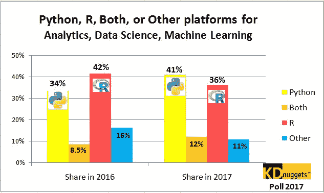
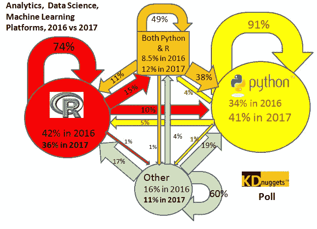
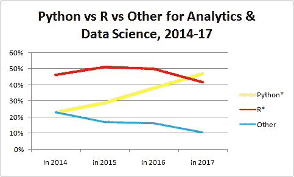
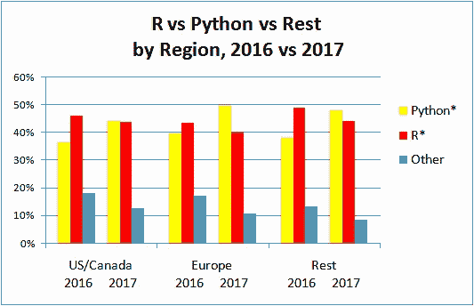

# Python 超越 R，成为数据科学、机器学习平台的领导者

> 原文：[`www.kdnuggets.com/2017/08/python-overtakes-r-leader-analytics-data-science.html`](https://www.kdnuggets.com/2017/08/python-overtakes-r-leader-analytics-data-science.html)

 评论上一个 KDnuggets 调查 询问

> **你在 2016 和 2017 年是否使用了 R、Python（及其包）、两者，或其他工具用于分析、数据科学、机器学习工作？**

Python 并未完全“吞并” R，但基于 954 位投票者的结果显示，2017 年 Python 生态系统 **超越** R 成为分析、数据科学、机器学习的领先平台。

> 另请参见我的后续文章：**Python 与 R – 谁在数据科学、机器学习中真正领先？**

虽然在 2016 年 Python 排在第 2 位（“主要使用 Python”份额为 34%，而“主要使用 R”的份额为 42%），但在 2017 年 Python 达到了 41%，而 R 为 36%。

使用 **两者** R 和 Python 的 KDnuggets 读者的份额也从 2017 年的 8.5% 增加到 12%，而主要使用 **其他** 工具的份额从 16% 下降到 11%。

 **图 1: Python、R、两者或其他平台在 2016 年和 2017 年的使用份额**

接下来，我们将检查不同平台之间的过渡。

 **图 2: 分析、数据科学、机器学习平台**

从 2016 到 2017 年的 R、Python、两者和其他的过渡**

这张图表看起来复杂，但我们看到两个关键方面，Python 在这两个方面都赢了：

+   忠诚度：Python 用户更忠诚，2016 年的 91% Python 用户继续使用 Python。而只有 74% 的 R 用户继续使用，其他平台用户中有 60% 继续使用。

+   切换：只有 5% 的 Python 用户转向 R，而转向 Python 的 R 用户则是两倍，达到了 10%。在 2016 年同时使用两者的人中，只有 49% 继续使用两者，38% 转向 Python，11% 转向 R。

净的，我们查看跨多个年的趋势。

在我们的 2015 年 R 与 Python 调查中，我们没有提供“Python 和 R 两者”选项，因此为了比较 4 年间的趋势，我们用 2016 和 2017 年 Python 和 R 的份额进行替换

Python* = (Python 分享) + 50% 的 (Python 和 R)

R* = (R 分享) + 50% 的 (Python 和 R)

我们看到 R 使用的份额在缓慢下降（从 2015 年的约 50% 下降到 2017 年的 36%），而 Python 份额则稳步增长——从 2014 年的 23% 增长到 2017 年的 47%。其他平台的份额也在稳步下降。

 **图 3: Python 与 R 与其他平台在分析、数据科学和机器学习中的 2014-17 趋势**

最后，我们查看了按地区的趋势和模式。各地区的参与情况是：

+   美国/加拿大，40%

+   欧洲，35%

+   亚洲，12.5%

+   拉丁美洲，6.2%

+   非洲/中东，3.6%

+   澳大利亚/新西兰，3.1%

为了简化图表，我们将“同时”投票分配给 R 和 Python，并将亚洲、澳大利亚/新西兰、拉丁美洲和非洲/中东的 4 个参与较少的地区合并为一个“其他”地区。

 **图 4: Python* 与 R* 与其他地区，2016 年对比 2017 年**

我们在所有地区观察到相同的模式：

+   Python 份额增加，8-10%

+   R 份额下降，大约 2-4%

+   其他平台的下降，5-7%

对于 Python 用户来说，未来看起来非常光明，但我们预计 R 和其他平台在可预见的未来将保持一定份额，因为它们有着庞大的用户基础。

**评论**

**比尔·温克勒，计算速度等。**

我们是一个使用 SAS 的团队，拥有大约 30 名新获得博士学位的人员和其他主要使用 R 的人员。由于我们开始转向基于云的环境，一些人开始使用 Python。对于使用基于严格理论模型的软件处理国家文件，我们使用高度优化的 C 和 FORTRAN 例程。SAS、R，甚至有时 Python 都慢了 100 多倍。

* * *

## 我们的前三大课程推荐

 1\. [Google 网络安全证书](https://www.kdnuggets.com/google-cybersecurity) - 快速开启网络安全职业生涯。

 2\. [Google 数据分析专业证书](https://www.kdnuggets.com/google-data-analytics) - 提升你的数据分析技能

 3\. [Google IT 支持专业证书](https://www.kdnuggets.com/google-itsupport) - 支持你的组织的 IT

* * *

### 更多相关话题

+   [使用管道编写干净的 Python 代码](https://www.kdnuggets.com/2021/12/write-clean-python-code-pipes.html)

+   [建立一个可靠的数据团队](https://www.kdnuggets.com/2021/12/build-solid-data-team.html)

+   [停止学习数据科学以寻找目标，并寻找目标以……](https://www.kdnuggets.com/2021/12/stop-learning-data-science-find-purpose.html)

+   [学习数据科学统计的顶级资源](https://www.kdnuggets.com/2021/12/springboard-top-resources-learn-data-science-statistics.html)

+   [每个数据科学家都应该了解的三个 R 库（即使你使用 Python）](https://www.kdnuggets.com/2021/12/three-r-libraries-every-data-scientist-know-even-python.html)

+   [是什么让 Python 成为初创公司的理想编程语言](https://www.kdnuggets.com/2021/12/makes-python-ideal-programming-language-startups.html)
