# Python Pandas 在 7 个简单步骤中的数据发现

> 原文：[`www.kdnuggets.com/2020/03/python-pandas-data-discovery.html`](https://www.kdnuggets.com/2020/03/python-pandas-data-discovery.html)

评论


当我第一次开始使用 Python 分析数据时，我写的第一行代码是‘import **pandas** as pd’。我对**pandas**是什么感到非常困惑，并且在代码上挣扎了很多。我的脑海中有很多问题：为什么每个人在 Python 的第一行代码中都使用‘import **pandas** as pd’？**pandas**有什么特别的价值？

* * *

## 我们的前三大课程推荐

 1\. [谷歌网络安全证书](https://www.kdnuggets.com/google-cybersecurity) - 快速进入网络安全职业生涯。

 2\. [谷歌数据分析专业证书](https://www.kdnuggets.com/google-data-analytics) - 提升你的数据分析技能

 3\. [谷歌 IT 支持专业证书](https://www.kdnuggets.com/google-itsupport) - 支持你的组织的 IT 需求

* * *

我相信如果我能了解其背景会更好。由于我的好奇心，我通过不同的渠道进行了调查，例如：在线课程、谷歌、教师等。最终，我得到了答案。让我在这篇文章中与你分享这个答案。

### 背景

**Pandas**，即面板数据的缩写，由著名开发者 [Wes McKinney](https://en.wikipedia.org/wiki/Wes_McKinney) 于 2008 年 1 月 11 日首次发布。Wes McKinney 厌恶研究人员浪费时间的想法。我最终通过他在[采访](https://qz.com/1126615/the-story-of-the-most-important-tool-in-data-science/)中所说的话理解了**pandas**的重要性。

> *“科学家们不必要地处理简单数据操作任务让我感到非常糟糕，”*
> 
> *“我告诉人们，它使那些不是计算机科学专家的人也能分析和处理数据，”*

**Pandas** 是现在数据分析师使用的主要工具之一，并且在推动 Python 在数据科学家社区中的使用方面发挥了重要作用。根据过去十年左右[StackOverflow](https://stackoverflow.com/)问答网站的流量，Python 的用户数量迅速增长。下图展示了**Pandas** 相对于其他一些 Python 软件库的巨大增长！


参考：[编码俱乐部](https://ourcodingclub.github.io/2018/04/18/pandas-python-intro.html)

现在是开始的时候了！让我们动手进行一些编码吧！这并不难，适合任何初学者。总共有 7 个步骤。

### 第 1 步：导入库

```py
import pandas as pd

```

### 第 2 步：读取数据

方法 1：加载包含表格数据的文本文件

```py
df=pd.read_csv(‘clareyan_file.csv’)

```

方法 2：从 [Python 字典](https://www.kdnuggets.com/2019/12/python-dictionary-methods.html) 创建一个 Pandas DataFrame

```py
#create a Python script that converts a Python dictionary{ } into a Pandas DataFrame
df = pd.DataFrame({
    'year_born': [1984, 1998, 1959, pd.np.nan, 1982, 1990, 1989, 1974, pd.np.nan, 1982], 
    'sex': ['M', 'W', 'M', 'W', 'W', 'M', 'W', 'W', 'M', 'W'],
    'name': ['George', 'Elizabeth', 'John', 'Julie', 'Mary', 'Bob', 'Jennifer', 'Patricia', 'Albert', 'Linda']
})
#display the top 5 rows 
df.head()
#display the top 10
df.head(10)
#display the bottom 5 rows
df.tail(5)

```

*输出*

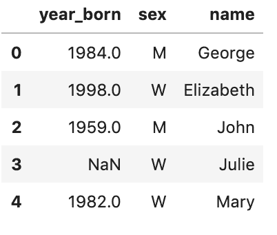

*这里，我使用了：df.head() 备注：python 列表是从 0 开始索引的，所以第一个元素是 0，第二个是 1，以此类推。*

### 步骤 3：理解数据类型、行数和列数

```py
df.shape

```

*输出*

(10,3) #(行, 列)

```py
print('Number of variables: {}'.format(df.shape[1]))
print('Number of rows: {}'.format(df.shape[0]))

```

*输出*

变量数量：3

行数：10

数据类型是编程中的一个重要概念，它包含了数据项的分类或归类。

```py
# Check the data type
df.dtypes

```

*输出*

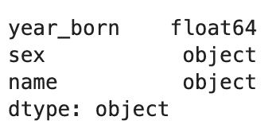

如果你对数据类型不太熟悉，这个表格可能对你有用。

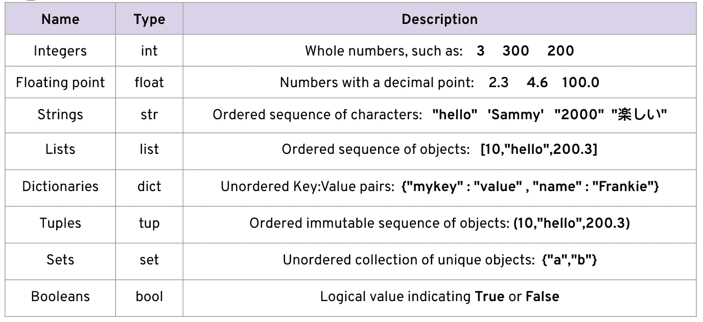

*数据类型*

```py
# basic data information(columns, rows, data types and memory usage)
df.info()

```

*输出*

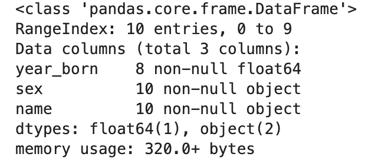

*从输出中，我们知道有 3 列，占用了 153MB 的内存。*

### 步骤 4：观察分类数据

```py
#use the dataframe.nunique() function to find the unique values
unique_counts = pd.DataFrame.from_records([(col, df[col].nunique()) for col in df.columns],columns=['Column_Name', 'Num_Unique']).sort_values(by=['Num_Unique'])

```

*输出*

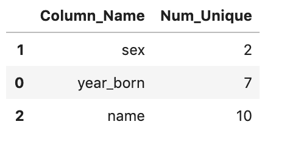

上表突出了每列的唯一值，这些值可能会帮助你确定哪些值可能是分类变量。例如，性别的唯一值为 2（这很合理 [M/F]）。名称和出生年份可能不太可能是分类变量，因为唯一值的数量相当大。

```py
#inspect the categorical column in detail
df['sex']

```

*输出*

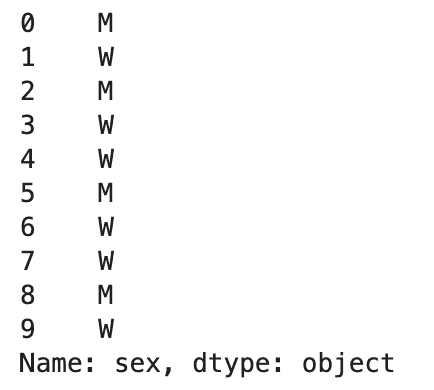

```py
# Counting
df.sex.value_counts()

```

*输出*

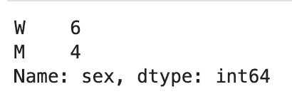

*6 名女性和 4 名男性*

### 步骤 5：探索数据

```py
# look into the specify data
df[(df['sex']=='M') & (df['year_born']==1990)]

```

*输出*

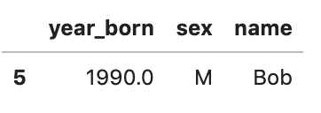

*要使用 &（AND）、~（NOT）和 |（OR），你必须在逻辑操作前后加上“（” 和 “）”。*

此外，使用 [**loc**](http://pandas.pydata.org/pandas-docs/stable/indexing.html#different-choices-for-indexing) 和 [**iloc**](http://pandas.pydata.org/pandas-docs/stable/indexing.html#different-choices-for-indexing) 你可以对 DataFrames 执行几乎所有你能想到的数据选择操作。让我给你一些例子。

```py
#show the *row* at position zero (1st row) df.iloc[0]
```

*输出*


```py
#show the 1st column and 1st *row*
df.iloc[0,0]

```

*输出*

1984

接下来，我将使用 ***loc*** 进行数据选择。

```py
#Gives you the ***row*** at position zero (2nd row)
df.loc[1]

```

*输出*

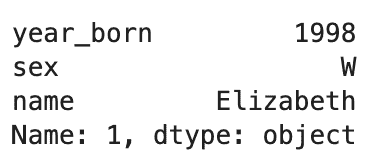

*第 2 行*

```py
#give you the first row and the column of 'sex'
df.loc[0,'sex']

```

*输出*

‘M’

```py
#select all rows where sex is male
df.loc[df.sex=='M']

```

*输出*

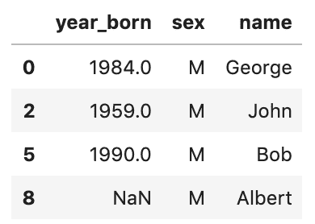

```py
#only show the column of 'year born' where sex is male
df.loc[df.sex=='M','year_born']

```

*输出*

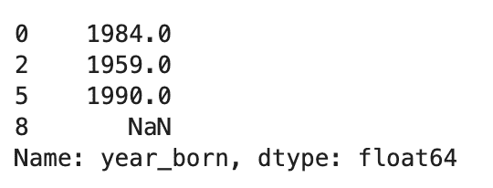

```py
# find the mean of year_born of male
df.loc[df.sex=='M', 'year_born'].median()

```

*输出*

1984.0

其他聚合： ***min()、max()、sum()、mean()、std()***

从上述示例中，你应该知道如何使用 **iloc** 和 **loc** 的功能。**iloc** 是 “**i**nteger **loc**ation” 的缩写。**iloc** 使我们可以以 ‘矩阵’ 风格的标记方式访问 DataFrame，即 **[行, 列]** 标记方式。**loc** 是基于标签的，这意味着你必须根据行和列的标签（名称）指定行和列。

根据我的经验，人们容易混淆 ***loc*** 和 ***iloc*** 的使用。因此，我更倾向于使用其中一个——***loc***。

### 步骤 6：查找缺失值

```py
#find null values and sort descending
df.isnull().sum().sort_values(ascending=False)

```

*输出*


*‘year_born’ 列中有 2 个缺失值。*

### 步骤 7：处理缺失值

当传递*inplace=True*时，数据将在原地重命名。

```py
#method 1: fill missing value using mean
df['year_born'].fillna((df['year_born'].mean()), inplace= True)

```

*输出*

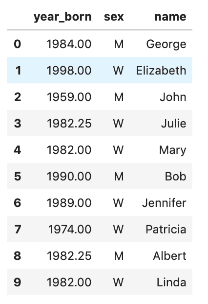

*Julie 和 Albert 的出生年份是 1982.25（由均值替代）。*

```py
#method 2 drop the rows with missing value
df.dropna(inplace = True)

```

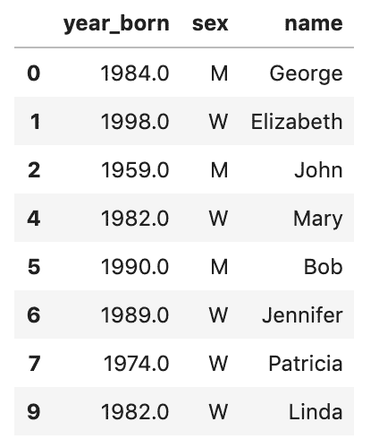

*第 4 行和第 9 行已被删除。*

### 步骤 8：数据可视化

Matplotlib 是一个 Python 的 2D 绘图库。你可以用几行代码轻松生成图表、直方图、功率谱、条形图、散点图等。这里的例子是绘制一个直方图。`%matplotlib inline` 会使你的绘图输出显示并存储在笔记本中，但与 pandas.hist() 的工作方式无关。

```py
%matplotlib inline
df.loc[df.sex=='W', 'year_born'].hist()

```

*输出*

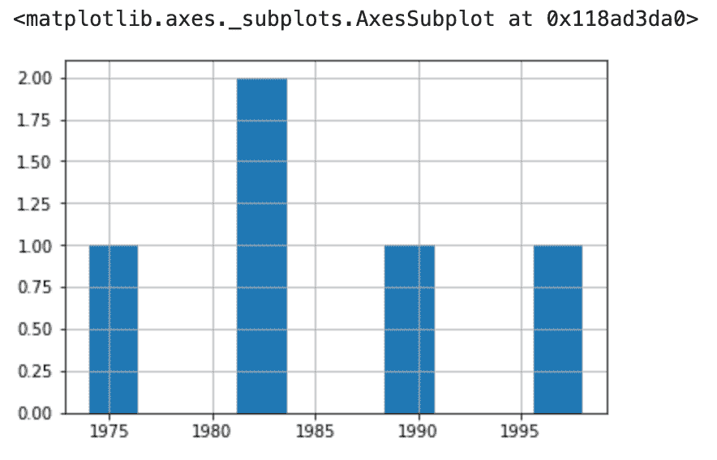

*性别=’W’的出生年份。*

```py
#plot a histogram showing 'year_born'
df.hist(column='year_born')

```

*输出*

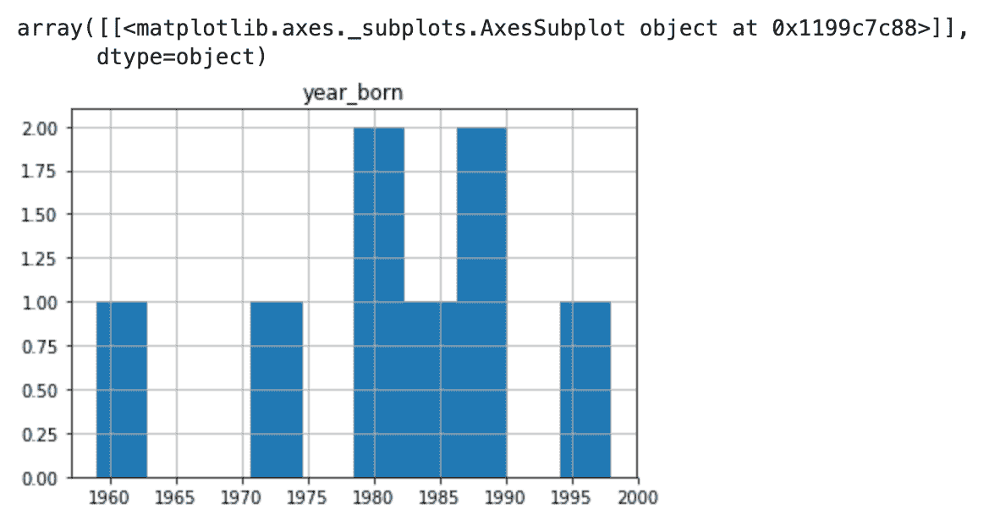

太棒了！我已经完成了使用**pandas**库进行数据发现的所有 7 个步骤。让我总结一下我使用过的函数：

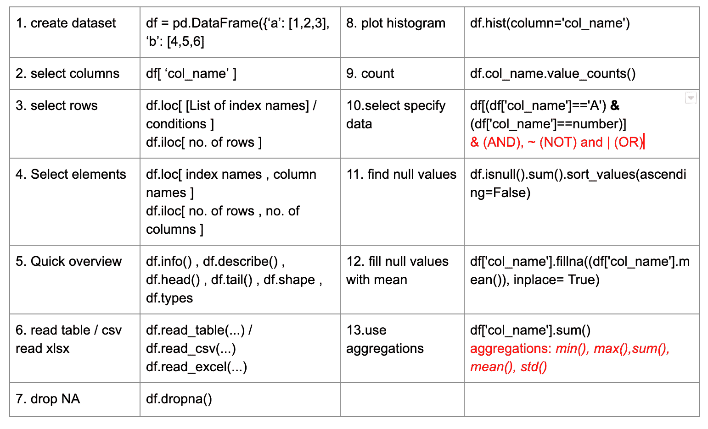

**附赠**：让我介绍一下只用两行代码进行探索性数据分析（EDA）的最快方法：**pandas_profiling**


```py
import pandas_profiling
df.profile_report()

```

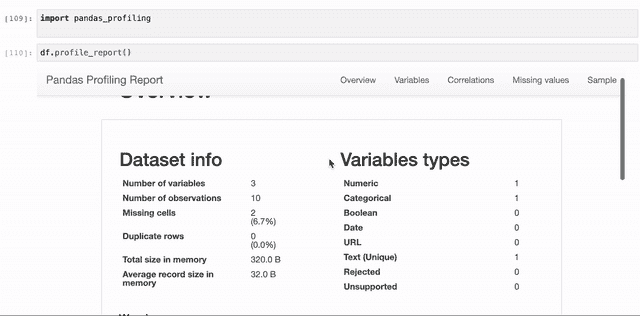

其内容包括：

1.  **概述：**

数据集信息：变量数量、观测数量、缺失单元格、重复行 0、内存中的总大小及内存中平均记录大小

1.  **变量：**缺失值及其百分比、不同计数、唯一值

1.  **相关性**

1.  **缺失值：**‘矩阵’和‘计数’

1.  **示例：**前 10 行和最后 10 行

[原文](https://medium.com/datadriveninvestor/python-pandas-in-7-simple-steps-no-coding-needed-eb980b633392)。经许可转载。

**相关：**

+   [数据清洗和预处理基础](https://www.kdnuggets.com/2019/11/data-cleaning-preprocessing-beginners.html)

+   [Pandas 的 5 个高级特性及其使用方法](https://www.kdnuggets.com/2019/10/5-advanced-features-pandas.html)

+   [如何通过一行代码将 Pandas 加速 4 倍](https://www.kdnuggets.com/2019/11/speed-up-pandas-4x.html)

### 更多相关主题

+   [通过 Python 自动化数据清洗的 5 个简单步骤](https://www.kdnuggets.com/5-simple-steps-to-automate-data-cleaning-with-python)

+   [5 个简单步骤系列：掌握 Python、SQL、Scikit-learn、PyTorch 和…](https://www.kdnuggets.com/5-simple-steps-series-master-python-sql-scikit-learn-pytorch-google-cloud)

+   [简化 Pandas DataFrame 的合并](https://www.kdnuggets.com/2022/09/combining-pandas-dataframes-made-simple.html)

+   [从 CSV 到完整的分析报告，利用 ChatGPT 5 个简单步骤](https://www.kdnuggets.com/from-csv-to-complete-analytical-report-with-chatgpt-in-5-simple-steps)

+   [分发和运行 LLM 的 llamafile 5 个简单步骤](https://www.kdnuggets.com/distribute-and-run-llms-with-llamafile-in-5-simple-steps)

+   [《Llama, Llama, Llama: 使用你的内容进行本地化 RAG 的 3 个简单步骤》](https://www.kdnuggets.com/3-simple-steps-to-local-rag-with-your-content)
