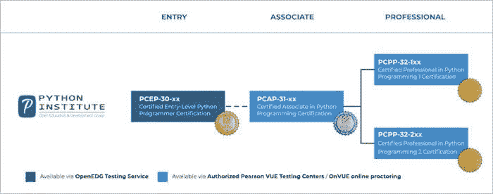
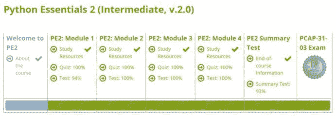
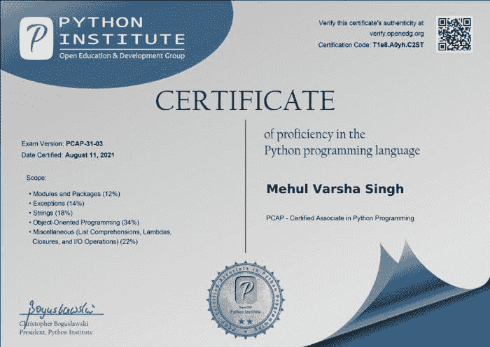

# 如何获得 Python PCAP 认证：路线图、资源、成功技巧，基于我的经验

> 原文：[`www.kdnuggets.com/2021/09/python-pcap-certification-roadmap-resources.html`](https://www.kdnuggets.com/2021/09/python-pcap-certification-roadmap-resources.html)

评论

**由[Mehul Varsha Singh](https://www.linkedin.com/in/mehul-varsha-singh-65a5b4155/)，诺丁汉大学 AI 本科生**。

Python 是这个十年最受欢迎的编程语言。就是这样。

* * *

## 我们的前三推荐课程

 1\. [Google 网络安全证书](https://www.kdnuggets.com/google-cybersecurity) - 快速进入网络安全职业。

 2\. [Google 数据分析专业证书](https://www.kdnuggets.com/google-data-analytics) - 提升你的数据分析能力

 3\. [Google IT 支持专业证书](https://www.kdnuggets.com/google-itsupport) - 支持您的组织进行 IT 工作

* * *

不论你学习 Python 的原因是什么，你都需要在某个时点验证你的知识是否符合国际标准。

> *“如果你正在学习它，那你不妨通过认证来获得一个证书。” - Mehul*

## 证书路线图由 Python Institute OpenEDG 提供

也许最重要且被讨论的四个 Python 证书来自于[Python Institute OpenEDG](https://pythoninstitute.org/)。

*Python Institute 认证路线图由 OpenEDG 提供。*

我于 2021 年 8 月 11 日取得了**PCAP（Python 认证助理程序员）证书**，成绩为 90%。

### 考试 - 关键细节

+   **考试版本**：PCAP-31–03

+   **持续时间**：65 分钟 + 10 分钟（保密协议）

+   **问题数量**：40

+   **及格分数**：70%

+   **考试方式**：由 Pearson Vue 在线监考

+   **考试形式**：选择题（单项和多项）

+   **价格**：295.00 美元（未折扣）

想要认证费折扣？当你完成 Open EDG 的 PCAP 课程（Python Essentials Part 1 和 Python Essentials Part 2）后，你将获得一张 50%的折扣券，将考试费用降低至 147.50 美元。

***不允许使用 IDE。***

## 我为考试制定的计划

所以，我决定了：“Mehul，你必须在 8 月之前获得 PCAP 认证。” 这就是我，在 6 月 31 号！

然后我开始在 Excel 中制定计划。

**简而言之**：1 个月准备和 2 周模拟测试。

我查看了[PCAP 课程大纲](https://pythoninstitute.org/certification/pcap-certification-associate/pcap-exam-syllabus/)，该大纲可以通过[Open EDG 提供的免费自学培训课程获取](https://pythoninstitute.org/free-python-courses/)。

该考试包含**4 个模块**（模块和包、字符串和异常、面向对象编程、杂项）。

*模块。*

我决定每周进行**1 个模块**的学习。

所以，从周一到周五，我会学习大纲，周六和周日则从[W3 Schools](https://www.w3resource.com/python-exercises/)做题以复习那些主题。

在 1 个月内，我完成了 PCAP 的大纲。

接下来的两周，我专注于进行练习测试/模拟考试。

**一些额外的资源和笔记：**

1.  [思科网络学院](https://www.netacad.com/courses/programming/pcap-programming-essentials-python)（免费且自定进度，包括额外的练习测试，完成后还可以获得考试的 50%折扣券）

1.  [免费样题测试](https://pythoninstitute.org/certification/pcap-certification-associate/) 由 Open EDG 提供

1.  在 PCAP 免费课程（第二部分）中，你每个模块会有 1 个小测验和 1 个测试，以及一个可以重复进行的最终总结测试（如上所述）。

1.  外部来源的模拟测试（非 PCAP）：这些模拟测试的难度通常高于实际考试，这将使你在参加实际考试时占有优势！在参加正式考试之前，我至少有 3 次得分达到 85%。

1.  闪卡：它们非常有效，尤其是在考试前进行即时复习。

+   [模块 1](https://quizlet.com/gb/555768886/pcap-31-03-module-1-modules-packages-pip-flash-cards/)

+   [模块 2](https://quizlet.com/gb/558484499/pcap-31-03-module-2-strings-lists-exceptions-flash-cards/?funnelUUID=b2bd722b-bc92-4da8-a2a1-c36b8a9c107d)

+   [模块 3](https://quizlet.com/gb/559369075/pcap-31-03-module-3-object-oriented-programming-flash-cards/?funnelUUID=c473aed1-9cf4-4d8f-8279-ed6d75cf75d9)

+   [模块 4](https://quizlet.com/gb/572631642/pcap-31-03-module-4-miscellaneous-flash-cards/?funnelUUID=07cf04da-04e6-4e5b-aeec-59e974283ea7)

1.  [考试讨论贴](https://www.examtopics.com/discussions/python-institute/)

## 一些小贴士！

1.  关注概念。

1.  考试包含：当选择时你可能会感到困惑，因为每个答案之间没有明确的区别。解决时使用排除法。

1.  尽可能多做题，因为这会给你在考试中带来优势。

1.  使用秒表进行练习测试（我能够在 30 分钟内完成最终考试，剩下的时间用于检查）**。**

1.  在学习过程中，如果你不理解一个程序，将其复制粘贴到调试器中并理解程序流程。这将帮助你在考试时，当他们要求你预测输出（尤其是面向对象相关问题）时。

最后，如果你不能解决一个问题，不要感到沮丧。理解解决方案，记下答案的原因，然后**再试一次**。我个人喜欢逐行阅读代码并解决问题。

好了，这就是我完成 PCAP 的全部经历。

希望我的经历和资源能给你信心和动力，帮助你顺利通过 PCAP 考试！

**个人简介：** [Mehul Varsha Singh](https://www.linkedin.com/in/mehul-varsha-singh-65a5b4155/) 是诺丁汉大学的 AI 本科生，同时还是一名受过训练的舞者、吉他手和 Maybank 学生大使。

**相关：**

+   [验证你的数据和分析技能的热门认证](https://www.kdnuggets.com/2021/09/sas-popular-certifications-data-analytics-skills.html)

+   [你从未听说过的最佳数据科学认证](https://www.kdnuggets.com/2020/11/best-data-science-certification-never-heard.html)

+   [10 个 Python 初学者技能](https://www.kdnuggets.com/2020/12/10-python-skills-beginners.html)

### 相关主题

+   [如何在没有任何工作经验的情况下获得你的第一份数据科学工作](https://www.kdnuggets.com/2021/02/first-job-data-science-without-work-experience.html)

+   [如何开始使用 SQL - 免费学习资源列表](https://www.kdnuggets.com/2022/10/get-running-sql-list-free-learning-resources.html)

+   [通过 DataCamp 体验数据的乐趣](https://www.kdnuggets.com/2022/12/datacamp-experience-joy-data-datacamp.html)

+   [3 个免费的个性化 ChatGPT 平台](https://www.kdnuggets.com/2023/05/3-free-platform-personalized-chatgpt-experience.html)

+   [将人类与 AI 代理结合以提升客户体验](https://www.kdnuggets.com/2024/06/softweb/bringing-human-and-ai-agents-together-for-enhanced-customer-experience)

+   [四周内学会 Python: 一份路线图](https://www.kdnuggets.com/2023/02/learning-python-four-weeks-roadmap.html)
