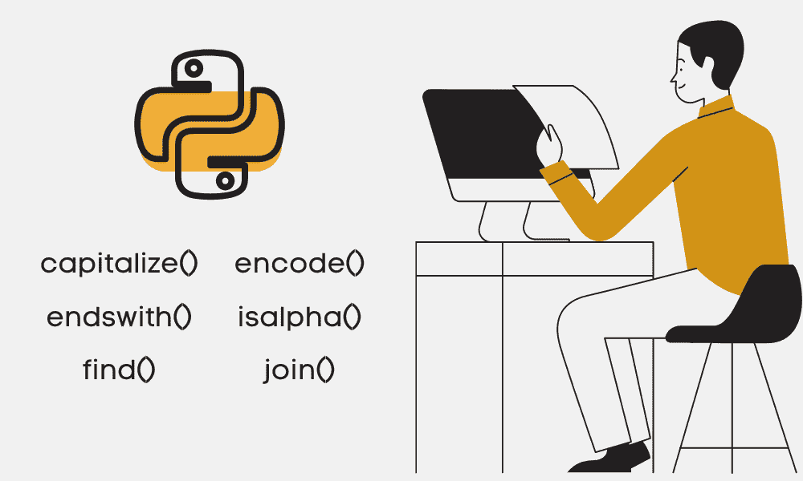

# Python 字符串方法

> 原文：[`www.kdnuggets.com/2022/12/python-string-methods.html`](https://www.kdnuggets.com/2022/12/python-string-methods.html)



图片由作者提供

在这篇博客中，我们将回顾 Python 的内置方法来操作字符串。你可以使用这些方法进行布尔检查以及替换或更改字符串的形式。

* * *

## 我们的前三大课程推荐

 1\. [Google 网络安全证书](https://www.kdnuggets.com/google-cybersecurity) - 快速进入网络安全职业的快车道。

 2\. [Google 数据分析专业证书](https://www.kdnuggets.com/google-data-analytics) - 提升你的数据分析技能

 3\. [Google IT 支持专业证书](https://www.kdnuggets.com/google-itsupport) - 支持你的组织进行 IT 工作

* * *

# 代码示例

## upper

`upper()` 方法将所有小写字母转换为大写字母。

```py
text = 'knoWledge dIsCoverY NuggETS'

# Converting string to uppercase
new_string = text.upper()
print(f"Before: {text}\nAfter: {new_string}\n")
```

```py
Before: knoWledge dIsCoverY NuggETS
After: KNOWLEDGE DISCOVERY NUGGETS
```

## replace

`replace()` 方法需要两个参数，将所有子字符串的出现替换为另一个子字符串。

```py
# Replacing the string
new_string = text.replace("knoWledge dIsCoverY ","KD")
print(f"Before: {text}\nAfter: {new_string}\n")
```

```py
Before: knoWledge dIsCoverY NuggETS
After: KDNuggETS
```

## find

`find()` 会搜索一个子字符串，如果找到，它将返回子字符串的最小索引。

```py
# Find the string
new_string = text.find("dIsCoverY")
print(f"The string is at {new_string} index\n")
```

```py
The string is at 10 index
```

## isnumeric

`isnumeric()` 方法返回“True”，如果字符串中的所有字符都是数字。

```py
# Is the text numerical?
new_string = text.isnumeric()
print(f"Is the text numerical? {new_string}\n")

print(f"Is·the·text·numerical?·{new_string}\n")
#·Is·the·text·numerical?
new_string·=·text.isnumeric()
```

```py
Is the text numerical? False
```

# 所有 Python 字符串方法列表

## 大小写转换

+   **lower():** 它将所有大写字母转换为小写字母。

+   **capitalize():** 它将字符串的第一个字符转换为大写字母。

+   **upper():** 它将所有小写字母转换为大写字母。

+   **title():** 它将字符串转换为标题大小写。

+   **casefold():** 它实现了不区分大小写的字符串匹配。

+   **swapcase():** 它将所有大写字母转换为小写字母，将所有小写字母转换为大写字母。

## 检查

+   **startswith():** 如果字符串以给定的子字符串开头，它返回“True”。

+   **endswith():** 如果字符串以给定的子字符串结尾，它返回“True”。

+   **isalnum():** 它检查字符串中的所有字符是否都是字母数字字符。

+   **isalpha():** 它检查字符串中的所有字符是否都是字母。

+   **isdecimal():** 它检查字符串中的所有字符是否都是十进制字符。

+   **isdigit():** 它检查字符串中的所有字符是否都是数字。

+   **isidentifier():** 它检查字符串是否是有效的标识符。

+   **islower():** 它检查字符串中的所有字符是否都是小写字母。

+   **isnumeric():** 它检查字符串中的所有字符是否都是数字。

+   **isprintable():** 如果字符串中的所有字符都是可打印字符或字符串为空，它返回“True”。

+   **isspace():** 它检查字符串中的所有字符是否都是空白字符。

+   **istitle():** 它检查字符串中的所有字符是否都是标题大小写。

+   **isupper():** 它检查字符串中的所有字符是否都是大写字母。

## 拆分和连接

+   **join():** 它返回一个拼接后的字符串。

+   **partition():** 它在分隔符的第一次出现处拆分字符串。

+   **rpartition():** 它将字符串拆分为三部分。

+   **rsplit():** 它使用指定的分隔符从右侧拆分字符串。

+   **splitlines():** 它在行边界处拆分行。

+   **split():** 它使用指定的分隔符拆分字符串。

## 填充和清理

+   **center():** 用指定的字符填充字符串。

+   **ljust():** 它使用指定的宽度将字符串左对齐。

+   **rjust():** 它使用指定的宽度将字符串右对齐。

+   **lstrip():** 它移除字符串开头的字符。

+   **rstrip():** 它移除字符串末尾的字符。

+   **strip():** 它移除字符串的前导和尾随字符。

+   **zfill():** 它返回一个在字符串左侧填充‘0’字符的副本。

## 查找和替换

+   **encode():** 它使用指定的编码方案对字符串进行编码。

+   **find():** 它返回指定子字符串的最小索引。

+   **rfind():** 它返回指定子字符串的最高索引。

+   **index():** 它返回子字符串在字符串中首次出现的位置。

+   **rindex():** 它返回子字符串在字符串中出现的最高索引。

+   **replace():** 它需要两个参数来将所有出现的子字符串替换为另一个子字符串。

## 杂项

+   **count():** 它计算子字符串在字符串中出现的次数。

+   **expandtabs():** 它指定在字符串中用“\t”符号替代的空格数量。

+   **maketrans():** 它返回一个翻译表。

+   **translate():** 它使用翻译映射更改字符串。

+   **format():** 它格式化字符串以便控制台打印。

+   **format_map():** 它使用字典在字符串中格式化指定的值。

# 学习资源

+   [Python 字符串教程](https://www.datacamp.com/tutorial/python-string-tutorial)

+   [Python 字符串 - GeeksforGeeks](https://www.geeksforgeeks.org/python-string/)

+   [31 个必备 Python 字符串方法 - YouTube](https://www.youtube.com/watch?v=HJpiAZDJrRY)

**[Abid Ali Awan](https://www.polywork.com/kingabzpro)** ([@1abidaliawan](https://twitter.com/1abidaliawan)) 是一位认证数据科学专业人士，喜欢构建机器学习模型。目前，他专注于内容创作和撰写关于机器学习和数据科学技术的技术博客。Abid 拥有技术管理硕士学位和电信工程学士学位。他的愿景是利用图神经网络为面临心理疾病的学生开发 AI 产品。

### 更多相关话题

+   [Python 字符串处理备忘单](https://www.kdnuggets.com/2020/01/python-string-processing-primer.html)

+   [Python 字符串匹配无复杂正则语法](https://www.kdnuggets.com/2023/02/python-string-matching-without-complex-regex-syntax.html)

+   [在 Python 中将字节转换为字符串：初学者教程](https://www.kdnuggets.com/convert-bytes-to-string-in-python-a-tutorial-for-beginners)

+   [每位程序员都应该知道的 11 种 Python 魔法方法](https://www.kdnuggets.com/11-python-magic-methods-every-programmer-should-know)

+   [理解 Python 的迭代和成员资格：__contains__ 和 __iter__ 魔法方法指南](https://www.kdnuggets.com/understanding-pythons-iteration-and-membership-a-guide-to-__contains__-and-__iter__-magic-methods)

+   [k-means 聚类的质心初始化方法](https://www.kdnuggets.com/2020/06/centroid-initialization-k-means-clustering.html)
