# Python 元组和元组方法

> 原文：[`www.kdnuggets.com/2019/11/python-tuples-methods.html`](https://www.kdnuggets.com/2019/11/python-tuples-methods.html)

评论

**由 [Michael Galarnyk](https://www.linkedin.com/in/michaelgalarnyk/)，数据科学家**

元组是有序的项序列，就像列表一样。元组和列表的主要区别在于元组不可更改（不可变），而列表则可以（可变）。

* * *

## 我们的前三个课程推荐

 1\. [谷歌网络安全证书](https://www.kdnuggets.com/google-cybersecurity) - 快速开启网络安全职业生涯。

 2\. [谷歌数据分析专业证书](https://www.kdnuggets.com/google-data-analytics) - 提升你的数据分析技能

 3\. [谷歌 IT 支持专业证书](https://www.kdnuggets.com/google-itsupport) - 支持你的组织的 IT 需求

* * *

### 初始化元组

有两种方法可以初始化一个空元组。你可以通过使用 () 并且不包含任何值来初始化一个空元组。

```py
# Way 1
emptyTuple = ()
```

你也可以通过使用 `tuple` 函数来初始化一个空元组。

```py
# Way 2
emptyTuple = tuple()
```

含有值的元组可以通过用逗号分隔的值序列来初始化。

```py
# way 1
z = (3, 7, 4, 2)# way 2 (tuples can also can be created without parenthesis)
z = 3, 7, 4, 2
```

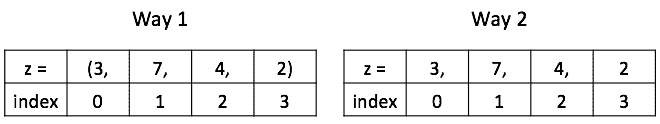

你可以使用或不使用括号初始化元组。

重要的是要记住，如果你想创建一个只包含一个值的元组，你需要在项后面加上一个逗号。

```py
# tuple with one value
tup1 = ('Michael',)# tuple with one value
tup2 = 'Michael',# This is a string, NOT a tuple.
notTuple = ('Michael')
```

### 访问元组中的值


你可以使用或不使用括号初始化元组。

元组中的每个值都有一个指定的索引值。重要的是要注意 Python 是零索引的语言。这意味着元组中的第一个值在索引 0 处。

```py
# Initialize a tuple
z = (3, 7, 4, 2)*# Access the first item of a tuple at index 0*
print(z[0])
```

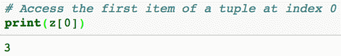

访问索引 0 处项的输出。

Python 还支持负索引。负索引从元组的末尾开始。使用负索引获取元组中的最后一项有时更方便，因为你不需要知道元组的长度来访问最后一项。

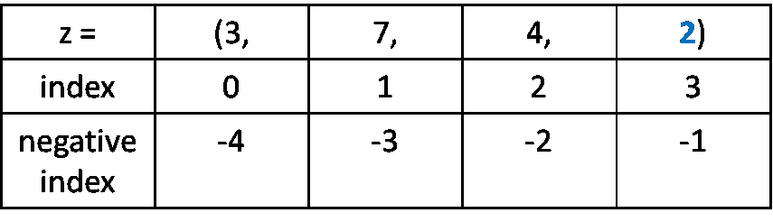

```py
*# print last item in the tuple*
print(z[-1])
```

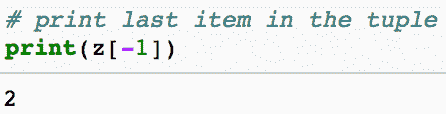

访问元组中最后一项的输出

提醒一下，你也可以使用正索引访问相同的项（如下所示）。

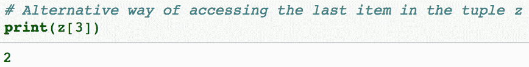

另一种访问元组 z 中最后一项的方法

### 元组切片

切片操作返回一个包含所请求项的新元组。切片适用于获取元组中的子集。对于下面的示例代码，它将返回一个包含从索引 0 到不包括索引 2 的项的元组。

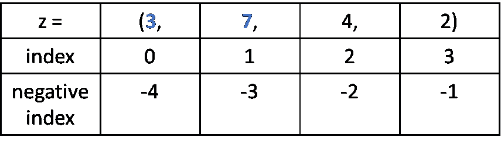

第一个索引是包含的（在 `:` 之前），最后一个（在 `:` 之后）则不包含

```py
# Initialize a tuple
z = (3, 7, 4, 2)# first index is inclusive (before the :) and last (after the :) is not.
print(z[0:2])
```

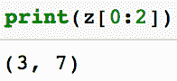

元组的切片语法

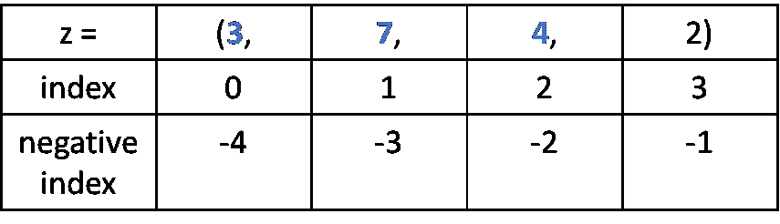

```py
*# everything up to but not including index 3*
print(z[:3])
```

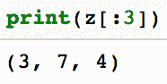

所有到达但不包括索引 3 的项

你甚至可以使用负索引进行切片。


```py
print(z[-4:-1])
```

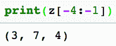

### 元组是不可变的

元组是不可变的，这意味着在初始化元组后，无法更新元组中的单个项。如下面的代码所示，你不能更新或更改元组项的值（这与 [Python 列表](https://towardsdatascience.com/python-basics-6-lists-and-list-manipulation-a56be62b1f95) 的可变性不同）。

```py
z = (3, 7, 4, 2)z[1] = "fish"
```

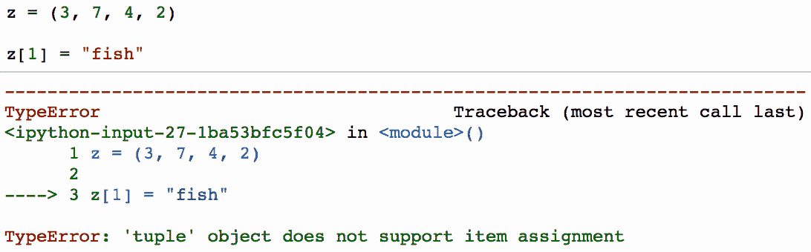

即使元组是不可变的，也可以取现有元组的部分来创建新的元组，如下例所示。

```py
# Initialize tuple
tup1 = ('Python', 'SQL')# Initialize another Tuple
tup2 = ('R',)# Create new tuple based on existing tuples
new_tuple = tup1 + tup2;
print(new_tuple)
```

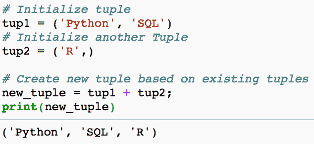

### 元组方法

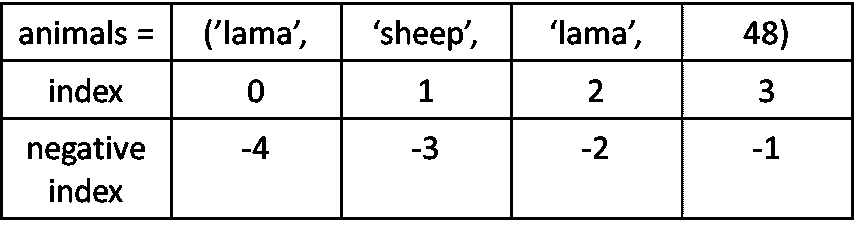

在开始本节之前，让我们先初始化一个元组。

```py
# Initialize a tuple
animals = ('lama', 'sheep', 'lama', 48)
```

### index 方法

index 方法返回值出现的第一个索引。

```py
print(animals.index('lama'))
```

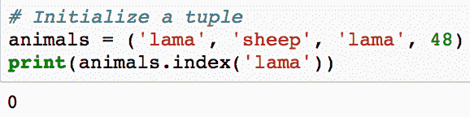

### count 方法

count 方法返回元组中值出现的次数。

```py
print(animals.count('lama'))
```

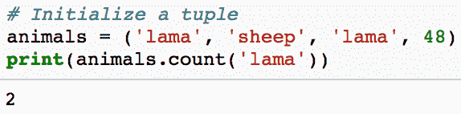

字符串‘lama’在元组 animals 中出现了两次

### 迭代元组

你可以通过使用 `for` 循环来迭代元组中的项。

```py
for item in ('lama', 'sheep', 'lama', 48):
   print(item)
```

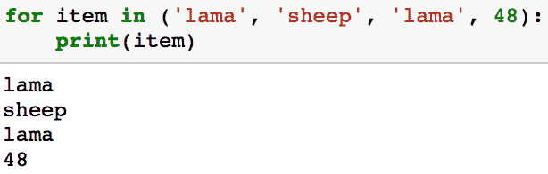

### 元组解包

元组对于序列解包非常有用。

```py
x, y = (7, 10);
print("Value of x is {}, the value of y is {}.".format(x, y))
```

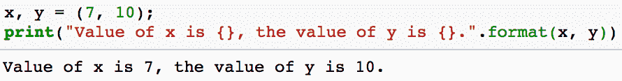

### 枚举

`enumerate` 函数返回一个包含每次迭代的计数（从默认的 0 开始）和从序列中获得的值的元组：

```py
friends = ('Steve', 'Rachel', 'Michael', 'Monica')
for index, friend in enumerate(friends):
    print(index,friend)
```

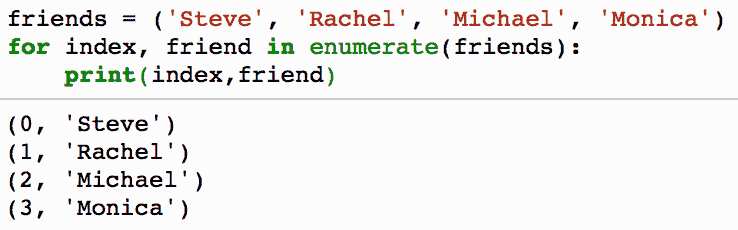

### 元组相对于列表的优点

本节的快速视频

列表和元组是标准的 Python 数据类型，用于以序列形式存储值。`tuple` 是 **不可变的**，而 `list` 是 **可变的**。以下是元组相对于列表的一些其他优点（部分来自 [Stack Overflow](https://stackoverflow.com/questions/1708510/python-list-vs-tuple-when-to-use-each)）

+   **元组比列表更快。** 如果你定义了一组常量值，并且你唯一要做的就是迭代它，使用元组而不是列表。性能差异可以通过 `timeit` 库部分测量，该库允许你测量 Python 代码的执行时间。下面的代码运行每种方法 100 万次，并输出总共花费的时间（以秒为单位）。

```py
import timeitprint(timeit.timeit('x=(1,2,3,4,5,6,7,8,9,10,11,12)', number=1000000))print(timeit.timeit('x=[1,2,3,4,5,6,7,8,9,10,11,12]', number=1000000))
```

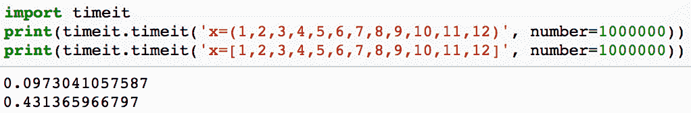

+   一些元组可以作为字典的键（特别是那些包含不可变值如字符串、数字和其他元组的元组）。列表不能用作字典键，因为列表是可变的（你可以在[这里](https://medium.com/@GalarnykMichael/python-basics-10-dictionaries-and-dictionary-methods-4e9efa70f5b9)了解字典）。

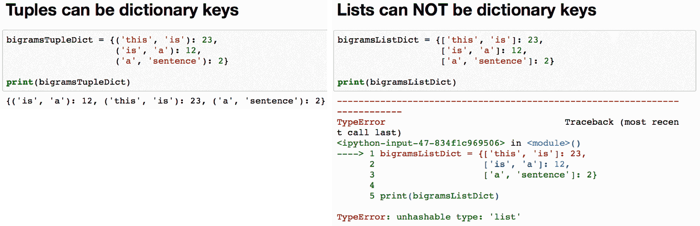

+   元组可以作为集合中的值，而列表不行（你可以在[这里](https://towardsdatascience.com/python-sets-and-set-theory-2ace093d1607)了解更多关于集合的内容）。

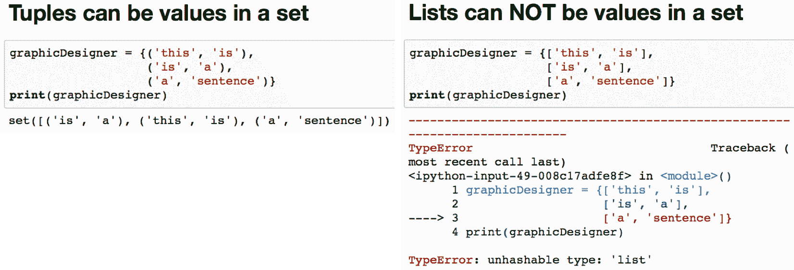

### 结论

如果你对教程有任何问题或想法，可以在下方评论区或通过[Twitter](https://twitter.com/GalarnykMichael)联系我。下一篇文章将回顾[Python 字典及字典方法](https://medium.com/@GalarnykMichael/python-basics-10-dictionaries-and-dictionary-methods-4e9efa70f5b9)。如果你想了解如何使用 Pandas、Matplotlib 或 Seaborn 库，请考虑参加我的[Python 数据可视化 LinkedIn 学习课程](https://www.linkedin.com/learning/python-for-data-visualization/value-of-data-visualization)。这里是[免费预览视频](https://youtu.be/BE8CVGJuftI)。

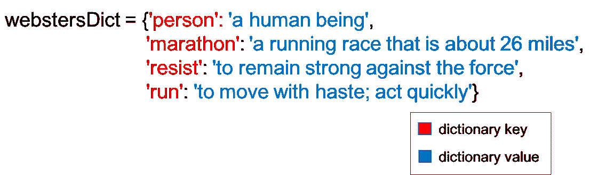

[Python 字典教程](https://medium.com/@GalarnykMichael/python-basics-10-dictionaries-and-dictionary-methods-4e9efa70f5b9)

**个人简介: [Michael Galarnyk](https://www.linkedin.com/in/michaelgalarnyk/)** 是一名数据科学家和企业培训师。他目前在 Scripps 转化研究所工作。你可以在 Twitter (https://twitter.com/GalarnykMichael)、Medium (https://medium.com/@GalarnykMichael) 和 GitHub (https://github.com/mGalarnyk) 找到他。

[原文](https://medium.com/@GalarnykMichael/python-tuples-and-tuple-methods-4817a6bb6fff)。经授权转载。

**相关:**

+   Python 列表和列表操作

+   理解箱线图

+   应用于 Pandas DataFrame 的集合操作

### 相关话题

+   [理解 Python 的迭代和成员关系：__contains__ 和 __iter__ 魔法方法指南](https://www.kdnuggets.com/understanding-pythons-iteration-and-membership-a-guide-to-__contains__-and-__iter__-magic-methods)

+   [Python 字符串方法](https://www.kdnuggets.com/2022/12/python-string-methods.html)

+   [每个程序员都应该知道的 11 个 Python 魔法方法](https://www.kdnuggets.com/11-python-magic-methods-every-programmer-should-know)

+   [k-means 聚类的质心初始化方法](https://www.kdnuggets.com/2020/06/centroid-initialization-k-means-clustering.html)

+   [机器学习中的替代特征选择方法](https://www.kdnuggets.com/2021/12/alternative-feature-selection-methods-machine-learning.html)

+   [数据科学方法推动业务成功](https://www.kdnuggets.com/2023/10/nwu-data-science-methods-drive-business-success)
