# Python 如何用于数据可视化？

> 原文：[`www.kdnuggets.com/2022/12/python-used-data-visualization.html`](https://www.kdnuggets.com/2022/12/python-used-data-visualization.html)


图片来自 [Freepik](https://www.freepik.com/free-vector/illustration-social-media-concept_2807766.htm#query=data%20visualizationython&position=28&from_view=search&track=ais)

# 介绍

* * *

## 我们的前三大课程推荐

 1\. [Google 网络安全证书](https://www.kdnuggets.com/google-cybersecurity) - 加入网络安全职业的快车道

 2\. [Google 数据分析专业证书](https://www.kdnuggets.com/google-data-analytics) - 提升你的数据分析技能

 3\. [Google IT 支持专业证书](https://www.kdnuggets.com/google-itsupport) - 支持你的组织 IT

* * *

研究如何以视觉方式表示数据称为数据可视化。它通过图形化绘制数据有效地传达数据中的发现。

我们可以通过数据可视化获得数据的视觉总结。当数据以图像、地图和图表呈现时，人类大脑更容易处理和理解这些数据。

无论是小型还是大型数据集，都能从数据可视化中获益，但大数据集尤为突出，因为人工查看、处理和理解所有数据是困难的。

数据可视化的研究涉及通过将数据放入视觉背景中来尝试理解数据，以揭示可能无法通过其他方式看到的模式、趋势和连接。

# 使用 Python 进行数据可视化

数据可视化可以使用任何编程语言进行，但选择 Python 更适合数据可视化，因为 Python 代码行数较少。

[Python](https://www.python.org/) 具有简单的语法，编写代码所需时间非常少，同时 Python 提供了多种数据可视化的包或库，利用现有的功能。一些用于数据可视化的 Python 库包括 matplotlib 和 seaborn 以及许多其他数据可视化的包。

Matplotlib、Seaborn、Bokeh 和 Plotly 是 Python 中用于数据可视化的库。

1.  **Matplotlib** 用于绘制图表，如散点图、折线图、饼图和条形图，matplotlib 处理数组和数据集字段。

1.  **Seaborn** 用于复杂的数据可视化，例如着色和设计图表，并且 seaborn 能处理整个数据集。

1.  **Bokeh** 用于通过使事物互动来进行数据可视化，并使用 HTML 和 JavaScript 在网页浏览器中呈现数据。

1.  **Plotly** 也用于数据可视化，使图表更具吸引力，并允许自定义。

现在，让我们详细了解这些内容。

# 1\. Matplotlib

Matplotlib 用于绘制图形，如散点图、线图、饼图和条形图，且 matplotlib 处理的是数据集的数组和字段。

Matplotlib 是一个低级接口，非常易于使用并提供灵活性，如前所述，matplotlib 处理使用 NumPy 创建的数组。

要安装 matplotlib，我们需要使用以下命令，

```py
pip install matplotlib
```

在命令提示符中运行此命令，您会看到如下所示。

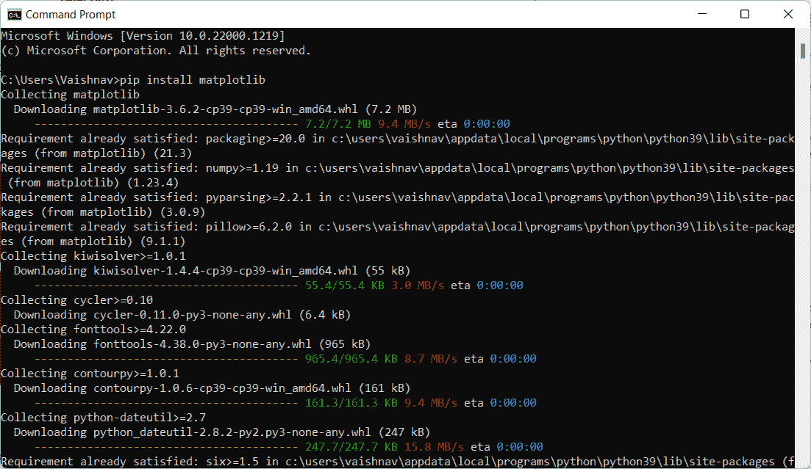

图片由作者提供

现在，我们可以使用 matplotlib 来可视化数据。

## 线图

线图用于表示数据集中的两个不同字段，或使用 plot() 函数显示两个字段之间的关系。

我们可以用 Python 编程，如下所示

```py
import pandas as pd
import matplotlib. pyplot as plt

data = pd.read_csv("diabetes.csv")

plt. plot(data['Preg'])
plt. plot(data['age'])
plt. title("Line Plot")
plt. xlabel('Preg')
plt. label('age')
plt. show()
```

**输出：**

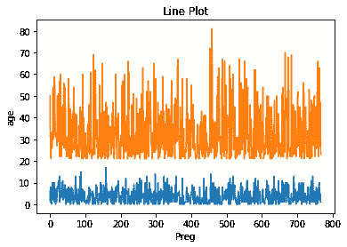

## 散点图

[散点图](https://en.wikipedia.org/wiki/Scatter_plot) 用于表示两个字段之间的关系，使用 matplotlib 库中的 scatter() 函数，该函数使用点来表示数据。

我们可以用 Python 编程，如下所示

```py
import pandas as pd
import matplotlib. pyplot as plt

data = pd.read_csv("diabetes.csv")

plt. scatter(data['Preg'], data['age'])
plt. title("Scatter Plot")
plt. xlabel('Preg')
plt. label('age')
plt. show()
```

**输出：**

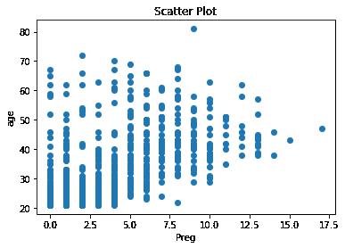

## 条形图

条形图用于使用 matplotlib 库中的 bar() 函数表示分类数据。

我们可以用 Python 编程，如下所示

```py
import pandas as pd
import matplotlib. pyplot as plt

data = pd.read_csv("diabetes.csv")

plt. bar(data['Preg'], data['age'])
plt. title("Bar Plot")
plt. xlabel('Preg')
plt. ylabel('age')
plt.show()
```

**输出：**

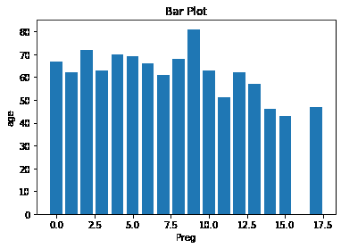

## 直方图

直方图用于以组的形式表示数据，使用 [matplotlib](https://matplotlib.org/) 库中的 hist() 函数来表示数据。

我们可以用 Python 编程，如下所示

```py
import pandas as pd
import matplotlib.pyplot as plt

data = pd.read_csv("diabetes.csv")

plt.hist(data['age'])
plt.title("Histogram Plot")
plt.show()
```

**输出：**

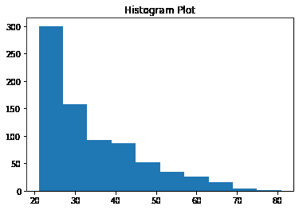

# 2\. Seaborn

Seaborn 用于数据的复杂可视化，如着色、图形设计，且 seaborn 可以处理整个数据集。

Seaborn 具有高层接口，能够生成具有吸引力且色彩丰富的输出。

要安装 seaborn，我们需要使用以下命令，

```py
pip install seaborn
```

在命令提示符中运行此命令，您会看到如下所示。

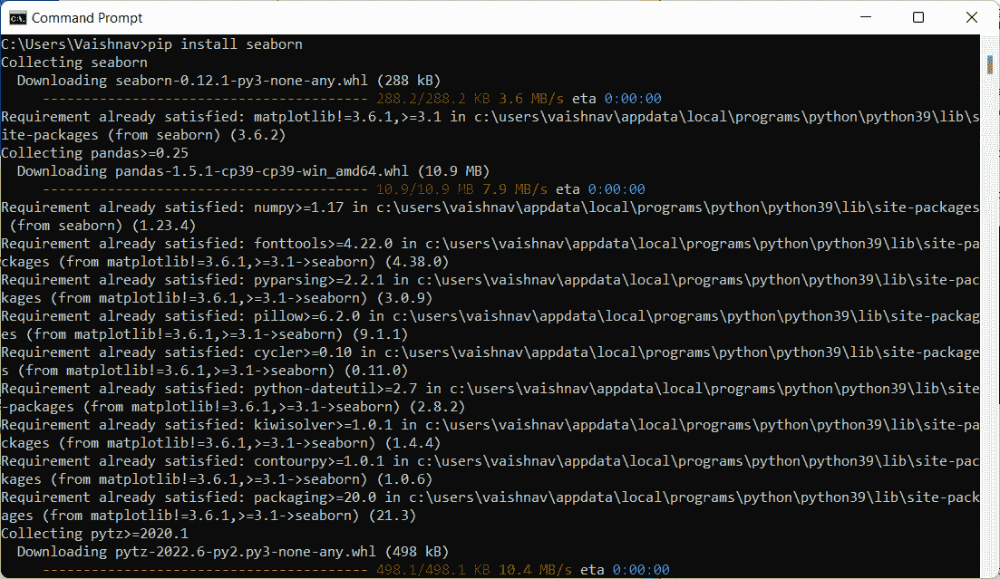

图片由作者提供

现在，我们可以使用 seaborn 来可视化数据。

## 线图

线图用于表示数据集中的两个不同字段，或显示两个字段之间的关系，使用 seaborn 中的 lineplot() 函数。

我们可以用 Python 编程，如下所示

```py
import seaborn as sns
import matplotlib.pyplot as plt
import pandas as pd

data = pd.read_csv("diabetes.csv")

sns.lineplot(x='Preg', y='age', data=data)
plt.show()
```

**输出：**

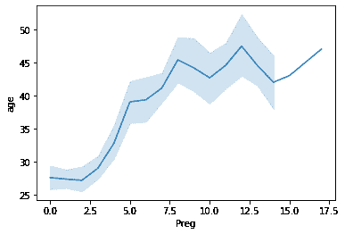

## 散点图

散点图用于表示两个字段之间的关系，使用 seaborn 库中的 scatterplot() 函数，该函数使用点来表示数据。

我们可以用 Python 编程，如下所示

```py
import seaborn as sns
import matplotlib.pyplot as plt
import pandas as pd

data = pd.read_csv("diabetes.csv")

sns.scatterplot(x='Preg', y='age', data=data, hue='class')
plt.show()
```

**输出：**

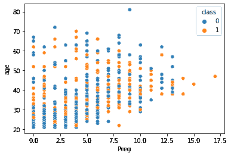

## 条形图

条形图用于表示分类数据，使用 seaborn 库中的 barplot()函数来表示数据。

我们可以用 Python 编写如下代码

```py
import seaborn as sns
import matplotlib.pyplot as plt
import pandas as pd

data = pd.read_csv("diabetes.csv")

sns.barplot(x='Preg', y='age', data=data, hue='class')
plt.show()
```

**输出：**

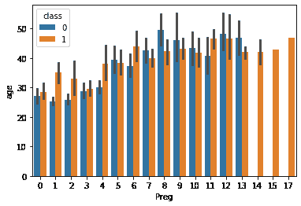

## 直方图

直方图用于将数据以分组的形式表示，使用 matplotlib 库中的 histplot()函数来表示数据。

我们可以用 Python 编写如下代码

```py
import seaborn as sns
import matplotlib.pyplot as plt
import pandas as pd

data = pd.read_csv("diabetes.csv")

sns.histplot(x='age',kde=True, data=data, hue='class')
plt.show()
```

**输出：**


# 3. Bokeh

Bokeh 用于数据可视化，通过使内容互动，使用 HTML 和 JavaScript 在网页浏览器中表示数据，并具有高级互动性。

要安装 seaborn，我们需要使用以下命令

```py
pip install bokeh
```

在命令提示符中运行此命令，你将看到如下效果。

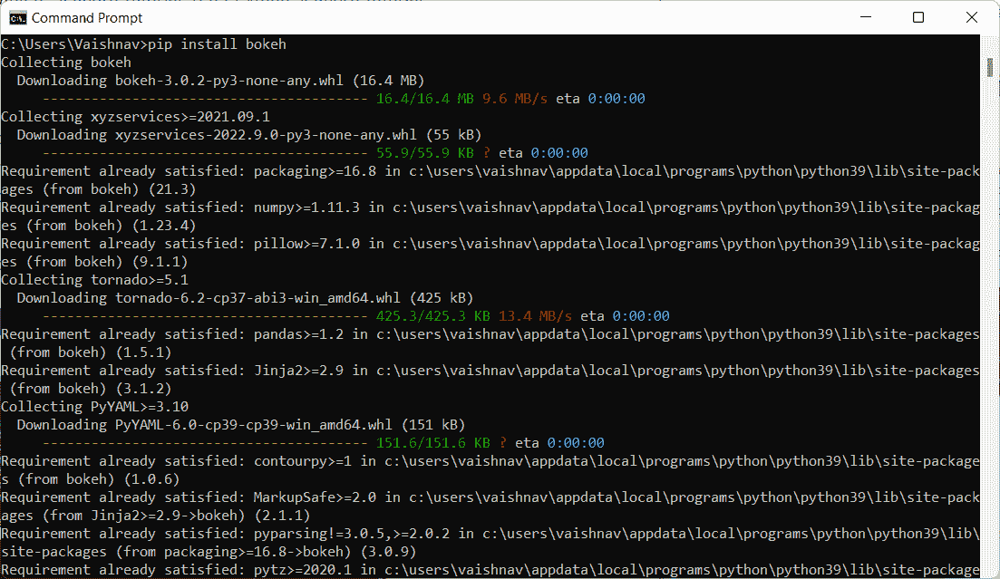

作者提供的图片

现在，我们可以使用 bokeh 来可视化数据。

## 折线图

折线图用于表示数据集中两个不同字段之间的关系，或使用 bokeh 中的 line()函数显示两个字段之间的关系。

我们可以用 Python 编写如下代码，

```py
from bokeh.plotting import figure, output_file, show
import pandas as pd

graph = figure(title = "Bokeh Bar Chart")
data = pd.read_csv("diabetes.csv")

df = data['age'].value_counts()

graph.line(df, data['age'])
show(graph)
```

**输出：**

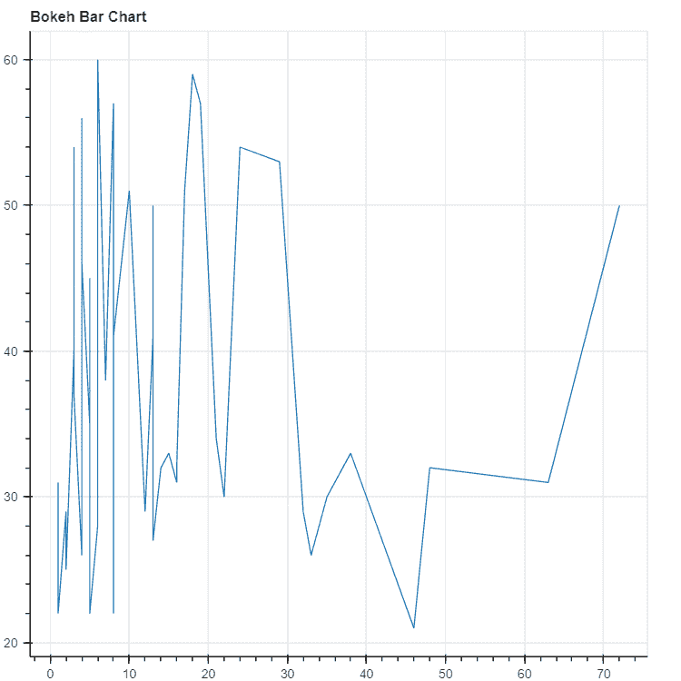

## 散点图

散点图用于表示两个字段之间的关系，使用 bokeh 库中的 scatter()函数，通过点来表示数据。

我们可以用 Python 编写如下代码

```py
from bokeh.plotting import figure, output_file, show
import pandas as pd

graph = figure(title = "Bokeh Bar Chart")
data = pd.read_csv("diabetes.csv")

df = data['age'].value_counts()
graph.scatter(df, data['age'])
show(graph)
```

**输出：**

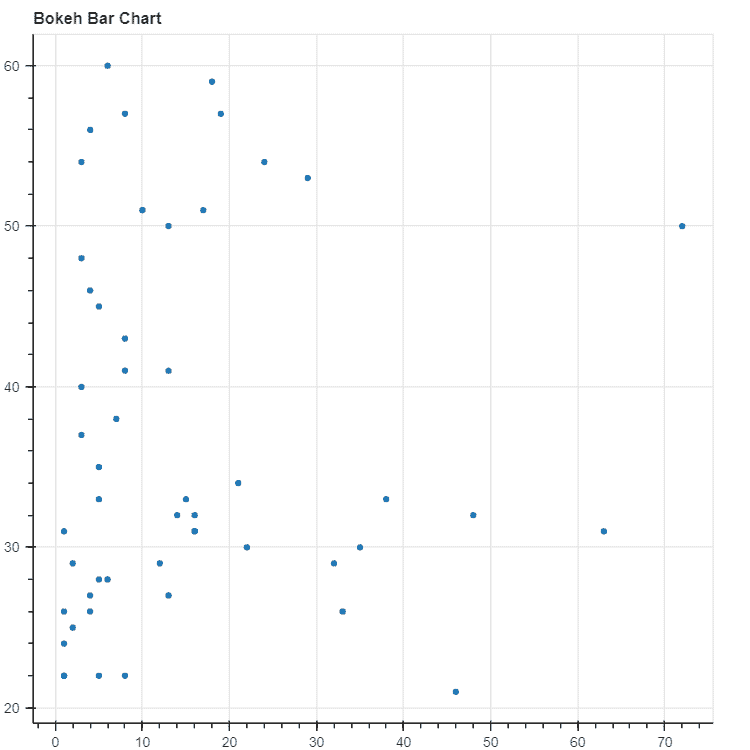

## 条形图

条形图用于表示分类数据，使用 bokeh 库中的 vbar()和 hbar()函数来表示数据。

我们可以用 Python 编写如下代码

```py
from bokeh.plotting import figure, output_file, show
import pandas as pd

graph = figure(title = "Bokeh Bar Chart")
data = pd.read_csv("diabetes.csv")

graph.vbar(data['age'], top=data['Preg'])
show(graph)
```

**输出：**

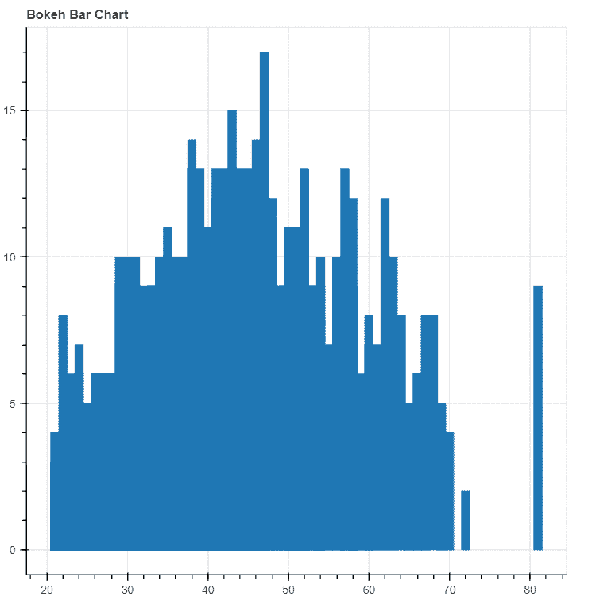

# 4. Plotly

Plotly 也用于数据可视化，使图表更具吸引力并允许自定义。

要安装 plotly，我们需要使用以下命令

```py
pip install plotly
```

在命令提示符中运行此命令，你将看到如下效果。

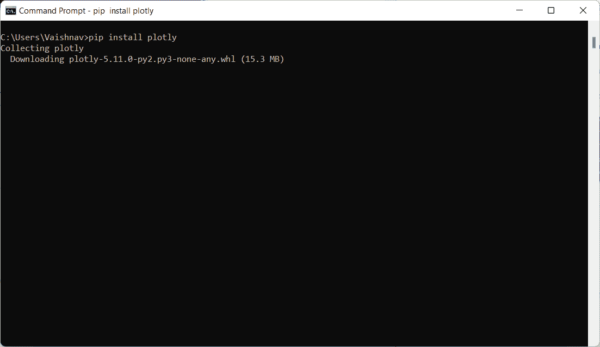

作者提供的图片

现在，我们可以使用 plotly 来可视化数据。

## 折线图

折线图用于表示数据集中两个不同字段之间的关系，或使用 plotly 中的 line()函数显示两个字段之间的关系。

我们可以用 Python 编写如下代码

```py
import plotly.express as px
import pandas as pd

data = pd.read_csv("diabetes.csv")

fig = px.line(data, y='age', color='class')
fig.show()
```

**输出：**

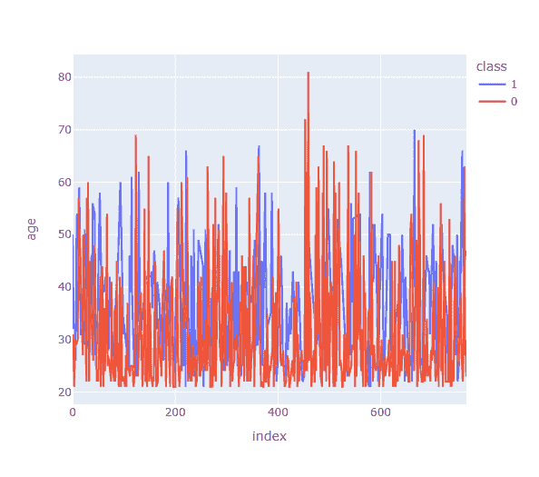

## 散点图

散点图用于表示两个字段之间的关系，使用 plotly 库中的 scatter()函数，通过点来表示数据。

我们可以用 Python 编写如下代码

```py
import plotly.express as px
import pandas as pd

data = pd.read_csv("diabetes.csv")

fig = px.scatter(data, x='Preg', y='age', color='class')
fig.show()
```

**输出：**

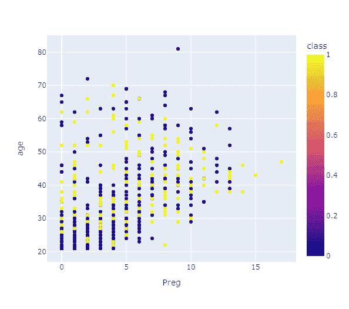

## 条形图

条形图用于使用 plotly 库中的 bar()函数表示分类数据。

我们可以用 Python 编写如下代码

```py
import plotly.express as px
import pandas as pd

data = pd.read_csv("diabetes.csv")

fig = px.bar(data, x='Preg', y='age', color='class')
fig.show()
```

**输出：**

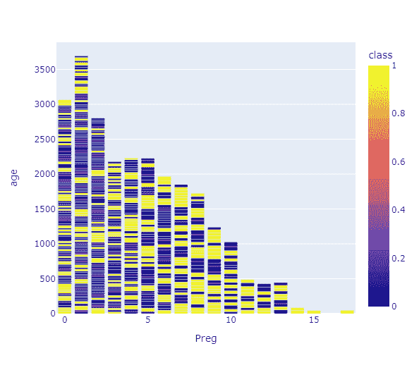

## 直方图

直方图用于使用 matplotlib 库中的 histogram()函数以分组形式表示数据。

我们可以用 Python 编写如下代码

```py
import plotly.express as px
import pandas as pd

data = pd.read_csv("diabetes.csv")

fig = px.histogram(data, x='age', color='class')
fig.show()
```

**输出：**


这些是使用 Python 库进行数据可视化的不同方法。现在让我们简要总结一下讨论的内容。

# 结论

1.  首先，我们了解了什么是数据可视化以及为什么要进行数据可视化。

1.  数据可视化的研究涉及通过将数据置于可视化上下文中，以揭示可能不易察觉的模式、趋势和关联。

1.  接下来，我们了解了如何使用 Python 进行数据可视化以及为什么可以选择 Python 进行数据可视化。

1.  我们了解了使用 Python 进行数据可视化的不同库。

1.  我们通过合适的示例和输出代码理解了每种数据可视化技术。

希望您学会了如何使用 Python 及其不同类型的库轻松地可视化数据。您可以通过免费的资源如 Kdnuggets、[Scaler](https://www.scaler.com/topics/python/)或[Wiki](https://wiki.python.org/moin/BeginnersGuide/Programmers)了解更多关于 Python 及其各种库的知识。

**[Vaishnavi Amira Yada](https://www.linkedin.com/in/vaishnavi-amira-yada/)**是一位技术内容作家。她具备 Python、Java、DSA、C 等方面的知识。她发现自己对写作充满热情，并且非常喜爱它。

### 更多相关主题

+   [为什么仅使用 LLM 无法满足您公司的预测需求](https://www.kdnuggets.com/2024/01/pecan-llms-used-alone-cant-address-companys-predictive-needs)

+   [生成性人工智能如何帮助您改进数据可视化图表](https://www.kdnuggets.com/how-generative-ai-can-help-you-improve-your-data-visualization-charts)

+   [KDnuggets 新闻，6 月 22 日：主要的监督学习算法…](https://www.kdnuggets.com/2022/n25.html)

+   [10 种最常用的 Tableau 函数](https://www.kdnuggets.com/2022/08/10-used-tableau-functions.html)

+   [KDnuggets 新闻，8 月 3 日：10 种最常用的 Tableau 函数 • 是…](https://www.kdnuggets.com/2022/n31.html)

+   [我每天使用 ChatGPT 5 个月。这些是一些隐藏的宝石…](https://www.kdnuggets.com/2023/07/used-chatgpt-every-day-5-months-hidden-gems-change-life.html)
