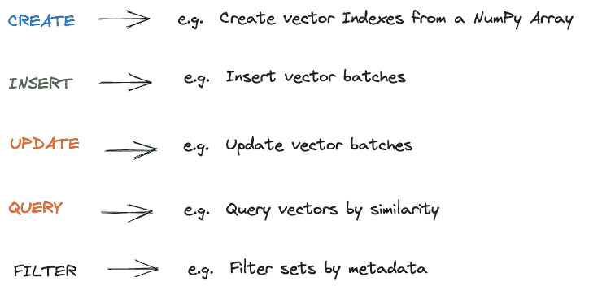
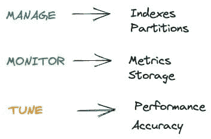

# Python 向量数据库和向量索引：LLM 应用的架构设计

> 原文：[`www.kdnuggets.com/2023/08/python-vector-databases-vector-indexes-architecting-llm-apps.html`](https://www.kdnuggets.com/2023/08/python-vector-databases-vector-indexes-architecting-llm-apps.html)


图片由 [Christina Morillo](https://www.pexels.com/photo/man-standing-infront-of-white-board-1181345/) 提供

由于使用其硬件创建的生成 AI 应用，Nvidia 体验到了显著的增长。另一项软件创新——向量数据库——也在乘上生成 AI 的浪潮。

* * *

## 我们的三大课程推荐

 1\. [谷歌网络安全证书](https://www.kdnuggets.com/google-cybersecurity) - 快速进入网络安全职业生涯。

 2\. [谷歌数据分析专业证书](https://www.kdnuggets.com/google-data-analytics) - 提升你的数据分析技能

 3\. [谷歌 IT 支持专业证书](https://www.kdnuggets.com/google-itsupport) - 支持组织的 IT 工作

* * *

开发者们正在使用 Python 和向量数据库构建 AI 驱动的应用程序。通过将数据编码为向量，他们可以利用向量空间的数学属性，实现对非常大数据集的快速相似性搜索。

让我们从基础开始吧！

# 向量数据库基础

向量数据库将数据存储为坐标空间中的数值向量。这使得可以通过如余弦相似度等操作计算向量之间的相似性。

最近的向量代表最相似的数据点。与标量数据库不同，向量数据库被优化用于相似性搜索，而不是复杂的查询或事务。

检索相似向量只需几毫秒，而非几分钟，即使在数十亿数据点中也是如此。

向量数据库构建索引，以通过接近度高效地查询向量。这有点类似于文本搜索引擎如何为快速全文搜索对文档进行索引。

# 向量搜索相较于传统数据库的好处

对于开发者来说，向量数据库提供：

+   快速相似性搜索 - 毫秒级找到相似向量

+   动态数据支持 - 持续用新数据更新向量

+   可扩展性 - 在多台机器上扩展向量搜索

+   灵活的架构 - 向量可以存储在本地、云对象存储或托管数据库中

+   高维度 - 每个向量索引数千维度

+   API - 如果你选择托管的向量数据库，它通常附带干净的查询 API 和与现有数据科学工具包或平台的集成。

向量搜索（向量数据库的关键功能）支持的流行用例示例如下：

+   视觉搜索 - 查找相似的产品图片

+   推荐 - 建议内容

+   聊天机器人 - 匹配查询意图

+   搜索 - 从文本向量中提取相关文档

向量搜索开始获得关注的用例有：

+   异常检测 - 识别异常向量

+   药物发现 - 按属性向量关联分子

# 什么是 Python 向量数据库？

一个包含支持向量数据库完整生命周期的 Python 库的向量数据库就是一个 Python 向量数据库。 数据库本身不需要用 Python 构建。

# 这些 Python 向量数据库库应该支持什么？

对向量数据库的调用可以分为两类 - **数据相关**和**管理相关**。 好消息是它们遵循与传统数据库类似的模式。

**数据相关功能库应支持的内容**



标准管理相关功能库应支持的内容



现在让我们进入一个稍微复杂的概念，即在这些数据库之上构建 LLM 应用

# 架构 LLM 应用

在深入了解由向量搜索驱动的 LLM 应用架构之前，让我们从工作流的角度理解涉及的内容。

一个典型的***工作流***包括：

1.  数据的丰富或清洗。这是一个轻量的数据转换步骤，有助于数据质量和一致的内容格式化。这也是需要对数据进行丰富的地方。

1.  通过模型将数据编码为向量。这些模型包含一些变换器（例如句子变换器）

1.  将向量插入向量数据库或向量索引（稍后会解释）

1.  通过 Python API 暴露搜索

1.  文档协调工作流

1.  在应用程序和用户界面中测试和可视化结果（例如聊天用户界面）

现在让我们看看如何使用不同的架构组件来启用这个工作流的不同部分。

对于 1)，你可能需要开始从其他源系统（包括关系型数据库或内容管理系统）获取元数据。

预训练模型几乎总是优选用于上面的步骤 2）。 OpenAI 模型是通过托管服务提供的最受欢迎的模型。 出于隐私和安全原因，你也可以托管本地模型。

对于 3)，如果需要进行大规模相似性搜索（例如数据集超过十亿条记录），你需要一个向量数据库或向量索引。从企业的角度来看，通常在进行“搜索”之前会有更多背景信息。

关于 4)上面的内容，好消息是，暴露的搜索通常遵循类似的模式。类似于以下代码：

来自 [Pinecone](https://docs.pinecone.io/docs/metadata-filtering#:~:text=eq%22%3A%20%5B%22comedy%22%2C%20%22documentary%22%5D%7D%7D-,Inserting%20metadata%20into%20an%20index,-Metadata%20can%20be)。

```py
index = pinecone.Index("example-index")

index.upsert([
    ("A", [0.1, 0.1, 0.1, 0.1], {"genre": "comedy", "year": 2020}),
)

index.query( 
vector=[0.1, 0.1, 0.1, 0.1], 
filter={ 
"genre": {"$eq": "documentary"}, 
"year": 2019 
}, 
top_k=1,
) 
```

这里有一句有趣的话：

```py
filter={ 
"genre": {"$eq": "documentary"}, 
"year": 2019 
},
```

它真的将结果筛选到接近“类型”和“年份”的向量。你还可以按概念或主题筛选向量。

现在的挑战是在企业环境中，它包括其他业务过滤器。重要的是解决来自数据源（如表结构和元数据）的数据建模缺失的问题。需要改进文本的准确性，减少与结构化数据相矛盾的错误表达。在这种情况下，需要一种“数据管道”策略，企业“内容匹配”变得重要。

对于 5) 除了常见的扩展挑战外，变化中的语料库也有其挑战。新文档可能需要重新编码和重新索引整个语料库，以保持向量的相关性。

对于 6) 这是一个全新的领域，除了测试相似度水平外，还需要一种人工干预的方法，以确保搜索质量在各个范围内的一致性。

自动搜索评分和不同类型的上下文评分不是一个容易完成的任务。

# Python 向量索引：为你现有数据库提供一种更简单的向量搜索替代方案。

**向量数据库** 是一个复杂的系统，能够实现如上例所示的上下文搜索，并具备所有额外的数据库功能（创建、插入、更新、删除、管理等）。

向量数据库的例子包括 Weaviate 和 Pinecone。这两个都提供了 Python API。

有时，更简单的设置已经足够。作为一种更轻量的替代方案，你可以使用已经在用的存储，并基于此添加一个 **向量索引**。这个向量索引用于检索带有上下文的搜索查询，例如用于你的生成性 AI。

在向量索引设置中，你需要：

+   你通常的数据存储（例如 PostgreSQL 或带文件的磁盘目录）提供了你需要的基本操作：创建、插入、更新、删除。

+   你的向量索引，能够在你的数据上实现快速的基于上下文的搜索。

实现向量索引的独立 Python 库包括 FAISS、Pathway LLM、Annoy。

好消息是，向量数据库和向量索引的 LLM 应用流程是相同的。主要区别在于，除了使用 Python 向量索引库外，你还需要继续使用现有的数据库进行“普通”数据操作和数据管理。例如，如果你使用 PostgreSQL，可能会用到 Psycopg；如果你将数据存储在文件中，可以使用标准的 Python “fs” 模块。

向量索引的支持者关注以下优点：

+   数据隐私：保持原始数据安全且不受干扰，减少数据暴露风险。

+   成本效率：减少与额外存储、计算能力和许可相关的成本。

+   可扩展性：通过减少管理的组件数量来简化扩展。

# 什么时候使用向量数据库与向量索引？

当以下一个或多个条件成立时，向量数据库是有用的：

+   你对大规模处理向量数据有特殊需求。

+   你正在为向量创建一个独立的定制应用程序。

+   你不期望在其他类型的应用程序中使用存储的数据。

向量索引在以下一个或多个条件成立时是有用的：

+   你不想信任新技术来进行数据存储。

+   你现有的存储可以从 Python 中轻松访问。

+   你的相似性搜索只是其他更大企业 BI 和数据库需求中的一种能力。

+   你需要将向量附加到现有的标量记录中。

+   你需要一种统一的方法来处理数据工程团队的管道。

+   你需要在数据上使用索引和图结构，以帮助你的[LLM 应用程序](https://github.com/pathwaycom/llm-app)或任务。

+   你需要来自其他来源的增强输出或增强上下文。

+   你想从语料库中创建规则，以应用于你的事务数据。

# 企业向量搜索的未来

向量搜索为开发者解锁了颠覆性的能力。随着模型和技术的进步，预计向量数据库或向量索引将成为应用程序堆栈的核心部分。

我希望这个概述为你探索 Python 中的向量数据库和向量索引提供一个坚实的起点。如果你对最近开发的向量索引感兴趣，请查看这个[开源项目](https://github.com/pathwaycom/llm-app)。

**[Anup Surendran](https://www.linkedin.com/in/anupsurendran/)** 是一位产品和产品营销副总裁，专注于将 AI 产品推向市场。他曾与两家成功退出（被 SAP 和 Kroll 收购）的初创公司合作，并喜欢教授其他人如何利用 AI 产品提高组织的生产力。

### 更多相关主题

+   [AI 和 LLM 用例中的向量数据库](https://www.kdnuggets.com/vector-databases-in-ai-and-llm-use-cases)

+   [如何使用索引加速 SQL 查询【Python 版】](https://www.kdnuggets.com/2023/08/speed-sql-queries-indexes-python-edition.html)

+   [数据库优化：探索 SQL 中的索引](https://www.kdnuggets.com/2023/07/database-optimization-exploring-indexes-sql.html)

+   [Python 构建 LLM 应用程序的初学者指南](https://www.kdnuggets.com/beginners-guide-to-building-llm-apps-with-python)

+   [什么是向量数据库，它们为什么对 LLM 如此重要？](https://www.kdnuggets.com/2023/06/vector-databases-important-llms.html)

+   [开源向量数据库的诚实比较](https://www.kdnuggets.com/an-honest-comparison-of-open-source-vector-databases)
