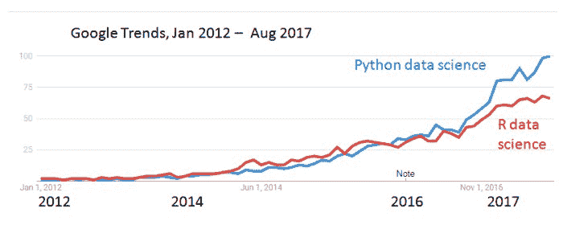
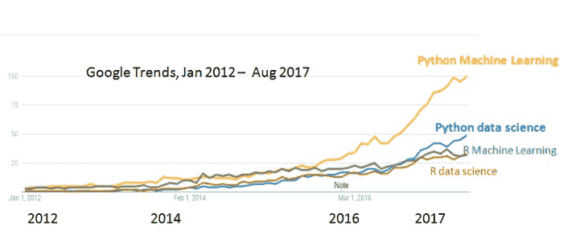
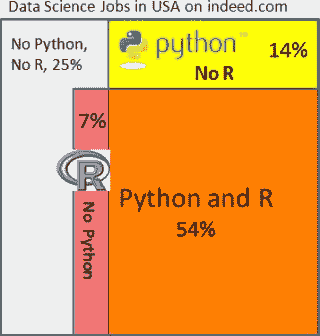
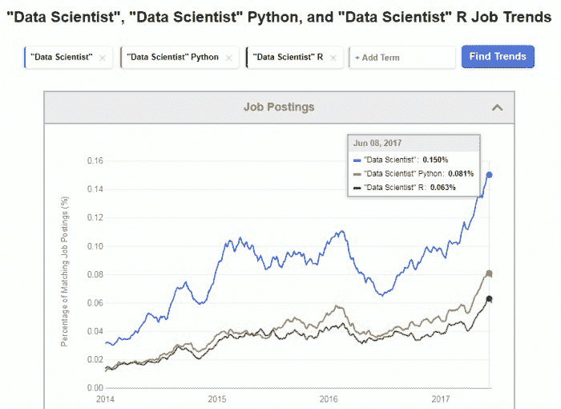
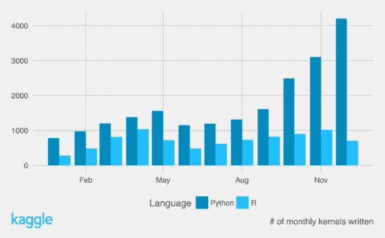

# Python 与 R - 谁在数据科学、机器学习领域真正领先？

> 原文：[`www.kdnuggets.com/2017/09/python-vs-r-data-science-machine-learning.html`](https://www.kdnuggets.com/2017/09/python-vs-r-data-science-machine-learning.html)

 评论我最近对 KDnuggets 调查结果的分析（**Python 超越 R，成为数据科学和机器学习平台的领导者**）引起了广泛关注，并生成了大量评论、讨论，以及来自两种语言支持者的不可避免的批评。

一些人抱怨调查不具备科学性，投票者代表的是自我选择的样本。这显然是正确的。但 KDnuggets 自 2001 年以来一直进行调查，并且每月覆盖了数十万的访问者。根据我们的经验，KDnuggets 的调查一直是数据挖掘和数据科学趋势和发展的良好指标。我们跟踪了 R 与 Python 的辩论好几年，因此与其他网站不同，我们可以将最新的调查结果与几年前的结果进行比较。

让我们检查一下数据科学家对 Python 和 R 的受欢迎程度的其他衡量标准。

首先，我们分析了 Google Trends（这一点在我们调查结果发布后也被 DSC 进行了分析）。

Python 是一个更受欢迎的编程语言，它在 [2017 年 IEEE Spectrum 第 1 语言](https://spectrum.ieee.org/computing/software/the-2017-top-programming-languages) 排名中名列前茅（感谢 Martin Skarzynski [**@marskar**](https://twitter.com/marskar) 提供的链接），因此直接比较 Python 和 R 的搜索量是不公平的，但我们可以比较 Google Trends 上的搜索词“Python 数据科学”与“R 数据科学”。

这是自 2012 年 1 月以来的图表。*注意，如果选择包含完整月份的范围，并且从 2012 年开始，那么你会获得平滑的月度趋势，而不是更为混乱的每周趋势。*

**图 1: [Google Trends](https://trends.google.com/trends/explore?date=2012-01-01%202017-08-31&q=Python%20data%20science,R%20data%20science)，2012 年 1 月 - 2017 年 8 月，“Python 数据科学”与“R 数据科学”。**

我们注意到，在 2014 年和 2015 年，随着数据科学的普及，R 略微领先，但“Python 数据科学”搜索在 2016 年底超过了“R 数据科学”，并且自 2017 年 1 月以来明显领先。

*注意：无论数据科学如何大写（“Data Science”或“data science”），统计数据都是相同的，但 Google 自动完成建议在 Python 和 R 中都使用“data science”。*

不过，最近机器学习变得非常流行 - 请参见我在 机器学习超越大数据？ 的帖子（2017 年 5 月），所以我们来看看 Google Trends 上的 Python 与 R 在“机器学习”方面的对比。

**图 2：[Google 趋势](https://trends.google.com/trends/explore?date=2012-01-01%202017-08-31&q=Python%20data%20science,R%20data%20science,Python%20Machine%20Learning,R%20Machine%20Learning)，2012 年 1 月 - 2017 年 8 月，“Python 机器学习”、“R 机器学习”、“Python 数据科学”和“R 数据科学”。**

我们看到“Python 机器学习”远远领先于“Python 数据科学”，两者都显著领先于“R 数据科学”和“R 机器学习”。

2017 年 8 月的相对搜索量是

+   Python 机器学习：100

+   Python 数据科学：49

+   R 数据科学：33

+   R 机器学习：32

*（注意：虽然 Google 自动完成建议搜索词“Python 数据科学”，并且以小写“data science”，它还建议了以大写的“Python 机器学习”。这里可能有一些深层次的含义……）*

**图 3：Snapshot of indeed.com 数据科学家职位广告在美国，同时包含 Python 和/或 R，2017 年 9 月**接下来，我们来看 indeed.com 上的职位广告。以下所有数字均为截至 2017 年 9 月 11 日在美国的职位。

+   搜索 ["数据科学家"](https://www.indeed.com/jobs?q=%22Data%20Scientist%22&l) 发现 3,558 个职位

+   搜索 ["数据科学家" Python](https://www.indeed.com/jobs?q=%22Data%20Scientist%22%20Python&l) 发现 2,407 个职位（占所有职位的 68%）

+   搜索 ["数据科学家" R](https://www.indeed.com/jobs?q=%22Data%20Scientist%22%20R&l) 发现 2,179 个职位（占所有职位的 61%）。

+   搜索 ["数据科学家" Python R](https://www.indeed.com/jobs?q=%22Data%20Scientist%22%20Python%20R&l) 发现 1,906 个职位（占所有职位的 54%）

+   搜索 ["数据科学家" -Python -R](https://www.indeed.com/jobs?q=%22Data%20Scientist%22%20-Python%20-R&l) 发现 892 个职位（占所有职位的 25%）

我们在右侧的维恩图中展示了这种关系。

Indeed 职位趋势也显示，了解 Python 和了解 R 的数据科学家的需求直到最近才接近，并且这些职位占所有数据科学家职位的很大一部分。

**图 4：Indeed “数据科学家”、“数据科学家” Python 和 “数据科学家” R 职位趋势，2014-2017**

这些职位广告数量表明，当前雇主认为大多数数据科学家能够根据需要使用 Python 和 R，但目前 Python 稍有优势。

Google 趋势结果表明，Python 的优势将会增长，而与 Python 相关的数据科学和机器学习职位的增长速度将快于与 R 相关的职位。

*注意：使用 indeed.com 时，你需要仔细指定搜索字符串，搜索 [数据科学家 Python] 会包含很多职位，这些职位可能包含“数据”或“科学家”，但不一定两者都有。*

最后，在我原始帖子 Python 超越 R 在数据科学中 上的许多评论中，我想强调两个观察点：

+   Stanislav Seltser 指出，在 github 上排名前 15 的语言中，[`octoverse.github.com`](https://octoverse.github.com)中，Python 排名第 3，而 R 不在列表中。

+   Stanislav 还提到 [Kaggle 2016 年总结](https://blog.kaggle.com/2017/01/05/your-year-on-kaggle-most-memorable-community-stats-from-2016/)，其中指出

    > 过去几年，R 是 Kaggle 上的首选语言，但 2016 年 Python 在编写的 kernels 数量上脱颖而出，成为明显的赢家。

    

**相关：**

+   Python 超越 R，成为数据科学和机器学习平台的领导者

+   Python 超越 R？

+   Python 与 R 在人工智能、机器学习和数据科学中的对比

### 更多相关话题

+   [停止学习数据科学以寻找目标，并寻找目标以……](https://www.kdnuggets.com/2021/12/stop-learning-data-science-find-purpose.html)

+   [学习数据科学统计的顶级资源](https://www.kdnuggets.com/2021/12/springboard-top-resources-learn-data-science-statistics.html)

+   [每个数据科学家都应该知道的三个 R 库（即使你使用 Python）](https://www.kdnuggets.com/2021/12/three-r-libraries-every-data-scientist-know-even-python.html)

+   [使用管道编写干净的 Python 代码](https://www.kdnuggets.com/2021/12/write-clean-python-code-pipes.html)

+   [什么让 Python 成为初创企业的理想编程语言](https://www.kdnuggets.com/2021/12/makes-python-ideal-programming-language-startups.html)

+   [每个初学者数据科学家应该掌握的 6 个预测模型](https://www.kdnuggets.com/2021/12/6-predictive-models-every-beginner-data-scientist-master.html)
