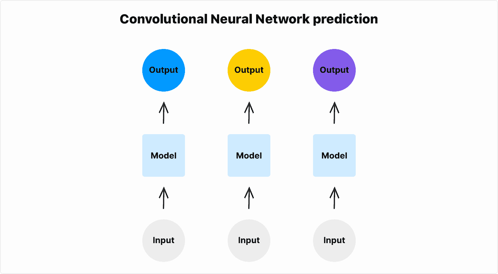
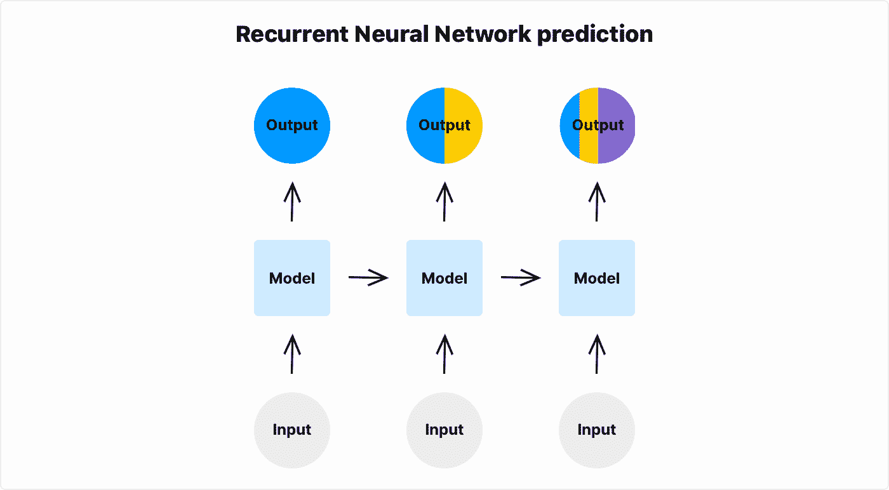
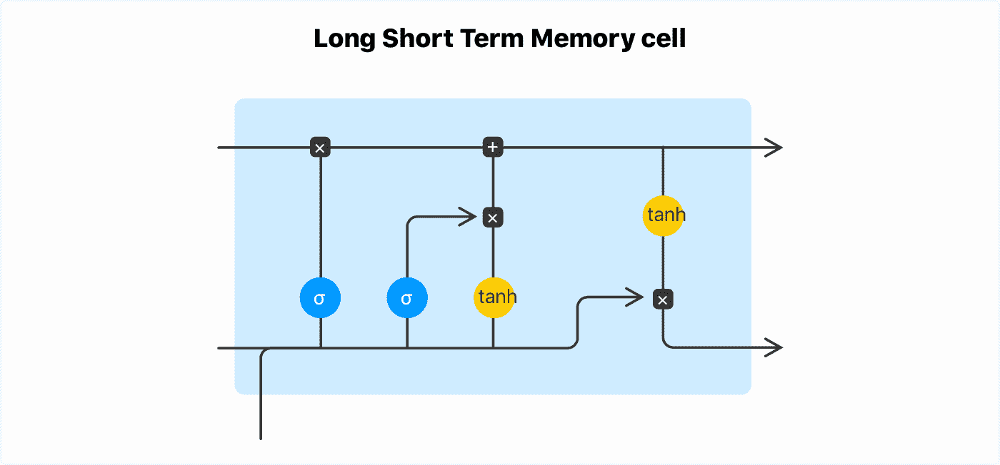

# PyTorch LSTM：文本生成教程

> 原文：[`www.kdnuggets.com/2020/07/pytorch-lstm-text-generation-tutorial.html`](https://www.kdnuggets.com/2020/07/pytorch-lstm-text-generation-tutorial.html)

评论

**作者 [Domas Bitvinskas](https://domasbitvinskas.com/)，Closeheat**

长短期记忆（LSTM）是一种流行的递归神经网络（RNN）架构。本教程讲解如何在 PyTorch 上使用 LSTM 生成文本；在这种情况下 - 一些相当无聊的笑话。

本教程需要：

+   基本的 Python、PyTorch 和机器学习知识

+   本地安装的 [Python](https://www.python.org/) v3+， [PyTorch](https://pytorch.org/) v1+， [NumPy](https://numpy.org/) v1+

* * *

## 我们的前三大课程推荐

 1\. [谷歌网络安全证书](https://www.kdnuggets.com/google-cybersecurity) - 加速进入网络安全职业生涯。

 2\. [谷歌数据分析专业证书](https://www.kdnuggets.com/google-data-analytics) - 提升你的数据分析技能

 3\. [谷歌 IT 支持专业证书](https://www.kdnuggets.com/google-itsupport) - 支持你所在组织的 IT

* * *

### 什么是 LSTM？

LSTM 是 RNN 的一种变体，广泛应用于深度学习。如果你在处理数据序列时，可以使用 LSTM。

以下是你可能熟悉的 LSTM 网络的最直接应用场景：

+   时间序列预测（例如，股票预测）

+   文本生成

+   视频分类

+   音乐生成

+   异常检测

### RNN

在开始使用 LSTM 之前，你需要了解 RNN 的工作原理。

RNN 是处理序列数据的神经网络。它可以是视频、音频、文本、股市时间序列甚至单张图像被切割成序列的各部分。

与 RNN 相比，标准神经网络（卷积神经网络或普通神经网络）有一个主要缺点 - 它们不能利用之前的输入来指导后续的预测。没有某种形式的记忆，无法解决某些机器学习问题。

例如，当你有一些视频帧显示一个球的移动，并想预测球的方向时，你可能会遇到问题。标准神经网络看到的问题是：你在一张图像中看到一个球，在另一张图像中也看到一个球。它没有机制将这两张图像作为序列连接起来。标准神经网络不能将两个独立的球的图像与“球在移动”的概念联系起来。它只看到图像#1 中有一个球，图像#2 中也有一个球，但网络输出是分开的。



将其与 RNN 进行比较，RNN 记住最后的帧，并可以用来指导下一次预测。



### LSTM 与 RNN

典型的 RNN 无法记忆长序列。所谓的“梯度消失”效应发生在 RNN 单元网络的反向传播阶段。携带序列开始部分信息的单元梯度经过小数的矩阵乘法后在长序列中接近 0。换句话说，序列开始部分的信息对序列末端几乎没有影响。

你可以在递归神经网络示例中看到这一点。给定足够长的序列，序列第一个元素的信息对序列最后一个元素的输出没有影响。

LSTM 是一种 RNN 架构，可以记忆长序列 - 最多 100 个元素。LSTM 具有记忆门控机制，使长期记忆能够继续流入 LSTM 单元。



### 使用 PyTorch 进行文本生成

你将使用 PyTorch 中的 LSTM 网络训练一个笑话文本生成器，并遵循最佳实践。首先，创建一个新的文件夹来存储代码：

`$ mkdir text-generation`

### 模型

要创建一个 LSTM 模型，在`text-generation`文件夹中创建一个名为`model.py`的文件，内容如下：

```py
import torch
from torch import nn

class Model(nn.Module):
    def __init__(self, dataset):
        super(Model, self).__init__()
        self.lstm_size = 128
        self.embedding_dim = 128
        self.num_layers = 3

        n_vocab = len(dataset.uniq_words)
        self.embedding = nn.Embedding(
            num_embeddings=n_vocab,
            embedding_dim=self.embedding_dim,
        )
        self.lstm = nn.LSTM(
            input_size=self.lstm_size,
            hidden_size=self.lstm_size,
            num_layers=self.num_layers,
            dropout=0.2,
        )
        self.fc = nn.Linear(self.lstm_size, n_vocab)

    def forward(self, x, prev_state):
        embed = self.embedding(x)
        output, state = self.lstm(embed, prev_state)
        logits = self.fc(output)
        return logits, state

    def init_state(self, sequence_length):
        return (torch.zeros(self.num_layers, sequence_length, self.lstm_size),
                torch.zeros(self.num_layers, sequence_length, self.lstm_size))
```

这是一个标准的 PyTorch 模型。`Embedding`层将单词索引转换为单词向量。`LSTM`是网络的主要可学习部分 - PyTorch 实现中的`LSTM`单元内部实现了门控机制，可以学习长序列的数据。

如早前[什么是 LSTM？](https://closeheat.com/blog/pytorch-lstm-text-generation-tutorial#what-is-lstm)部分所述 - RNN 和 LSTM 具有在训练周期之间传递的额外状态信息。`forward`函数具有一个`prev_state`参数。这个状态保持在模型外部，并手动传递。

它还具有`init_state`函数。在每个 epoch 开始时调用此函数，以初始化正确形状的状态。

### 数据集

在本教程中，我们使用 Reddit 清理笑话数据集来训练网络。[下载 (139KB)](https://raw.githubusercontent.com/amoudgl/short-jokes-dataset/master/data/reddit-cleanjokes.csv)数据集，并将其放入`text-generation/data/`文件夹中。

数据集包含 1623 个笑话，内容如下：

```py
ID,Joke
1,What did the bartender say to the jumper cables? You better not try to start anything.
2,Don't you hate jokes about German sausage? They're the wurst!
3,Two artists had an art contest... It ended in a draw
…
```

要将数据加载到 PyTorch 中，请使用 PyTorch 的`Dataset`类。创建一个名为`dataset.py`的文件，内容如下：

```py
import torch
import pandas as pd
from collections import Counter

class Dataset(torch.utils.data.Dataset):
    def __init__(
        self,
        args,
    ):
        self.args = args
        self.words = self.load_words()
        self.uniq_words = self.get_uniq_words()

        self.index_to_word = {index: word for index, word in enumerate(self.uniq_words)}
        self.word_to_index = {word: index for index, word in enumerate(self.uniq_words)}

        self.words_indexes = [self.word_to_index[w] for w in self.words]

    def load_words(self):
        train_df = pd.read_csv('data/reddit-cleanjokes.csv')
        text = train_df['Joke'].str.cat(sep=' ')
        return text.split(' ')

    def get_uniq_words(self):
        word_counts = Counter(self.words)
        return sorted(word_counts, key=word_counts.get, reverse=True)

    def __len__(self):
        return len(self.words_indexes) - self.args.sequence_length

    def __getitem__(self, index):
        return (
            torch.tensor(self.words_indexes[index:index+self.args.sequence_length]),
            torch.tensor(self.words_indexes[index+1:index+self.args.sequence_length+1]),
        )
```

这个`Dataset`类继承自 PyTorch 的`torch.utils.data.Dataset`类，并定义了两个重要的方法`__len__`和`__getitem__`。详细了解 PyTorch 中`Dataset`类的工作原理，请参考[数据加载教程](https://pytorch.org/tutorials/beginner/data_loading_tutorial.html#dataset-class)。

`load_words`函数加载数据集。数据集中计算独特的词汇量，以定义网络的词汇表大小和嵌入大小。`index_to_word`和`word_to_index`将单词转换为数字索引，反之亦然。

这是过程的一部分是 *分词*。未来，[torchtext](https://github.com/pytorch/text) 团队计划改进这一部分，但他们正在重新设计，新的 API 对于本教程来说过于不稳定。

### 训练

创建一个 `train.py` 文件并定义一个 `train` 函数。

```py
import argparse
import torch
import numpy as np
from torch import nn, optim
from torch.utils.data import DataLoader
from model import Model
from dataset import Dataset

def train(dataset, model, args):
    model.train()

    dataloader = DataLoader(dataset, batch_size=args.batch_size)
    criterion = nn.CrossEntropyLoss()
    optimizer = optim.Adam(model.parameters(), lr=0.001)

    for epoch in range(args.max_epochs):
        state_h, state_c = model.init_state(args.sequence_length)

        for batch, (x, y) in enumerate(dataloader):
            optimizer.zero_grad()

            y_pred, (state_h, state_c) = model(x, (state_h, state_c))
            loss = criterion(y_pred.transpose(1, 2), y)

            state_h = state_h.detach()
            state_c = state_c.detach()

            loss.backward()
            optimizer.step()

            print({ 'epoch': epoch, 'batch': batch, 'loss': loss.item() })
```

使用 PyTorch `DataLoader` 和 `Dataset` 抽象来加载笑话数据。

使用 `CrossEntropyLoss` 作为损失函数，并使用 `Adam` 作为默认参数的优化器。你可以稍后进行调整。

在他著名的 [帖子](https://karpathy.github.io/2019/04/25/recipe/) 中，Andrew Karpathy 也建议最初保持这一部分的简单。

### 文本生成

将 `predict` 函数添加到 `train.py` 文件中：

```py
def predict(dataset, model, text, next_words=100):
    model.eval()

    words = text.split(' ')
    state_h, state_c = model.init_state(len(words))

    for i in range(0, next_words):
        x = torch.tensor([[dataset.word_to_index[w] for w in words[i:]]])
        y_pred, (state_h, state_c) = model(x, (state_h, state_c))

        last_word_logits = y_pred[0][-1]
        p = torch.nn.functional.softmax(last_word_logits, dim=0).detach().numpy()
        word_index = np.random.choice(len(last_word_logits), p=p)
        words.append(dataset.index_to_word[word_index])

    return words
```

### 执行预测

将以下代码添加到 `train.py` 文件中以执行已定义的函数：

```py
parser = argparse.ArgumentParser()
parser.add_argument('--max-epochs', type=int, default=10)
parser.add_argument('--batch-size', type=int, default=256)
parser.add_argument('--sequence-length', type=int, default=4)
args = parser.parse_args()

dataset = Dataset(args)
model = Model(dataset)

train(dataset, model, args)
print(predict(dataset, model, text='Knock knock. Whos there?'))
```

使用以下命令运行 `train.py` 脚本：

`$ python train.py`

你可以看到损失随训练轮次变化。当训练结束时，模型在 `Knock knock. Whos there?` 之后预测接下来的 100 个词。默认情况下，它运行 10 个轮次，训练大约需要 15 分钟。

```py
{'epoch': 9, 'batch': 91, 'loss': 5.953955173492432}
{'epoch': 9, 'batch': 92, 'loss': 6.1532487869262695}
{'epoch': 9, 'batch': 93, 'loss': 5.531163215637207}
['Knock', 'knock.', 'Whos', 'there?', '3)', 'moostard', 'bird', 'Book,',
'What', 'when', 'when', 'the', 'Autumn', 'He', 'What', 'did', 'the',
'psychologist?', 'And', 'look', 'any', 'jokes.', 'Do', 'by', "Valentine's",
'Because', 'I', 'papa', 'could', 'believe', 'had', 'a', 'call', 'decide',
'elephants', 'it', 'my', 'eyes?', 'Why', 'you', 'different', 'know', 'in',
'an', 'file', 'of', 'a', 'jungle?', 'Rock', '-', 'and', 'might', "It's",
'every', 'out', 'say', 'when', 'to', 'an', 'ghost', 'however:', 'the', 'sex,',
'in', 'his', 'hose', 'and', 'because', 'joke', 'the', 'month', '25', 'The',
'97', 'can', 'eggs.', 'was', 'dead', 'joke', "I'm", 'a', 'want', 'is', 'you',
'out', 'to', 'Sorry,', 'the', 'poet,', 'between', 'clean', 'Words', 'car',
'his', 'wife', 'would', '1000', 'and', 'Santa', 'oh', 'diving', 'machine?',
'He', 'was']
```

如果你跳过了这部分并想运行代码，这里有一个可以克隆的 Github [仓库](https://github.com/closeheat/pytorch-lstm-text-generation-tutorial)。

### 下一步

恭喜！你已经编写了第一个 PyTorch LSTM 网络并生成了一些笑话。

接下来你可以做的事情来改进模型是：

+   通过去除非字母字符来清理数据。

+   通过添加更多的 `Linear` 或 `LSTM` 层来增加模型的容量。

+   将数据集拆分为训练、测试和验证集。

+   添加检查点，以便你不必每次都训练模型才能运行预测。

**简介: [Domas Bitvinskas](https://domasbitvinskas.com/)** (**[@domasbitvinskas](https://twitter.com/domasbitvinskas)**) 在 Closeheat 领导机器学习和增长实验。

[原文](https://closeheat.com/blog/pytorch-lstm-text-generation-tutorial)。经许可转载。

**相关：**

+   PyTorch 深度学习：免费电子书

+   使用 TensorFlow 和 LSTM 循环神经网络生成烹饪食谱：逐步指南

+   你应该知道的 PyTorch 最重要的基础知识

### 更多相关主题

+   [检索增强生成：信息检索与…的交汇点](https://www.kdnuggets.com/retrieval-augmented-generation-where-information-retrieval-meets-text-generation)

+   [文本到视频生成：逐步指南](https://www.kdnuggets.com/2023/08/text2video-generation-stepbystep-guide.html)

+   [LSTM 再次崛起：扩展 LSTM 模型挑战 Transformer…](https://www.kdnuggets.com/lstms-rise-again-extended-lstm-models-challenge-the-transformer-superiority)

+   [YOLOv5 PyTorch 教程](https://www.kdnuggets.com/2022/12/yolov5-pytorch-tutorial.html)

+   [文本摘要生成开发：使用 GPT-3.5 的 Python 教程](https://www.kdnuggets.com/2023/04/text-summarization-development-python-tutorial-gpt35.html)

+   [Bark: 终极音频生成模型](https://www.kdnuggets.com/2023/05/bark-ultimate-audio-generation-model.html)
