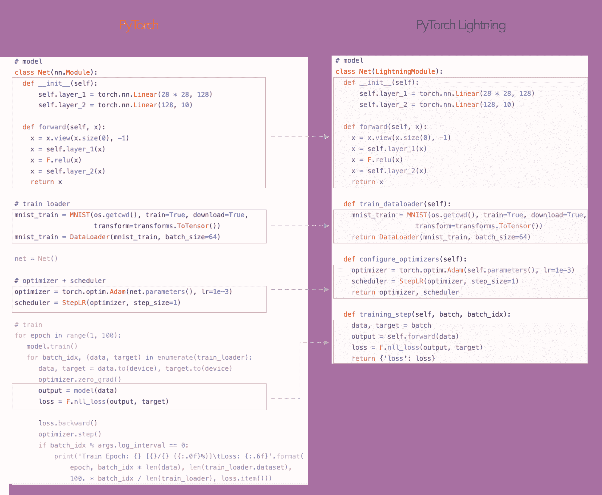
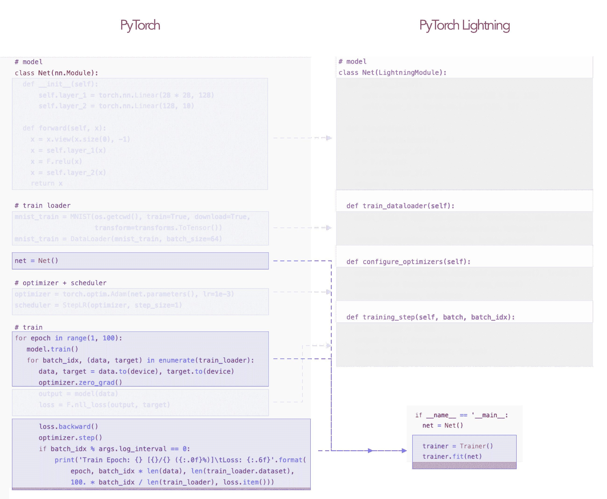

# PyTorch 多 GPU 指标库及新 PyTorch Lightning 发布中的更多内容

> 原文：[`www.kdnuggets.com/2020/07/pytorch-multi-gpu-metrics-library-pytorch-lightning.html`](https://www.kdnuggets.com/2020/07/pytorch-multi-gpu-metrics-library-pytorch-lightning.html)

评论

**由 [William Falcon](https://www.linkedin.com/in/wfalcon/)，PyTorch Lightning 创始人**

~~今天~~ [最近] 我们发布了 0.8.1，这是 PyTorch Lightning 的一个重要里程碑。随着用户的惊人增长和采用，我们继续构建工具以轻松进行 AI 研究。

这次重大发布使我们朝着即将到来的 v1.0.0 最终 API 更改的方向迈进！

### PyTorch Lightning

[PyTorch Lightning](https://github.com/williamFalcon/pytorch-lightning) 是一个非常轻量的 PyTorch 结构——它更像是一个风格指南而不是一个框架。但一旦你结构化了你的代码，我们会为你提供免费的 GPU、TPU、16 位精度支持以及更多功能！



Lightning 只是结构化的 PyTorch



### **指标**

此次发布在 Lightning 中新增了一个重大包——一个多 GPU 指标包！

关于 Lightning 中的指标包，有两个关键点。

1.  它可以与普通 PyTorch 一起使用！

1.  它通过 DDP 自动处理多 GPU。这意味着即使你在一个或 20 个 GPU 上计算准确性，我们也会为你自动处理。

指标包还包括与 sklearn 指标的映射，以桥接 numpy、sklearn 和 PyTorch 之间的差距，以及一个你可以用来实现自己指标的高级类。

```py
**class** **RMSE**(TensorMetric):
    **def** **forward**(self, x, y):
        **return** torch**.**sqrt(torch**.**mean(torch**.**pow(x**-**y, 2.0)))
```

指标包目前实现了超过 18 种指标（包括功能性指标）。查看 [我们的文档](https://pytorch-lightning.readthedocs.io/en/stable/metrics.html#functional-metrics) 获取完整列表！

### overfit_batches

此次发布还清理了我们在 Lightning 中存在已久的非常酷的调试工具。overfit_batches 标志现在可以让你在数据的一个小子集上过拟合，以确保你的模型没有重大缺陷。

逻辑是，如果你甚至无法在 1 个批次的数据上过拟合，那么训练模型的其余部分没有意义。这可以帮助你确定是否正确实现了某些东西，或确保你的数学是正确的

```py
Trainer(overfit_batches=1)
```

如果你在 Lightning 中这样做，你会得到以下结果：

### 更快的多 GPU 训练

此次发布的另一个关键部分是通过 DDP 对分布式训练的加速。变化来自允许 DDP 与 num_workers>0 一起在数据加载器中工作

```py
Dataloader(dataset, num_workers=8)
```

今天，当你通过.spawn()启动 DDP 并尝试在数据加载器中使用 num_workers>0 时，你的程序可能会冻结并且无法开始训练（这在 Lightning 之外也是如此）。

对大多数人来说，解决方案是设置 num_workers=0，但这意味着你的训练将非常慢。为了启用 num_workers>0 和 DDP，我们现在在后台启动 DDP 而不使用 spawn。这消除了许多其他奇怪的限制，比如需要 pickle 一切，以及模型权重在训练完成后不可用的要求（因为权重是在具有不同内存的子进程中学习的）。

因此，我们的 DDP 实现比普通的快得多。当然，我们保留了两者以便灵活使用：

```py
# very fast :)
Trainer(distributed_backend='ddp')# very slow
Trainer(distributed_backend='ddp_spawn')
```

### 发布的其他酷炫功能

+   .test() 现在会自动加载最佳模型权重！

```py
model = Model()
trainer = Trainer()
trainer.fit(model)# automatically loads the best weights!
trainer.test()
```

+   现在通过 conda 安装 Lightning

```py
conda install pytorch-lightning -c conda-forge
```

+   ModelCheckpoint 跟踪最佳权重的路径

```py
ckpt_callback = ModelCheckpoint(...)
trainer = Trainer(model_checkpoint=ckpt_callback)
trainer.fit(model)best_weights = ckpt_callback.best_model_path
```

+   推理期间自动将数据移动到正确的设备

```py
class LitModel(LightningModule):                    @auto_move_data                
    def forward(self, x):                    
        return xmodel = LitModel()
x = torch.rand(2, 3)
model = model.cuda(2)# this works!
model(x)
```

+   还有许多速度改进，包括单 TPU 加速（我们也支持多 TPU）

```py
Trainer(tpu_cores=8)
```

### 今天就试试 Lightning

如果你还没有！给 Lightning 一个机会 :)

这个视频讲解了如何将你的 PyTorch 代码重构为 Lightning。

**简介：[威廉·法尔孔](https://www.linkedin.com/in/wfalcon/)** 是一名 AI 研究员，也是 PyTorch Lightning 的创始人。他致力于理解大脑、构建 AI 并在规模上使用它。

[原始内容](https://medium.com/pytorch/pytorch-multi-gpu-metrics-and-more-in-pytorch-lightning-0-8-1-b7cadd04893e)。经授权转载。

**相关内容：**

+   Pytorch Lightning 与 PyTorch Ignite 与 Fast.ai

+   在 PyTorch 中训练 Lightning-fast 神经网络的 9 个技巧

+   Lit BERT：NLP 转移学习的 3 个步骤

* * *

## 我们的前三个课程推荐

 1\. [谷歌网络安全证书](https://www.kdnuggets.com/google-cybersecurity) - 快速进入网络安全职业生涯。

 2\. [谷歌数据分析专业证书](https://www.kdnuggets.com/google-data-analytics) - 提升你的数据分析能力

 3\. [谷歌 IT 支持专业证书](https://www.kdnuggets.com/google-itsupport) - 支持你的组织 IT

* * *

### 更多相关内容

+   [深度学习库介绍：PyTorch 和 Lightning AI](https://www.kdnuggets.com/introduction-to-deep-learning-libraries-pytorch-and-lightning-ai)

+   [解锁 AI 的力量 - KDnuggets 和 Machine… 的特别发布](https://www.kdnuggets.com/2023/07/mlm-unlock-power-ai-special-release-kdnuggets-machine-learning-mastery.html)

+   [开始使用 PyTorch Lightning](https://www.kdnuggets.com/2022/12/getting-started-pytorch-lightning.html)

+   [分类问题的更多性能评估指标](https://www.kdnuggets.com/2020/04/performance-evaluation-metrics-classification.html)

+   [免费使用 Lightning AI Studio](https://www.kdnuggets.com/using-lightning-ai-studio-for-free)

+   [skops: 一个提升 Scikit-learn 生产效率的新库](https://www.kdnuggets.com/2023/02/skops-new-library-improve-scikitlearn-production.html)
