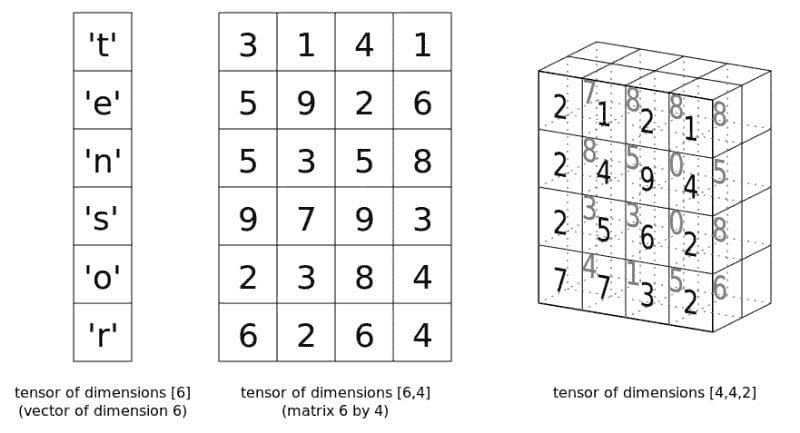

# PyTorch 张量基础

> 原文：[`www.kdnuggets.com/2018/05/pytorch-tensor-basics.html`](https://www.kdnuggets.com/2018/05/pytorch-tensor-basics.html)

 评论

现在我们知道了 张量是什么，并了解了 Numpy 的 `ndarray` 如何用来表示它们，接下来我们来看看它们在 PyTorch 中是如何表示的。

[PyTorch](https://pytorch.org/) 自 Facebook 在 2017 年初开源以来，在机器学习领域产生了令人印象深刻的影响。它可能没有 TensorFlow 那样广泛的采用——TensorFlow 最初发布的时间早了一年多，得到了 Google 的支持，并且在神经网络工具新潮流兴起时奠定了黄金标准——但 PyTorch 在研究界获得的关注确实非常真实。这种关注很大程度上来自于其与 [Torch proper](http://torch.ch/) 的关系，以及其动态计算图。

* * *

## 我们的前三大课程推荐

 1\. [谷歌网络安全证书](https://www.kdnuggets.com/google-cybersecurity) - 快速进入网络安全职业的快车道。

 2\. [谷歌数据分析专业证书](https://www.kdnuggets.com/google-data-analytics) - 提升你的数据分析能力

 3\. [谷歌 IT 支持专业证书](https://www.kdnuggets.com/google-itsupport) - 支持你所在组织的 IT 工作

* * *



[图片来源](http://noaxiom.org/tensor) 尽管我最近对 PyTorch 的关注充满了兴奋，但这实际上并不是一个 *PyTorch* 教程；它更像是对 PyTorch 的 [`Tensor`](https://pytorch.org/docs/master/tensors.html) 类的介绍，该类与 Numpy 的 `ndarray` 类似。

**张量（非常）基础**

所以让我们来看看 PyTorch 的一些张量基础，从创建一个张量（使用 `Tensor` 类）开始：

```py
import torch

# Create a Torch tensor
t = torch.Tensor([[1, 2, 3], [4, 5, 6]])
t

```

```py
tensor([[ 1.,  2.,  3.],
        [ 4.,  5.,  6.]])

```

你可以通过两种方式转置张量：

```py
# Transpose
t.t()

# Transpose (via permute)
t.permute(-1,0)

```

两者都产生以下输出：

```py
tensor([[ 1.,  4.],
        [ 2.,  5.],
        [ 3.,  6.]])

```

请注意，这两种方法都不会改变原始张量。

使用视图重塑张量：

```py
# Reshape via view
t.view(3,2)

```

```py
tensor([[ 1.,  2.],
        [ 3.,  4.],
        [ 5.,  6.]])

```

另一个例子：

```py
# View again...
t.view(6,1)

```

```py
tensor([[ 1.],
        [ 2.],
        [ 3.],
        [ 4.],
        [ 5.],
        [ 6.]])

```

应该显而易见的是，Numpy 遵循的数学惯例也会延续到 PyTorch 张量中（具体来说，我指的是行和列的表示法）。

创建一个张量并用零填充它（你可以用 `ones()` 实现类似的功能）：

```py
# Create tensor of zeros
t = torch.zeros(3, 3)
t

```

```py
tensor([[ 0.,  0.,  0.],
        [ 0.,  0.,  0.],
        [ 0.,  0.,  0.]])

```

创建一个从正态分布中抽取随机数的张量：

```py
# Create tensor from normal distribution randoms
t = torch.randn(3, 3)
t

```

```py
tensor([[ 1.0274, -1.3727, -0.2196],
        [-0.7258, -2.1236, -0.8512],
        [ 0.0392,  1.2392,  0.5460]])

```

张量对象的形状、维度和数据类型：

```py
# Some tensor info
print('Tensor shape:', t.shape)   # t.size() gives the same
print('Number of dimensions:', t.dim())
print('Tensor type:', t.type())   # there are other types

```

```py
Tensor shape: torch.Size([3, 3])
Number of dimensions: 2
Tensor type: torch.FloatTensor

```

除了数学概念之外，`ndarray` 和 `Tensor` 实现之间还存在许多编程和实例化上的相似之处，这一点也应该显而易见。

你可以像切片`ndarrays`一样切片 PyTorch 张量，这对使用其他 Python 结构的人来说应该很熟悉：

```py
# Slicing
t = torch.Tensor([[1, 2, 3], [4, 5, 6], [7, 8, 9]])

# Every row, only the last column
print(t[:, -1])

# First 2 rows, all columns
print(t[:2, :])

# Lower right most corner
print(t[-1:, -1:])

```

```py
tensor([ 3.,  6.,  9.])
tensor([[ 1.,  2.,  3.],
        [ 4.,  5.,  6.]])
tensor([[ 9.]])

```

**PyTorch `Tensor` 与 Numpy `ndarray` 之间的转换**

你可以轻松地从`ndarray`创建张量，反之亦然。这些操作很快，因为这两种结构的数据会共享相同的内存空间，所以不涉及复制。这显然是一种[高效的方法](https://stsievert.com/blog/2017/09/07/pytorch/)。

```py
# Numpy ndarray <--> PyTorch tensor
import numpy as np

# ndarray to tensor
a = np.random.randn(3, 5)
t = torch.from_numpy(a)
print(a)
print(t)
print(type(a))
print(type(t))

```

```py
[[-0.52192738 -1.11579634  1.26925835  0.10449378 -1.02894372]
 [-0.78707263 -0.05350072 -0.65815075  0.18810677 -0.52795765]
 [-0.41677548  0.82031861 -2.46699201  0.60320375 -1.69778546]]
tensor([[-0.5219, -1.1158,  1.2693,  0.1045, -1.0289],
        [-0.7871, -0.0535, -0.6582,  0.1881, -0.5280],
        [-0.4168,  0.8203, -2.4670,  0.6032, -1.6978]], dtype=torch.float64)
<class 'numpy.ndarray'>
<class 'torch.Tensor'>

```

```py
# tensor to ndarray
t = torch.randn(3, 5)
a = t.numpy()
print(t)
print(a)
print(type(t))
print(type(a))

```

```py
tensor([[-0.1746, -2.4118,  0.4688, -0.0517, -0.2706],
        [-0.8402, -0.3289,  0.4170,  1.9131, -0.8601],
        [-0.6688, -0.2069, -0.8106,  0.8582, -0.0450]])
[[-0.17455131 -2.4117854   0.4688457  -0.05168453 -0.2706456 ]
 [-0.8402392  -0.3289494   0.41703534  1.9130518  -0.86014426]
 [-0.6688193  -0.20693372 -0.8105542   0.8581988  -0.04502954]]
<class 'torch.Tensor'>
<class 'numpy.ndarray'>

```

**基本张量操作**

这里有几个张量操作，你可以与 Numpy 实现进行比较以增添乐趣。首先是叉积：

```py
# Compute cross product
t1 = torch.randn(4, 3)
t2 = torch.randn(4, 3)
t1.cross(t2)

```

```py
tensor([[ 2.6594, -0.5765,  1.4313],
        [ 0.4710, -0.3725,  2.1783],
        [-0.9134,  1.6253,  0.7398],
        [-0.4959, -0.4198,  1.1338]])
```

接下来是矩阵乘积：

```py
# Compute matrix product
t = (torch.Tensor([[2, 4], [5, 10]]).mm(torch.Tensor([[10], [20]])))
t

```

```py
tensor([[ 100.],
        [ 250.]])
```

最后是逐元素相乘：

```py
# Elementwise multiplication
t = torch.Tensor([[1, 2], [3, 4]])
t.mul(t)

```

```py
tensor([[  1.,   4.],
        [  9.,  16.]])
```

**关于 GPU 的一些话**

PyTorch 张量具有内置的 GPU 支持。指定使用 GPU 内存和 CUDA 核心来存储和执行张量计算非常简单；[`cuda`](https://pytorch.org/docs/master/cuda.html)包可以帮助确定是否有可用的 GPU，而该包的`cuda()`方法将张量分配给 GPU。

```py
# Is CUDA GPU available?
torch.cuda.is_available()

# How many CUDA devices?
torch.cuda.is_available()

# Move to GPU
t.cuda()

```

**相关**：

+   什么是张量?!?

+   PyTorch 入门第一部分：了解自动微分的工作原理

+   构建神经网络的简单入门指南

### 更多相关话题

+   [停止学习数据科学以寻找目标并找到目标…](https://www.kdnuggets.com/2021/12/stop-learning-data-science-find-purpose.html)

+   [一个 90 亿美元的 AI 失败案例分析](https://www.kdnuggets.com/2021/12/9b-ai-failure-examined.html)

+   [学习数据科学统计学的顶级资源](https://www.kdnuggets.com/2021/12/springboard-top-resources-learn-data-science-statistics.html)

+   [成功数据科学家的 5 个特征](https://www.kdnuggets.com/2021/12/5-characteristics-successful-data-scientist.html)

+   [是什么让 Python 成为初创公司的理想编程语言](https://www.kdnuggets.com/2021/12/makes-python-ideal-programming-language-startups.html)

+   [每个数据科学家都应该知道的三个 R 库（即使你使用 Python）](https://www.kdnuggets.com/2021/12/three-r-libraries-every-data-scientist-know-even-python.html)
