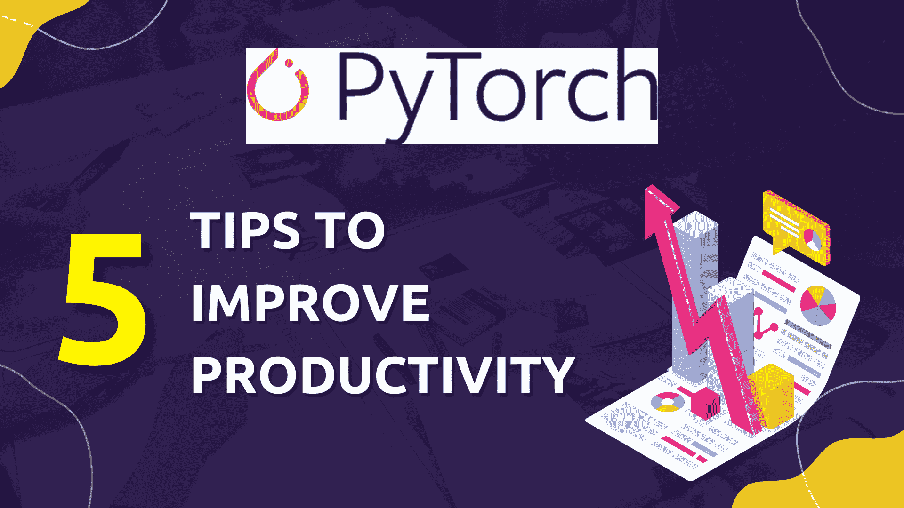

# PyTorch 提升生产力的技巧

> 原文：[`www.kdnuggets.com/2023/08/pytorch-tips-boost-productivity.html`](https://www.kdnuggets.com/2023/08/pytorch-tips-boost-productivity.html)



作者提供的图片

# 介绍

* * *

## 我们的前三大课程推荐

 1\. [谷歌网络安全证书](https://www.kdnuggets.com/google-cybersecurity) - 快速进入网络安全职业。

 2\. [谷歌数据分析专业证书](https://www.kdnuggets.com/google-data-analytics) - 提升你的数据分析技能

 3\. [谷歌 IT 支持专业证书](https://www.kdnuggets.com/google-itsupport) - 支持你组织的 IT

* * *

你是否曾经花了几个小时来调试一个机器学习模型，却无法找到准确率没有提高的原因？你是否觉得一切都应该完美无缺，但由于某种神秘原因，你却没有得到理想的结果？

不再如此。对于初学者来说，探索 PyTorch 可能会令人望而却步。在这篇文章中，你将探索经过验证的工作流程，这些工作流程肯定会提高你的结果并提升你模型的性能。

# 1\. 对单个批次进行过拟合

是否曾经在一个大型数据集上训练模型几个小时，却发现损失没有下降，准确率也没有改善？那么，首先做一个合理性检查。

在大型数据集上训练和评估可能是耗时的，首先在小数据子集上调试模型更容易。一旦我们确定模型正常工作，就可以轻松地将训练扩展到完整数据集上。

不要在整个数据集上进行训练，**总是对单个批次进行训练以进行合理性检查**。

```py
batch = next(iter(train_dataloader)) # Get a single batch

# For all epochs, keep training on the single batch.
for epoch in range(num_epochs):
    inputs, targets = batch    
    predictions = model.train(inputs)
```

考虑上述代码片段。假设我们已经有了一个训练数据加载器和一个模型。与其遍历整个数据集，不如轻松获取数据集的第一个批次。然后我们可以对这个单独的批次进行训练，以检查模型是否能够学习这个小数据部分中的模式和变化。

如果损失减少到非常小的值，我们知道模型可能会过拟合这些数据，并且可以确定它在短时间内已经学到了东西。然后，我们可以通过简单地修改一行代码在完整数据集上进行训练，如下所示：

```py
# For all epochs, iterate over all batches of data.
for epoch in range(num_epochs):
    for batch in iter(dataloader):
        inputs, targets = batch    
        predictions = model.train(inputs)
```

如果模型能够对单个批次进行过拟合，它应该能够学习完整数据集中的模式。这种过拟合批次的方法使调试变得更加容易。如果模型甚至不能对单个批次进行过拟合，我们可以确定问题出在模型实现上，而不是数据集上。

# 2\. 数据标准化和洗牌

*对于数据顺序不重要的数据集，打乱数据是有帮助的*。例如，对于图像分类任务，如果模型在单个批次中接收到不同类别的图像，它会更好地拟合数据。**以相同的顺序传递数据，我们冒着模型根据数据传递的顺序学习模式的风险，而不是学习数据内部的固有方差。** 因此，传递打乱后的数据更为合适。为此，我们可以简单地使用 PyTorch 提供的 DataLoader 对象，并将 shuffle 设置为 True。

```py
from torch.utils.data import DataLoader

dataset = # Loading Data
dataloder = DataLoader(dataset, shuffle=True)
```

此外，在使用机器学习模型时，规范化数据是非常重要的。尤其是在数据方差较大且某个特定参数的值高于数据集中其他所有属性时，这一点尤为关键。这可能导致某个参数主导其他所有参数，从而降低模型的准确性。**我们希望所有输入参数都在相同范围内，最好是均值为 0，方差为 1.0。** 为此，我们必须转换数据集。了解数据集的均值和方差后，我们可以简单地使用 torchvision.transforms.Normalize 函数。

```py
import torchvision.transforms as transforms

image_transforms = transforms.Compose([
	transforms.ToTensor(),
	# Normalize the values in our data
	transforms.Normalize(mean=(0.5,), std=(0.5))
])
```

我们可以在 transforms.Normalize 函数中传递每通道的均值和标准差，它会自动将数据转换为均值为 0 和标准差为 1。

# 3\. 梯度裁剪

梯度爆炸是 RNN 和 LSTM 中的一个已知问题。然而，这个问题不仅限于这些架构。任何具有深层的模型都可能遭遇梯度爆炸。高梯度的反向传播可能导致发散，而不是损失的逐渐减少。

参考下面的代码片段。

```py
for epoch in range(num_epochs):
	for batch in iter(train_dataloader):
    	inputs, targets = batch
    	predictions = model(inputs)

    	optimizer.zero_grad() # Remove all previous gradients
    	loss = criterion(targets, predictions)
    	loss.backward() # Computes Gradients for model weights

    	# Clip the gradients of model weights to a specified max_norm value.
    	torch.nn.utils.clip_grad_norm_(model.parameters(), max_norm=1)

    	# Optimize the model weights AFTER CLIPPING
    	optimizer.step()
```

为了解决梯度爆炸问题，我们使用梯度裁剪技术，将梯度值裁剪到指定范围内。例如，如果我们使用 1 作为裁剪值或规范值，如上所述，所有梯度将被裁剪到 [-1, 1] 范围内。如果我们遇到 50 的梯度爆炸值，它将被裁剪到 1。**因此，梯度裁剪解决了梯度爆炸问题，允许模型向收敛方向进行缓慢优化。**

# 4\. 切换训练 / 评估模式

这一行代码将显著提高你的模型测试准确性。几乎所有深度学习模型都会使用 dropout 和归一化层。这些层仅在稳定训练和确保模型不会因数据方差而过拟合或发散时才需要。像 BatchNorm 和 Dropout 这样的层在训练过程中提供模型参数的正则化。然而，一旦训练完成，这些层就不再需要。**将模型切换到评估模式可以禁用仅在训练中需要的层，从而使模型的所有参数都用于预测。**

为了更好地理解，请考虑以下代码片段。

```py
for epoch in range(num_epochs):

	# Using training Mode when iterating over training dataset
	model.train()
	for batch in iter(train_dataloader):
    	    # Training Code and Loss Optimization

	# Using Evaluation Mode when checking accuarcy on validation dataset
	model.eval()
	for batch in iter(val_dataloader):
    	    # Only predictions and Loss Calculations. No backpropogation
    	    # No Optimzer Step so we do can omit unrequired layers.
```

在评估时，我们不需要对模型参数进行任何优化。在验证步骤中我们不会计算任何梯度。为了更好的评估，我们可以省略 Dropout 和其他归一化层。例如，这将启用所有模型参数，而不是像 Dropout 层中那样仅启用部分权重。这将显著提高模型的准确性，因为你将能够使用完整的模型。

# 5\. 使用 Module 和 ModuleList

PyTorch 模型通常继承自 torch.nn.Module 基类。根据文档：

*以这种方式分配的子模块将被注册，并且当你调用* [*to()*](https://pytorch.org/docs/stable/generated/torch.nn.Module.html#torch.nn.Module.to)*，等等时，它们的参数也会被转换。*

模块基类允许在模型中注册每一层。然后我们可以使用 `model.to()` 以及类似的函数，如 `model.train()` 和 `model.eval()`，这些函数将应用到模型中的每一层。如果不这样做，将不会更改模型中每一层的设备或训练模式，你需要手动进行。**模块基类一旦在模型对象上使用函数，将自动为你进行转换。**

此外，一些模型包含类似的顺序层，可以使用 for 循环轻松初始化并放在列表中。这简化了代码。然而，这也会导致上述问题，因为简单的 Python 列表中的模块不会自动在模型中注册。**我们应该使用 ModuleList 来包含模型中的类似顺序层。**

```py
import torch
import torch.nn as nn

# Inherit from the Module Base Class
class Model(nn.Module):
      def __init__(self, input_size, output_size):
    	    # Initialize the Module Parent Class
    	    super().__init__()

    	     self.dense_layers = nn.ModuleList()

    	    # Add 5 Linear Layers and contain them within a Modulelist
    	    for i in range(5):
        	    self.dense_layers.append(
            	    nn.Linear(input_size, 512)
        	    )

    	    self.output_layer = nn.Linear(512, output_size)

	def forward(self, x):

    	    # Simplifies Foward Propogation.
     	    # Instead of repeating a single line for each layer, use a loop
    	    for layer in range(len(self.dense_layers)):
        	x = layer(x)

    	    return self.output_layer(x)
```

上述代码片段展示了创建模型及其子层的正确方法。使用 Module 和 ModuleList 可以避免在训练和评估模型时出现意外错误。

# 结论

上述方法是 PyTorch 机器学习框架的最佳实践。它们被广泛使用，并且得到了 PyTorch 文档的推荐。使用这些方法应该是机器学习代码流的主要方式，并且肯定会提高你的结果。

**[穆罕默德·阿赫姆](https://www.linkedin.com/in/muhammad-arham-a5b1b1237/)** 是一位从事计算机视觉和自然语言处理的深度学习工程师。他曾在 Vyro.AI 上工作，部署和优化了多个生成 AI 应用程序，这些应用程序在全球排行榜上名列前茅。他对构建和优化智能系统的机器学习模型感兴趣，并相信持续改进。

### 更多相关内容

+   [从零到英雄：使用 PyTorch 创建你的第一个 ML 模型](https://www.kdnuggets.com/from-zero-to-hero-create-your-first-ml-model-with-pytorch)

+   [通过组织工作最大化你的数据科学生产力](https://www.kdnuggets.com/2022/03/maximize-productivity-data-scientist-organizing.html)

+   [提升你在 Snowflake 上生产力的 6 个顶级工具](https://www.kdnuggets.com/2023/08/top-6-tools-improve-productivity-snowflake.html)

+   [6 个 ChatGPT 提示提升你在工作中的生产力](https://www.kdnuggets.com/6-chatgpt-prompts-to-enhance-your-productivity-at-work)

+   [提升你的机器学习模型性能！](https://www.kdnuggets.com/2023/04/manning-boost-machine-learning-model-performance.html)

+   [5 个 ChatGPT 功能助力你的日常工作](https://www.kdnuggets.com/2023/05/5-chatgpt-features-boost-daily-work.html)
