# PyViz：简化 Python 中的数据可视化过程

> 原文：[`www.kdnuggets.com/2019/06/pyviz-data-visualisation-python.html`](https://www.kdnuggets.com/2019/06/pyviz-data-visualisation-python.html)

 评论

**由 [Parul Pandey](https://www.linkedin.com/in/parul-pandey-a5498975/)，数据科学爱好者**

> 可视化的目的是洞察，而不是图片。
> 
> ―本·施奈德曼

* * *

## 我们的三大课程推荐

 1\. [Google 网络安全证书](https://www.kdnuggets.com/google-cybersecurity) - 快速进入网络安全职业生涯。

 2\. [Google 数据分析专业证书](https://www.kdnuggets.com/google-data-analytics) - 提升你的数据分析技能

 3\. [Google IT 支持专业证书](https://www.kdnuggets.com/google-itsupport) - 支持你的组织 IT

* * *

如果你处理数据，那么数据可视化是你日常工作中的一个重要部分。如果你使用 Python 进行分析，你一定会被众多的数据可视化库所压倒。一些库如 Matplotlib 用于初步的基本探索，但对于展示数据中的复杂关系却不太有用。有些库适用于大数据集，而另一些则主要关注 3D 渲染。实际上，没有一个单一的可视化库可以被称为最好的。一个库在某些功能上可能优于另一个，反之亦然。总之，选择很多，几乎不可能学习和尝试所有的库，或者让它们全部协同工作。那么我们该如何完成工作呢？PyViz 可能有答案。

### Python 当前的可视化格局

现有的 Python 数据可视化系统似乎是一个令人困惑的网状结构。

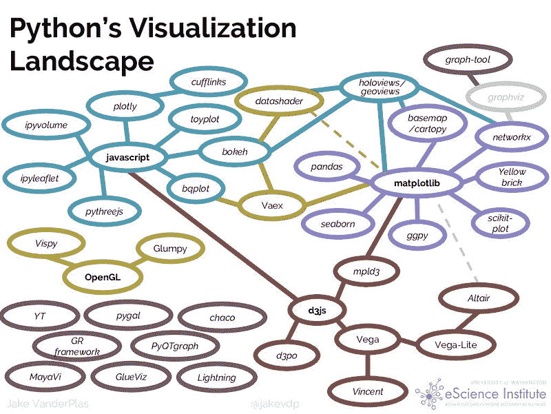

[来源](http://pyviz.org/tutorial/01_Workflow_Introduction.html)

现在，从这些工具中选择最合适的一个有点棘手和令人困惑。PyViz 试图解决这一情况。它有助于简化在网页浏览器中处理小型和大型数据集（从几个点到数十亿个点）的过程，无论是进行探索性分析、制作简单的基于小部件的工具还是构建功能齐全的仪表板。

### PyViz 生态系统

[PyViz](http://pyviz.org/) 是一个协调努力，使得 Python 中的数据可视化更易于使用、学习和更强大。PyViz 由一组开源 Python 包组成，可以在网页浏览器中轻松处理小型和大型数据集。无论是简单的 EDA 还是复杂的创建启用小部件的仪表板，PyViz 都是绝佳选择。

> **这是 PyViz 下的 Python 可视化格局。**

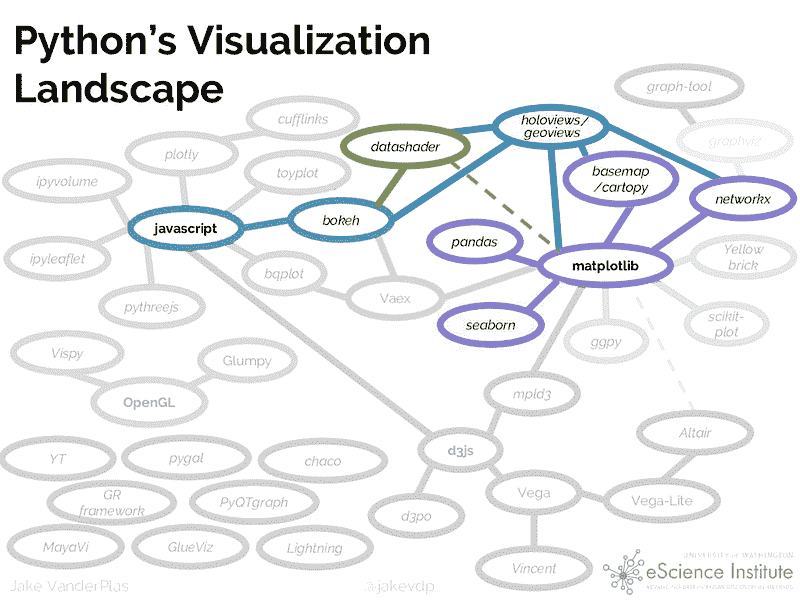

[源代码](http://pyviz.org/tutorial/01_Workflow_Introduction.html)

### PyViz 目标

Pyviz 的一些重要目标包括：

+   应重点关注任何规模的数据，而不是编码

+   完整功能和互动应直接在浏览器中提供（而非桌面端）

+   重点应更多放在 Python 用户上，而非网页程序员。

+   重点应更多放在 2D 可视化上，而非 3D。

+   利用 Python 用户已经熟悉的通用 SciPy/PyData 工具

### 库

组成 PyViz 的开源 [库](http://pyviz.org/background.html)有：


+   [**HoloViews**](http://holoviews.org/): 用于立即可视化数据的声明性对象，从方便的高级规格构建 Bokeh 绘图

+   [**GeoViews**](http://geo.holoviews.org/): 可视化的地理数据，可以与 HoloViews 对象混合和匹配

+   [**Bokeh**](http://bokeh.pydata.org/): 在网页浏览器中进行互动绘图，运行 JavaScript 但由 Python 控制

+   [**Panel**](http://panel.pyviz.org/): 从许多不同的库中组装对象，创建布局或应用程序，无论是在 Jupyter notebook 还是独立的可服务仪表板中

+   [**Datashader**](http://datashader.org/): 快速将巨大的数据集栅格化为固定大小的图像

+   [**hvPlot**](http://hvplot.pyviz.org/): 快速从 Pandas、Xarray 或其他数据结构中返回互动 HoloViews 或 GeoViews 对象

+   [**Param**](http://param.pyviz.org/): 声明用户相关参数，使得在笔记本上下文内外使用小部件变得简单

除此之外，PyViz 核心工具可以与以下库无缝配合。


此外，几乎所有其他绘图库中的对象都可以与 [**Panel**](https://panel.pyviz.org/) 一起使用，包括对这里列出的所有内容的特定支持，以及任何可以生成 HTML、PNG 或 SVG 的内容。**HoloViews** 还支持 [**Plotly**](https://plot.ly/) 进行 3D 可视化。

### 资源

PyViz 提供了示例、演示和培训材料，记录如何解决可视化问题。本教程提供了解决您自己可视化问题的起点。整个教程材料也托管在他们的 [Github 代码库](https://github.com/pyviz/pyviz) 中。

### 安装

请参阅 [pyviz.org](http://pyviz.org/installation.html) 以获取有关这些教程中使用的软件的完整安装说明。这里是这些说明的简化版本，假设您已经下载并安装了 [Anaconda](https://www.anaconda.com/download) 或 [Miniconda](https://conda.io/miniconda.html)：

```py
conda create -n pyviz-tutorial python=3.6
conda activate pyviz-tutorial
conda install -c pyviz/label/dev pyviz
pyviz examples
cd pyviz-examples
jupyter notebook
```

一旦所有内容都安装完成，以下单元格应打印出‘1.11.0a4’或更高版本：

```py
import holoviews as hv
hv.__version__
```

```py
'1.11.0a11'
```

```py
hv.extension('bokeh', 'matplotlib')
#should see the HoloViews, Bokeh, and Matplotlib logos
```

```py
#Import necessary libraries
import pandas
import datashader
import dask
import geoviews
import bokeh
```

如果完成没有错误，你的环境应该已经准备好了。

### 使用 PyViz 探索数据

在本节中，我们将探讨不同库如何在从数据中提取不同见解方面发挥作用，它们的结合可以真正帮助更好地分析数据。

**数据集**

所用数据集涉及每 10 万人中记录的 [麻疹和百日咳病例数](http://graphics.wsj.com/infectious-diseases-and-vaccines/#b02g20t20w15)，涵盖了美国每个州随时间变化的数据。该数据集在 PyViz 教程中预装。

**使用 Pandas 进行数据探索**

在任何数据科学项目中，开始探索通常是从 pandas 开始。让我们导入并显示数据集的前几行。

```py
import pandas as pd
```

```py
diseases_data = pd.read_csv('../data/diseases.csv.gz')
diseases_data.head()
```


数字是好的，但图表能更好地展示数据中的模式。

**使用 Matplotlib 进行数据探索**

```py
%matplotlib inline
```

```py
diseases_data.plot();
```

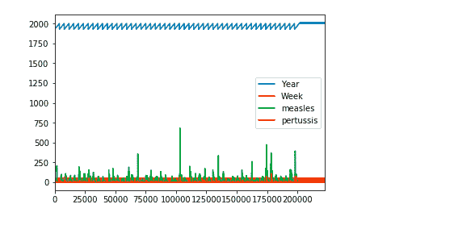

这并没有传达太多信息。让我们使用 pandas 进行一些操作，以获得有意义的结果。

```py
import numpy as np
```

```py
diseases_by_year = diseases_data[["Year","measles"]].groupby("Year").aggregate(np.sum)
```

```py
diseases_by_year.plot();
```

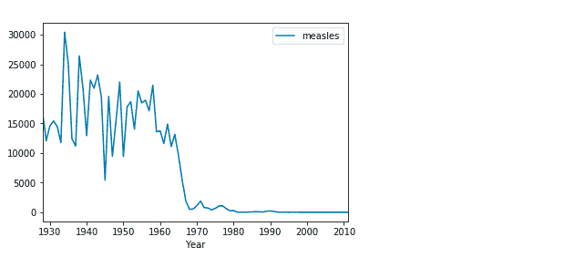

这就更有意义了。在这里，我们可以清楚地推断出大约在 1970 年发生了某些事情，导致麻疹的发生率几乎降为零。这是正确的，因为麻疹疫苗大约在 1963 年引入美国 [[Wikipedia](https://en.wikipedia.org/wiki/Measles_vaccine)]

**使用 HVPlot 和 Bokeh 进行数据探索**

上面的图表传达了正确的信息，但没有提供交互性。这是因为它们是静态图，没有在网页浏览器中平移、悬停或缩放的功能。然而，我们可以通过简单导入 `** hvplot**` 包来实现这种交互功能。

```py
import hvplot.pandas
```

```py
diseases_by_year.hvplot()
```

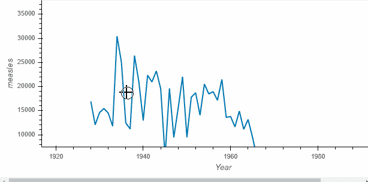

调用返回的对象称为 [**HoloViews**](http://holoviews.org/) 对象（这里是 Holoviews [Curve](http://holoviews.org/reference/elements/bokeh/Curve.html)），它 *显示* 为 Bokeh 图表。Holoviews 图表更丰富，方便在探索数据时捕捉你的理解。

让我们看看 HoloViews 还能做些什么：

**在图表上捕捉重要点**

1963 年在麻疹方面很重要，我们在图表上记录这一点怎么样。这还将帮助我们比较疫苗引入前后的麻疹病例数。

```py
import holoviews as hv
vline = hv.VLine(1963).options(color='red')
```

```py
vaccination_introduced = diseases_by_year.hvplot() * vline * \
    hv.Text(1963, 27000, "Measles Vaccine Introduced", halign='left')
```

```py
vaccination_introduced
```

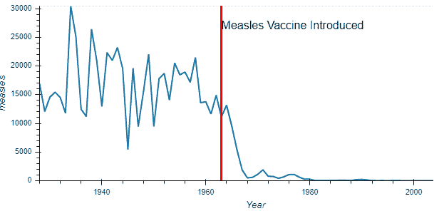

Holoviews 对象保存了原始数据，而不是其他绘图库。例如，可以以表格格式访问原始数据。

```py
print(vaccination_introduced)
vaccination_introduced.Curve.I.data.head()
```

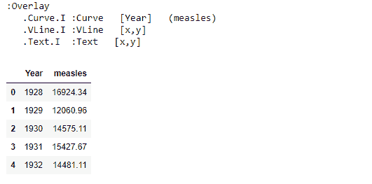

在这里，我们能够使用用于绘制图表的数据。此外，现在很容易以多种不同的方式拆分数据。

```py
measles_agg = diseases_data.groupby(['Year', 'State'])['measles'].sum()
by_state = measles_agg.hvplot('Year', groupby='State', width=500, dynamic=False)
```

```py
by_state * vline
```

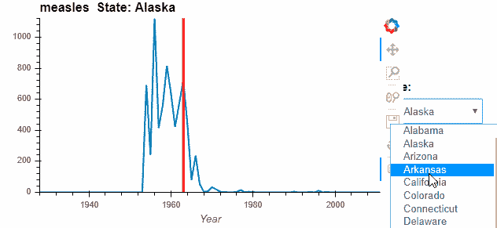

我们可以将图表并排放置，以便更好地进行比较，而不是使用下拉菜单。

```py
by_state["Alabama"].relabel('Alabama') + by_state["Florida"].relabel('Florida')
```

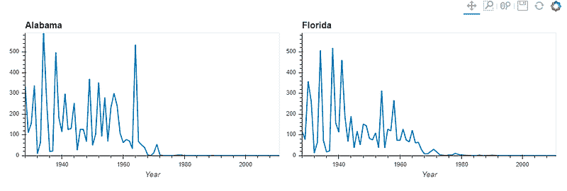

我们还可以改变图表的类型，比如改为柱状图。让我们比较 1980 年至 1985 年四个州的麻疹模式。

```py
states = ['New York', 'Alabama', 'California', 'Florida']
measles_agg.loc[1980:1990, states].hvplot.bar('Year', by='State', rot=90)
```

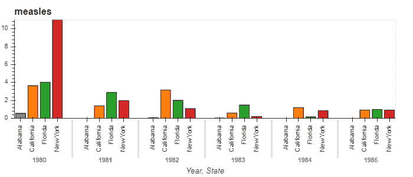

从以上示例可以明显看出，通过选择**HoloViews+Bokeh**图表，我们可以在浏览器中探索数据，具有完全的互动性和最小的代码。

**使用 PyViz 可视化大型数据集**

PyViz 还能够轻松处理非常大的数据集。对于这样的数据集，PyViz 套件的其他成员将发挥作用。

+   [**GeoViews**](http://geoviews.org/)

+   [**Datashader**](http://datashader.org/)

+   [**Panel**](https://panel.pyviz.org/)

+   [**Param**](https://param.pyviz.org/)

+   [**Colorcet**](https://colorcet.pyviz.org/)**用于**感知上均匀的大数据色图

为了展示这些库在处理大量数据时的能力，让我们使用 NYC 出租车数据集，该数据集包含了高达 1000 万次出租车行程的数据。这些数据已在教程中提供。

```py
#Importing the necessary libraries
```

```py
import dask.dataframe as dd, geoviews as gv, cartopy.crs as crs
from colorcet import fire
from holoviews.operation.datashader import datashade
from geoviews.tile_sources import EsriImagery
```

[**Dask**](http://docs.dask.org/en/latest/) 是一个用于 Python 的灵活并行计算库。Dask DataFrame 是一个大型并行 DataFrame，由许多较小的 Pandas DataFrame 组成，按索引拆分。这些 Pandas DataFrame 可以存储在磁盘上，以便在单台机器上进行超出内存限制的计算，或在集群中的许多不同机器上进行计算。一个 Dask DataFrame 操作会触发许多操作在组成的 Pandas DataFrame 上。

[**Cartopy**](https://scitools.org.uk/cartopy/docs/latest/) 是一个 Python 包，旨在进行地理空间数据处理，以生成地图和其他地理空间数据分析。

```py
topts = dict(width=700, height=600, bgcolor='black', xaxis=None, yaxis=None, show_grid=False)
tiles = EsriImagery.clone(crs=crs.GOOGLE_MERCATOR).options(**topts)
```

```py
dopts = dict(width=1000, height=600, x_sampling=0.5, y_sampling=0.5)
```

读取和绘制数据：

```py
taxi  = dd.read_parquet('../data/nyc_taxi_wide.parq').persist()
pts   = hv.Points(taxi, ['pickup_x', 'pickup_y'])
trips = datashade(pts, cmap=fire, **dopts)
```

```py
tiles * trips
```

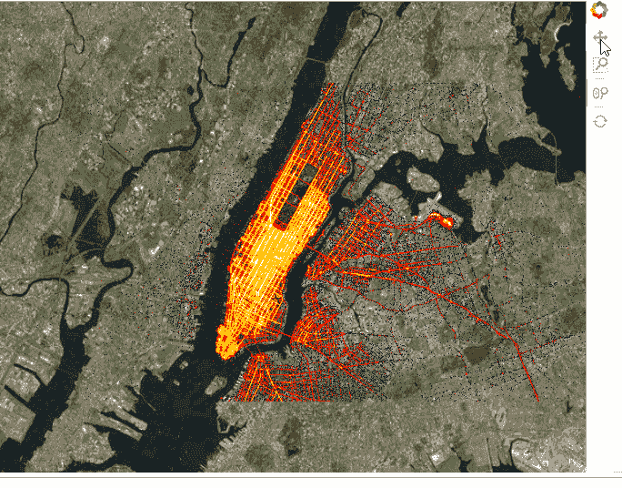

我们还可以添加[**小部件**](http://pyviz.org/tutorial/01_Workflow_Introduction.html)来控制选择。这可以在笔记本中完成，也可以通过标记可服务对象为`.servable()`，然后通过 Bokeh Server 运行.ipynb 文件，或者将代码提取到单独的.py 文件中并执行相同操作。

```py
import param, panel as pn
from colorcet import palette
```

```py
class NYCTaxi(param.Parameterized):
    alpha = param.Magnitude(default=0.75, doc="Map tile opacity")
    cmap = param.ObjectSelector('fire', objects=['fire','bgy','bgyw','bmy','gray','kbc'])
    location = param.ObjectSelector(default='dropoff', objects=['dropoff', 'pickup'])
```

```py
 def make_view(self, **kwargs):
        pts   = hv.Points(taxi, [self.location+'_x', self.location+'_y'])
        trips = datashade(pts, cmap=palette[self.cmap], **dopts)
        return tiles.options(alpha=self.alpha) * trips
```

```py
explorer = NYCTaxi(name="Taxi explorer")
pn.Row(explorer.param, explorer.make_view).servable()
```

**出租车探索器**

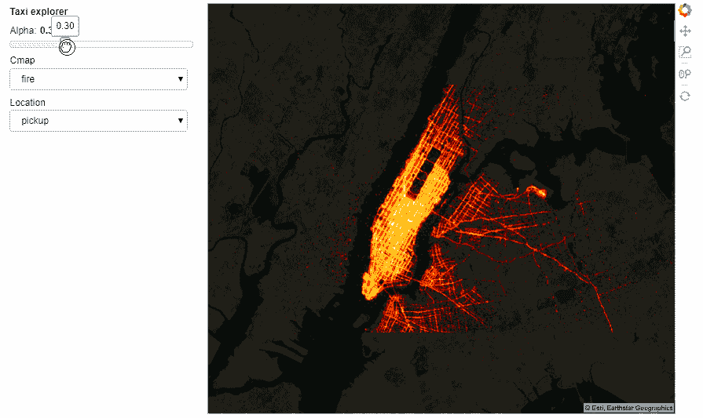

含有所有运行代码的 Notebook 可以从[**这里**](https://github.com/parulnith/Data-Visualisation-libraries/tree/master/Data%20Visualisation%20with%20PyViz)访问。然而，互动性在 GitHub 上无法呈现，但你仍然可以访问笔记本并在本地运行。

### 结论

PyViz 工具帮助我们即使用少量代码也能创建美观的可视化图表。PyViz 工具集合在一起构建高性能、可扩展、灵活且可部署的可视化、应用程序和仪表板，无需显式使用 JavaScript 或其他网页技术。本文只是对多功能 PyViz 生态系统的简单介绍。深入学习整个教程，以了解其复杂性及其在不同数据类型中的使用。

**简介： [Parul Pandey](https://www.linkedin.com/in/parul-pandey-a5498975/)** 是一位数据科学爱好者，常为数据科学出版物如 Towards Data Science 撰稿。

[原文](https://towardsdatascience.com/pyviz-simplifying-the-data-visualisation-process-in-python-1b6d2cb728f1)。经许可转载。

**相关：**

+   用代码在 Python 中进行 5 个快速而简单的数据可视化

+   Python 图形库

+   使用 Folium 在 Python 中可视化地理空间数据

### 更多相关话题

+   [每个数据科学家都应该知道的三个 R 库（即使你使用 Python）](https://www.kdnuggets.com/2021/12/three-r-libraries-every-data-scientist-know-even-python.html)

+   [是什么让 Python 成为初创企业的理想编程语言](https://www.kdnuggets.com/2021/12/makes-python-ideal-programming-language-startups.html)

+   [停止学习数据科学以寻找目标，并找到目标以…](https://www.kdnuggets.com/2021/12/stop-learning-data-science-find-purpose.html)

+   [学习数据科学统计的顶级资源](https://www.kdnuggets.com/2021/12/springboard-top-resources-learn-data-science-statistics.html)

+   [成功数据科学家的 5 个特征](https://www.kdnuggets.com/2021/12/5-characteristics-successful-data-scientist.html)

+   [一个 90 亿美元的 AI 失败，解析](https://www.kdnuggets.com/2021/12/9b-ai-failure-examined.html)
