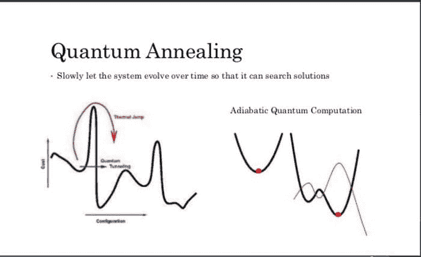
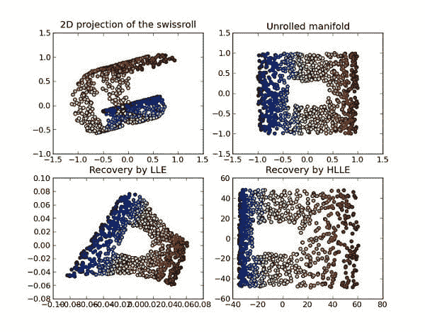
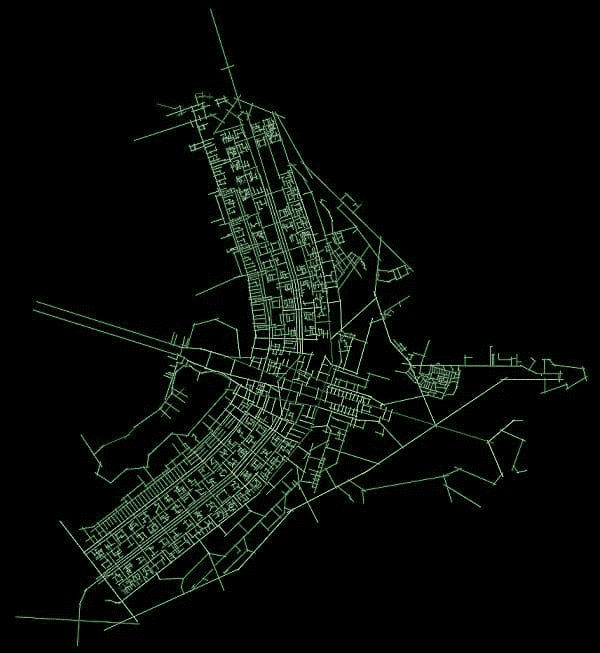

# 量子计算如何对机器学习有用

> 原文：[`www.kdnuggets.com/2019/04/quantum-computing-machine-learning.html`](https://www.kdnuggets.com/2019/04/quantum-computing-machine-learning.html)

 评论

**作者：[Roger Huang](http://rogerhuang.co/)**

如果你听说过量子计算，你可能会对将其应用于机器学习的可能性感到兴奋。如何利用这项新兴技术？我在 Springboard 工作，我们最近推出了一个包括职位保证的机器学习训练营。我们希望确保我们的毕业生接触到前沿的机器学习应用，因此我们将这篇文章作为我们研究量子计算与机器学习交集的一部分。

让我们先来探讨一下**量子计算与经典计算的区别。** 在经典计算中，数据存储在物理比特中，数据是二进制的且互为穷尽：比特要么处于 0 状态，要么处于 1 状态，不能同时处于两者状态。量子计算利用分子间小尺度物理相互作用的物理特性，使得量子比特（简称“qubit”）可以是经典 0 和 1 状态的线性组合——允许在一个 qubit 中存储比在普通比特中更多的数据。

量子计算确实会受到慢速的影响，因为量子分子彼此纠缠，并且直接物理观察它们所处的量子系统（即，从量子计算机中获取经典结果）会存在困难。但它可以更快地处理大量数据，并减少许多经典计算任务的空间/时间考虑——包括与机器学习相关的任务。

现在让我们看看量子计算在某些具体实例中如何提供帮助。

**1- 量子退火器与量子隧穿中的损失函数最小化**

首先要区分的是通用量子门计算机，它可以执行每个[完整量子算法](http://quantumalgorithmzoo.org/)（前述链接中描述了大约 50 个算法）以及量子退火器，它们是适用于特定目的的量子计算机的简化版本。

你可能对量子退火器有所了解，比如来自[D-Wave](https://www.dwavesys.com/home)的设备。这篇文章深入解释了[量子通用门计算机与退火器的区别](https://medium.com/quantum-bits/what-s-the-difference-between-quantum-annealing-and-universal-gate-quantum-computers-c5e5099175a1)。基本上，量子退火器是“简化版”的通用量子计算机，专注于找到超局部极小值，并比经典计算机更接近全局极小值。

**来源: [`www.slideshare.net/donotstalkme/quantum-computing-55840897`](https://www.slideshare.net/donotstalkme/quantum-computing-55840897)**

量子退火器通过[一系列磁铁附着在一个网格上](https://arstechnica.com/science/2017/01/explaining-the-upside-and-downside-of-d-waves-new-quantum-computer/)。磁铁相互影响，为了让系统整体节省能量，它们会翻转到一个协调的方向，从而最小化能量使用。在经典设置下，磁铁在找到更低的极小值之前会被困在低能量设置中，但由于量子特性如隧穿效应，它们可以跳过那些大的能量成本设置——这使得函数更容易从局部极小值下降到全局极小值或更接近全局极小值的局部极小值。

当涉及到成本函数时，这可以意味着梯度下降函数在次优设置下被困，还是在最优或接近最优的设置下，尤其是在复杂的非凸误差表面上。

如果你在急需“足够好”的答案的情况下，面对通常需要大量经典计算能力的复杂机器学习优化问题，它们可以是一个可靠的解决方案。通过利用量子隧穿效应，你可以更快地收敛于优化应用中的误差函数，比如投资组合分析（金融领域）。该技术已被用于分析[美国电网](https://www.bgp4.com/2018/10/16/annealing-quantum-computers-tackle-big-data-with-a-ml-quantum-boltzmann-machine/)，传感器每两秒钟收集大约 3PB 的数据，并几乎即时进行快速的损失函数计算。

**2-** **增强或替代** **用于维度减少的支持向量机**

机器学习面临的最大问题之一是处理高维空间中的计算。实际上，机器学习需要使用核技巧来有效地进行计算。[量子计算机可以帮助简化这个问题](https://hackernoon.com/quantum-machine-learning-d0037f59f31a)：有量子解释的[支持向量机核技巧](https://towardsdatascience.com/understanding-the-kernel-trick-e0bc6112ef78)可以帮助将计算减少到特定维度，并允许将高维数据集拆分成更易于管理的数据集。[这篇 2016 年论文](https://iopscience.iop.org/article/10.1088/1367-2630/18/7/073011/meta)在进行维度减少时实现了量子计算机的指数级加速，超过了在经典计算机上运行的任何算法。

**来源: 维基百科**

随着可用量子比特数量的增加，这种实现变得越来越高效。

通过使用适用于量子门和量子计算的支持向量机实现，有可能以更高的速度和更低的计算成本对非常大且复杂的数据集进行分类，例如基于多个因素判断细胞是否为癌细胞，这比目前经典计算机所能实现的更为高效。

**3- 小规模量子计算与强大经典计算的混合实现用于非常大数据集（例如：拓扑分析）**

通过利用量子计算和经典计算的优势，你可以为涉及巨大数据集的问题创造新的解决方案。

如果你想例如分析数据的[拓扑分布](https://www.ayasdi.com/blog/bigdata/why-topological-data-analysis-works/)（通常这是一个非常困难的任务，即使对于较小的数据集），以便简化数据中的失真并实质性地权衡数据错误的风险，你可以使用量子计算，即使是在非常小的规模下，也能达到更优的效果，同时使用经典计算来完成其余分析。这是[麻省理工学院、滑铁卢大学和南加州大学](https://news.mit.edu/2016/quantum-approach-big-data-0125)的学者们正在积极研究的方向。

通过在量子计算机上对数据集进行拓扑分析（当在经典计算机上进行此操作计算成本过高时），你可以快速获得数据集中的所有重要特征，评估其形状和方向，然后继续使用经典计算算法进行剩余工作，手中握有所需的特征和适当的算法方法。

**来源：维基媒体**

这种方法将使机器学习算法和方法在更大且不断增长的数据集中更有效地实现，结合了越来越强大的量子计算机和经典计算机。

---

希望这篇文章帮助你了解如何将量子算法和计算与机器学习结合起来。以下的[EdX 课程将帮助你](https://www.edx.org/course/quantum-machine-learning)提供实际的两个领域结合的例子。Coursera 提供了有关[量子计算概念](https://www.coursera.org/courses?query=quantum%20computing)的一系列课程，帮助你更加熟悉这一领域。如果你希望提高机器学习技能或进入一个全职从事机器学习的职业，并思考如上所述的问题，可以参考[Springboard 的 AI/机器学习职业路径](https://www.springboard.com/workshops/ai-machine-learning-career-track/?utm_source=kdnuggets&utm_medium=article&utm_term=quantum-machine-learning-kd)。

**简介**： [Roger Huang](http://rogerhuang.co/) 帮助公司在短短几周内实现收入倍增，并且现在正在帮助人们找到梦想中的工作。

**相关：**

+   [量子机器学习：神话、现实与未来预测](https://www.kdnuggets.com/2018/11/quantum-machine-learning.html)

+   [2018 年 AI 时代大会 – 第二天亮点](https://www.kdnuggets.com/2018/02/age-ai-conference-2018-day-2.html)

+   [量子机器学习：概述](https://www.kdnuggets.com/2018/01/quantum-machine-learning-overview.html)

* * *

## 我们的前三个课程推荐

 1\. [谷歌网络安全证书](https://www.kdnuggets.com/google-cybersecurity) - 快速进入网络安全职业的快车道。

 2\. [谷歌数据分析专业证书](https://www.kdnuggets.com/google-data-analytics) - 提升您的数据分析技能

 3\. [谷歌 IT 支持专业证书](https://www.kdnuggets.com/google-itsupport) - 支持您的组织进行 IT

* * *

### 更多相关话题

+   [探索 AI/DL 的最新趋势：从元宇宙到量子计算](https://www.kdnuggets.com/2023/07/exploring-latest-trends-aidl-metaverse-quantum-computing.html)

+   [解析量子计算：对数据科学和 AI 的影响](https://www.kdnuggets.com/breaking-down-quantum-computing-implications-for-data-science-and-ai)

+   [在数据科学之旅中实现量子飞跃](https://www.kdnuggets.com/2023/02/make-quantum-leaps-data-science-journey.html)

+   [免费 MIT 课程：TinyML 和高效深度学习计算](https://www.kdnuggets.com/free-mit-course-tinyml-and-efficient-deep-learning-computing)

+   [KDnuggets 新闻，12 月 7 日：揭穿的十大数据科学神话 • 4…](https://www.kdnuggets.com/2022/n47.html)

+   [5 个真正有用的 Bash 脚本用于数据科学](https://www.kdnuggets.com/2023/02/bash-scripts-data-science.html)
