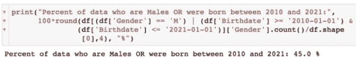
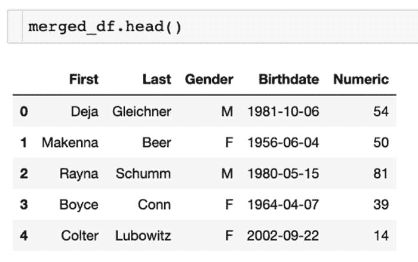
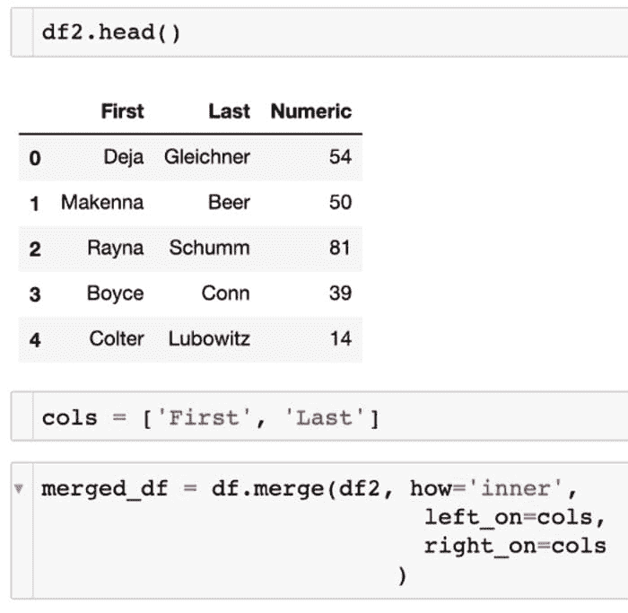

# 如何查询你的 Pandas 数据框

> 原文：[`www.kdnuggets.com/2021/08/query-pandas-dataframe.html`](https://www.kdnuggets.com/2021/08/query-pandas-dataframe.html)

评论


图片由 [Bruce Hong](https://unsplash.com/@hongqi?utm_source=unsplash&utm_medium=referral&utm_content=creditCopyText) 拍摄，来源于 [Unsplash](https://unsplash.com/s/photos/pandas?utm_source=unsplash&utm_medium=referral&utm_content=creditCopyText) [1]。

## 目录

1.  介绍

1.  多重条件

1.  在多个特定列上合并

1.  总结

1.  参考

## 介绍

无论你是从数据工程师/数据分析师转行，还是想成为更高效的数据科学家，查询你的数据框可以证明是一种非常有用的方法，用于返回你想要的特定行。需要注意的是，pandas 有一个专门的查询函数，名为 `query`。不过，我将讨论其他模拟查询、筛选和合并数据的方法。我们将展示一些你可能向数据提出的常见场景或问题，而不是使用 SQL，我们将用 Python 来完成。在下面的段落中，我将概述一些用 Python 编程语言查询 pandas 数据框的简单方法。

## 多重条件


示例数据。作者截图 [2]。

作为数据科学家或数据分析师，我们希望返回特定的行数据。一个这样的场景是你想在同一行代码中应用多个条件。为了展示我的示例，我创建了一些虚假的样本数据，包括名字和姓氏，以及相应的性别和出生日期。这些数据在截图中展示。

示例中的多个条件将本质上回答一个特定的问题，就像你使用 SQL 一样。问题是，我们的数据中有多少百分比是男性 **OR** 出生于 2010 年至 2021 年之间的人。

这是解决该问题的代码（*有几种方法可以回答这个问题，但这是我具体的做法*）：

```py
print(“Percent of data who are Males OR were born between 2010 and 2021:”,
 100*round(df[(df[‘Gender’] == ‘M’) | (df[‘Birthdate’] >= ‘2010–01–01’) & 
 (df[‘Birthdate’] <= ‘2021–01–01’)][‘Gender’].count()/df.shape
 [0],4), “%”)
```

为了更好地可视化这段代码，我还包括了上面的相同代码的截图，以及输出/结果。你也可以应用这些条件以返回实际行，而不是获取总行数的比例或百分比。



条件代码。作者截图 [3]。

这里是我们执行的命令顺序：

+   返回男性的 `Gender`

+   包括 **OR** 函数 `|`

+   返回 `Birthdate` > 2010 和 2021 的行

+   将所有条件结合起来，然后除以总行数

如你所见，这段代码与 SQL 中你会看到的内容类似。我个人认为在 pandas 中更容易，因为代码量可能更少，同时可以在一个易于查看的位置看到所有代码，而无需上下滚动（*但这种格式只是我的偏好*）。

## 在多个特定列上合并



合并的数据框结果。截图由作者提供 [4]。

我们可能已经在其他教程中看到如何合并数据框，所以我想添加一种独特的方法，这种方法我还没有真正看到过，就是在多个特定列上合并。在这种情况下，我们希望连接两个数据框，其中两个字段在它们之间共享。如果有更多列，这种方法可能会更加有用。

我们有第一个数据框，即 df，然后我们在第二个数据框 df2 上合并列。以下是实现我们预期结果的代码：

```py
merged_df = df.merge(df2, how=’inner’, 
 left_on=cols, 
 right_on=cols
 )
```

为了更好地可视化这些合并和代码，我在下面展示了截图。你可以看到第二个数据框的样子，包含了`First`和`Last`名字，就像它们在第一个数据框中一样，但新增了一个`Numeric`列。然后，我们选择了要合并的特定列，同时返回了`Gender`、`Birthdate`和新的`Numeric`列。这些列是一个名为`cols`的列列表。



合并数据框。截图由作者提供 [5]。

如你所见，这种合并数据框的方式是一种简单的方法，可以实现与 SQL 查询相同的结果。

## 摘要

在本教程中，我们查看了在 SQL 中你会执行的两个常见问题或查询，而是用 Python 中的 pandas 数据框执行了它们。

*总结一下，这里是我们处理的两种情况：*

1.  返回满足多个条件的行占总数据集的百分比

1.  在多个特定列上合并以返回包含新列的最终数据框

我希望你觉得我的文章既有趣又有用。如果你对这些方法有不同的看法，请随时在下方评论。为什么？或者为什么不？这些内容当然可以进一步澄清，但我希望我能够阐明一些你可以用 pandas 和 Python 代替 SQL 的方法。感谢阅读！

请随时查看我的个人资料，[Matt Przybyla](https://medium.com/u/abe5272eafd9?source=post_page-----c6f7d64164bc--------------------------------)，以及其他文章，也欢迎通过 LinkedIn 与我联系。

我与这些公司没有关联。

**参考文献**

[1] 图片由 [Bruce Hong](https://unsplash.com/@hongqi?utm_source=unsplash&utm_medium=referral&utm_content=creditCopyText) 提供，发布于 [Unsplash](https://unsplash.com/s/photos/pandas?utm_source=unsplash&utm_medium=referral&utm_content=creditCopyText), (2018)

[2] M. Przybyla, 示例数据截图, (2021)

[3] M. Przybyla, 条件代码截图, (2021)

[4] M. Przybyla，合并数据框结果截图，（2021）

[5] M. Przybyla，合并数据框截图，（2021）

**简介： [Matthew Przybyla](https://www.linkedin.com/in/matthew-przybyla-0a095b31/)** 是 Favor Delivery 的高级数据科学家，同时也是一名自由技术写作人员，特别擅长数据科学领域。

[原文](https://towardsdatascience.com/how-to-query-your-pandas-dataframe-c6f7d64164bc)。经许可转载。

**相关：**

+   数据科学家与机器学习工程师 – 他们的技能是什么？

+   Pandas 与 SQL：数据科学家何时使用每种工具

+   5 个 Python 数据处理技巧与代码片段

* * *

## 我们的前三名课程推荐

 1\. [Google 网络安全证书](https://www.kdnuggets.com/google-cybersecurity) - 快速进入网络安全职业生涯。

 2\. [Google 数据分析专业证书](https://www.kdnuggets.com/google-data-analytics) - 提升你的数据分析能力

 3\. [Google IT 支持专业证书](https://www.kdnuggets.com/google-itsupport) - 支持组织的 IT 需求

* * *

### 更多相关话题

+   [成为优秀数据科学家所需的 5 项关键技能](https://www.kdnuggets.com/2021/12/5-key-skills-needed-become-great-data-scientist.html)

+   [每个初学者数据科学家应该掌握的 6 种预测模型](https://www.kdnuggets.com/2021/12/6-predictive-models-every-beginner-data-scientist-master.html)

+   [2021 年最佳 ETL 工具](https://www.kdnuggets.com/2021/12/mozart-best-etl-tools-2021.html)

+   [用 SQL 查询你的 Pandas 数据框](https://www.kdnuggets.com/2021/10/query-pandas-dataframes-sql.html)

+   [停止学习数据科学以寻求目标，找到目标去……](https://www.kdnuggets.com/2021/12/stop-learning-data-science-find-purpose.html)

+   [一桩 90 亿美元的 AI 失败，深度剖析](https://www.kdnuggets.com/2021/12/9b-ai-failure-examined.html)
