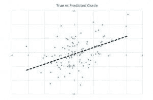
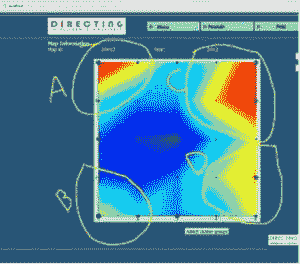

# 数据科学能回答哪些问题？

> 原文：[`www.kdnuggets.com/2016/01/questions-data-science-answer.html/2`](https://www.kdnuggets.com/2016/01/questions-data-science-answer.html/2)

### 多少/多少？

当你需要找一个数字而不是类别时，应该使用**回归**算法家族。

+   下周二的气温会是多少？

+   我在葡萄牙的第四季度销售额会是多少？

+   30 分钟后，我的风电场将需求多少千瓦？

+   我下周会获得多少新关注者？

+   在一千个单位中，这款型号的轴承有多少能在使用 10,000 小时后存活？

通常，回归算法会给出一个实数值的答案；答案可能有很多小数位甚至是负数。对于一些问题，特别是以“多少…”开头的问题，负数可能需要重新解释为零，小数值需要重新解释为最接近的整数。

### 多类别分类作为回归

有时看起来像多值分类问题的问题实际上更适合回归。例如，“哪条新闻对这个读者最有趣？” 似乎在询问一个类别——从新闻故事列表中选一个。然而，你可以将其重新表述为 “这个列表中的每个故事对这个读者有多有趣？” 并给每篇文章一个数值评分。然后识别出得分最高的文章是件简单的事。这类问题通常表现为排名或比较。

+   “我的车队中哪辆车最需要维护？” 可以重新表述为 “我车队中的每辆车需要维护的程度如何？”

+   “我客户中哪 5%的人会在接下来的一年里转向竞争对手？” 可以重新表述为 “我每个客户在接下来的一年里转向竞争对手的可能性有多大？”

### 二分类作为回归

二分类问题也可以重新表述为回归问题可能不会令人惊讶。（事实上，在底层，一些算法将*每个*二分类问题重新表述为回归。）这在一个例子可能部分属于 A 和部分属于 B，或有可能两种情况都发生时尤其有用。当一个答案可能部分是肯定的和否定的，可能是打开的但也可能是关闭的，那么回归可以反映这一点。这类问题通常以“可能性有多大…”或“比例是多少…”开始。

+   这个用户点击我的广告的可能性有多大？

+   这个老虎机的多少次拉动会导致支付？

+   这个员工成为内部安全威胁的可能性有多大？

+   今天的航班中有多少会准时起飞？

如你所知，两类分类、多类分类、异常检测和回归等问题都密切相关。它们都属于同一个扩展家庭，即**监督学习**。它们有许多共同之处，通常可以将问题修改并在多个领域提出。它们的共同点是，它们是通过一组标记样本（称为**训练**）构建的，然后可以对未标记样本进行赋值或分类（称为**评分**）。

完全不同的数据科学问题属于无监督学习和强化学习的扩展算法家庭。

### 这些数据如何组织？

有关数据如何组织的问题属于**无监督学习**。有多种技术尝试揭示数据的结构。其中一种是**聚类**，也称为分块、分组、捆绑或分段。它们试图将数据集分成直观的块。聚类与监督学习不同之处在于，没有数字或名称告诉你每个点属于哪个组、组的代表是什么，甚至没有指定应该有多少组。如果监督学习是从夜空中的星星中挑选行星，那么聚类就是发明星座。聚类试图将数据分成自然的“团块”，以便人类分析师可以更容易地解释和向他人解释。

聚类总是依赖于定义相似性或接近性的标准，称为距离度量。距离度量可以是任何可测量的量，如智商差异、共享的基因对数或直线距离。聚类问题都试图将数据划分为更均匀的组。

+   哪些购物者在农产品上的口味相似？

+   哪些观众喜欢相同类型的电影？

+   哪些打印机型号以相同的方式失败？

+   在一周中的哪些日子，这个电力变电站的电力需求类似？

+   如何将这些文档自然地划分为五个主题组？

另一类无监督学习算法称为**降维**技术。降维是简化数据的另一种方式，使其更易于沟通、更快地进行计算和更易于存储。

降维的核心在于创建一种描述数据点的简写方式。一个简单的例子是 GPA。大学生的学术能力通过数十门课程的数百次考试和数千次作业来衡量。每个作业都能反映出学生对课程内容的理解，但完整列出这些信息对任何招聘人员来说都过于繁杂。幸运的是，你可以通过将所有分数平均化来创建一个简写。你可以通过这种大规模简化来处理数据，因为在一项作业或课程中表现非常好的学生通常在其他方面也表现良好。通过使用 GPA 而不是完整的档案，虽然失去了一些细节，比如学生是否在数学上比英语更强，或在课后编程作业中得分是否比课堂小测验更高，但你获得的是简洁，这使得讨论和比较学生的能力变得容易得多。

与降维相关的问题通常是关于哪些因素倾向于一起变化。

+   在这台喷气发动机中，哪些传感器组的变化往往是互相关联的（或相反的）？

+   成功的 CEO 有哪些共同的领导实践？

+   美国的汽油价格变化中最常见的模式是什么？

+   在这组文档中，哪些词组倾向于一起出现？（它们涵盖了哪些主题？）

如果你的目标是总结、简化、浓缩或提炼一组数据，降维和聚类是你首选的工具。

### 我现在应该做什么？

第三类扩展的机器学习（ML）算法专注于采取行动。这些被称为**强化学习**（RL）算法。它们与监督学习和无监督学习算法略有不同。一个回归算法可能预测明天的高温为 98 度，但它不会决定如何应对。RL 算法会进一步选择行动，例如在天气仍然凉爽的时候预先冷却办公室的上层楼层。

RL 算法最初受到老鼠和人类大脑如何对惩罚和奖励做出反应的启发。它们选择行动，努力选择能够获得最大奖励的行动。你需要提供一组可能的行动，并在每次行动后得到反馈，了解该行动是好、一般还是巨大的错误。

通常，RL 算法非常适合那些需要在没有人工指导的情况下做出大量小决策的自动化系统。电梯、供暖、制冷和照明系统是很好的候选者。RL 最初是为了控制机器人而开发的，因此任何自行移动的设备，从检查无人机到吸尘器，都是适用的。RL 回答的问题总是关于应该采取什么行动，尽管通常由机器来执行这些行动。

+   我应该把这个广告放在网页的哪个位置，以便观众最有可能点击它？

+   我应该把温度调高、调低，还是保持现状？

+   我应该重新吸尘客厅还是继续保持在充电站？

+   我现在应该买多少股这只股票？

+   我应该在看到黄灯时继续保持当前速度、刹车还是加速？

强化学习（RL）通常比其他算法类型需要更多的努力，因为它与系统的其他部分紧密集成。好的一面是，大多数 RL 算法可以在没有数据的情况下开始工作。它们在进行过程中收集数据，通过试错学习。

[本系列的第一篇文章](https://www.linkedin.com/pulse/what-can-data-science-do-me-brandon-rohrer)介绍了进行优秀数据科学所需的基本要素。接下来的最后一篇文章将提供大量关于尖锐数据科学问题的具体示例，以及最适合每个问题的算法家族。敬请关注。

个人简介：[Brandon Rohrer](https://twitter.com/_brohrer_) 是微软的高级数据科学家。

本文最初发布在 [微软 TechNet 机器学习博客](http://blogs.technet.com/b/machinelearning/archive/2015/08/27/what-types-of-questions-can-data-science-answer.aspx)上。

* * *

## 我们的前三大课程推荐

 1\. [谷歌网络安全证书](https://www.kdnuggets.com/google-cybersecurity) - 快速进入网络安全职业。

 2\. [谷歌数据分析专业证书](https://www.kdnuggets.com/google-data-analytics) - 提升你的数据分析技能

 3\. [谷歌 IT 支持专业证书](https://www.kdnuggets.com/google-itsupport) - 支持你的组织 IT 需求

* * *

### 更多相关内容

+   [如何回答数据科学编程面试问题](https://www.kdnuggets.com/2022/01/answer-data-science-coding-interview-questions.html)

+   [你必须知道的 10 个高级数据科学 SQL 面试问题……](https://www.kdnuggets.com/2023/01/top-10-advanced-data-science-sql-interview-questions-must-know-answer.html)

+   [谷歌通过将生成式 AI 加入 Docs 和 Gmail 来回应 ChatGPT](https://www.kdnuggets.com/2023/03/google-answer-chatgpt-adding-generative-ai-docs-gmail.html)

+   [KDnuggets 新闻，5 月 4 日：9 门免费哈佛课程学习数据……](https://www.kdnuggets.com/2022/n18.html)

+   [15 个你必须知道的数据科学 Python 编程面试问题](https://www.kdnuggets.com/2022/04/15-python-coding-interview-questions-must-know-data-science.html)

+   [12 个最具挑战性的数据显示科学面试问题](https://www.kdnuggets.com/2022/07/12-challenging-data-science-interview-questions.html)
