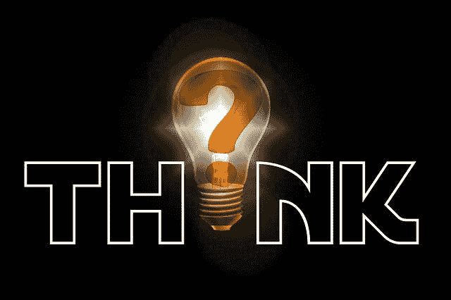

# 初级数据科学家的两个问题

> 原文：[`www.kdnuggets.com/2020/01/questions-junior-data-scientist.html`](https://www.kdnuggets.com/2020/01/questions-junior-data-scientist.html)

评论

**由 [Sowmya Vajjala](https://nishkalavallabhi.github.io/) 撰写，博客内容包括 NLP 研究和教学、R、Python 等**。

* * *

## 我们的前三大课程推荐

 1\. [Google 网络安全证书](https://www.kdnuggets.com/google-cybersecurity) - 快速进入网络安全职业生涯。

 2\. [Google 数据分析专业证书](https://www.kdnuggets.com/google-data-analytics) - 提升你的数据分析技能

 3\. [Google IT 支持专业证书](https://www.kdnuggets.com/google-itsupport) - 支持你的组织 IT

* * *

我认为，招聘数据科学家一般来说是一个困难的过程。有很多来自不同背景、学术学位水平和经验的人。不同公司对“数据科学家”的要求差异很大。此外，我们还看到越来越多的人在 LinkedIn 个人资料上添加了“数据科学家”的标签。*评估一个有经验的数据科学家个人资料是否适合一个职位可能相对容易，但我们如何评估一个初级/入门级数据科学家个人资料？*

在过去几个月中，我面试了几位应届毕业生/证书项目毕业生/实习候选人后，花了一些时间思考这个问题。我觉得在面试过程中有两个重要的问题需要提出。这篇文章就是关于这两个问题以及我提出这些问题的理由。

让我先给他们设置标题。

1.  解决同一问题的不同方式

1.  一般理解还是具体知识

### 解决同一问题的不同方式

让我举一个匿名的真实面试经验。我曾面试过一位学术背景非常优秀、作为学生已经完成了一系列令人印象深刻的项目的候选人。其中一个项目涉及使用强化学习解决自然语言处理领域的一个问题。这是一个 Kaggle 比赛（据我记得），候选人在其中名列前茅。我觉得他们解释自己做了什么的方式相当不错。

当时，我问：“如果被告知不能使用强化学习，你会怎么做？”候选人似乎对这个问题感到惊讶。经过一番思考，他们说：“深度学习。”我问：“深度学习中的什么？”他们说：“也许是 RNNs。”我说：“好的，假设决定我们不能使用深度学习。你能想到其他解决方案吗？”他们：（茫然的表情）。

在这种情况下，我们讨论的问题的一个流行算法（这在教科书中也可以找到）使用了正则表达式和简单的启发式方法！现在，有人可能会问，在这个时代问这个问题有什么意义？三个原因：

+   在行业项目中，通常构建一个快速的 MVP 或简单的解决方案、获取反馈并进行迭代是有意义的。因此，考虑几种不同的解决方案并评估哪个可以快速构建是有用的。

+   强化学习、深度学习或正则表达式只是解决问题的“方法”。它们不应成为问题本身的解决方案。

+   *这也会告诉我候选人是否只是遵循了他们课程中强制项目的描述，还是实际上理解并考虑了解决问题的方式*

所以，我的观点是：当我们刚开始时，避免停留在一个解决方案上，思考“还有其他解决方案吗？”。这也是我们在实际工作中常做的事情。我们在给定的约束下寻找最优解。虽然对刚开始的人来说，了解所有内容是困难的——这部分也涉及常识。*当有人突然问你关于替代解决方案的问题时，你应该在面试中有一个答案。这在作为数据科学家成长的过程中将非常有用。*

### 广泛的理解还是具体的知识

让我再举一个匿名的面试经验。一个刚毕业的候选人在简历上有一堆典型项目——垃圾邮件分类、MNIST 数据集数字识别、情感分析等。在其中一个项目中，候选人还声称自己在 Kaggle 排行榜上是前十名的表现者。虽然这很令人印象深刻，但这些与现实世界项目场景相差甚远。那么，我该怎么做呢？

我没有直接询问这些知名数据集和项目的具体细节，而是稍微修改了我的“问题描述”。我问了候选人解决问题的问题，例如：“假设我经营一个在线业务，经常收到客户抱怨的邮件。我只有三个客户支持部门：订单和账单、退货和退款、其他。我想要一个机器学习解决方案，将客户邮件分配到这三个部门中的一个。”——如果有人理解了他们做过的项目，他们应该将其映射到分类问题上，可能类似于垃圾邮件或情感分类。即使是入门级别，不看到这个关联对我来说也是一个警示信号。

对于这个问题，我有两个重点：

+   *如果你展示的所有数据科学项目都是标准数据集和 Kaggle 竞赛，这完全没问题（几个月前，我曾质疑这是否有用，但我现在改变了看法）。不过，一个人需要知道如何将这些知识推广到新问题上。*例如，如果你之前做过文本分类问题，你需要能够识别另一个文本分类问题，并了解解决它的一些步骤。

+   在这里，我的第二点与问题 1 类似。这告诉我候选人是否真正理解了他们所做的事情，还是只是跟随指令或在线教程。

*总结来说，申请数据科学职位时，入门级候选人需要在项目方面考虑得更深入一点——寻找其他可能的解决方案，并寻找类似问题在实际应用中的例子。*

当然，这些都是我的个人观点，并不一定适用于每一个数据科学面试！

[原文](https://towardsdatascience.com/2-questions-for-a-junior-data-scientist-47d355b87023)。经许可转载。

**简介：**[Sowmya Vajjala](https://nishkalavallabhi.github.io/) 是一位位于加拿大多伦多的 NLP 研究员，专注于使用机器学习方法处理和理解文本。此前，Sowmya 曾在爱荷华州立大学任教，并在多伦多担任数据科学家。

**相关：**

+   [我想成为数据科学家，但…怎么做？](https://www.kdnuggets.com/2020/01/wanna-be-data-scientist.html)

+   [作为数据科学家不被录用的 4 种最快方法](https://www.kdnuggets.com/2019/12/4-ways-not-hired-data-scientist.html)

+   [数据科学面试学习指南](https://www.kdnuggets.com/2020/01/data-science-interview-study-guide.html)

### 更多相关主题

+   [初级与高级数据科学家薪资：有什么区别？](https://www.kdnuggets.com/2022/03/junior-senior-data-scientist-salary-difference.html)

+   [初级数据科学家：下一个阶段](https://www.kdnuggets.com/2022/02/junior-data-scientist-next-level.html)

+   [初级机器学习工程师实际需要知道什么才能被录用？](https://www.kdnuggets.com/what-junior-ml-engineers-actually-need-to-know-to-get-hired)

+   [KDnuggets 新闻，5 月 4 日：9 门免费哈佛课程学习数据…](https://www.kdnuggets.com/2022/n18.html)

+   [如何回答数据科学编码面试问题](https://www.kdnuggets.com/2022/01/answer-data-science-coding-interview-questions.html)

+   [你必须知道的 15 个 Python 编码面试问题](https://www.kdnuggets.com/2022/04/15-python-coding-interview-questions-must-know-data-science.html)
