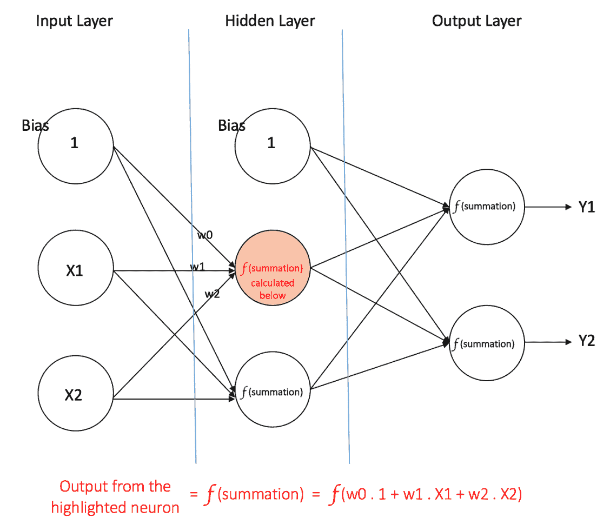
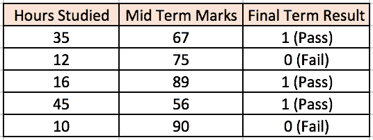
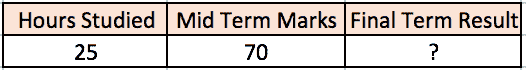

# 神经网络快速入门

> 原文：[`www.kdnuggets.com/2016/11/quick-introduction-neural-networks.html/2`](https://www.kdnuggets.com/2016/11/quick-introduction-neural-networks.html/2)

前馈神经网络可以由三种类型的节点组成：

1.  **输入节点 -** 输入节点将来自外部世界的信息传递给网络，被统称为“输入层”。输入节点中不进行任何计算——它们只是将信息传递给隐藏节点。

1.  **隐藏节点 -** 隐藏节点与外部世界没有直接连接（因此称为“隐藏”）。它们执行计算，并将信息从输入节点传递到输出节点。隐藏节点的集合形成了一个“隐藏层”。虽然前馈网络只有一个输入层和一个输出层，但它可以有零个或多个隐藏层。

1.  **输出节点 -** 输出节点统称为“输出层”，负责计算并将信息从网络传递到外部世界。

在前馈网络中，信息仅朝一个方向移动——前进——从输入节点，通过隐藏节点（如有）到达输出节点。网络中没有循环或回路[3]（这一前馈网络的特性不同于递归神经网络，其中节点之间的连接形成循环）。

* * *

## 我们的前三个课程推荐

 1\. [谷歌网络安全证书](https://www.kdnuggets.com/google-cybersecurity) - 快速开启网络安全职业之路。

 2\. [谷歌数据分析专业证书](https://www.kdnuggets.com/google-data-analytics) - 提升您的数据分析技能

 3\. [谷歌 IT 支持专业证书](https://www.kdnuggets.com/google-itsupport) - 支持组织的 IT 需求

* * *

下方给出了两个前馈网络的例子：

1.  **单层感知器** - 这是最简单的前馈神经网络[4]，不包含任何隐藏层。您可以在[4]，[5]，[6]，[7]中了解更多关于单层感知器的内容。

1.  **多层感知器** - 多层感知器具有一个或多个隐藏层。我们将仅讨论多层感知器，因为它们在实际应用中比单层感知器更有用。

#### 多层感知器

多层感知器（MLP）包含一个或多个隐藏层（除了一个输入层和一个输出层）。虽然单层感知器只能学习线性函数，但多层感知器也可以学习非线性函数。

图 4 显示了一个具有单一隐藏层的多层感知器。注意，所有连接都有权重，但图中仅显示了三个权重（w0, w1, w2）。

**输入层：** 输入层有三个节点。偏置节点的值为 1。其他两个节点接受 X1 和 X2 作为外部输入（这些值取决于输入数据集的数值）。如上所述，输入层不进行计算，因此输入层的节点输出为 1、X1 和 X2，它们被送入隐藏层。

**隐藏层：** 隐藏层也有三个节点，偏置节点的输出为 1。隐藏层中其他两个节点的输出取决于输入层的输出（1、X1、X2）以及与连接（边）相关的权重。图 4 显示了一个隐藏节点（高亮显示）的输出计算。同样，其他隐藏节点的输出也可以计算。请记住，***f*** 指的是激活函数。这些输出随后被送入输出层的节点。

###### 图 4：具有一个隐藏层的多层感知器

**输出层：** 输出层有两个节点，这些节点从隐藏层接受输入，并执行与高亮隐藏节点所示类似的计算。这些计算得到的值（Y1 和 Y2）作为多层感知器的输出。

给定一组特征**X = (x1, x2, ...)**和一个目标**y**，多层感知器可以学习特征与目标之间的关系，用于分类或回归。

让我们通过一个例子更好地理解多层感知器。假设我们有以下学生-成绩数据集：

两个输入列显示了学生学习的小时数和学生在期中考试中获得的分数。期末结果列可以有两个值 1 或 0，表示学生是否通过了期末考试。例如，我们可以看到，如果学生学习了 35 小时并在期中考试中获得了 67 分，他/她最终通过了期末考试。

现在，假设我们想预测一个学习了 25 小时并在期中考试中得了 70 分的学生是否能通过期末考试。

这是一个二分类问题，其中多层感知器可以从给定的示例（训练数据）中学习，并在给定新的数据点时做出有根据的预测。我们将看到多层感知器如何学习这种关系。

##### 训练我们的 MLP：反向传播算法

多层感知器学习的过程称为反向传播算法。我建议阅读[Hemanth Kumar 在 Quora 上的回答](https://www.quora.com/How-do-you-explain-back-propagation-algorithm-to-a-beginner-in-neural-network/answer/Hemanth-Kumar-Mantri)（下文引用），它清楚地解释了反向传播。

> **反向误差传播**，通常缩写为 BackProp，是训练人工神经网络（ANN）的几种方法之一。它是一种监督训练方案，这意味着它从标记的训练数据中学习（有监督者来指导其学习）。
> 
> 简而言之，BackProp 就像是“**从错误中学习**”。监督者在 ANN 犯错时会进行***纠正***。
> 
> 一个 ANN 由不同层中的节点组成：输入层、隐藏层和输出层。相邻层节点之间的连接有“权重”与之相关。学习的目标是为这些边分配正确的权重。给定一个输入向量，这些权重决定了输出向量。
> 
> 在监督学习中，训练集是标记的。这意味着，对于一些给定的输入，我们知道期望的输出（标签）。
> 
> **反向传播算法：**
> 
> 最初，所有边权重都是随机分配的。对于训练数据集中的每个输入，激活 ANN 并观察其输出。这个输出与我们已经知道的期望输出进行比较，并且误差被“传播”回上一层。记录这个误差并相应地“调整”权重。这个过程会重复进行，直到输出误差低于预定的阈值。
> 
> 一旦上述算法终止，我们就拥有一个“学习过”的 ANN，我们认为它准备好处理“新”输入了。这个 ANN 被认为从多个示例（标记数据）和它的错误（误差传播）中学习了。

现在我们对反向传播的工作原理有了了解，让我们回到上面的学生分数数据集。

### 更多相关话题

+   [快速数据科学提示和技巧以学习 SAS](https://www.kdnuggets.com/2022/05/sas-quick-data-science-tips-tricks-learn.html)

+   [7 个用于快速数据可视化的 Pandas 绘图函数](https://www.kdnuggets.com/7-pandas-plotting-functions-for-quick-data-visualization)

+   [Voronoi 图的快速概述](https://www.kdnuggets.com/2022/11/quick-overview-voronoi-diagrams.html)

+   [找到适合注释的合适人才的快速指南](https://www.kdnuggets.com/2022/04/quick-guide-find-right-minds-annotation.html)

+   [用 PyTorch 解释神经网络](https://www.kdnuggets.com/2022/01/interpretable-neural-networks-pytorch.html)

+   [深度神经网络不会引导我们走向 AGI](https://www.kdnuggets.com/2021/12/deep-neural-networks-not-toward-agi.html)
html)

1.  [单层感知机](http://www.cs.stir.ac.uk/courses/ITNP4B/lectures/kms/2-Perceptrons.pdf)

1.  [加权网络 – 感知机](http://page.mi.fu-berlin.de/rojas/neural/chapter/K3.pdf)

1.  [神经网络模型（监督学习）（scikit-learn 文档）](http://scikit-learn.org/dev/modules/neural_networks_supervised.html)

1.  [神经网络中的隐藏层计算了什么？](http://stats.stackexchange.com/a/63163/53914)

1.  [如何选择前馈神经网络中的隐藏层数量和节点数量？](http://stats.stackexchange.com/a/1097/53914)

1.  [人工神经网络速成简介](http://ulcar.uml.edu/~iag/CS/Intro-to-ANN.html)

1.  [为什么在人工神经网络中需要偏置？我们是否需要为每一层设置单独的偏置？](http://stackoverflow.com/questions/7175099/why-the-bias-is-necessary-in-ann-should-we-have-separate-bias-for-each-layer)

1.  [基础神经网络教程 – 理论](https://takinginitiative.wordpress.com/2008/04/03/basic-neural-network-tutorial-theory/)

1.  [神经网络揭秘（视频系列）：第一部分，Welch 实验室 @ MLconf SF](https://www.youtube.com/watch?v=5MXp9UUkSmc)

1.  A. W. Harley, "卷积神经网络的交互式节点-链接可视化," 见 ISVC, 页码 867-877, 2015 ([链接](http://scs.ryerson.ca/~aharley/vis/harley_vis_isvc15.pdf))

[原文](https://ujjwalkarn.me/2016/08/09/quick-intro-neural-networks/)。

* * *

## 我们的三大课程推荐

 1\. [谷歌网络安全证书](https://www.kdnuggets.com/google-cybersecurity) - 快速进入网络安全职业轨道。

 2\. [谷歌数据分析专业证书](https://www.kdnuggets.com/google-data-analytics) - 提升你的数据分析技能

 3\. [谷歌 IT 支持专业证书](https://www.kdnuggets.com/google-itsupport) - 支持你的组织的 IT

* * *

### 更多相关主题

+   [快速数据科学技巧与窍门：学习 SAS](https://www.kdnuggets.com/2022/05/sas-quick-data-science-tips-tricks-learn.html)

+   [7 个 Pandas 绘图函数以快速数据可视化](https://www.kdnuggets.com/7-pandas-plotting-functions-for-quick-data-visualization)

+   [Voronoi 图的快速概述](https://www.kdnuggets.com/2022/11/quick-overview-voronoi-diagrams.html)

+   [快速指南：如何找到合适的注释专家](https://www.kdnuggets.com/2022/04/quick-guide-find-right-minds-annotation.html)

+   [使用 PyTorch 的可解释神经网络](https://www.kdnuggets.com/2022/01/interpretable-neural-networks-pytorch.html)

+   [深度神经网络不会引领我们走向 AGI](https://www.kdnuggets.com/2021/12/deep-neural-networks-not-toward-agi.html)
