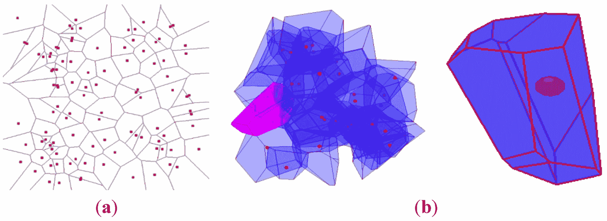
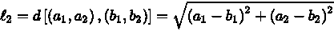
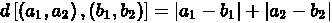
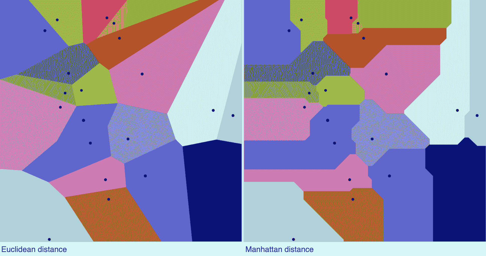
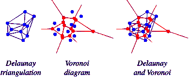
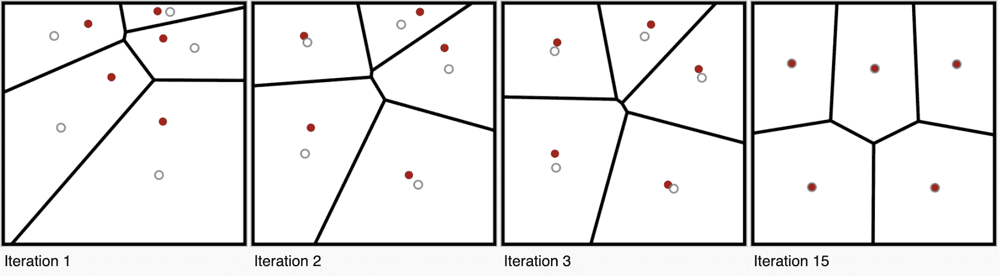

# Voronoi 图概述

> 原文：[`www.kdnuggets.com/2022/11/quick-overview-voronoi-diagrams.html`](https://www.kdnuggets.com/2022/11/quick-overview-voronoi-diagrams.html)

[Vackground.com](https://unsplash.com/@vackground) 来自 Unsplash

**Voronoi 图**。这是什么？它几乎存在于我们周围的自然界中。它们也被称为迪利克雷镶嵌或泰森多边形。尽管它们被称为如此复杂的名字，Voronoi 图实际上很简单，但具有显著的属性，并涉及到从计算机科学到艺术的不同领域。

* * *

## 我们的前 3 名课程推荐

 1\. [Google 网络安全证书](https://www.kdnuggets.com/google-cybersecurity) - 快速进入网络安全职业道路。

 2\. [Google 数据分析专业证书](https://www.kdnuggets.com/google-data-analytics) - 提升你的数据分析技能

 3\. [Google IT 支持专业证书](https://www.kdnuggets.com/google-itsupport) - 支持你所在组织的 IT 工作

* * *

例如，在 1854 年伦敦霍乱流行期间，医生约翰·斯诺使用了 Voronoi 图，将每个多边形中的水泵位置用于识别特定的泵作为感染源，以统计死亡人数。有趣吧？那么这个图示是什么呢？

# 什么是 Voronoi 图？

Voronoi 图是一种在欧几里得平面上具有散布随机点（n）的图示。然后将平面划分成每个点周围的单元格，这些单元格包围了平面中离每个点最近的部分——形成一个覆盖平面的镶嵌多边形。

为了更好地视觉理解，可以查看下面的图像。每个随机点都被封闭在一个单元格中，该单元格在两个或多个点之间是等距的。

来源：[MDPI](https://www.mdpi.com/2220-9964/4/3/1480)

如上图所示，在(a)中，大多数点都集中在每个单元格的中心，但并非所有点都是如此。单元格的边界是基于到周围点的距离，而创建单元格的线条将点之间的空间完美地分隔开来。

如果向特定单元格中添加更多随机点，它们将更靠近该单元格内的原始点。

Voronoi 图在不同的情况下被看到和使用——其中许多来自自然界。我整理了一些自然发生的 Voronoi 图案的拼贴画，以帮助你更好地理解。

如果你对动物的形状和模式感兴趣，可以阅读这篇论文：[整合哺乳动物模型中的形状和模式](https://www.iro.umontreal.ca/~poulin/fournier/papers/Walter-2001-ISP/Walter-2001-ISP.pdf)

来源：作者图像

Voronoi 划分是通过点的径向外扩展创建的，如下图所示。

来源：[维基百科](https://en.wikipedia.org/wiki/Voronoi_diagram#/media/File:Voronoi_growth_euclidean.gif)

# 背后的数学

点之间的距离可以通过以下方式测量：

## 欧几里得距离

## 曼哈顿距离

如果我们使用这两个度量标准上的 `20` 个点绘制 Voronoi 图，它们将会是这样的：

来源：[维基百科](https://en.wikipedia.org/wiki/Voronoi_diagram)

但这一切听起来很熟悉，对吗？通过数据点之间的距离来获取更多信息。听起来像是 k-最近邻算法——一种通过计算当前训练数据点之间的距离来对测试数据集进行预测的算法。

那么我们如何计算这个呢？

# Delaunay 三角剖分

Delaunay 三角剖分有时也称为 Delone 三角剖分，是 Voronoi 图中细胞神经的三角剖分形式。简单来说，如果你将 Voronoi 图中的每个点与其邻近单元的点连接起来——你就得到了 Delaunay 三角剖分。

来源：[数学世界](https://mathworld.wolfram.com/DelaunayTriangulation.html)

这是一个三角形集合，使用原始点集，基于一个条件：不允许有三角形位于其他三角形的外接圆内。

## Lloyd 算法

Lloyd 算法，也称为 Voronoi 迭代，生成一个质心 Voronoi 划分。这意味着每个 Voronoi 单元的数据点也称为质心。该算法重复地将每个点移动到 Voronoi 单元的质心，然后根据其最接近的质心重新划分输入点。就像 k-means 聚类一样。

通过每次迭代，算法最终将通过创建更多类似 Voronoi 的单元来分隔点。

来源：[维基百科](https://en.wikipedia.org/wiki/Lloyd's_algorithm)

# 总结

我希望这对 Voronoi 图的快速概述和理解有所帮助。它在许多领域和不同情况下都被使用。我们能够介绍 Voronoi 图、其背后的数学、Delaunay 三角剖分和 Lloyd 算法。

希望这对你有帮助！

**[妮莎·阿里亚](https://www.linkedin.com/in/nisha-arya-ahmed/)** 是一名数据科学家和自由技术写作者。她特别关注提供数据科学职业建议或教程，以及围绕数据科学的理论知识。她还希望探索人工智能如何或可以促进人类寿命的不同方式。作为一个渴望学习的人，她寻求拓宽自己的技术知识和写作技能，同时帮助指导他人。

### 更多相关主题

+   [快速数据科学技巧和窍门以学习 SAS](https://www.kdnuggets.com/2022/05/sas-quick-data-science-tips-tricks-learn.html)

+   [7 个 Pandas 绘图函数以快速数据可视化](https://www.kdnuggets.com/7-pandas-plotting-functions-for-quick-data-visualization)

+   [寻找合适的标注专家的快速指南](https://www.kdnuggets.com/2022/04/quick-guide-find-right-minds-annotation.html)

+   [文本摘要方法：概述](https://www.kdnuggets.com/2019/01/approaches-text-summarization-overview.html)

+   [机器学习的数据标注：市场概况、方法和工具](https://www.kdnuggets.com/2021/12/data-labeling-ml-overview-and-tools.html)

+   [水银概述：创建数据科学投资组合和…](https://www.kdnuggets.com/2022/05/overview-mercury-creating-data-science-portfolio-notebook-based-webapps.html)
