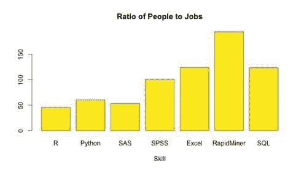
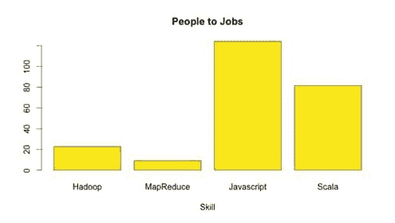
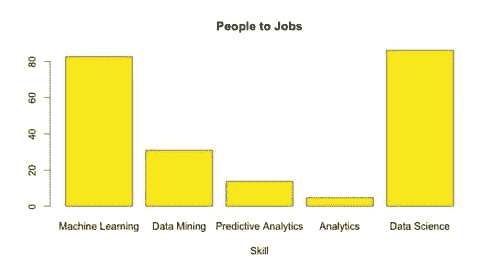
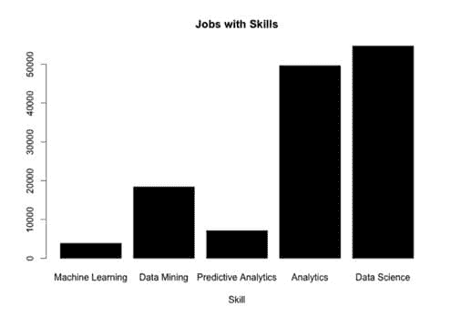
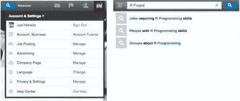

# R 和 Hadoop 使机器学习对每个人都成为可能

> 原文：[`www.kdnuggets.com/2014/11/r-hadoop-make-machine-learning-possible-everyone.html`](https://www.kdnuggets.com/2014/11/r-hadoop-make-machine-learning-possible-everyone.html)

 评论**作者：Joel Horwitz ([H2O.ai](http://h2o.ai/))，2014 年 11 月。**

在统计学中，引导法可以指任何依赖于有放回随机抽样的测试或指标。简单来说，它提供了一种测量采样分布准确性的方法，这种方法通常用于构建假设测试。在商业领域，bootstrapping 指的是在没有外部帮助或资本的情况下启动业务。一般来说，bootstrapping 这个词指的是一个荒谬且不可能的行动，即“靠自己的靴带把自己拉过栅栏”。R 和 Hadoop 是非常*自给自足*的技术，它们在过去 20 年里几乎在所有行业和使用案例中依靠看似随机的贡献者，未接受任何直接投资。

**R 海盗掠夺全球业务**

R 首次出现于 1993 年，当时 Ross Ihaka 和 Robert Gentleman 在奥克兰大学发布了一个免费的软件包。从那时起，R 在美国的用户数量已超过 300 万人，根据去年发布的下载网站[日志文件](http://cran-logs.rstudio.com/)。

此外，R 超过了 SAS，拥有超过 7,000 个独特的包，你可以在 [Crantastic 网站](http://crantastic.org/packages)上查看。难怪它在许多行业和学术界得到了广泛应用。事实上，2014 年夏季，R 超过了 IBM SPSS，成为学术文章中使用最广泛的分析软件，依据是 [Robert Muenchen](http://r4stats.com/articles/popularity/)。因此，R 现在成为了进行各种统计、经济学甚至机器学习的“黄金标准”。此外，根据我的经验，许多人（如果不是大多数的话）即使在使用其他更昂贵或流行的企业软件时，也会将 R 作为辅助工具来检查他们的工作。难怪 R 正迅速成为 21 世纪数据科学家的首选工具。

推动 R 增长的主要因素是社区通过许多博客和用户组提供对常见问题的解答，使核心软件更有用和相关。此外，根据 LinkedIn 的数据（见下图），显然存在未得到充分服务的职位市场。由于这种需求，R 现在在几乎所有主要大学中作为统计编程的事实标准语言提供，每天都有许多新的在线课程开始。[**Datacamp**](http://www.datacamp.com) 就是一个例子，它建立了一个互动式的网络环境，提供丰富的课程，让非程序员可以轻松入门，无需触及命令行。

 企业也纷纷转向统计学，并接受数据扩展时出现的概率性问题，而传统的商业智能无法跟上。因此，许多人转向 Hadoop，以打开数据平台，解锁多年来一直远离业务分析师的企业数据管理世界。预先过滤、预先汇总的仪表板和 Excel 工作簿时代已经过去，这些仪表板和工作簿被随意地通过电子邮件发送给高管和决策者，几乎没有解释或“讲故事”来指导业务做出明智决策。

**Hadoop 增长**

Apache Hadoop 出现几乎是在 R 于 2005 年首次登场后的 10 年，直到 2013 年，当超过一半的财富 50 强公司开始建立自己的集群时，它才被广泛采用。名字“ Hadoop”来源于著名的 Yahoo! 工程师 Doug Cutting 的一个玩具大象，他与 Mike Cafarella 一起最初开发了该技术以创建更好的搜索引擎。除了能够在相对便宜的硬件上处理大量数据外，它还使得可以在分布式文件系统（HDFS）上存储数据，而无需提前转换。与 R 类似，许多开源项目被创建出来以重新构想数据平台。从将数据导入 HDFS（sqoop、flume、kafka 等），到计算和流处理（Spark、YARN、MapReduce、Storm 等），再到数据查询（Hive、Pig、Stinger / Tez、Drill、Presto 等），到数据存储（Hbase、Cassandra、Redis、Voldermort 等），到调度器（Oozie、Cascading、Scalding 等），最后到机器学习（Mahout、MLlib、H2O 等），以及许多其他应用。

不幸的是，没有简单的方法可以像 R 一样通过一行代码查看所有这些技术并轻松安装。MapReduce 也不是一个普通开发者可以轻松掌握的语言。实际上，你可以通过 LinkedIn 清晰地看到像 R 一样，Hadoop 和 MapReduce 技能工人的短缺与职位数量之间的差距。正因为如此，Hadoop 并未像 R 那样全面普及，最近在纽约市举行的 Strata Hadoop World 会议上也有人谈论它的衰退。

**真正的问题是什么？用一个答案来讲，就是数据**

在过去几年中，数据科学领域的问题已经成为[第一大问题](http://www.nytimes.com/2014/08/18/technology/for-big-data-scientists-hurdle-to-insights-is-janitor-work.html)，尤其是面对数据的广泛种类和体量。我不能不提及不断袭来的数据波浪对我们脆弱分析环境的冲击。事实上，预计到 2020 年，数据量将超过宇宙中的星星数量，[根据 IDC](http://www.emc.com/leadership/digital-universe/index.htm)。幸运的是，有一种全新的方法解决这个问题，直到现在我们一直在习惯性地想要将数据约束在查询工具中。

**机器学习是新的 SQL**

简而言之，“机器学习是一门科学学科，涉及构建和研究能够从数据中学习的算法。” 这是从单纯计数事物的标准方式到探索未知深层领域的量子跃迁的开始。

所以这里是故事的真正有趣部分。根据我的 LinkedIn 分析，机器学习和数据科学实际上非常符合市场对可用人员的整体需求（与 R 和 Hadoop 不同）。

我们需要另一个图表来真正了解数据科学与机器学习之间实际存在的职位数量。我对这个图表的解读是，今天数据科学家的工作相当于分析师或数据分析专业人员，而真正的机会在于不断增长的机器学习领域。

 **机器学习是新兴领域**

数据科学最初被描述为编程或“黑客技能”、数学和统计学以及商业专业知识的交集，参考 Drew Conway 的 [博客](http://drewconway.com/zia/2013/3/26/the-data-science-venn-diagram)。事实证明，编程是一个过于笼统的术语，真正的含义是通过新算法应用数学于大规模数据，这些算法可以穿越这个复杂的网络。要在这片丛林中寻找答案，仅仅在树冠上飞过是无法揭示隐藏在树冠下的宝藏的。从涌现出的机器学习项目数量和市场接受概率信息的成熟度来看，显然这标志着我们在数据资产中寻找价值的竞赛进入了一个新时代。

> “机器并不会使人类远离自然的伟大问题，而是让他更深刻地陷入其中。” - **安托万·德·圣-埃克苏佩里**

**Hadoop 2.0 已经来了，算是来了吧**

很多人曾尝试声称 Hadoop 2.0 是通过 MR2、YARN 或高可用性 HDFS 功能实现的，但考虑到类似名称的 Web 2.0 将我们带入了 Facebook、Twitter、LinkedIn、Amazon 等网络应用的时代，这种说法是不准确的。根据现在 Strata 名声赫赫的 John Battelle 和 Tim O’Reilly 的定义，这种转变被简单地称为“Web 作为平台”，即软件应用程序建立在 Web 上，而非桌面上。Apache Spark 使得在 Hadoop 上开发应用程序变得更容易，[H2O](http://www.h2o.ai) 使得 R 和 Hadoop 终于可以协同工作。对于我来说，在“大数据”行业工作一段时间后，我清楚地看到，软件开发人员和统计学家希望用他们的语言进行编程，而不是 MapReduce。现在是离开桌面，进入集群的激动人心的时刻，因为这里的限制被解除，机会无限。

作为一个开源项目，像 R 和 Apache Hadoop 一样，H2O 不仅要向社区展示持续的价值，还必须经受住最严格的行业用例考验。从 2012 年开始，H2O 首先专注于通过举办超过 120 次聚会来创建社区，将用户基础扩大到 7000 多人。H2O 是 R 用户从笔记本电脑转向大规模环境的桥梁，以训练超出笔记本内存的数据。这是我们处理数据问题的基本转变，并且为众多生产客户提供了可靠的结果，涵盖从零售到保险、健康再到高科技的各个领域。要了解更多关于如何开始的信息，请访问 [`www.h2o.ai`](http://www.h2o.ai) 免费开始使用。

**工作和技能分析说明**

最近，许多人对统计软件的日益流行进行了研究，使用了如 [间接方法](http://r4stats.com/articles/popularity/) 的学术研究引用、职位发布、书籍、网站流量、博客、调查（如 KDnuggets 年度 调查）、GitHub 活动等。然而，这些方法一般都侧重于技术人群。在我看来，LinkedIn 代表了商业世界，正是这些地方才是实际应用的关键。此外，如果你想要面对更广泛的受众，你可以使用 Google Adwords 执行相同的操作。逆向工程广告平台是一种获取市场规模信息的好方法。我在我的 [个人博客](http://joelshorwitz.com) 上写了一篇关于这个主题的完整博客。在接下来的说明中，我将讲解如何使用 LinkedIn 作为样本，并结合 R 来分析我上面的商业市场分析。

**1\. 数据收集**

从 LinkedIn 获取数据有两种方式。一种是使用左侧图片中显示的广告，另一种是使用右侧下方显示的直接搜索功能。

在这种情况下，我选择了手动操作，并使用了搜索功能。对于每个产品类别，我搜索时会显示结果的计数，并将其作为需求的代理。 请见下文：

从这个例子中，我们可以看到“R 编程”有 1720 个结果。我还包括了“R 统计学”和其他相关的“R”术语。

**2\. 数据分析**

作为一个新的 R 用户，我手动创建了每个数据框来保存数据，首先创建了个人和职位的各个向量：

`name<-c(“R”,”Python”,"SAS","SPSS","Excel","RapidMiner","SQL") people <- c(230750,815555,128860,752205,15390756,3306,4648240) jobs <-c(5059,13519,2414,7429,123874,17,37571)`

在我创建了一个简单的数据框后：

`skills <- data.frame(c(name),c(people),c(jobs))`

要获取比例，我简单地使用了 transform 函数：

`skills <- transform(skills, ratio=people/job)`

**3\. 数据可视化**

R 配备了许多可视化包，其中最著名的是 ggplot2。在这种情况下，我使用了内置的条形图，因为它开箱即用更为简便。坦率地说，R 中生成的可视化可能在普通观众看来不够引人注目，但它确实促使你考虑你正在绘制的内容，从而生成更有信息量的可视化效果。

要获取条形图（使用 H2O 颜色）：

`barplot(skills$ratio,names.arg=name,col=“#fbe920”, main=“Ratio of People to Jobs”,xlab=“Skill”)`

就这样！非常简单，我确信还有更优雅的分析方法，但对我来说，这样的分析方式能确保结果是合理的。

要获取完整的脚本，你可以[下载](https://www.dropbox.com/s/yhjfkdvw74mzj5z/Skills%20Analysis.R?dl=0)来尝试或加入我的分析中。

**相关：**

+   数据科学技能与商业问题

+   使用 R 进行人口普查数据的可视化

+   STRATA + Hadoop World 2014 NYC 报告

* * *

## 我们的前三大课程推荐

 1\. [Google 网络安全证书](https://www.kdnuggets.com/google-cybersecurity) - 快速进入网络安全职业。

 2\. [Google 数据分析专业证书](https://www.kdnuggets.com/google-data-analytics) - 提升你的数据分析水平

 3\. [Google IT 支持专业证书](https://www.kdnuggets.com/google-itsupport) - 支持你的组织的 IT

* * *

### 相关主题更多

+   [进入数据科学的 3 种可能途径](https://www.kdnuggets.com/2022/03/3-possible-ways-get-data-science.html)

+   [数据驱动的人工智能：它是真的吗？对每个人都适用吗？我们准备好了吗？](https://www.kdnuggets.com/2022/03/data-centric-ai-real-everyone-ready.html)

+   [利用 ChatGPT 和 AI 赚钱的 3 种方法](https://www.kdnuggets.com/3-ways-to-make-money-with-chatgpt-and-ai)

+   [强化学习：教计算机做出最佳决策](https://www.kdnuggets.com/2023/07/reinforcement-learning-teaching-computers-make-optimal-decisions.html)

+   [这是我用来赚取 $10,000 的 AI 工具和技能……](https://www.kdnuggets.com/2023/07/ai-tools-along-skills-make-10000-monthly-bs.html)

+   [用 Pandas 制作美丽互动可视化的最简单方法](https://www.kdnuggets.com/2021/12/easiest-way-make-beautiful-interactive-visualizations-pandas.html)
