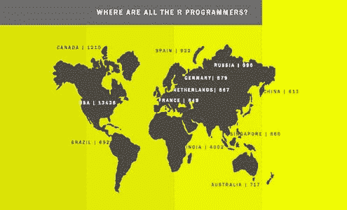

# R 编程：谁、在哪里以及做什么

> 原文：[`www.kdnuggets.com/2015/08/r-programming-who-where-what.html`](https://www.kdnuggets.com/2015/08/r-programming-who-where-what.html)

 comments

**由 Ashwin Ramasamy**（ContractIQ）。

R 编程的流行度逐年上升，在过去几年中位列前 10 名编程语言之一。数据科学作为一个学科正逐渐成为主流，主要受到互联网和软件技术公司迅速增长的推动。媒体、银行和其他传统领域正在逐渐认识到数据的力量，以提高效率和预测下一个重大趋势。尽管如此，还有一个抱怨是没有足够的人懂得软件和统计学。R 程序员数量不足。

除了轶事之外，我想检查数据以确认这些抱怨是否属实。无需多言，我向你呈现‘R 程序员的谁、哪里以及做什么’。在得出结论的过程中没有虐待数据。但我承认，我无法使用 R 来得出这些见解。Excel 做到了。

首先，全球只有大约 50,000 名 R 程序员。现在，谷歌的数据科学家年薪超过一百万的传言似乎是真的。对于那些还在从“我刚刚读到什么？”这种震惊中恢复过来的人来说，Glassdoor 提供了更易于理解的数字。他们说，数据科学家的年薪大约为 $118,000。

奇怪的是，当谈到 R 程序员的分布时，并没有前 3 个国家。只有美国，其次才是其他国家。美国拥有所有 R 程序员的 25% 以上。排名第二的是印度，拥有大约 4000 到 6000 名 R 程序员（美国的数量是其两倍或略多）。加拿大有超过 1000 名 R 程序员。

世界其他地方刚刚开始关注 R。是的，包括西欧在内的地区总共有大约 5000 名 R 程序员。整个亚洲、非洲、中东、南美洲和东欧在某些情况下拥有不到 500 名 R 程序员，大多数情况下仅有低双位数。也门有一名 R 程序员。他或她一定感到非常孤独。

就 R 程序员社区的年龄而言，经验似乎是制胜法宝。这是可以理解的，因为在尝试理解数据之前，需要了解和欣赏一个组织的运作。60% 的 R 程序员拥有超过 6 年的工作经验。事实上，拥有超过 10 年经验的人占 R 程序员的最大比例，为 30%。

那么，如果你是 R 程序员或正在招聘一个，你该怎么做：

1.  现在是成为 R 程序员的好时机，无论你在世界的哪个地方。

1.  你有 3 个选项来组建你的数据科学团队——美国、印度或加拿大。

1.  如果你是一个初创企业正在招聘一批 R 程序员，很快你就得把你的平均年龄广告打到 20 多岁，因为 3 个里就有 1 个超过 30 岁。这既不是好事也不是坏事。你只需意识到你的初创企业正进入一个员工生活阶段多样化的阶段。此外，英国 3 个 R 程序员中就有 1 个是外国人。我相信，美国也不例外。

1.  如果你负责美国企业的分析工作，如果你没有与大学合作建立人才库，你已经在失败了。供应有限，经济因素对你不利。

我查看了 R 程序员通常参与的行业和职能。如果您希望获得这样的见解和/或喜欢明亮的彩色信息图，您可以在 [`contractiq.com/`](https://contractiq.com/) 找到它们。

**简介：** Ashwin Ramasamy 是 [ContractIQ](https://contractiq.com/) 的创始人，该平台和专家团队将您与全球一流的应用开发机构进行匹配。

**相关内容：**

+   如何成为数据科学家 – 简要回答

+   如何成为数据科学家并获得聘用

+   招聘量化分析师，优化你的招聘流程

* * *

## 我们的前三大课程推荐

 1\. [谷歌网络安全证书](https://www.kdnuggets.com/google-cybersecurity) - 快速开启网络安全职业生涯。

 2\. [谷歌数据分析专业证书](https://www.kdnuggets.com/google-data-analytics) - 提升您的数据分析技能

 3\. [谷歌 IT 支持专业证书](https://www.kdnuggets.com/google-itsupport) - 支持您的组织在 IT 领域

* * *

### 更多相关主题

+   [热门编程语言及其用途](https://www.kdnuggets.com/2021/05/top-programming-languages.html)

+   [KDnuggets™ 新闻 22:n04, 1 月 26 日：高薪副业…](https://www.kdnuggets.com/2022/n04.html)

+   [数据科学编程语言及其应用场景](https://www.kdnuggets.com/2022/02/data-science-programming-languages.html)

+   [数据科学与 Go 编程语言](https://www.kdnuggets.com/2024/03/nwu-data-science-go-programming-language)

+   [KDnuggets™ 新闻 22:n06, 2 月 9 日：数据科学编程…](https://www.kdnuggets.com/2022/n06.html)

+   [是什么让 Python 成为初创企业理想的编程语言](https://www.kdnuggets.com/2021/12/makes-python-ideal-programming-language-startups.html)
