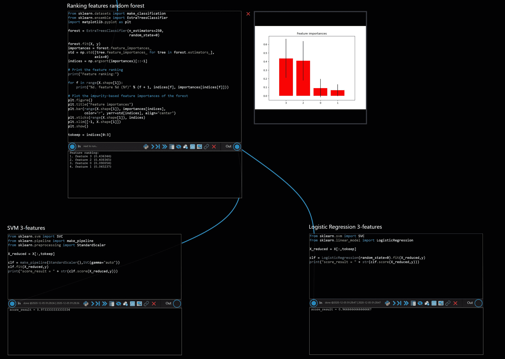
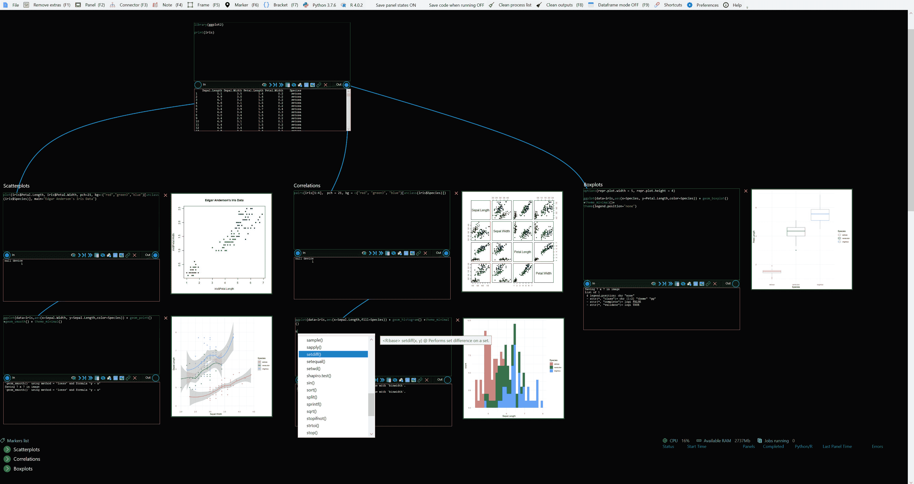

# R 还是 Python？为什么不两个都用呢？

> 原文：[`www.kdnuggets.com/2020/12/r-python-both-prython.html`](https://www.kdnuggets.com/2020/12/r-python-both-prython.html)

评论

忘掉[R 与 Python 的争论](https://www.kdnuggets.com/tag/python-vs-r)吧。

在实际应用场景中，使用两者的情况是否有必要？

* * *

## 我们的前三个课程推荐

 1\. [Google 网络安全证书](https://www.kdnuggets.com/google-cybersecurity) - 快速进入网络安全职业领域。

 2\. [Google 数据分析专业证书](https://www.kdnuggets.com/google-data-analytics) - 提升你的数据分析技能

 3\. [Google IT 支持专业证书](https://www.kdnuggets.com/google-itsupport) - 支持您组织的 IT 部门

* * *

如果一个数据科学或分析团队由多个在两种语言方面都具备专业知识的成员组成呢？如果系统的设计利用了源自两种基础语言的库和包呢？如果某个特定的用例要求某个实现部分偏离了产品的其余部分所用的语言呢？

那么，如果你想使用一个 IDE 实现和管理这些不同的代码呢？

或者，如果你在不同的项目中使用 R 和 Python，并且只是想要一个单一的工作空间来编写所有代码呢？

进入**[prython](http://www.prython.com/)**，一个为 R 和 Python 编码设计的 IDE，甚至可以在同一个项目中使用。

> prython 是一个新颖的 IDE，它通过在画布中连接面板来支持 R 或 Python 编程（甚至可以在同一项目中同时使用）。它允许你组织代码，进行一键运行的实验，并在创建它们的面板旁边可视化你的图表+数据框。厌倦了记住哪些行需要注释掉以测试某些内容？还是仅仅想更好地组织代码？目前适用于 Windows，并与本地 R/Python 内核一起运行。

该项目的优点都与集成 Python 和 R 编程环境的简便性有关，包括用于输入和输出流管理的无代码功能、数据可视化、在项目流程的各个位置启动上下文控制台、混合数据框检查等。

主要缺点是 prython 目前仅支持 Windows 系统。

如果你是 Windows 用户，可以在[这里](http://www.prython.com/download.html)下载 prython。

prython 基于面板的概念，这些面板可以在画布上相互连接，每个面板运行 Python 或 R 代码。面板具有输入和输出连接，这些相互连接可以根据需要配置和重新配置。面板可以独立运行，也可以与前后的面板一起运行。为什么要使用面板呢？

> 数据专业人员需要对他们的数据进行实验，构建大量的图表，并将代码分成不同的区域。他们很少想要一个从头到尾的线性脚本。这几乎不可避免地会导致非常混乱的脚本，不清晰的输出，混乱的图表，以及用户需要记住测试时需要注释掉什么。没有其他 IDE 适合这种需求。

根据其网站，使用 prython 的一些典型原因：

> +   跟踪和描述实验及测试。与其记住在脚本中需要注释掉什么以测试 X 更改，你可以轻松地通过 prython 完成这一点
> +   
> +   在一个画布上同时显示你的结果和图表
> +   
> +   运行复杂的测试，能够通过一次点击在不同的模型上运行（例如：你想同时测试多个 scikit-learn 模型）
> +   
> +   在画布上将你的代码分成不同区域。例如，一个区域用于输入加载，另一个区域用于模型训练，不同的区域用于图表/分析
> +   
> +   在同一个项目中混合 Python 和 R 代码。
> +   
> +   可视化数据框在脚本中如何变化和演变。prython 计算所有对数据框的更改（无论是在 R 还是 Python 中）跨面板显示，每当数据框被修改时，它都会作为表格显示在每个面板旁边

这个视频中有对 prython 的简要高级介绍：

项目的网站包含额外的视频[教程](http://www.prython.com/tutorials.html)以及充分的[文档](http://www.prython.com/documentation.html)，帮助你快速上手并开始高效工作。

关于哪种语言是统治一切的唯一语言的争论已经结束，但这并不意味着其中一种是“赢家”。Python 和 R 是实现你的数据科学或数据分析目标的两个工具，而根据你所使用的工具来设定目标是适得其反的。因此，使用其中任何一种——或两者——并查看 prython 是否能通过其数据科学中心的 IDE 独特方法使你更高效。毕竟，工具的*目的*就是让你更高效。

**相关**：

+   R 中的简单直观集成学习

+   在 Python 中合并 Pandas 数据框

+   为数据科学家简单解释面向对象编程

### 更多相关内容

+   [每个数据科学家都应该了解的三个 R 库（即使你使用 Python）](https://www.kdnuggets.com/2021/12/three-r-libraries-every-data-scientist-know-even-python.html)

+   [是什么让 Python 成为初创企业理想的编程语言](https://www.kdnuggets.com/2021/12/makes-python-ideal-programming-language-startups.html)

+   [停止学习数据科学去寻找目标，并去寻找目标…](https://www.kdnuggets.com/2021/12/stop-learning-data-science-find-purpose.html)

+   [一个 90 亿美元的 AI 失败，深入剖析](https://www.kdnuggets.com/2021/12/9b-ai-failure-examined.html)

+   [学习数据科学统计的顶级资源](https://www.kdnuggets.com/2021/12/springboard-top-resources-learn-data-science-statistics.html)

+   [成功的数据科学家的五个特征](https://www.kdnuggets.com/2021/12/5-characteristics-successful-data-scientist.html)
