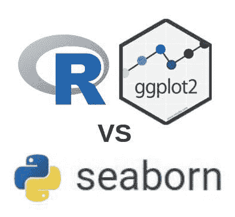
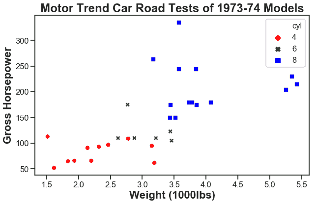
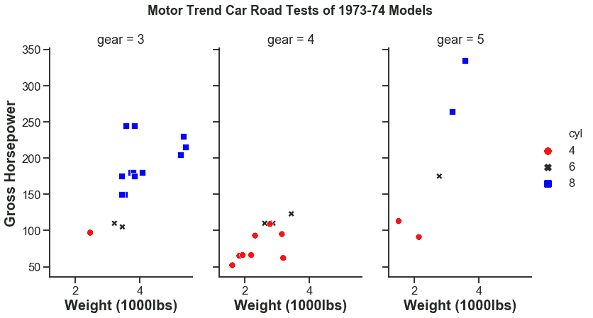
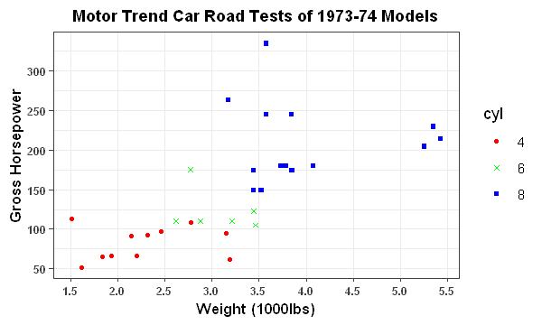
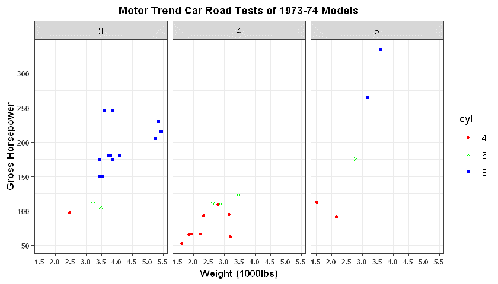

# R 与 Python 数据可视化

> 原文：[`www.kdnuggets.com/2019/03/r-vs-python-data-visualization.html`](https://www.kdnuggets.com/2019/03/r-vs-python-data-visualization.html)

 评论ggplot2 vs seaborn

R 和 Python 使我们能够生成复杂且吸引人的统计图形，以便获得见解和探索数据。两者都能处理数百万的数据点（可能取决于平台，甚至数十亿）。

* * *

## 我们的前三推荐课程

 1\. [Google 网络安全证书](https://www.kdnuggets.com/google-cybersecurity) - 快速进入网络安全职业道路。

 2\. [Google 数据分析专业证书](https://www.kdnuggets.com/google-data-analytics) - 提升你的数据分析技能

 3\. [Google IT 支持专业证书](https://www.kdnuggets.com/google-itsupport) - 支持你的组织 IT

* * *

### 使用 Python 可视化数据

Seaborn 建立在 Matplotlib 之上，语法和结构相对简单。

首先，我们使用 `import seaborn as sns; sns.set()` 加载并设置 seaborn 主题默认值到 Python 会话中。由于两个库是一起使用的，Matplotlib 也必须加载。

```py

    import seaborn as sns; sns.set()
    import matplotlib.pyplot as plt

```

1.  `sns.set_style()` 设置图表的背景主题。"ticks" 是最接近 R 中制作的图表的样式。

1.  `sns.set_context()` 将应用预定义的格式以适应可视化的用途或背景。`font_scale=1` 用于设置图表中所有文本的字体大小比例。

1.  `plt.figure()` 是一个命令，用于控制 matpltlib 图形的不同方面（如前所述，seaborn 图形实际上是 Matplotlib 图形）。

1.  `sns.scatterplot()` 是用于传递参数以创建 seaborn 风格散点图的命令。

+   `x="wt"` 将重量映射到 x 轴。

+   `y="hp"` 将马力映射到 y 轴。

+   `hue="cyl"` 将填充和着色散点。

+   `palette=['red','green','blue']` 手动覆盖 `hue` 设置的颜色调色板，将其改为红色、绿色和蓝色。

+   `data="mtcars"` 允许我们使用数据集中的数据。

+   `style='cyl'` 为每个气缸类别分配形状。

+   `legend='brief'` 将分配 `hue` 和 `size`。

1.  `sizes=(800,1000)`

控制图表上散点的最小和最大大小。

1.  `plt.title()` 为图表设置主标题。*如果你是经验丰富的 Matplotlib 用户，或者之前使用过 plt.suptitle()，你会知道同时使用这两个函数时的困惑。* 参数很明显。

1.  `plt.xlabel()` 将格式化 x 轴标签。我使用 `set_..` 访问类来包含美学属性。这有时可能会显得杂乱，但有许多方法可以格式化 seaborn/matplotlib 图形。这在图形创建后非常有用。图形已经用 `sns.scatterplot` 创建，因此我们需要以这种方式覆盖默认格式。

1.  `plt.ylabel()` 的工作方式与 x 轴完全相同，只是针对 y 轴。

```py

    #sns.set_style("darkgrid")
    sns.set_style("ticks")
    sns.set_context("talk")
    #sns.set_context("notebook", font_scale=1)
    plt.figure(figsize=(10,8)) #plt.figure(figsize=(width,height))
    sns.scatterplot(x="wt", y="hp", hue='cyl', palette=['red','green','blue'],
                    data=mtcars, style='cyl', legend='brief', sizes=(800,1000)
                   )
    plt.title('Motor Trend Car Road Tests of 1973-74 Models', fontsize=24, fontweight='bold')
    plt.xlabel("Weigt (1000lbs)").set_fontsize('22')
    plt.xlabel("Weigt (1000lbs)").set_fontweight("bold")
    plt.ylabel("Gross Horsepower").set_fontsize('22')
    plt.ylabel("Gross Horsepower").set_fontweight("bold");

```

Seaborn：mtcars 散点图

正如我们所见，该图形与 ggplot2 创建的图形非常相似。对于对这个图进行分面处理，Seaborn 是 Matplotlib 的一个更简单的替代方案。

在 Seaborn 中进行分面处理需要创建一个新图形。有多种方法可以实现，`sns.relplot()` 就是其中之一。

1.  `sns.set()` 将默认的 Seaborn 主题设置到 Python 环境中，也可以用于覆盖默认参数，如 `rc={'figure.figsize':(20,20)}`。

1.  `sns.relplot()` 具有许多与上述讨论相同的参数，这里我们将讨论针对分面处理的新参数。

+   `col="gear"` 指定了在 mtcars 数据集中用于分面化的列。

+   `col_wrap=3` 指定了图形的排列方式。在这种情况下，图形将被放置在 3 列中。由于没有指定行数，所以它将位于一行中，但如果需要，可以指定行数。

+   `aspect=0.6` 是控制图形大小的参数。我建议阅读相关文档，因为这个部分的解释可能会变得复杂。

1.  `g.fig.suptitle()` 为图形创建标题。

+   `position=(0.5,1.05)` 是一个有趣的参数，因为它控制标题的位置。即使是小的变化也能显著改变标题的位置。

1.  `g.set_xlabels` 和 `g.set_ylabels` 将按之前讨论的方式工作。

```py

  sns.set(rc={'figure.figsize':(20,20)})
  sns.set_style("ticks")
  sns.set_context("talk")

  g = sns.relplot(x="wt", y="hp", hue='cyl', palette=['red','green','blue'],
                  data=mtcars, col='gear', col_wrap=3,
                  height=6, aspect=0.6, style='cyl', sizes=(800,1000))

  g.fig.suptitle('Motor Trend Car Road Tests of 1973-74 Models' ,position=(0.5,1.05), fontweight='bold', size=18)
  g.set_xlabels("Weigt (1000lbs)",fontweight='bold', size=20)
  g.set_ylabels("Gross Horsepower",fontweight='bold', size=20);

```

Seaborn：mtcars 分面散点图

### 在 R 中可视化数据

使用 ggplot2，我们可以通过向图形添加美学层来创建简单且可自定义的图形。对新用户来说，一个很棒的功能是，除了加载数据和指定几何形状外，美学层（大部分情况下）可以按照任何顺序添加。这是因为 ggplot2 建立在图形语法的原则之上。这些原则使我们能够创建引人注目且信息丰富的可视化。

以下 R 代码将加载 ggplot2 包（可能是 R 中最突出的可视化包），并为我们生成一个散点图。

1.  `ggplot(mtcars, aes(x=wt, y=hp))` 将加载 mtcars 数据集以供 ggplot2 使用，`aes(x=wt, y=hp)` 将为我们的图形映射美学，其中 *x* 美学表示 x 轴的重量，*y* 美学表示 y 轴的马力。

1.  `geom_point(size=1,aes(color=cyl, shape=cyl, fill=cyl))` 将生成具有之前定义的美学属性和新的美学属性的散点图。`color=cyl` 将根据气缸数为散点的轮廓赋予独特的颜色。`shape=cyl` 将为散点赋予独特的形状，并与 `color` 一起工作。`fill=cyl` 将填充散点的颜色，而不仅仅是轮廓。最好将 `color` 和 `fill` 一起使用（如果你仔细查看，会发现有一个细微的美学差异）。

1.  `theme_bw()` 提供了 ggplot2 中的一个预制主题，我们可以用来开始。然后可以使用正确的命令轻松调整。ggplot2 的语法简单易学，这使得调整变得容易。

1.  `theme()` 是允许你更改在第 3 点中设置的任何主题的默认设置的命令（你也可以用它来更改图表的其他美学属性）。

    +   `axis.text=element_text(face='bold', size=7` 格式化了 y 轴和 x 轴的文本（轴上的数字）。`face='bold'` 将加粗文本，而 `size="7"` 将其大小增加到指定的值。

    +   `axis.title=element_text(face='bold', size=10)` 与上述命令类似，但仅适用于轴标题。

    +   `axis.ticks=element_line(size=0.5)` 将使图表上的刻度线更加明显。

    +   `panel.background=element_rect(colour = NA)` 是我决定添加的一个美学措施，它去掉了包围图表的矩形边框。

    +   `plot.title=element_text(face='bold', size=11,hjust = 0.5))` 仅仅是加粗并更改主标题的大小。`***hjust=0.5***` 将 ***使标题居中对齐***。

    +   `scale_color_manual(breaks = c("4", "6", "8"), values=c("red", "green", "blue"))` 将覆盖默认的颜色方案，并将红色添加到 '4'，绿色添加到 '6'，蓝色添加到 '8'。这会手动覆盖散点的轮廓颜色。

    +   `scale_fill_manual(breaks = c("4", "6", "8"), values=c("red", "green", "blue"))` 将对散点的内部进行与上述相同的操作。

    +   `scale_y_continuous(breaks = seq(0,350,50))` 手动覆盖 y 轴上的数字，使其从零开始，到 350 结束，单位增量为 50。这将显示在主要刻度上。

    +   `scale_x_continuous(breaks = seq(1.5,5.5,0.5), minor_breaks=seq(1.5,5.5,1))` 对 x 轴做了与上述相同的操作，并手动覆盖了次要刻度，但这不会那么明显。

    +   `scale_shape_manual(values=c(21,4,22))` 将定义每个气缸类别的形状类型。

1.  `options(repr.plot.width=4, repr.plot.height=3)` 是一个方便的命令，当你想要调整图形的宽度和高度时特别有用。它在 Jupyter 中尤其实用。

```py

  library(ggplot2)
  options(repr.plot.width=4, repr.plot.height=3)
     p <- ggplot(mtcars, aes(x=wt, y=hp)) +
          geom_point(size=1,aes(color=cyl, shape=cyl, fill=cyl)) +
          labs(title='Motor Trend Car Road Tests of 1973-74 Models') +
          xlab("Weigt (1000lbs)") +
          ylab("Gross Horsepower") +
          theme_bw() +
          theme(axis.text=element_text(face='bold',
          size=7),
          axis.title=element_text(face='bold',
          size=10),
          axis.ticks=element_line(size=0.5),
          panel.background=element_rect(colour = NA),
          plot.title=element_text(face='bold', size=11,hjust = 0.5)) +
          scale_color_manual(breaks = c("4", "6", "8"), values=c("red", "green", "blue"))+
          scale_fill_manual(breaks = c("4", "6", "8"), values=c("red", "green", "blue"))+
          scale_y_continuous(breaks = seq(0,350,50)) +
          scale_x_continuous(breaks = seq(1.5,5.5,0.5), minor_breaks=seq(1.5,5.5,1)) +
          scale_shape_manual(values=c(21,4,22))
          p

```



ggplot: mtcars 散点图

ggplot2 的另一个优点是其 **能够在一行代码中对数据进行分面，创建多个图表**。

1.  `facet_grid(~gear)`将按齿轮数量细分数据，并创建多个具有相同主题美学的相同图形。

```py

  options(repr.plot.width=7, repr.plot.height=4)
  p + facet_grid(~gear)

```



ggplot: mtcars 分面散点图

### 结论

我认为主要的区别之一是，Seaborn 绘图的默认分辨率优于 ggplot2 图形，所需的语法也可能少得多（但这取决于具体情况）。Seaborn 使用编程方法，用户可以访问 Seaborn 和 Matplotlib 中的类来操作图形。ggplot2 使用分层方法，用户可以以任意顺序添加美学和格式来创建图形（尽管所需的代码量更多，我认为这种方法可能更简单）。大多数人不会注意到这一点，而这对某些人可能比其他人更为重要，Python 图形在保存为图像时占用的磁盘空间显著大于 R 生成的图形。在本文中的图形中，Seaborn/Matplotlib 图形占用的磁盘空间约为 ggplot2 图形的 6 倍。

尽管有些细微的差别，但使用 Seaborn 和 ggplot2 重新创建相同的图形是非常可能的。虽然工具不同，但仍然可以用它们创建相同的对象。

**相关：**

+   Python 图形画廊

+   五大最佳数据可视化库

+   数据可视化备忘单

 评论

### 更多相关话题

+   [成为优秀数据科学家所需的 5 项关键技能](https://www.kdnuggets.com/2021/12/5-key-skills-needed-become-great-data-scientist.html)

+   [每个初学者数据科学家都应该掌握的 6 种预测模型](https://www.kdnuggets.com/2021/12/6-predictive-models-every-beginner-data-scientist-master.html)

+   [2021 年最佳 ETL 工具](https://www.kdnuggets.com/2021/12/mozart-best-etl-tools-2021.html)

+   [每个数据科学家都应该了解的三个 R 库（即使你使用 Python）](https://www.kdnuggets.com/2021/12/three-r-libraries-every-data-scientist-know-even-python.html)

+   [使用管道编写干净的 Python 代码](https://www.kdnuggets.com/2021/12/write-clean-python-code-pipes.html)

+   [是什么让 Python 成为初创公司的理想编程语言](https://www.kdnuggets.com/2021/12/makes-python-ideal-programming-language-startups.html)
