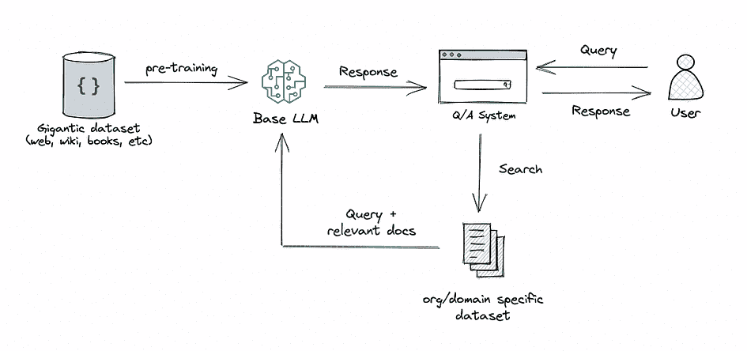
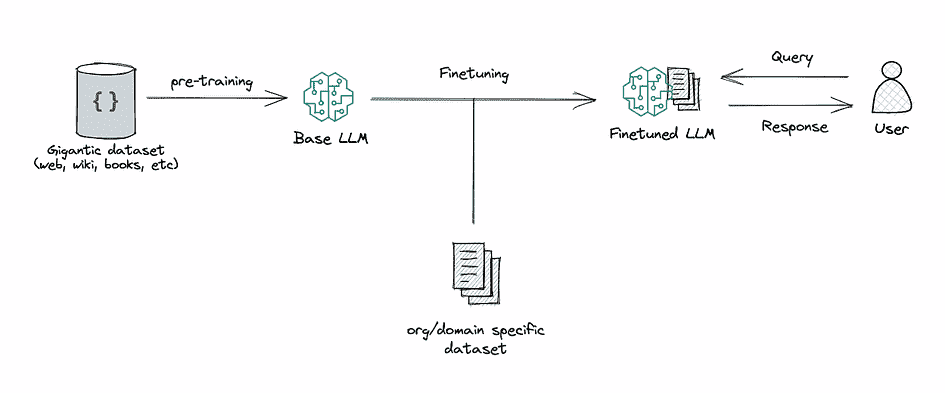
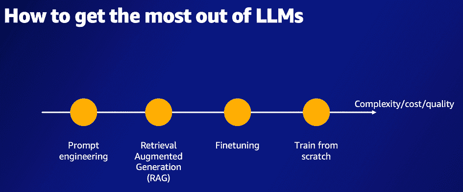
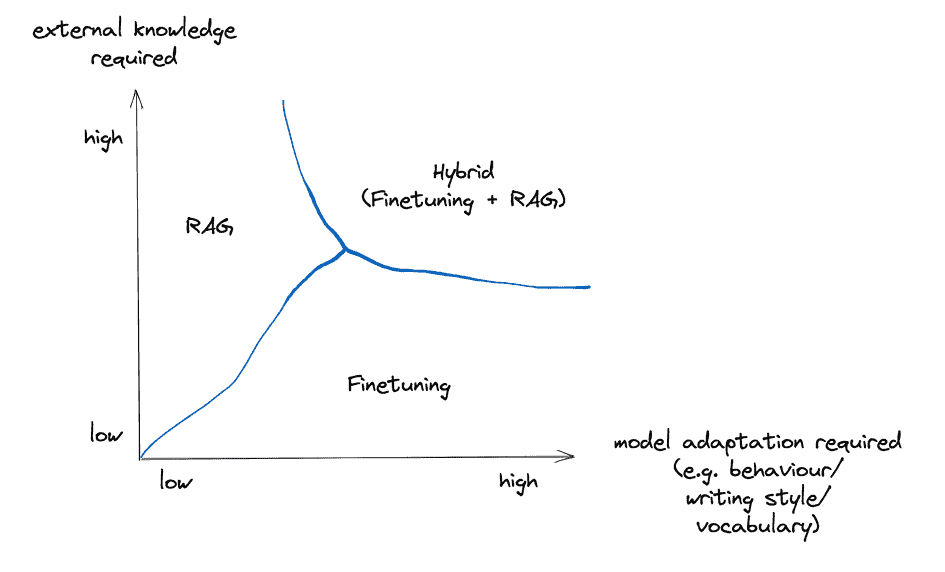
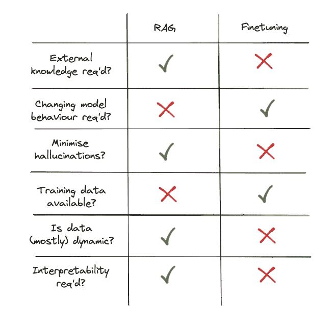
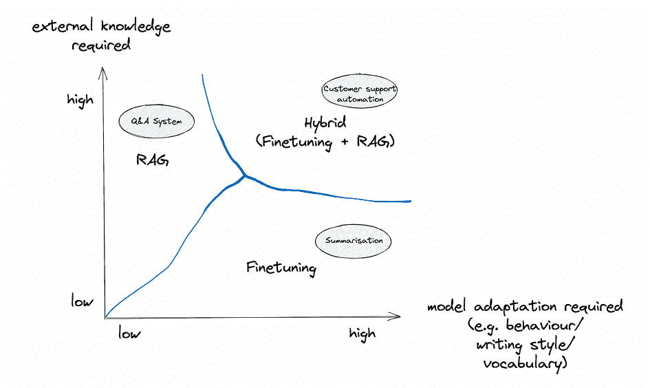

# RAG 与微调：哪个是提升您的 LLM 应用的最佳工具？

> 原文：[`www.kdnuggets.com/rag-vs-finetuning-which-is-the-best-tool-to-boost-your-llm-application`](https://www.kdnuggets.com/rag-vs-finetuning-which-is-the-best-tool-to-boost-your-llm-application)

图片由作者提供

# 前言

* * *

## 我们的前三大课程推荐

 1\. [谷歌网络安全证书](https://www.kdnuggets.com/google-cybersecurity) - 快速进入网络安全职业的快车道

 2\. [谷歌数据分析专业证书](https://www.kdnuggets.com/google-data-analytics) - 提升您的数据分析技能

 3\. [谷歌 IT 支持专业证书](https://www.kdnuggets.com/google-itsupport) - 支持您组织中的 IT

* * *

随着对大型语言模型（LLMs）的兴趣激增，许多开发者和组织忙于构建利用其强大功能的应用程序。然而，当现成的预训练 LLM 的表现未达到预期时，如何提升 LLM 应用的性能成为一个问题。最终我们会问自己：我们应该使用[检索增强生成](https://arxiv.org/abs/2005.11401)（RAG）还是模型微调来改善结果？

在深入探讨之前，让我们解开这两种方法的神秘面纱：

**RAG**：这种方法将检索（或搜索）的力量整合到 LLM 文本生成中。它结合了一个检索系统，从大型语料库中提取相关文档片段，以及一个 LLM，利用这些片段中的信息生成回答。实质上，RAG 帮助模型“查找”外部信息以改善其回应。

图片由作者提供

**微调**：这是在较小的特定数据集上进一步训练预训练 LLM 的过程，以使其适应特定任务或提升其性能。通过微调，我们根据我们的数据调整模型的权重，使其更加符合我们应用的独特需求。

图片由作者提供

RAG 和微调都作为增强基于 LLM 的应用性能的强大工具，但它们关注优化过程中的不同方面，这在选择使用哪一种工具时至关重要。

以前，我通常会建议组织在深入微调之前先尝试 RAG。这是基于我认为这两种方法实现了类似的结果，但在复杂性、成本和质量上有所不同。我甚至用这样的图示来说明这一点：

图片由作者提供

在这个图中，复杂性、成本和质量等各种因素沿着一个维度表示。要点是？RAG 更简单且成本更低，但其质量可能无法匹配。我的建议通常是：从 RAG 开始，评估其性能，如果表现不佳，再转向微调。

然而，我的观点已经发生了变化。我认为将 RAG 和微调视为实现相同结果的两种技术，只不过一种比另一种更便宜、更简单，是一种过于简化的看法。它们在本质上是不同的——它们实际上是*正交*的，而不是*共线*的——并且服务于 LLM 应用的不同需求。

> 为了更清楚地说明这一点，可以考虑一个简单的现实世界类比：当被问到“我应该用刀子还是勺子来吃饭？”时，最合逻辑的反问是：“你在吃什么？”我问过朋友和家人这个问题，每个人都本能地用那个反问来回答，表明他们并不认为刀子和勺子是可以互换的，或者其中一个是另一个的劣等变体。

# 这到底是关于什么的？

在这篇博客文章中，我们将深入探讨在各个维度上区分 RAG 和微调的细微差别，这些维度在我看来对确定特定任务的最佳技术至关重要。此外，我们还会查看一些最受欢迎的 LLM 应用案例，并利用第一部分中建立的维度来识别哪种技术可能最适合哪个用例。在博客的最后部分，我们将识别在构建 LLM 应用时应考虑的额外方面。每一个方面可能都值得单独写一篇博客，因此在这篇文章中我们只能简要提及它们。

# 为什么你需要关心这些？

选择正确的技术来调整大型语言模型对 NLP 应用的成功有重大影响。选择错误的方法可能会导致：

+   在特定任务上的模型性能差，导致输出不准确。

+   如果技术未针对您的用例进行优化，模型训练和推理的计算成本会增加。

+   如果之后需要转向不同的技术，会增加额外的开发和迭代时间。

+   部署应用程序和将其展示给用户的延迟。

+   如果选择了过于复杂的适应方法，可能缺乏模型可解释性。

+   由于大小或计算限制，部署模型到生产环境中的困难。

RAG 和微调之间的细微差别涵盖了模型架构、数据需求、计算复杂性等方面。**忽视这些细节可能会影响项目的时间线和预算。**

本博客文章旨在通过清晰地阐述每种技术何时具有优势来防止浪费精力。通过这些见解，你可以从第一天开始就用正确的适配方法取得进展。详细的比较将使你能够做出最佳技术选择，实现业务和 AI 目标。**本指南将帮助你选择合适的工具，为你的项目成功奠定基础。**

那么，让我们深入探讨吧！

# 提升性能的关键考虑因素

在选择 RAG 还是微调之前，我们应该根据一些维度评估 LLM 项目的要求，并问自己几个问题。

## 我们的用例是否需要访问外部数据源？

在选择微调 LLM 还是使用 RAG 时，一个关键考虑因素是应用是否需要访问外部数据源。如果答案是肯定的，RAG 可能是更好的选择。

RAG 系统本质上设计用于通过在生成响应前从知识源中检索相关信息来增强 LLM 的能力。这使得这种技术非常适合需要查询数据库、文档或其他结构化/非结构化数据存储的应用。检索器和生成器组件可以被优化以利用这些外部资源。

相比之下，虽然可以通过微调 LLM 来学习一些外部知识，但这样做需要大量来自目标领域的标注数据集。这个数据集必须随着基础数据的变化而更新，这使得它在频繁变化的数据源中不切实际。微调过程也没有明确建模在查询外部知识时涉及的检索和推理步骤。

总结来说，如果我们的应用需要利用外部数据源，那么使用 RAG 系统通常比仅通过微调“嵌入”所需知识更有效且可扩展。

## 我们是否需要修改模型的行为、写作风格或领域特定知识？

另一个非常重要的方面是我们需要模型调整其行为、写作风格或为领域特定应用定制响应的程度。

微调在于能够将 LLM 的行为适应特定的细微差别、语调或术语。如果我们希望模型听起来更像医疗专业人士，采用诗意风格，或使用特定行业的术语，微调领域特定数据可以实现这些定制。影响模型行为的能力对于需要与特定风格或领域专业知识一致的应用至关重要。

RAG 虽然在融入外部知识方面非常强大，但主要关注于信息检索，并不会根据检索到的信息固有地调整其语言风格或领域特异性。它会从外部数据源中提取相关内容，但可能不会表现出微调模型所能提供的量身定制的细微差别或领域专业知识。

所以，如果我们的应用程序需要专业的写作风格或与特定领域的术语和惯例深度对齐，微调提供了更直接的途径来实现这种对齐。它提供了必要的深度和定制，以真正与特定受众或专业领域产生共鸣，确保生成的内容感觉真实且信息丰富。

## 快速回顾

在决定使用哪种方法来提升 LLM 应用性能时，这两个方面是迄今为止最重要的方面。有趣的是，在我看来，它们是正交的，可以独立使用（也可以结合使用）。

作者提供的图片

然而，在深入使用案例之前，我们应该考虑一些关键方面：

## 抑制幻觉的重要性有多大？

LLM 的一个缺点是它们容易产生幻觉——编造没有现实依据的事实或细节。这在准确性和真实性至关重要的应用中可能会非常成问题。

微调可以通过将模型固定在特定领域的训练数据中来帮助减少幻觉。然而，当面临不熟悉的输入时，模型仍可能会编造回应。需要在新数据上重新训练，以持续最小化虚假的编造。

相比之下，RAG 系统天生更不容易产生幻觉，因为它们将每个响应基于检索到的证据。检索器在生成器构造答案之前会从外部知识源中识别相关事实。这个检索步骤充当了事实检查机制，减少了模型的编造能力。生成器被限制在检索到的上下文支持的回应中合成答案。

因此，在抑制虚假和虚构内容至关重要的应用中，RAG 系统提供了内置的机制来最小化幻觉。响应生成之前的证据检索使 RAG 在确保事实准确和真实输出方面具有优势。

## 有多少标注的训练数据可用？

在 RAG 和微调之间做出决定时，一个关键因素是我们手头拥有的领域或任务特定的标注训练数据的量。

对 LLM 进行微调以适应特定任务或领域，严重依赖于可用标记数据的质量和数量。丰富的数据集可以帮助模型深入理解特定领域的细微差别、复杂性和独特模式，从而生成更准确和上下文相关的响应。然而，如果我们处理的是有限的数据集，微调带来的改进可能会很有限。在某些情况下，稀缺的数据集甚至可能导致过拟合，即模型在训练数据上表现良好，但在未见或现实世界输入中表现不佳。

相反，RAG 系统独立于训练数据，因为它们利用外部知识源来检索相关信息。即使我们没有一个广泛的标记数据集，RAG 系统仍能通过访问和整合其外部数据源的见解而表现出色。检索和生成的结合确保了系统在特定领域训练数据稀缺时仍保持知情。

从本质上讲，如果我们拥有捕捉领域复杂性的丰富标记数据，微调可以提供更量身定制和精细化的模型行为。但在这种数据有限的情况下，RAG 系统提供了一个稳健的替代方案，通过其检索能力确保应用保持数据驱动和上下文敏感。

## 数据的静态/动态特性如何？

选择 RAG 和微调之间的另一个基本方面是数据的动态特性。数据更新的频率如何？模型保持最新状态有多重要？

对特定数据集进行 LLM 微调意味着模型的知识在训练时成为该数据的静态快照。如果数据经常更新、变化或扩展，这可能很快使模型过时。为了在这种动态环境中保持 LLM 的最新状态，我们必须频繁地对其进行再训练，这一过程既耗时又资源密集。此外，每次迭代都需要仔细监控，以确保更新后的模型在不同场景下仍表现良好，并且没有产生新的偏见或理解上的缺口。

相比之下，RAG 系统在动态数据环境中固有的优势。它们的检索机制不断查询外部来源，确保用于生成响应的信息是最新的。随着外部知识库或数据库的更新，RAG 系统无缝地整合这些变化，保持其相关性，而无需频繁的模型再训练。

总结来说，如果我们面对的是快速变化的数据环境，RAG 提供了传统微调难以匹敌的灵活性。通过始终保持与最新数据的连接，RAG 确保生成的响应与当前信息状态保持一致，使其成为动态数据场景的理想选择。

## 我们的 LLM 应用需要多大的透明度/可解释性？

最后一个需要考虑的方面是我们需要多少关于模型决策过程的洞察。

虽然微调 LLM 非常强大，但它的操作类似于黑箱，使得其响应背后的推理变得更加不透明。随着模型从数据集中内化信息，识别每个响应的确切来源或推理变得困难。这可能使开发者或用户难以信任模型的输出，特别是在需要理解回答“为什么”的关键应用中。

另一方面，RAG 系统提供了一种通常在单纯的微调模型中找不到的透明度。由于 RAG 的两步特性——检索和生成——用户可以窥见这一过程。检索组件允许检查哪些外部文档或数据点被选为相关内容。这提供了可以评估的实质证据或参考，以理解响应构建的基础。在需要高度问责或验证生成内容准确性的应用中，追溯模型答案到特定数据源的能力是无价的。

本质上，如果透明度和解释模型响应基础的能力是优先考虑的，RAG 提供了明确的优势。通过将响应生成分解为不同阶段并允许对数据检索的深入了解，RAG 促进了对其输出的更大信任和理解。

## 总结

在考虑这些维度时，选择 RAG 和微调变得更为直观。如果我们需要依赖外部知识并重视透明度，RAG 是我们的首选。另一方面，如果我们处理的是稳定的标注数据并希望将模型更紧密地调整到特定需求，微调是更好的选择。

图片来源：作者

在接下来的部分，我们将看到如何根据这些标准评估流行的 LLM 使用案例。

# 使用案例

我们来看一些流行的使用案例以及上述框架如何帮助选择合适的方法：

## 总结（在专业领域和/或特定风格中）

**1\. 是否需要外部知识？** 对于以往总结风格的任务，主要的数据来源是以往的总结。如果这些总结包含在一个静态数据集中，则无需持续检索外部数据。然而，如果有一个经常更新的动态总结数据库，并且目标是不断将风格与最新条目对齐，那么 RAG 可能会在这里发挥作用。

**2\. 需要模型适应吗？** 这个用例的核心围绕适应专业领域或特定写作风格。微调特别擅长捕捉风格细节、语气变化和特定领域的词汇，使其成为这个维度的*最佳选择*。

**3\. 是否关键要最小化幻觉？** 幻觉在大多数 LLM 应用中都是问题，包括总结。然而，在这个用例中，被总结的文本通常作为背景提供。这使得幻觉相较于其他用例的关注度较低。源文本限制了模型，减少了虚构。因此，虽然事实准确性总是重要的，但在有背景限制的情况下，抑制幻觉的优先级较低。

**4\. 有可用的训练数据吗？** 如果有大量的标记或结构化的先前总结，模型可以从中学习，那么微调会变得非常有吸引力。另一方面，如果数据集有限，并且我们依赖外部数据库来进行风格对齐，RAG 可能会发挥作用，尽管它的主要优势不在于风格适应。

**5\. 数据有多动态？** 如果先前总结的数据库是静态的或更新不频繁，微调模型的知识可能会保持较长时间的相关性。然而，如果总结频繁更新并且需要模型不断对齐最新的风格变化，RAG 可能具有优势，因为其动态数据检索能力。

**6\. 需要透明性/可解释性吗？** 主要目标是风格对齐，因此对特定总结风格的“为什么”可能没有其他用例那样关键。不过，如果需要追溯并了解哪些先前总结影响了特定输出，RAG 提供了更多的透明性。尽管如此，这对这个用例来说可能是一个次要关注点。

> **推荐：** 对于这个用例，***微调*** 似乎是更合适的选择。主要目标是风格对齐，而微调在这一点上表现突出。假设有足够的先前总结可用于训练，微调 LLM 将允许深入适应所需风格，捕捉领域的细微差别和复杂性。然而，如果总结数据库极其动态且追溯影响有价值，可以考虑混合方法或倾向于 RAG。

## 组织知识的问答系统（即外部数据）

**1\. 需要外部知识？** 依赖于组织知识库的问题/回答系统本质上需要访问外部数据，在这种情况下，是组织的内部数据库和文档存储。系统的有效性取决于它从这些来源中提取和检索相关信息以回答查询的能力。因此，RAG 在这个维度上更为适合，因为它设计用来通过从知识源中检索相关数据来增强大模型的能力。

**2\. 是否需要模型适配？** 根据组织及其领域，可能需要模型符合特定的术语、语气或惯例。虽然 RAG 主要关注信息检索，微调可以帮助大模型调整其回答以适应公司的内部术语或其领域的细微差别。因此，根据具体要求，微调可能在这个维度上发挥作用。

**3\. 关键在于最小化虚假信息？** 虚假信息在这个应用场景中是一个主要问题，因为大模型的知识截止日期。如果模型无法基于其训练的数据回答问题，它几乎肯定会回退到（部分或完全）编造一个看似合理但不正确的答案。

**4\. 是否有可用的训练数据？** 如果组织有一个结构化且标记好的之前回答过的问题的数据集，这可以增强微调的方法。然而，并非所有内部数据库都被标记或结构化以用于训练。在数据没有被整齐标记或主要关注准确和相关答案的情况下，RAG 能够从外部数据源中提取数据而不需要大量标记数据集，这使其成为一个有吸引力的选择。

**5\. 数据的动态性如何？** 组织内部的数据库和文档存储可能非常动态，具有频繁的更新、变化或添加。如果这种动态性是组织知识库的特征，RAG 提供了独特的优势。它不断查询外部来源，确保其答案基于最新的数据。微调则需要定期重新训练以跟上这些变化，这可能是不切实际的。

**6\. 需要透明度/可解释性？** 对于内部应用，特别是在金融、医疗或法律等领域，理解答案背后的推理或来源可能至关重要。由于 RAG 提供了检索和生成的两步过程，它本质上提供了对哪些文档或数据点影响了特定答案的更清晰的洞察。这种可追溯性对于需要验证或进一步调查某些答案来源的内部利益相关者非常宝贵。

> **推荐：** 对于这种使用场景，***RAG 系统*** 似乎是更合适的选择。考虑到需要动态访问组织不断变化的内部数据库，以及可能需要在回答过程中的透明度，RAG 提供的功能与这些需求非常契合。然而，如果特别强调模型语言风格的定制或适应特定领域的细微差别，可以考虑引入微调元素。

## 客户支持自动化（即提供即时响应的自动聊天机器人或帮助台解决方案）

**1. 是否需要外部知识？** 客户支持通常需要访问外部数据，特别是在处理产品详情、账户特定信息或故障排除数据库时。虽然许多查询可以通过一般知识解决，但有些可能需要从公司数据库或产品常见问题中提取数据。在这里，RAG 从外部来源检索相关信息的能力将非常有益。然而，值得注意的是，许多客户支持互动也基于预定义的脚本或知识，这些可以通过微调模型有效处理。

**2. 需要模型适应吗？** 客户互动需要特定的语气、礼貌和清晰度，并且可能需要公司特定的术语。微调对于确保大型语言模型（LLM）适应公司的声音、品牌和特定术语尤其有用，从而确保一致且符合品牌的客户体验。

**3. 是否关键于最小化虚假信息？** 对于客户支持聊天机器人，避免虚假信息对保持用户信任至关重要。单靠微调会让模型在面对不熟悉的查询时容易产生虚假信息。相比之下，RAG 系统通过将回应基于检索到的证据来抑制虚假信息。这种对来源事实的依赖使得 RAG 聊天机器人能够最小化有害的虚假信息，并在准确性至关重要的地方提供可靠的信息。

**4. 是否有培训数据？** 如果公司有客户互动的历史记录，这些数据对微调来说非常宝贵。丰富的历史客户查询及其解决方案数据可以用来训练模型，以处理未来类似的互动。如果这样的数据有限，RAG 可以通过从外部来源（如产品文档）检索答案提供备用方案。

**5. 数据动态性如何？** 客户支持可能需要处理有关新产品、更新的政策或变化的服务条款的查询。在产品线、软件版本或公司政策经常更新的情况下，RAG 从最新文档或数据库动态提取信息的能力是有利的。另一方面，对于更静态的知识领域，微调可能就足够了。

**6\. 需要透明度/可解释性吗？** 虽然在某些领域透明度是必需的，但在客户支持中，主要关注点是准确、快速和礼貌的回应。然而，对于内部监控、质量保证或处理客户争议，关于答案来源的可追溯性可能会有帮助。在这种情况下，RAG 的检索机制提供了额外的透明度层。

> **推荐：** 对于客户支持自动化，***混合方法***可能是最优的。微调可以确保聊天机器人与公司的品牌、语调和一般知识一致，处理大多数典型的客户查询。RAG 可以作为补充系统，处理更动态或特定的询问，确保聊天机器人可以从最新的公司文档或数据库中获取信息，从而减少幻觉。通过整合这两种方法，公司可以提供全面、及时且品牌一致的客户支持体验。

图片作者

# 额外需要考虑的方面

如上所述，在决定使用 RAG 还是微调（或两者结合）时，还应考虑其他因素。我们无法深入探讨这些因素，因为它们都是多方面的，并且不像上述某些方面那样有明确的答案（例如，如果没有训练数据，微调根本不可行）。但这并不意味着我们应该忽视它们：

## 可扩展性

随着组织的成长和需求的变化，所讨论的方法的可扩展性如何？由于 RAG 系统具有模块化的特点，它们可能提供更直接的可扩展性，特别是当知识库增长时。另一方面，频繁地调整模型以适应扩展的数据集可能会计算上较为繁重。

## 延迟和实时要求

如果应用程序需要实时或近实时的响应，请考虑每种方法引入的延迟。RAG 系统涉及在生成响应之前检索数据，可能会比基于内化知识生成响应的微调 LLM 引入更多的延迟。

## 维护和支持

考虑长期情况。哪个系统更符合组织提供一致维护和支持的能力？RAG 可能需要维护数据库和检索机制，而微调则需要持续的再训练工作，特别是当数据或需求变化时。

## 鲁棒性和可靠性

每种方法对不同类型输入的鲁棒性如何？虽然 RAG 系统可以从外部知识来源中提取信息，可能处理各种问题，但经过良好微调的模型在某些领域可能提供更一致的表现。

## 伦理和隐私问题

从外部数据库存储和检索数据可能引发隐私问题，特别是当数据敏感时。另一方面，虽然微调的模型不查询实时数据库，但仍可能基于其训练数据生成输出，这也可能具有伦理问题。

## 与现有系统的集成

组织可能已经具备某些基础设施。RAG 或微调与现有系统的兼容性——无论是数据库、云基础设施还是用户界面——都可能影响选择。

## 用户体验

考虑最终用户及其需求。如果他们需要详细的、以参考为基础的回答，RAG 可能更为合适。如果他们重视速度和领域特定的专业知识，微调模型可能更适合。

## 成本

微调可能会变得昂贵，特别是对于非常大的模型。但在过去几个月中，得益于如 [QLoRA](https://github.com/artidoro/qlora) 等参数高效技术，成本已显著降低。设置 RAG 可能需要大量的初始投资——包括集成、数据库访问，甚至许可费用——但还需考虑到对外部知识库的常规维护。

## 复杂性

微调可能会迅速变得复杂。虽然现在许多供应商提供一键微调，我们只需要提供训练数据，但跟踪模型版本并确保新模型在各方面表现良好是具有挑战性的。另一方面，RAG 也可能迅速变得复杂。需要设置多个组件，确保数据库保持新鲜，并确保各个部分——如检索和生成——完美契合。

# 结论

正如我们所探讨的，选择 RAG 和微调之间需要对 LLM 应用的独特需求和优先级进行细致评估。没有一刀切的解决方案；成功在于将优化方法与任务的具体要求对齐。通过评估关键标准——对外部数据的需求、适应模型行为、训练数据的可用性、数据动态、结果透明度等——组织可以对最佳前进路径做出明智的决策。在某些情况下，利用 RAG 和微调的混合方法可能是最佳选择。

关键在于避免假设某种方法是普遍优越的。像任何工具一样，它们的适用性取决于具体的任务。方法和目标的错位会阻碍进展，而正确的方法则会加速进展。当组织评估提升 LLM 应用的选项时，必须抵制过度简化的倾向，不应将 RAG 和微调视为可互换的工具，而是选择能够使模型发挥其能力并与用例需求对齐的工具。这些方法所解锁的可能性令人惊叹，但仅有可能性是不够的——执行才是关键。工具已经在这里——现在让我们开始使用它们。

[原文](https://towardsdatascience.com/rag-vs-finetuning-which-is-the-best-tool-to-boost-your-llm-application-94654b1eaba7)。已获许可转载。

****[Heiko Hotz](https://www.linkedin.com/in/heikohotz/)**** 是 NLP London 的创始人，该公司是一家人工智能咨询公司，帮助组织实施自然语言处理和对话 AI。Heiko 拥有超过 15 年的技术行业经验，是利用 AI 和机器学习解决复杂商业挑战的专家。

### 相关话题

+   [本周提升你搜索应用的 8 种方法](https://www.kdnuggets.com/2022/09/corise-8-ways-improve-search-application-week.html)

+   [哪一个更好：数据科学训练营 vs 学位 vs 在线课程](https://www.kdnuggets.com/2022/09/best-data-science-bootcamp-degree-online-course.html)

+   [一些厉害的提示工程技巧来提升我们的 LLM 模型](https://www.kdnuggets.com/some-kick-ass-prompt-engineering-techniques-to-boost-our-llm-models)

+   [6 个最佳免费在线课程来学习 Python 并提升你的职业生涯](https://www.kdnuggets.com/2022/11/corise-6-best-free-online-courses-python-boost-career.html)

+   [ETL 与 ELT：哪个更适合你的数据管道？](https://www.kdnuggets.com/2023/03/etl-elt-one-right-data-pipeline.html)

+   [Web LLM：将 LLM 聊天机器人带入浏览器](https://www.kdnuggets.com/2023/05/webllm-bring-llm-chatbots-browser.html)
