# 随机森林® — 一种强大的集成学习算法

> 原文：[`www.kdnuggets.com/2020/01/random-forest-powerful-ensemble-learning-algorithm.html`](https://www.kdnuggets.com/2020/01/random-forest-powerful-ensemble-learning-algorithm.html)

评论

### 引言

在文章 [**决策树算法 — 解释**](https://towardsdatascience.com/decision-tree-algorithm-explained-83beb6e78ef4)**中，**我们学习了决策树及其如何通过从先前的数据（训练数据）中推断简单的决策规则来预测目标变量的类别或数值。

* * *

## 我们的前三个课程推荐

 1\. [谷歌网络安全证书](https://www.kdnuggets.com/google-cybersecurity) - 快速进入网络安全职业生涯。

 2\. [谷歌数据分析专业证书](https://www.kdnuggets.com/google-data-analytics) - 提升你的数据分析技能

 3\. [谷歌 IT 支持专业证书](https://www.kdnuggets.com/google-itsupport) - 支持你的组织的 IT 需求

* * *

但是，决策树的一个常见问题是，特别是当表格中有很多列时，它们会过拟合。 有时看起来像是树记住了训练数据集。如果没有对决策树设置限制，它将为训练数据集提供 100%准确性，因为在最坏的情况下，它将为每个观察值创建一个叶子。因此，这会影响对不属于训练集的样本进行预测时的准确性。

随机森林是解决过拟合问题的几种方法之一，现在让我们*深入探讨*这一强大的机器学习算法的工作原理和实现方式。在此之前，我建议你熟悉一下 [**决策树算法**](https://towardsdatascience.com/decision-tree-algorithm-explained-83beb6e78ef4)**。**

随机森林是一种集成学习算法，所以在讨论随机森林之前，让我们首先简单了解一下什么是集成学习算法。

### 集成学习算法

集成学习算法是 [**元算法**](https://cs.stackexchange.com/questions/107003/what-is-a-meta-algorithm) ，它们将多个机器学习算法结合成一个预测模型，以减少方差、偏差或改善预测。

算法可以是任何 [机器学习](https://www.toptal.com/machine-learning/machine-learning-theory-an-introductory-primer) 算法，如逻辑回归、决策树等。这些模型在作为集成方法的输入时，被称为”**基础模型**”。

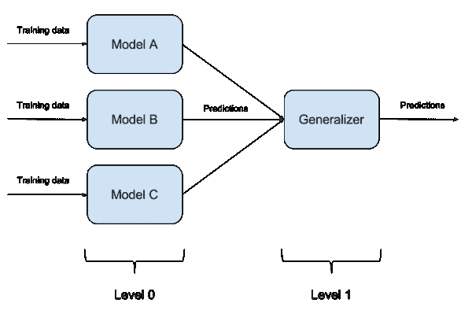

[集成学习](https://www.commonlounge.com/discussion/1697ade39ac142988861daff4da7f27d)

集成方法通常比单一模型产生更准确的解决方案。这在许多机器学习竞赛中已得到验证，获胜解决方案通常使用了集成方法。在著名的 Netflix 竞赛中，[获胜者使用了集成方法](http://blog.echen.me/2011/10/24/winning-the-netflix-prize-a-summary/)来实现一个强大的协同过滤算法。另一个例子是 KDD 2009，获胜者也[使用了集成方法](http://jmlr.org/proceedings/papers/v7/niculescu09/niculescu09.pdf)。

集成算法或方法可以分为两组：

+   **顺序集成方法**——其中基学习器是顺序生成的（例如，AdaBoost）。

    顺序方法的基本动机是**利用基学习器之间的依赖性**。通过对之前标记错误的例子加权，整体性能可以得到提升。

+   **并行集成方法**——其中基学习器是并行生成的（例如，随机森林）。

    并行方法的基本动机是**利用基学习器之间的独立性**，因为通过平均可以显著减少误差。

大多数集成方法使用单一的基学习算法生成同质基学习器，即相同类型的学习器，导致*同质集成*。

也有一些方法使用异质学习器，即不同类型的学习器，导致*异质集成*。为了使集成方法比任何单一成员更准确，基学习器必须尽可能准确且尽可能多样化。

### 随机森林算法是什么？

随机森林是一种监督集成学习算法，既用于分类问题也用于回归问题。但实际上，它主要用于分类问题。正如我们知道的，森林由树木组成，树木越多，森林越强健。类似地，随机森林算法在数据样本上创建决策树，然后从每棵树中获得预测，并通过投票选出最佳解决方案。它是一种比单一决策树更好的集成方法，因为它通过平均结果来减少过拟合。

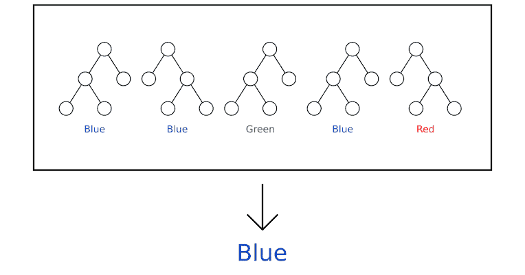

根据多数投票，最终结果是‘蓝色’。

随机森林的基本概念是一个简单但强大的理念——**众智智慧**。

> **“大量相对不相关的模型（树）作为一个委员会运作将优于任何单一的构成模型。”**

模型之间的低相关性是关键。

随机森林能产生出色结果的原因是树木彼此保护，避免各自的错误。虽然某些树可能出错，但许多其他树会正确，因此作为一个整体，树木能够朝正确的方向发展。

**为什么叫“随机”？**

两个关键概念赋予了它“随机”这个名字：

1.  在构建树时对训练数据集进行随机抽样。

1.  在拆分节点时考虑的特征随机子集。

### **随机森林如何确保模型的多样性？**

随机森林通过以下两种方法确保每棵树的行为与模型中任何其他树的行为不太相关：

+   Bagging 或 Bootstrap 聚合

+   随机特征选择

**Bagging 或 Bootstrap 聚合**

决策树对所训练的数据非常敏感，训练数据集的微小变化可能导致树结构的显著不同。随机森林利用这一点，通过允许每棵树**从数据集中随机抽样（带有替换）**，从而生成不同的树。这一过程称为 Bagging。

注意，在 Bagging 中，我们并不是将训练数据子集分成较小的块，并在不同的块上训练每棵树。相反，如果我们有一个大小为**N**的样本，我们仍然给每棵树一个大小为**N**的训练集。但不是原始训练数据，而是带有替换的随机样本。

例如——如果我们的训练数据是[1,2,3,4,5,6]，那么我们可能会给一棵树提供列表[1,2,2,3,6,6]，而给另一棵树提供列表[2,3,4,4,5,6]。注意列表的长度是**6**，一些元素在我们提供给树的随机选择的训练数据中被重复（因为我们带有替换地抽样）。


[Bagging](https://medium.com/machine-learning-through-visuals/machine-learning-through-visuals-part-1-what-is-bagging-ensemble-learning-432059568cc8)

上图显示了如何从数据集中带有替换地抽取随机样本。

**随机特征选择**

在普通决策树中，当需要拆分节点时，我们考虑所有可能的特征，并选择在左节点与右节点之间产生最大分离的特征。相比之下，随机森林中的每棵树只能从特征的随机子集中选择。这迫使模型中的树之间有更多变化，并最终导致树之间的低相关性和更多的多样化。

因此，在随机森林中，我们得到的树是基于不同的数据集训练的，并且使用不同的特征来做决策。

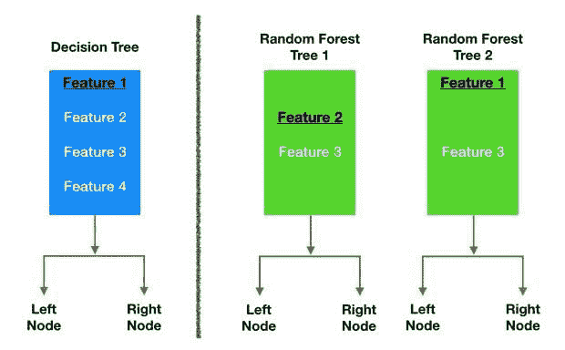

[随机森林中不同树的随机特征选择。](https://towardsdatascience.com/understanding-random-forest-58381e0602d2)

最终，无关的树创造了缓冲区，并从各自的错误中预测彼此。

随机森林创建伪代码：

1.  从总共“**m**”个特征中随机选择“**k**”个特征，其中**k << m**

1.  在“**k**”个特征中，使用最佳划分点计算节点“**d**”

1.  使用**最佳划分**将节点拆分为**子节点**

1.  重复 1**到 3**步，直到达到“l”个节点。

1.  通过重复步骤 1 **至 4** “n” 次来构建森林，从而创建**“n” 棵树**。

### 在 Scikit-learn 中构建随机森林分类器

在本节中，我们将使用随机森林算法从声音数据集中构建一个性别识别分类器。目的是根据声音和言语的声学属性识别声音为男性或女性。数据集包含 3,168 个录制的声音样本，来自男性和女性发言者。声音样本通过 R 中的声学分析进行预处理，使用了 seewave 和 tuneR 包，分析频率范围为 0Hz-280Hz。

数据集可以从 [kaggle](https://www.kaggle.com/primaryobjects/voicegender)下载。

目标是创建一个决策树和随机森林分类器，并比较两个模型的准确性。以下是我们在模型构建过程中将执行的步骤：

**1\. 导入各种模块并加载数据集**

**2\. 探索性数据分析（EDA）**

**3\. 异常值处理**

**4\. 特征工程**

**5\. 数据准备**

**6\. 模型构建**

**7\. 模型优化**

那么，让我们开始吧。

**步骤-1: 导入各种模块并加载数据集**

```py
# Ignore  the warnings
import warnings
warnings.filterwarnings('always')
warnings.filterwarnings('ignore')# data visualisation and manipulationimport numpy as np
import pandas as pd
import matplotlib.pyplot as plt
from matplotlib import style
import seaborn as sns
import missingno as msno#configure
# sets matplotlib to inline and displays graphs below the corressponding cell.
%matplotlib inline  
style.use('fivethirtyeight')
sns.set(style='whitegrid',color_codes=True)#import the necessary modelling algos.
from sklearn.ensemble import RandomForestClassifier
from sklearn.tree import DecisionTreeClassifier

#model selection
from sklearn.model_selection import train_test_split
from sklearn.model_selection import KFold
from sklearn.metrics import accuracy_score,precision_score
from sklearn.model_selection import GridSearchCV#preprocess.
from sklearn.preprocessing import MinMaxScaler,StandardScaler
```

现在加载数据集。

```py
train=pd.read_csv("../RandomForest/voice.csv")df=train.copy()
```

**步骤-2: 探索性数据分析（EDA）**

```py
df.head(10)
```

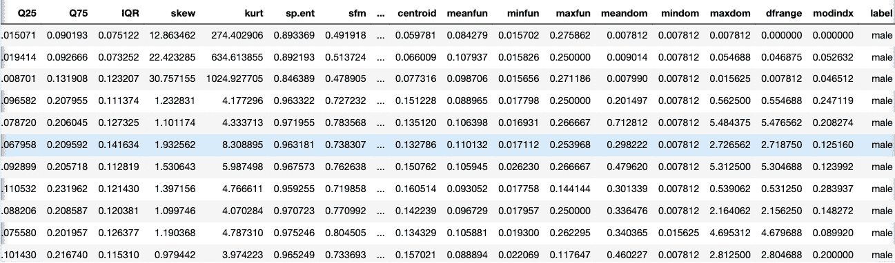

数据集

每个声音的以下声学属性被测量并包含在我们的数据中：

+   **meanfreq**: 平均频率（单位：kHz）

+   **sd**: 频率的标准差

+   **median**: 中位频率（单位：kHz）

+   **Q25**: 第一四分位数（单位：kHz）

+   **Q75**: 第三四分位数（单位：kHz）

+   **IQR**: 四分位数间距（单位：kHz）

+   **skew**: 偏度

+   **kurt**: 峰度

+   **sp.ent**: 频谱熵

+   **sfm**: 频谱平坦度

+   **mode**: 模态频率

+   **centroid**: 频率质心

+   **peakf**: 峰值频率（能量最高的频率）

+   **meanfun**: 在声学信号中测量的基频的平均值

+   **minfun**: 在声学信号中测量的基频的最小值

+   **maxfun**: 在声学信号中测量的基频的最大值

+   **meandom**: 在声学信号中测量的主频率的平均值

+   **mindom**: 在声学信号中测量的主频率的最小值

+   **maxdom**: 在声学信号中测量的主频率的最大值

+   **dfrange**: 在声学信号中测量的主频率范围

+   **modindx**: 调制指数，它是通过将相邻的基频测量的绝对差值累积后除以频率范围来计算的

+   **label**: 男性或女性

```py
df.shape
```

请注意，我们有 3168 个声音样本，每个样本记录了 20 种不同的声学属性。最后，‘label’ 列是目标变量，我们需要预测的就是该人的性别。

现在我们下一步是处理缺失值。

```py
*# check for null values.*
df.isnull().any()
```

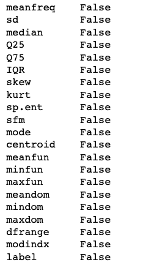

我们的数据集中没有缺失值。

现在我将进行单变量分析。请注意，由于所有特征都是“数值型”的，因此最合理的绘制方式是“直方图”或“箱线图”。

此外，单变量分析对于离群值检测也很有用。因此，除了为每个列或特征绘制箱线图和直方图外，我还编写了一个小工具函数，可以告诉我们如果去除离群值后每个特征剩余的观测数。

为了检测离群值，我使用了标准的 1.5 四分位数范围（IQR）规则，该规则指出，任何低于“第一个四分位数 — 1.5 IQR”或高于“第三个四分位数 + 1.5 IQR”的观测值都是离群值。

```py
def calc_limits(feature):
    q1,q3=df[feature].quantile([0.25,0.75])
    iqr=q3-q1
    rang=1.5*iqr
    return(q1-rang,q3+rang)

def plot(feature):
    fig,axes=plt.subplots(1,2)
    sns.boxplot(data=df,x=feature,ax=axes[0])
    sns.distplot(a=df[feature],ax=axes[1],color='#ff4125')
    fig.set_size_inches(15,5)

    lower,upper = calc_limits(feature)
    l=[df[feature] for i in df[feature] if i>lower and i<upper] 
    print("Number of data points remaining if outliers removed : ",len(l))
```

让我们绘制第一个特征，即 meanfreq。

```py
plot('meanfreq')
```

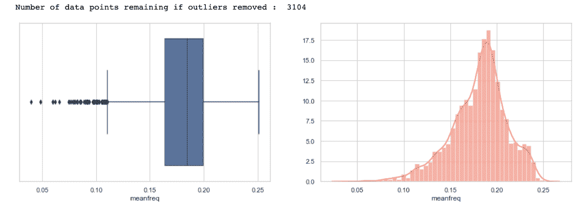

### 从上述图表中得出的结论—

1) 首先，请注意，值与描述方法数据框中观察到的情况一致。

2) 请注意，根据 1.5 四分位数规则，我们有几个离群值（在箱线图中用“点”表示）。去除这些数据点或离群值后，我们剩下大约 3104 个值。

3) 此外，从分布图来看，分布似乎有些负偏，因此我们可以进行归一化，使分布更对称。

4) 最后，请注意，左尾分布在 Q1 以下的侧面有更多的离群值，而右尾在 Q3 以上的侧面则有更多的离群值。

通过绘制其他特征也可以得出类似的结论，我已经绘制了一些，你们可以检查所有的。

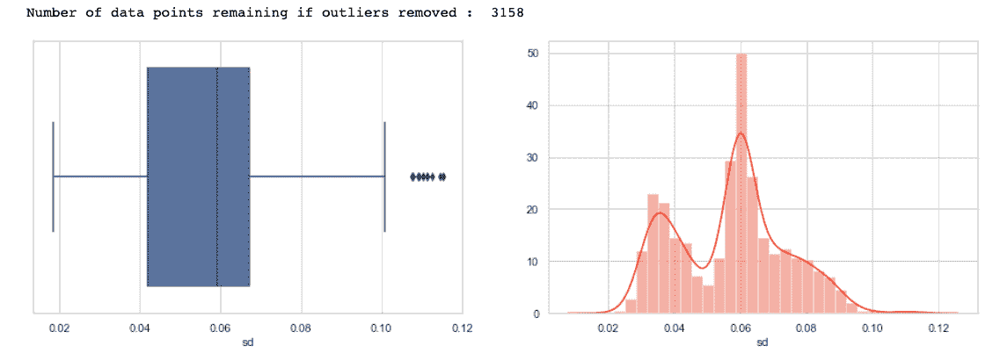

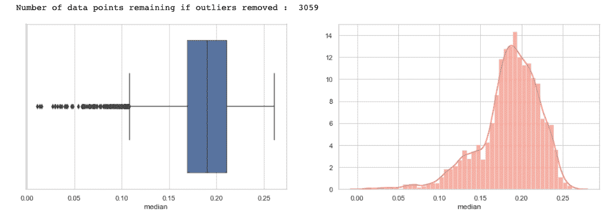

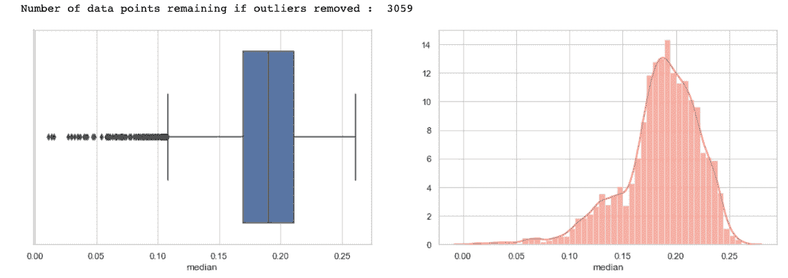

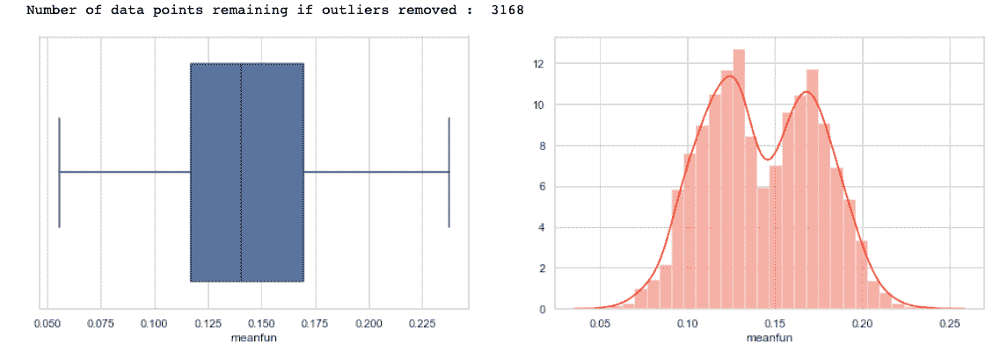

现在绘制和统计目标变量，以检查目标类别是否平衡。

```py
sns.countplot(data=df,x='label')
df['label'].value_counts()
```

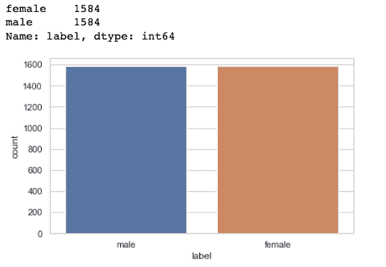

目标变量的绘图

我们的“男性”和“女性”类别的观测数量相等，因此这是一个平衡的数据集，我们不需要对此做任何处理。

现在我将进行双变量分析，以分析不同特征之间的相关性。为此，我绘制了一个“热图”，该图清晰地可视化了不同特征之间的相关性。

```py
temp = []
for i in df.label:
    if i == 'male':
        temp.append(1)
    else:
        temp.append(0)
df['label'] = temp
#corelation matrix.
cor_mat= df[:].corr()
mask = np.array(cor_mat)
mask[np.tril_indices_from(mask)] = False
fig=plt.gcf()
fig.set_size_inches(23,9)
sns.heatmap(data=cor_mat,mask=mask,square=True,annot=True,cbar=True)
```

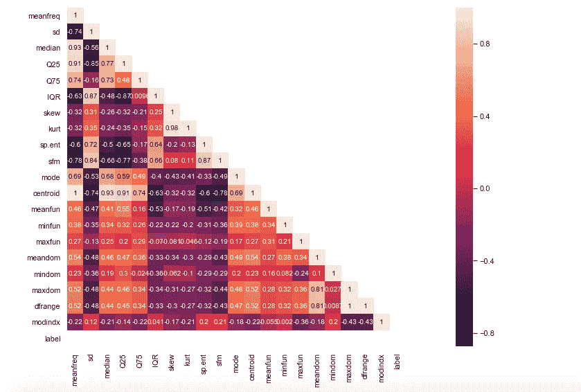

热图

从上述热图中得出的结论—

1) 平均频率与标签的相关性适中。

2) IQR 和标签之间通常有很强的正相关关系。

3) 频谱熵与标签的相关性也相当高，而 sfm 与标签的相关性适中。

4) 偏度和峰度与标签的相关性不大。

5) meanfun 与标签的相关性非常负。

6) Centroid 和 median 具有根据公式预期的高正相关性。

7) 此外，meanfreq 和 centroid 是根据公式完全相同的特征，它们的值也是一致的。因此，它们的相关性是完美的 1。在这种情况下，我们可以删除其中任何一列。

注意，质心通常与大多数其他特征有很高的相关性，因此我将删除质心列。

8) sd 与 sfm 高度正相关，sp.ent 与 sd 也是如此。

9) kurt 和 skew 也高度相关。

10) meanfreq 与中位数以及 Q25 高度相关。

11) IQR 与 sd 高度相关。

12) 最后，自相关，即特征对自身的关系，等于 1，符合预期。

注意，我们可以丢弃一些高度相关的特征，因为它们会给模型带来冗余，但现在我们暂时保留所有特征。对于高度相关的特征，我们可以使用主成分分析（PCA）等降维技术来减少特征空间。

```py
df.drop('centroid',axis=1,inplace=True)
```

**步骤-3: 异常值处理**

这里我们需要处理异常值。注意，我们在**“单变量分析”**部分发现了潜在的异常值。现在，要去除这些异常值，我们可以选择删除相应的数据点或用其他统计量（如中位数）进行填补（对异常值具有鲁棒性）。

目前，我将移除所有对“任何”特征都是异常值的观测值或数据点。这样做会大大减少数据集的大小。

```py
*# removal of any data point which is an outlier for any fetaure.*
for col in df.columns:
    lower,upper=calc_limits(col)
    df = df[(df[col] >lower) & (df[col]<upper)]df.shape
```

注意，新形状为（1636，20），我们剩下 20 个特征。

**步骤-4: 特征工程**

在这里，我丢弃了一些根据我的分析证明不太有用或冗余的列。

```py
temp_df=df.copy()temp_df.drop(['skew','kurt','mindom','maxdom'],axis=1,inplace=True) # only one of maxdom and dfrange.
temp_df.head(10)
```

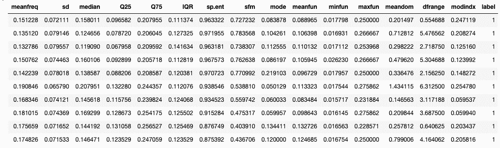

过滤后的数据集

现在让我们创建一些新特征。我在这里做了两件新事物。首先，我使‘meanfreq’，‘median’ 和 ‘mode’ 符合标准关系**3Median = 2Mean + Mode**。为此，我调整了‘median’列中的值，如下所示。你可以修改其他列中的值，比如‘meanfreq’列。

```py
temp_df['meanfreq']=temp_df['meanfreq'].apply(lambda x:x*2)
temp_df['median']=temp_df['meanfreq']+temp_df['mode']
temp_df['median']=temp_df['median'].apply(lambda x:x/3)sns.boxplot(data=temp_df,y='median',x='label') # seeing the new 'median' against the 'label'
```

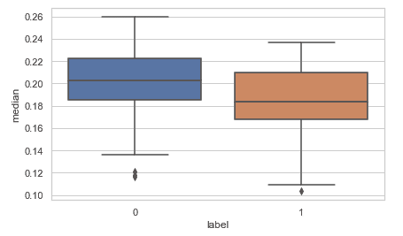

我添加的第二个新特征是一个新的特征，用于测量“偏度”。

为此，我使用了‘[卡尔·皮尔森系数](https://en.wikipedia.org/wiki/Pearson_correlation_coefficient)’，其计算公式为**系数 = （均值 — 众数）/标准差**

你还可以尝试一些其他系数，看看它们与目标（即“标签”列）相比如何。

```py
temp_df['pear_skew']=temp_df['meanfreq']-temp_df['mode']
temp_df['pear_skew']=temp_df['pear_skew']/temp_df['sd']
temp_df.head(10)sns.boxplot(data=temp_df,y='pear_skew',x='label')
```

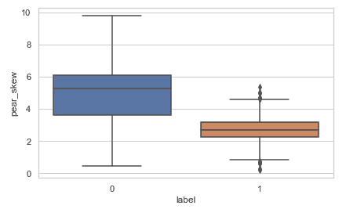

**步骤-5: 数据准备**

我们首先要做的是对所有特征进行标准化，基本上我们会执行特征缩放，以使所有值处于可比较的范围内。

```py
scaler=StandardScaler()
scaled_df=scaler.fit_transform(temp_df.drop('label',axis=1))
X=scaled_df
Y=df['label'].as_matrix()
```

接下来，将数据拆分为训练集和测试集。

```py
x_train,x_test,y_train,y_test=train_test_split(X,Y,test_size=0.20,random_state=42)
```

**步骤-6: 模型构建**

现在我们将构建两个分类器，决策树和随机森林，并比较它们的准确率。

```py
models=[RandomForestClassifier(), DecisionTreeClassifier()]model_names=['RandomForestClassifier','DecisionTree']acc=[]
d={}for model in range(len(models)):
    clf=models[model]
    clf.fit(x_train,y_train)
    pred=clf.predict(x_test)
    acc.append(accuracy_score(pred,y_test))

d={'Modelling Algo':model_names,'Accuracy':acc}
```

将准确率放入数据框中。

```py
acc_frame=pd.DataFrame(d)
acc_frame
```

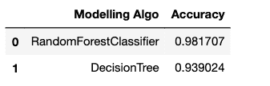

绘制准确率：

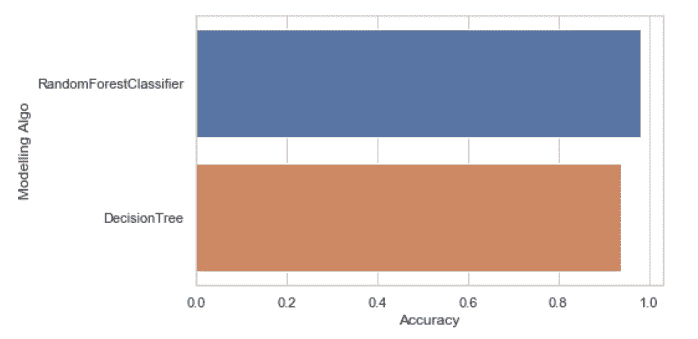

正如我们所见，仅仅使用我们模型的默认参数，随机森林分类器的表现优于决策树分类器（如预期）。

**第 7 步：使用 GridSearchCV 进行参数调优**

最后，让我们还使用 GridSearchCV 调整我们的随机森林分类器。

```py
param_grid = { 
    'n_estimators': [200, 500],
    'max_features': ['auto', 'sqrt', 'log2'],
    'max_depth' : [4,5,6,7,8],
    'criterion' :['gini', 'entropy']
}
CV_rfc = GridSearchCV(estimator=RandomForestClassifier(), param_grid=param_grid, scoring='accuracy', cv= 5)
CV_rfc.fit(x_train, y_train)
```

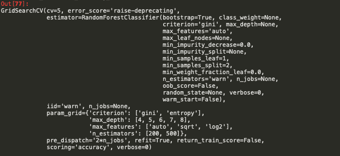

```py
print("Best score : ",CV_rfc.best_score_)
print("Best Parameters : ",CV_rfc.best_params_)
print("Precision Score : ", precision_score(CV_rfc.predict(x_test),y_test))
```

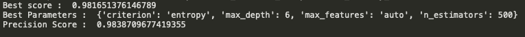

经过超参数优化后，我们可以看到结果相当不错 :)

如果你愿意，你还可以检查每个特征的重要性。

```py
df1 = pd.DataFrame.from_records(x_train)     
tmp = pd.DataFrame({'Feature': df1.columns, 'Feature importance': clf_rf.feature_importances_})
tmp = tmp.sort_values(by='Feature importance',ascending=False)
plt.figure(figsize = (7,4))
plt.title('Features importance',fontsize=14)
s = sns.barplot(x='Feature',y='Feature importance',data=tmp)
s.set_xticklabels(s.get_xticklabels(),rotation=90)
plt.show()
```

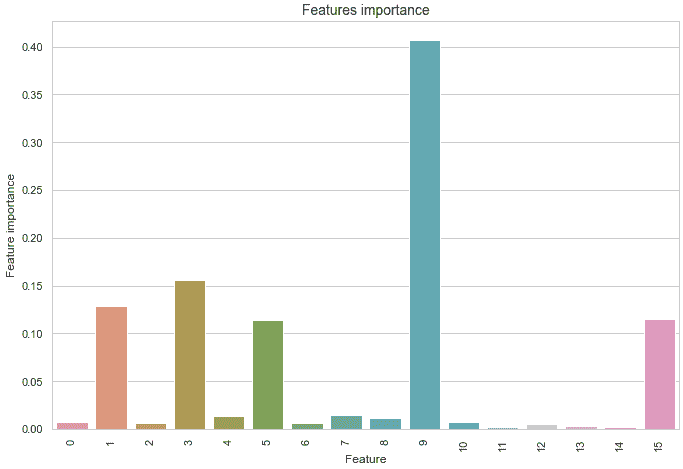

### 结论

现在希望你已经掌握了随机森林的概念框架，并且这篇文章已经给了你开始在项目中使用随机森林所需的信心和理解。随机森林是一个强大的机器学习模型，但这不应妨碍我们了解它是如何工作的。我们对模型了解得越多，就越能有效地使用它，并解释它如何做出预测。

你可以在我的 [Github 仓库](https://github.com/nageshsinghc4/Gender-prediction-from-voice-data--random-forest) 中找到源代码。

好了，这篇文章就是这些，希望你们喜欢阅读，如果这篇文章对你有帮助，我会很高兴。欢迎在评论区分享你的评论/想法/反馈。


[来源](http://bestanimations.com/Nature/Flora/Trees/Trees.html)

谢谢阅读！！！

**简介： [Nagesh Singh Chauhan](https://www.linkedin.com/in/nagesh-singh-chauhan-6936bb13b/)** 是 CirrusLabs 的大数据开发人员。他在电信、分析、销售、数据科学等各个领域拥有超过 4 年的工作经验，专注于各种大数据组件。

[原文](https://towardsdatascience.com/random-forest-a-powerful-ensemble-learning-algorithm-2bf132ba639d)。经许可转载。

随机森林® 是 Minitab 的注册商标。

**相关内容：**

+   支持向量机的友好介绍

+   比较决策树算法：随机森林与 XGBoost

+   从零开始构建人工神经网络：第一部分

### 更多相关主题

+   [随机森林算法是否需要归一化？](https://www.kdnuggets.com/2022/07/random-forest-algorithm-need-normalization.html)

+   [随机森林与决策树：关键区别](https://www.kdnuggets.com/2022/02/random-forest-decision-tree-key-differences.html)

+   [调整随机森林超参数](https://www.kdnuggets.com/2022/08/tuning-random-forest-hyperparameters.html)

+   [集成学习技术：Python 中随机森林的操作指南](https://www.kdnuggets.com/ensemble-learning-techniques-a-walkthrough-with-random-forests-in-python)

+   [为什么我们总是需要人类来训练 AI——有时是实时的](https://www.kdnuggets.com/2021/12/why-we-need-humans-training-ai.html)

+   [带例子的集成学习](https://www.kdnuggets.com/2022/10/ensemble-learning-examples.html)
