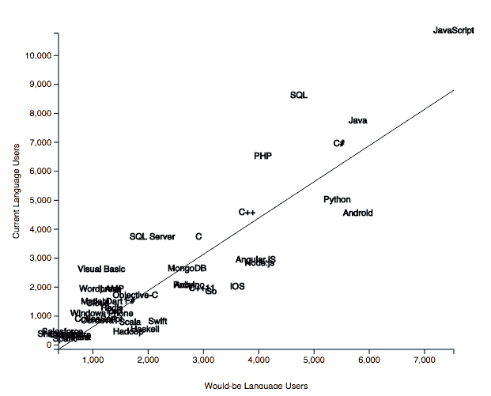

# 增长最快的编程语言和计算框架

> 原文：[`www.kdnuggets.com/2016/03/ranking-growth-programming-languages.html`](https://www.kdnuggets.com/2016/03/ranking-growth-programming-languages.html)

 评论

**作者：Nathan Epstein**

自 2010 年首次进行分析（将 Github 库数量与 Stack Overflow 帖子进行回归分析）以来，Redmonk 语言排名一直是排名编程语言受欢迎程度的重要工具。库数量和帖子数量相关的事实令人感到安慰，但并不能提供预测语言未来增长的指导。

* * *

## 我们的前三大课程推荐

 1\. [Google 网络安全证书](https://www.kdnuggets.com/google-cybersecurity) - 快速进入网络安全职业道路。

 2\. [Google 数据分析专业证书](https://www.kdnuggets.com/google-data-analytics) - 提升你的数据分析技能

 3\. [Google IT 支持专业证书](https://www.kdnuggets.com/google-itsupport) - 支持你的组织 IT

* * *

另一种方法是使用 Stack Overflow 开发者调查中的数据，涉及使用特定技术的开发者数量和希望使用这些技术的开发者数量（首次收集于 2015 年调查中）。

我们可以通过对现有用户与潜在用户进行回归分析来预测调查中各种技术的增长。

回归线有一个直观的解释。它是给定技术兴趣水平下预期的用户数量。因此，我们可以合理预期回归线下方的技术会增长，而回归线以上的技术会减少（如果我们假设兴趣驱动采纳的话）。

我们还可以根据“稳态”用户基础对各种技术进行排名，预测基于潜在用户数量（下文列为“排名加分”）。

在 2016 年 Stack Overflow 开发者调查结果发布之前，我们将无法验证预测的准确性。尽管如此，以下是 2015 年调查的结果和预测。

### 2015 年结果：

### 当前排名：

1.  JavaScript

1.  SQL

1.  Java

1.  C#

1.  PHP

1.  Python

1.  C++

1.  Android

1.  SQL Server

1.  C

### 排名加分：

1.  JavaScript

1.  Java

1.  Android

1.  C#

1.  Python

1.  SQL

1.  PHP

1.  Node.js

1.  AngularJS

1.  C++

### 最高增长：

1.  Haskell

1.  Hadoop

1.  Swift

1.  Rust

1.  Scala

1.  iOS

1.  Go

1.  C++11

1.  Node.js

1.  AngularJS

**简介：** [Nathan Epstein](https://twitter.com/epstein_n) 是一名数据科学家和软件工程师，现居纽约。他偶尔参与开源软件开发、公开演讲和学术研究。他在哥伦比亚大学和 Recurse Center 学习了应用数学和编程。

**相关：**

+   到 2018 年，企业将需要一百万名数据科学家

+   数据科学家必须掌握的一种语言

+   数据挖掘、数据科学和大数据的关键进展、主要趋势的研究领袖

### 更多相关主题

+   [顶级编程语言及其用途](https://www.kdnuggets.com/2021/05/top-programming-languages.html)

+   [KDnuggets™ 新闻 22:n04, 1 月 26 日: 高薪兼职工作…](https://www.kdnuggets.com/2022/n04.html)

+   [数据科学编程语言及其使用时机](https://www.kdnuggets.com/2022/02/data-science-programming-languages.html)

+   [KDnuggets™ 新闻 22:n06, 2 月 9 日: 数据科学编程…](https://www.kdnuggets.com/2022/n06.html)

+   [针对特定数据角色的编程语言](https://www.kdnuggets.com/2023/06/programming-languages-specific-data-roles.html)

+   [2023 年要学习的 8 种数据科学编程语言](https://www.kdnuggets.com/2023/07/8-programming-languages-data-science-learn-2023.html)
