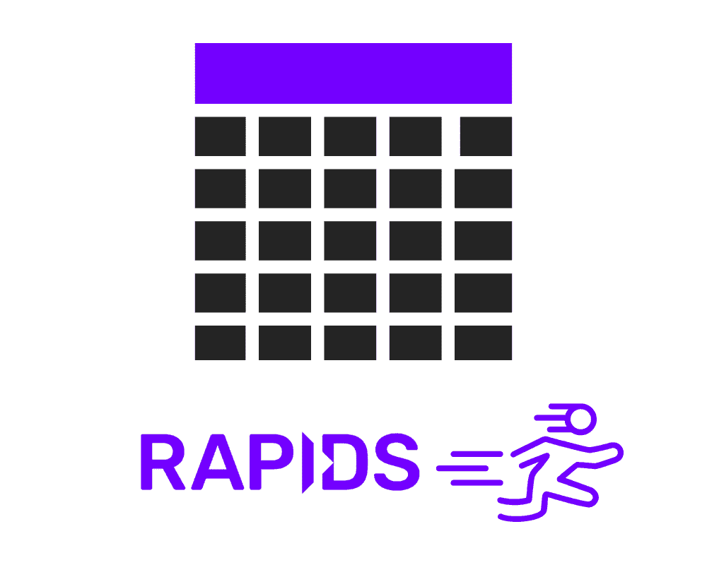
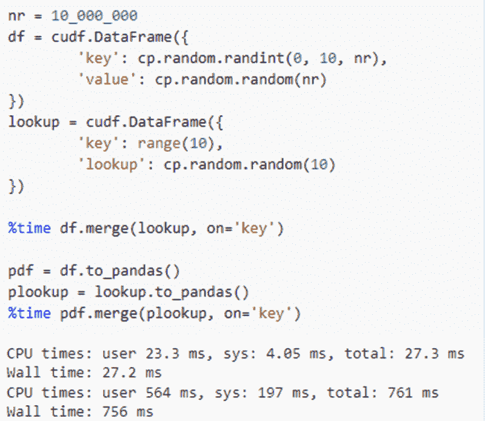

# RAPIDS cuDF 在 Google Colab 上加速数据科学

> 原文：[`www.kdnuggets.com/2023/01/rapids-cudf-accelerated-data-science-google-colab.html`](https://www.kdnuggets.com/2023/01/rapids-cudf-accelerated-data-science-google-colab.html)



图片由编辑提供

NVIDIA GPU 已成为加速计算密集型机器学习任务的最有效方式之一。现在，得益于 RAPIDS cuDF，GPU 还可以为你的数据分析工作提供加速。

* * *

## 我们的前三个课程推荐

 1\. [谷歌网络安全证书](https://www.kdnuggets.com/google-cybersecurity) - 快速进入网络安全职业。

 2\. [谷歌数据分析专业证书](https://www.kdnuggets.com/google-data-analytics) - 提升你的数据分析技能

 3\. [谷歌 IT 支持专业证书](https://www.kdnuggets.com/google-itsupport) - 支持你所在组织的 IT

* * *

# 什么是 RAPIDS cuDF？

[RAPIDS cuDF](https://github.com/rapidsai/cudf) 是一个开源的、GPU 加速的数据框架库，它实现了熟悉的 pandas API 用于处理和分析数据。Python cuDF 接口基于 libcudf，即 CUDA/C++ 计算核心，能够加速从数据摄取和解析到连接、聚合等基本数据操作。在某些工作负载下，你会发现将 `import pandas` 切换到 `import cudf` 可以加速工作负载，并且数据处理速度提高 10 倍或更多。

例如，通过切换到 cuDF，一个简单的连接操作可以从 761 毫秒缩短到 27 毫秒：



# 开始在 Colab 上使用 RAPIDS

现在在 Colab 上开始使用 RAPIDS 比以往任何时候都更加容易。借助 Colab 的 [默认运行时更新到 Python 3.8](https://colab.research.google.com/github/rapidsai-community/showcase/blob/main/getting_started_tutorials/cudf_pandas_colab_demo.ipynb?ncid=ref-inor-594904) 和新的 [RAPIDS pip 包](https://rapids.ai/pip.html)，你可以直接在浏览器中尝试 NVIDIA GPU 加速的数据科学。运行 RAPIDS 在 Colab 上只需两个快速步骤：

1.  首先，选择一个使用 GPU 加速器的 Colab 运行时。导航到“运行时”菜单，选择“更改运行时类型”，然后从下拉菜单中选择“GPU”，并点击“保存”。你从 Colab 获得的 NVIDIA GPU 可能会因会话而异，包括新一代 GPU 和旧一代 GPU。使用 Colab 的“按需付费”层级，你现在可以选择通过 Colab Pro 升级运行时至“高级 GPU”，以便访问更强大的 [NVIDIA A100](https://www.nvidia.com/en-us/data-center/a100/) 或 V100 Tensor Core GPU。 [查看 Google 的博客文章，了解更多关于 GPU 可用性的信息。](https://blog.tensorflow.org/2022/09/colabs-pay-as-you-go-offers-more-access-to-powerful-nvidia-compute-for-machine-learning.html#:~:text=Paid%20Colab%20users%20can%20now,or%20A100%20Tensor%20Core%20GPUs.)

1.  第二步，在你的笔记本中安装 RAPIDS cuDF。使用新的 RAPIDS pip 包，这一步比以往任何时候都更简单。在代码块中执行以下命令，你将设置好运行 RAPIDS。安装完成后，确保重启你的运行时：

```py
!pip install cudf-cu11 --extra-index-url=https://pypi.ngc.nvidia.com

!rm -rf /usr/local/lib/python3.8/dist-packages/cupy*

!pip install cupy-cuda11x
```

最后，检查 `import cudf` 是否在新的代码块中成功完成，然后你就可以开始了。如果遇到任何问题，请通过 [在 RAPIDS Slack 中](https://rapids.ai/slack-invite) 联系我们，我们将帮助你解决问题。

# 在 Colab 上运行 10 分钟的 cuDF

现在你有了一个工作的 cuDF 安装和一个 GPU，你可以运行我们的教程笔记本，“[10 分钟到 cuDF。](https://nvda.ws/3PijZIA)” 这个笔记本受到了 Pandas 社区类似指南的启发，是我们完整笔记本“[10 分钟到 cuDF 和 Dask-cuDF](https://docs.rapids.ai/api/cudf/stable/user_guide/10min.html)”的简化版。

在笔记本中运行时，你会发现数据框创建、数据过滤、转换、连接、聚合等示例。我们还包括了 Parquet、ORC 和 CSV 格式的文件读取和写入示例。随着你深入探索更复杂的数据处理，我们希望你将此作为 [cuDF 文档](https://docs.rapids.ai/api/cudf/stable/)的补充。

# 探索 RAPIDS 的其他部分

当你准备好深入了解时，RAPIDS 还包括 [Dask-cuDF](https://docs.rapids.ai/api/cudf/stable/user_guide/dask-cudf.html) 用于大规模工作流， [cuML](https://docs.rapids.ai/api/cuml/stable/) 用于与 scikit-learn 兼容的加速机器学习，以及 [cuGraph](https://docs.rapids.ai/api/cugraph/stable/) 用于图数据分析。按照以下代码块中所示的扩展安装列表更新你的 Colab 笔记本，你将准备好使用完整的工具包。

```py
!pip install cudf-cu11 dask-cudf-cu11 cuml-cu11 cugraph-cu11 --extra-index-url=https://pypi.ngc.nvidia.com

!rm -rf /usr/local/lib/python3.8/dist-packages/cupy*

!pip install cupy-cuda11x
```

这里有一些额外的 RAPIDS 笔记本，你可以探索以了解更多关于 RAPIDS 的信息：

+   [使用 cuML 训练和评估 ML 模型](https://github.com/rapidsai/cuml/blob/1e0f40d71e898871bc32e82cf9be635d152f7649/docs/source/estimator_intro.ipynb)

+   [Louvain 社区检测](https://github.com/rapidsai/cugraph/blob/5c6bf51f44b54f0e77afd60da2a038b58f4d515f/notebooks/algorithms/community/Louvain.ipynb)

+   [cuGraph 笔记本](https://github.com/rapidsai/cugraph/tree/HEAD/notebooks)

**[保罗·马勒](https://medium.com/@realpaulmahler)** 是位于科罗拉多州丹佛的 NVIDIA 高级数据科学家及机器学习技术产品经理。在 NVIDIA，保罗的工作重点是通过利用 GPU 技术的强大功能来构建加速数据科学工作流的工具。

[原文](https://medium.com/google-colab/rapids-cudf-for-accelerated-data-science-on-google-colab-bf315d622ac7)。已获许可转载。

### 更多相关内容

+   [RAPIDS cuDF 加速您的下一个数据科学工作流](https://www.kdnuggets.com/2023/04/rapids-cudf-speed-next-data-science-workflow.html)

+   [RAPIDS cuDF 速查表](https://www.kdnuggets.com/2023/05/cudf-data-science-cheat-sheet.html)

+   [使用 RAPIDS cuDF 利用 GPU 进行特征工程](https://www.kdnuggets.com/2023/06/rapids-cudf-leverage-gpu-feature-engineering.html)

+   [在 Google Colab 上免费微调 LLAMAv2 与 QLora](https://www.kdnuggets.com/fine-tuning-llamav2-with-qlora-on-google-colab-for-free)

+   [在 Google Colab 上免费运行 Mixtral 8x7b](https://www.kdnuggets.com/running-mixtral-8x7b-on-google-colab-for-free)

+   [在 Google Colab 上运行 Redis](https://www.kdnuggets.com/2022/01/running-redis-google-colab.html)
