# 使用 RAPIDS cuDF 在特征工程中利用 GPU

> 原文：[`www.kdnuggets.com/2023/06/rapids-cudf-leverage-gpu-feature-engineering.html`](https://www.kdnuggets.com/2023/06/rapids-cudf-leverage-gpu-feature-engineering.html)
> 
> **编辑备注**：这是我们最近 NVIDIA + KDnuggets GPU 主题博客写作比赛的亚军。恭喜 Hasan 取得这一成就！

* * *

## 我们的前三大课程推荐

 1\. [谷歌网络安全证书](https://www.kdnuggets.com/google-cybersecurity) - 快速进入网络安全职业的轨道。

 2\. [谷歌数据分析专业证书](https://www.kdnuggets.com/google-data-analytics) - 提升您的数据分析水平

 3\. [谷歌 IT 支持专业证书](https://www.kdnuggets.com/google-itsupport) - 支持您的组织 IT

* * *

特定方法成功解决问题的事实可能不会在不同规模上产生相同的结果。当距离改变时，鞋子也需要改变。

在机器学习中，数据及数据处理对模型的成功至关重要，而特征工程是其中的一部分。当数据量较小时，经典的 Pandas 库可以轻松处理 CPU 上的任何处理任务。然而，Pandas 在处理大数据时可能过于缓慢。提高数据处理和特征工程速度和效率的一个解决方案是 RAPIDS。

> “*RAPIDS 是一套开源软件库，用于在图形处理单元（GPU）上执行端到端的数据科学和分析管道。RAPIDS 加速了数据科学管道，以创建更高效的工作流程。*[1]”


图片由[brgfx](https://www.freepik.com/free-vector/opposite-adjectives-fast-slow_1172856.htm#query=running%20fast&position=6&from_view=search&track=ais)提供，来源于 Freepik

RAPIDS 的一个工具，用于在特征工程和数据预处理中高效操作表格数据，是*cuDF*。RAPIDS *cuDF* 允许创建 GPU 数据框，并执行多个*Pandas*操作，如索引、分组、合并和字符串处理。正如 RAPIDS 网站定义的：

> “*cuDF 是一个 Python GPU DataFrame 库（基于 Apache Arrow 列式内存格式），用于加载、连接、聚合、过滤和以 DataFrame 风格的 API 处理表格数据，类似于 pandas。*[2]”

本文尝试解释如何创建和操作数据框，并在 GPU 上使用*cuDF*应用特征工程，采用真实数据集。

我们的[数据集](https://www.kaggle.com/competitions/optiver-realized-volatility-prediction/data)属于 Kaggle 的 Optiver 实际波动预测。它包含与金融市场中实际交易执行相关的股票市场数据，包括订单簿快照和执行的交易[3]。

我们将在下一节中深入了解数据。然后，我们将整合 Google Colab 与 Kaggle 和 RAPIDS。在第三节中，我们将看到如何使用*Pandas*和*cuDF*对这个数据集进行特征工程。这将为我们提供两个库的比较性能评估。在最后一节中，我们将绘制并评估结果。

# 数据

我们将要使用的数据包括两个文件集[3]：

1.  book_[train/test].parquet：一个 Parquet 文件，按 stock_id 分区，提供市场中最具竞争力的买入和卖出订单的订单簿数据。此文件包含被动买入/卖出意图更新。

book_[train/test].parquet 中的特征列：

+   stock_id - 股票的 ID 代码。Parquet 在加载时将此列强制转换为分类数据类型。

+   time_id - 时间桶的 ID 代码。时间 ID 不一定是顺序的，但在所有股票中是一致的。

+   seconds_in_bucket - 从桶的开始时间起的秒数，总是从 0 开始。

+   bid_price[1/2] - 最具竞争力的买入价/第二具竞争力买入价的标准化价格。

+   ask_price[1/2] - 最具竞争力的卖出价/第二具竞争力卖出价的标准化价格。

+   bid_size[1/2] - 最具竞争力的买入价/第二具竞争力买入价的股份数量。

+   ask_size[1/2] - 最具竞争力的卖出价/第二具竞争力卖出价的股份数量。


展示-1：book_[train/test].parquet 的描述（作者提供的图像）

此文件大小为 5.6 GB，包含超过 1.67 亿条记录。有 112 只股票和 3830 个 10 分钟的时间窗口（time_id）。每个时间窗口（桶）最多有 600 秒。由于每个时间窗口中的每只股票每秒钟可能会发生一个交易意图，因此上述数字的乘积可以解释为什么我们有数百万条记录。需要注意的是，并非每秒钟都会发生交易意图，这意味着某些时间窗口中的某些秒数是缺失的。

1.  trade_[train/test].parquet：一个 Parquet 文件，按 stock_id 分区，包含实际执行的交易数据。

trade_[train/test].parquet 中的特征列：

+   stock_id - 同上。

+   time_id - 同上。

+   seconds_in_bucket - 同上。请注意，由于交易和订单数据来自相同的时间窗口，并且交易数据通常更稀疏，因此此字段不一定从 0 开始。

+   price - 在一秒钟内执行交易的平均价格。价格已经过标准化，平均值按每笔交易中交易的股份数量加权。

+   size - 交易的总股数。

+   order_count - 交易订单的唯一数量。

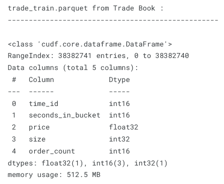

展示-2：trade_[train/test].parquet 文件描述（作者提供的图片）

trade_[train/test].parquet 文件远小于 book_[train/test].parquet。前者为 512.5 MB，有超过 3800 万条记录。由于实际交易不一定符合意图，交易数据更为稀疏，因此条目较少。

目标是预测在相同 stock_id/time_id 下的特征数据在接下来的 10 分钟窗口内的实际股票价格波动。该项目涉及大量特征工程，需在大数据集上进行。开发新特征还会增加数据量和计算复杂性。一种解决办法是使用 *cuDF* 替代 *Pandas* 库。

在这篇博客中，我们将探讨一些特征工程任务和数据框操作，同时尝试 *Pandas* 和 *cuDF* 以比较它们的性能。然而，我们不会使用所有数据，而只使用单只股票的记录以展示一个示例实现。可以查看 [笔记本](https://www.kaggle.com/code/hserdaraltan/optiver-train-feature-engineering-lgbm-cv-gpu) 来了解对整个数据进行的特征工程工作。

由于我们在 Google Colab 上执行代码，首先应配置我们的笔记本以集成 Kaggle 和 RAPIDS。

# Google Colab 笔记本配置

配置 Colab 笔记本的步骤如下：

1.  在 Kaggle 账户上创建一个 API 令牌，以便用 Kaggle 服务进行身份验证。


展示-3：在 Kaggle 账户上创建 API 令牌（作者提供的图片）

转到设置并点击“创建新令牌。” 会下载一个名为“kaggle.json”的文件，其中包含用户名和 API 密钥。

1.  在 Google Colab 上启动一个新的笔记本并上传 kaggle.json 文件。

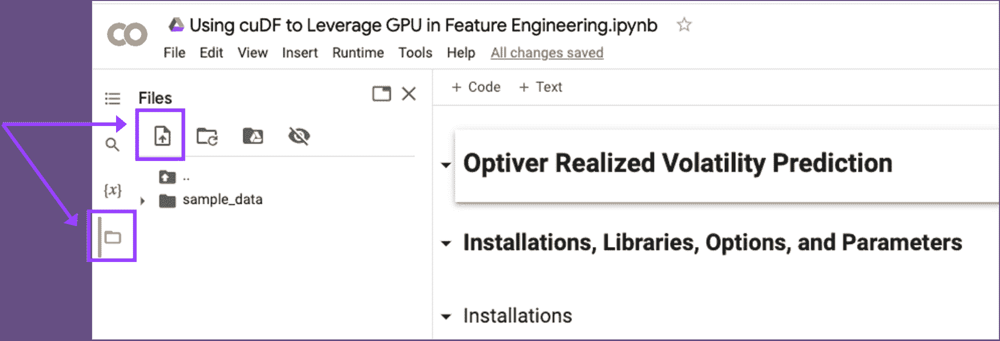

展示-4：在 Google Colab 中上传 kaggle.json 文件（作者提供的图片）

点击“上传到会话存储”图标，在 Google Colab 中上传 kaggle.json 文件。

1.  点击页面顶部的“运行时”下拉菜单，然后选择“更改运行时类型”，确认实例类型为 *GPU*。

1.  执行以下命令并检查输出，确保你分配到了 Tesla T4、P4 或 P100。

```py
!nvidia-smi
```

1.  获取 RAPIDS-Colab 安装文件并检查你的 GPU：

```py
!git clone https://github.com/rapidsai/rapidsai-csp-utils.git
!python rapidsai-csp-utils/colab/pip-install.py
```

确保你的 Colab 实例在该单元格的输出中兼容 RAPIDS。

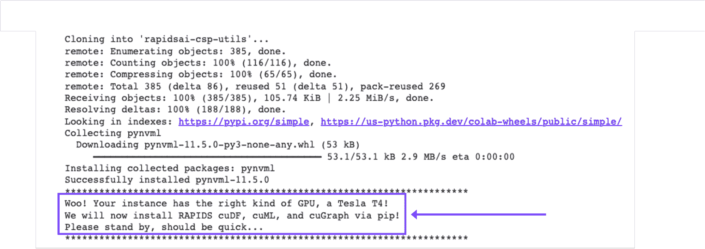

展示-5：检查 Colab 实例是否兼容 RAPIDS（作者提供的图片）

1.  检查 RAPIDS 库是否正确安装：

```py
import cudf, cuml
cudf.__version__
```

如果设置没有错误，我们的 Google Colab 配置就绪。现在，我们可以上传 Kaggle 数据集。

# 导入和上传 Kaggle 数据集

我们需要在 Colab 实例中进行一些调整以从 Kaggle 导入数据集。

1.  安装 Kaggle 库：

```py
!pip install -q kaggle
```

1.  创建一个名为“.kaggle”的目录：

```py
!mkdir ~/.kaggle
```

1.  将“kaggle.json”复制到这个新目录中：

```py
!cp kaggle.json ~/.kaggle/
```

1.  为此文件分配所需的权限：

```py
!chmod 600 ~/.kaggle/kaggle.json
```

1.  从 Kaggle 下载数据集：

```py
!kaggle competitions download optiver-realized-volatility-prediction
```

1.  为解压缩的数据创建一个目录：

```py
!mkdir train
```

1.  在新目录中解压数据：

```py
!unzip optiver-realized-volatility-prediction.zip -d train
```

1.  导入我们需要的所有其他库：

```py
import glob
import numpy as np
import pandas as pd
from cudf import DataFrame
import matplotlib.pyplot as plt
from matplotlib import style
from collections import defaultdict
from IPython.display import display
import gc
import time
import warnings
%matplotlib inline
```

1.  设置*Pandas*选项：

```py
pd.set_option("display.max_colwidth", None)
pd.set_option("display.max_columns", None)
warnings.filterwarnings("ignore")

print("Threshold:", gc.get_threshold())
print("Count:", gc.get_count())
```

1.  定义参数：

```py
# Data directory that contains files
DIR = "/content/train/"

# Number of execution cycles
ROUNDS = 30
```

1.  获取文件：

```py
# Get order and trade books
order_files = glob.glob(DIR + "book_train.parquet" + "/*")
trade_files = glob.glob(DIR + "trade_train.parquet" + "/*")
print(order_files[:5])
print("\n")
print(trade_files[:5])
print("\n")

# Get stock_ids as a list
stock_ids = sorted([int(file.split('=')[1]) for file in order_files])
print(f"{len(stock_ids)} stocks: \n {stock_ids} \n")
```

现在，我们的笔记本已经准备好运行所有数据框任务并执行特征工程。

# 特征工程

本节将讨论在*Pandas*数据框和*cuDF*上进行的 13 种典型工程操作。我们将查看这些操作所需的时间和使用的内存。让我们首先加载数据。

## 1\. 加载数据

```py
def load_dataframe(files, dframe=0):

   print("LOADING DATA FRAMES", "\n")

   # Load the pandas dataframe
   if dframe == 0:
     print("Loading pandas dataframe..", "\n")
     start = time.time()
     df_pandas = pd.read_parquet(files[0])
     end = time.time()
     elapsed_time = round(end-start, 3)
     print(f"For pandas dataframe: \n start time: {start} \n end time: {end} \n elapsed time: {elapsed_time} \n")
     return df_pandas, elapsed_time

   # Load the cuDF dataframe
   else:
     print("Loading cuDF dataframe..", "\n")
     start = time.time()
     df_cudf = cudf.read_parquet(files[0])
     end = time.time()
     elapsed_time = round(end-start, 3)
     print(f"For cuDF dataframe: \n start time: {start} \n end time: {end} \n elapsed time: {elapsed_time} \n ")

     return df_cudf, elapsed_time
```

当 dframe=0 时，数据将以*Pandas*数据框的形式加载，否则为*cuDF*。例如，

*Pandas：*

```py
# Load pandas order dataframe and calculate time
df_pd_order, _ = load_dataframe(order_files, dframe=0)
display(df_pd_order.head())
```

这将返回订单簿（book_[train/test].parquet）的前五条记录：

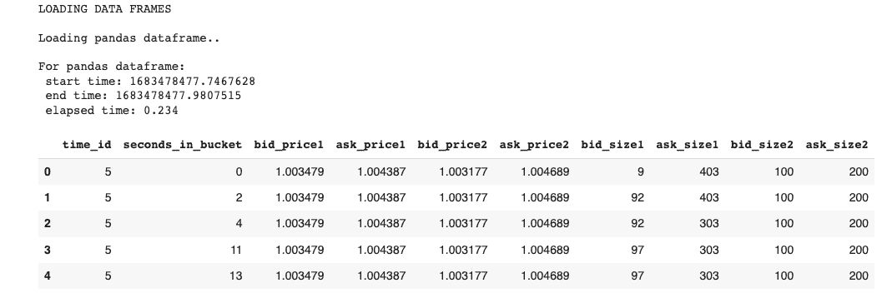

展示-6：将数据加载为 Pandas 数据框（图片由作者提供）

*cuDF：*

```py
# Load cuDF book dataframe and calculate time
df_cudf_order, _ = load_dataframe(order_files, dframe=1)
display(df_cudf_order.head())
```

输出：

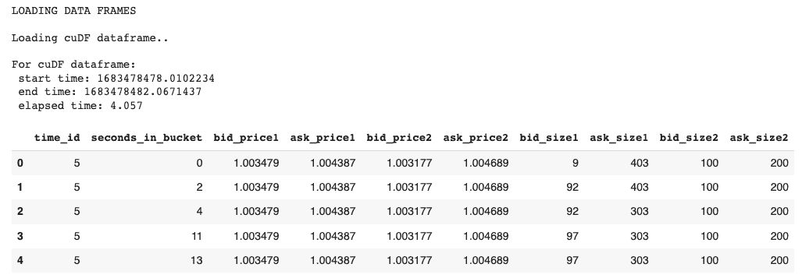

展示-7：将数据加载为 cuDF（图片由作者提供）

让我们从*Pandas*版本中获取订单簿数据的信息：

```py
# Order dataframe info
display(df_pd_order.info())
```

输出：

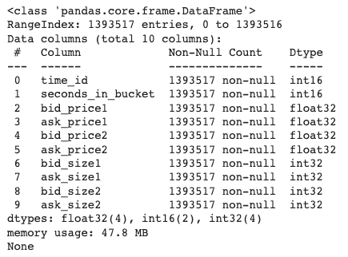

展示-8：有关第一个股票订单簿数据的信息（图片由作者提供）

上面的图片告诉我们，第一个股票大约有 140 万条记录，占用 47.8 MB 的内存空间。为了减少空间并提高速度，我们应该将数据类型转换为较小的格式，我们将在稍后完成。

以类似的方式，我们将订单簿数据加载到两个数据框库中，也就是交易簿（trade_[train/test].parquet）数据。数据及其信息如下所示：

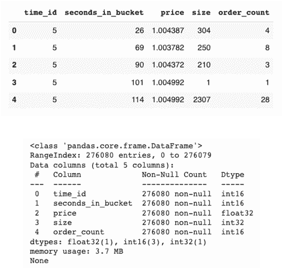

展示-9：第一个股票的交易簿数据及数据说明（图片由作者提供）

第一个股票的交易数据为 3.7 MB，记录超过 276 千条。

在订单簿和交易簿两个文件中，并非每个时间窗口都有 600 个秒点。换句话说，特定时间桶在 10 分钟间隔内可能只在某些秒钟有交易或出价。这使我们在两个文件中都面临着稀疏数据，其中一些秒钟缺失。我们应通过对缺失秒钟的所有列进行前向填充来解决此问题。虽然 *Pandas* 允许我们进行前向填充，但 *cuDF* 没有这个功能。因此，我们将在 *Pandas* 中进行前向填充，并从前向填充的 *Pandas* 数据框架重新创建 *cuDF*。对此我们感到遗憾，因为本博客的核心目标是展示 *cuDF* 如何胜过 *Pandas*。我曾多次查阅过此事，但据我所知，我无法找到 *cuDF* 中像 *Pandas* 中实现的方法。因此，我们可以按以下方式进行前向填充[4]：

```py
# Forward fill data
def ffill(df, df_name="order"):

   # Forward fill
   df_pandas = df.set_index(['time_id', 'seconds_in_bucket'])

   if df_name == "order":
     df_pandas = df_pandas.reindex(pd.MultiIndex.from_product([df_pandas.index.levels[0], np.arange(0,600)], names = ['time_id', 'seconds_in_bucket']), method='ffill')
     df_pandas = df_pandas.reset_index()

   else:
     df_pandas = df_pandas.reindex(pd.MultiIndex.from_product([df_pandas.index.levels[0], np.arange(0,600)], names = ['time_id', 'seconds_in_bucket']))
     # Fill nan values with 0
     df_pandas = df_pandas.fillna(0)
     df_pandas = df_pandas.reset_index()   

   # Convert to a cudf dataframe
   df_cudf = cudf.DataFrame.from_pandas(df_pandas)

   return df_pandas, df_cudf 
```

让我们以订单数据为例，看看它是如何处理的：

```py
# Forward fill order dataframes
expanded_df_pd_order, expanded_df_cudf_order = ffill(df_pd_order, df_name="order")
display(expanded_df_cudf_order.head())
```

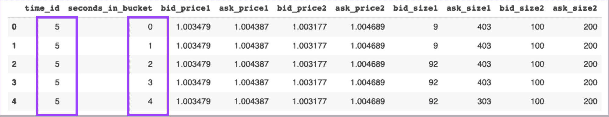

展览-10：前向填充订单数据（作者提供的图片）

与展示 7 中的数据不同，展示 10 中的前向填充数据在时间桶“5”中有全部 600 秒，即从 0 到 599，全包括。我们在交易数据上也执行同样的操作。

## 2\. 合并数据框架

我们有两个数据集，订单和交易，两者都已前向填充。这两个数据集在 *Pandas* 和 *cuDF* 框架中都有表现。接下来，我们将订单和交易数据集按 time_id 和 seconds_in_buckets 合并。

```py
def merge_dataframes(df1, df2, dframe=0):

   print("MERGING DATA FRAMES", "\n")

   if dframe == 0:
     df_type = "Pandas"
   else:
     df_type = "cuDF"

   # Merge dataframes
   print(f"Merging {df_type} dataframes..", "\n")
   start = time.time()
   df = df1.merge(df2, how="left", on=["time_id", "seconds_in_bucket"], sort=True)
   end = time.time()
   elapsed_time = round(end-start, 3)
   print(f"For {df_type} dataframes: \n start time: {start} \n end time: {end} \n elapsed time: {elapsed_time} \n")

   return df, elapsed_time
```

*cuDF* 将执行以下命令：

```py
# Merge cuDF order and trade dataframes
df_cudf, cudf_merge_time = merge_dataframes(expanded_df_cudf_order, expanded_df_cudf_trade, dframe=1)
display(df_cudf.head())
```

expanded_df_cudf_trade 是前向填充的交易数据，与 expanded_df_pd_order 或 expanded_df_cudf_order 获取方式相同。合并操作将创建如下所示的组合数据框架：

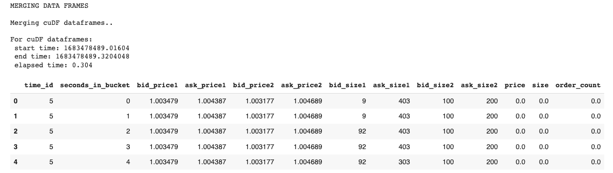

展览-11：合并数据框架（作者提供的图片）

两个数据集的所有列被合并为一个。合并操作也对 *Pandas* 数据框架重复执行。


图片由 [pikisuperstar](https://www.freepik.com/free-vector/hand-drawn-flat-design-gathering-data-business-concept_20547395.htm#page=3&query=data%20engineering&position=36&from_view=search&track=ais) 在 Freepik 上提供

## 3\. 改变数据类型

我们想要改变某些列的数据类型，以减少内存空间并提高计算速度。

```py
# Make dtype changes
def change_dtype(df, dframe=0):

   print("CHANGING DTYPES", "\n")

   convert_dict = {"time_id": "int16",
                   "seconds_in_bucket": "int16",
                   "bid_size1": "int16",
                   "ask_size1": "int16",
                   "bid_size2": "int16",
                   "ask_size2": "int16",
                   "size": "int16",
                   "order_count": "int16"
                   } 

   df = df.astype(convert_dict)

   return df, dframe
```

当我们执行以下命令时，

```py
# Make dtype changes for cuDF data frame
df_cudf, _ = change_dtype(df_cudf)
display(df_cudf.info())
```

我们得到以下输出：

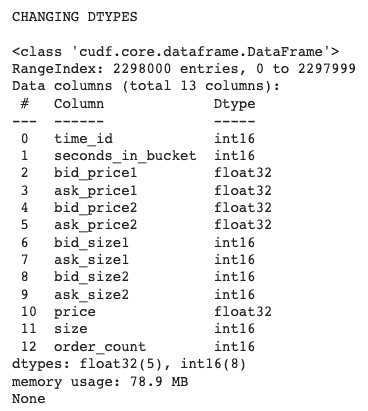

展览-12：改变数据类型（作者提供的图片）

如果没有进行数据类型转换，展示 12 中的数据将使用更多内存空间。它仍然有 78.9 MB，但在前向填充和合并操作之后，结果为 13 列和 230 万条记录。

我们为*Pandas* DF 和 *cuDF* 完成了每个特征工程任务。在这里，我们仅展示了一个*cuDF*的例子。

## 4\. 获取唯一时间 ID

我们将在本节中使用 unique 方法提取 time_ids。

```py
# Get unique values in time_id column and put them in a list
def get_unique_timeids(df, dframe=0):

   global time_ids

   print("GETTING UNIQUE VALUES", "\n")

   # Get unique time_ids
   if dframe == 0:
     print(f"Getting sorted unique time_ids from Pandas dataframe..", "\n")
     start = time.time()
     time_ids = sorted(df['time_id'].unique().tolist())
     end = time.time()
     elapsed_time = round(end-start, 3)
     print(f"Unique time_ids from Pandas dataframe: \n start time: {start} \n end time: {end} \n elapsed time: {elapsed_time} \n")

   else:
     print(f"Getting sorted unique time_ids from cuDF dataframe..", "\n")
     start = time.time()
     time_ids = sorted(df['time_id'].unique().to_arrow().to_pylist())
     end = time.time()
     elapsed_time = round(end-start, 3)
     print(f"Unique time_ids from cuDF dataframe: \n start time: {start} \n end time: {end} \n elapsed time: {elapsed_time} \n")

   print(f"{len(time_ids)} time buckets: \n {time_ids[:10]}...")
   print("\n")

   return df, time_ids
```

上述代码将从*Pandas* DF 和 *cuDF* 中获取唯一的 time_ids。

```py
# Get time_ids from cuDF dataframe
time_ids = get_unique_timeids(df_cudf_order, dframe=1)
```

*cuDF* 的输出如下：

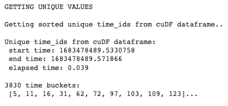

展示-13：获取唯一时间 ID（作者提供的图像）

## 5\. 检查空值

然后，我们将检查数据框中的空值。

```py
# Check df null values
def check_null_values(df, dframe=0):

   print("CHECKING NULL VALUES", "\n")

   print("Checking dataframe null values..", "\n")
   display(df.isna().values.any())
   display(df.isnull().sum())

   return df, dframe
```

在*cuDF*中的检查空值示例：

```py
# Check null values for cuDF dataframe
df_cudf, _ = check_null_values(df_cudf, dframe=0)
```

输出是：

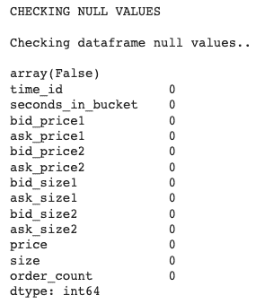

展示-14：检查空值（作者提供的图像）

## 6\. 添加列

我们想要创建更多的特征，因此添加了几列。

```py
# Add columns
def add_column(df, dframe=0):

   print("ADDING COLUMNS", "\n")

   # Calculate WAPs
   df['wap1'] = (df['bid_price1'] * df['ask_size1'] + df['ask_price1'] * df['bid_size1']) / (df['bid_size1'] + df['ask_size1'])
   df['wap2'] = (df['bid_price2'] * df['ask_size2'] + df['ask_price2'] * df['bid_size2']) / (df['bid_size2'] + df['ask_size2'])

   # Calculate order volumes
   df['bid1_volume'] = df['bid_price1'] * df['bid_size1']
   df['bid2_volume'] = df['bid_price2'] * df['bid_size2']
   df['ask1_volume'] = df['ask_price1'] * df['ask_size1']
   df['ask2_volume'] = df['ask_price2'] * df['ask_size2']

   # Calculate volume imbalance
   df['imbalance'] = np.absolute((df['ask_size1'] + df['ask_size2']) - (df['bid_size1'] + df['bid_size2']))

   # Calculate trade volume imbalance
   df['volume_imbalance'] = np.absolute((df['bid_price1'] * df['bid_size1']) - (df['ask_price1'] * df['ask_size1']))

   return df, dframe
```

这将创建新的特征，如加权平均价格 (wap1 和 wap2)、订单量和成交量失衡。通过执行以下操作，总共会向数据框添加八列：

```py
# Add a column in cuDF dataframe
df_cudf, _ = add_column(df_cudf)
display(df_cudf.head())
```

因此它将给我们：

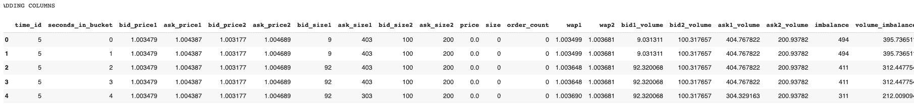

展示-15：添加列和特征（作者提供的图像）

## 7\. 删除列

我们决定通过删除 wap1 和 wap2 的列来去掉这两个特征：

```py
# Drop columns
def drop_column(df, dframe=0):

   print("DROPPING COLUMNS", "\n")

   df.drop(columns=['wap1', 'wap2'], inplace=True)

   return df, dframe
```

删除列的实现是：

```py
# Add a column in cuDF dataframe
df_cudf, _ = drop_column(df_cudf)
display(df_cudf.head())
```

这使得我们得到的数据显示 wap1 和 wap2 列已被删除！

## 8\. 按组计算统计数据

接下来，我们将通过时间 ID 计算一些特征的均值、中位数、最大值、最小值、标准差和总和。为此，我们将使用 groupby 和 agg 方法。

```py
# Calculate statistics by selected features
def calc_agg_stats(df, dframe=0):

   print("CALCULATING STATISTICS", "\n")

   # Statistical calculations to be made 
   operations = ["mean", "median", "max", "min", "std", "sum"]

   # Features for which statistical calculations will be made
   features_list = ["bid1_volume", "bid2_volume", "ask1_volume", "ask2_volume"]

   # Create a dictionary to store feature-calculation pairs
   stats_dict = defaultdict(list)
   for feature in features_list:
       stats_dict[feature].extend(operations)

   # Calculate aggregate statistics
   df_stats = df.groupby('time_id', as_index=False, sort=True).agg(stats_dict)

   return df, df_stats
```

我们创建了一个名为 features_list 的列表，以指定进行数学计算的特征。

```py
# Calculate statistics by selected features in cuDF dataframe
_, df_cudf_stats = calc_agg_stats(df_cudf)
display(df_cudf_stats.head())
```

作为回报，我们得到以下输出：

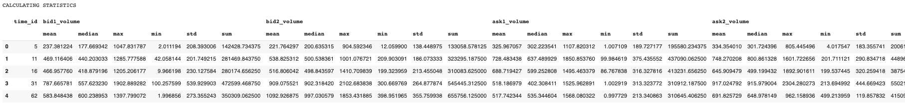

展示-16：计算统计数据（作者提供的图像）

返回的表格是一个新的数据框。我们应将其与原始数据框 (df_cudf) 合并。我们将通过*Pandas*完成此操作：

```py
# Merge data frame with stats
def merge_dataframes_2(df, dframe=0):

   if dframe == 0:
     df = df.merge(df_pd_stats, how="left", on="time_id", sort=True)

   else:
     df = df.to_pandas()
     df = df.merge(df_pd_stats, how="left", on="time_id", sort=True)
     df = cudf.DataFrame.from_pandas(df)

   return df, dframe

# Merge cuDF data frames
df_cudf, _ = merge_dataframes_2(df_cudf, dframe=1)
display(df_cudf.head())
```

上述代码段将把 df_pd_stats 和 df_pd 放在一个数据框中，并将其保存为 df_cudf。

一如既往，我们对*Pandas*执行相同的任务。

下一步是计算两列之间的相关性：

```py
# Calculate correlation between two selected features
def calc_corr(df, dframe=0):

 correlation = df[["bid1_volume", "ask1_volume"]].corr()
 print(f"Correlation between 'bid1_volume' and 'ask1_volume' is {correlation} \n")

 return df, correlation
```

这段代码

```py
# Calculate correlation in cuDF dataframe
_ = calc_corr(df_cudf)
```

将返回以下输出：

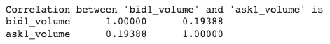

展示-17：计算两个特征之间的相关性（作者提供的图像）

## 9\. 重命名列

为了消除任何混淆，我们应重命名两列。

```py
# Rename columns
def rename_cols(df, dframe=0):

   print("RENAMING COLUMNS", "\n")

   df = df.rename(columns={"imbalance": "volume_imbalance", "volume_imbalance": "trade_volume_imbalance"})

   return df, dframe
```

列的失衡和成交量失衡将分别重命名为成交量失衡和交易量失衡。

## 10\. 对列进行分箱

我们还想进行另一项数据操作，即对 bid1_volume 进行分箱，并将分箱结果存储在新列中。

```py
# Bin a selected column
def bin_col(df, dframe=0):

   print("BINNING A COLUMN", "\n")

   if dframe == 0:
     df['bid1_volume_cut'] = pd.cut(df["bid1_volume"], bins=5, labels=["very high", "high", "average", "low", "very low"], ordered=True)

   else:
     df['bid1_volume_cut'] = cudf.cut(df["bid1_volume"], bins=5, labels=["very high", "high", "average", "low", "very low"], ordered=True)

   return df, dframe
```

通过运行以下代码行

```py
# Bin a selected column in cuDF dataframe
df_cudf, _ = bin_col(df_cudf, dframe=1)
display(df_cudf.head())
```

我们将得到一个数据框作为输出，下面展示了它的一部分：

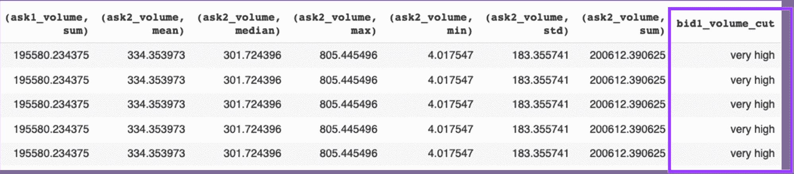

展示-18：对列进行分箱（作者图片）

## 11\. 显示数据框

特征工程步骤完成后，我们可以展示数据框。本节包含三个操作：显示数据框、获取有关数据框的信息以及描述数据框。

```py
# Display data frame
def display_df(df, dframe=0):

   print("DISPLAYING DATA FRAMES", "\n")

   display(df.head())
   print("\n")

   return df, dframe

# Display dataframe info
def display_info(df, dframe=0):

   print("DISPLAYING DATA FRAME INFO", "\n")

   display(df.info())
   print("\n")

   return df, dframe

# Display dataframe info
def describe_df(df, dframe=0):

   print("DESCRIBING DATA FRAMES", "\n")

   display(df.describe())
   print("\n")

   return df, dframe
```

以下代码将完成这三个任务：

```py
# Display cuDF dataframe and info
_, _ = display_df(df_cudf, dframe=1)
_, _ = display_info(df_cudf, dframe=1)
_, _ = describe_df(df_cudf, dframe=1)
```

我们已经完成了特征工程。

# 单次运行执行

总结一下，我们的特征工程工作集中在以下任务：

1.  加载数据框

1.  合并数据框

1.  更改数据类型

1.  获取唯一的 `time_ids`。

1.  检查空值

1.  添加列

1.  删除列

1.  计算统计信息

1.  计算相关性

1.  重命名列

1.  对列进行分箱

1.  显示数据框

1.  显示数据信息

1.  描述数据框

总共是 13 个任务，但我们在这里将“计算相关性”作为一个单独的实体。现在，我们希望在一次运行中按顺序执行这些任务，如下所示：

```py
def run_and_report():

   # Create a dictionary to store elapsed times
   time_dict = defaultdict(list)

   # List operations to be performed
   labels = ["changing_dtype",
             "getting_unique_timeids",
             "checking_null_values",
             "adding_column",
             "dropping_column",
             "calculating_agg_stats",
             "merging_dataframes",
             "renaming_columns",
             "binning_col",
             "calculating_corr",
             "displaying_dfs",
             "displaying_info",
             "describing_dfs"]

   # Load pandas order dataframe and calculate time
   df_pd_order, pd_order_loading_time = load_dataframe(order_files, dframe=0)
   print("-"*150, "\n")

   # Load cuDF book dataframe and calculate time
   df_cudf_order, cudf_order_loading_time = load_dataframe(order_files, dframe=1)
   print("-"*150, "\n")

   # Load pandas trade dataframe and calculate time
   df_pd_trade, pd_trade_loading_time = load_dataframe(trade_files, dframe=0)
   print("-"*150, "\n")

   # Load cuDF trade dataframe and calculate time
   df_cudf_trade, cudf_trade_loading_time = load_dataframe(trade_files, dframe=1)
   print("-"*150, "\n")

   # Get time_ids from Pandas data frame
   _, time_ids = get_unique_timeids(df_pd_order, dframe=0)
   print("-"*150, "\n")

   # Get time_ids from cuDF dataframe
   _, time_ids = get_unique_timeids(df_cudf_order, dframe=1)
   print("-"*150, "\n")

   # Store loading times
   time_dict["loading_dfs"].extend([pd_order_loading_time, cudf_order_loading_time])

   # Forward fill order dataframes
   expanded_df_pd_order, expanded_df_cudf_order = ffill(df_pd_order, df_name="order")

   # Forward fill trade dataframes
   expanded_df_pd_trade, expanded_df_cudf_trade = ffill(df_pd_trade, df_name="trade")

   # Merge pandas order and trade dataframes
   df_pd, pd_merge_time = merge_dataframes(expanded_df_pd_order, expanded_df_pd_trade, dframe=0)
   print("-"*150, "\n")

   # Merge pandas order and trade dataframes
   df_cudf, cudf_merge_time = merge_dataframes(expanded_df_cudf_order, expanded_df_cudf_trade, dframe=1)
   print("-"*150, "\n")

   # Store merge times
   time_dict["merging_dfs"].extend([pd_merge_time, cudf_merge_time])

   # Apply functions
   functions = [change_dtype,
                get_unique_timeids,
                check_null_values,
                add_column,
                drop_column,
                calc_agg_stats,
                merge_dataframes_2,
                rename_cols,
                bin_col,
                calc_corr,
                display_df,
                display_info,
                describe_df]

   for label, function in enumerate(functions):

     # Function for pandas
     start_pd = time.time()
     df_pd, x = function(df_pd, dframe=0)
     end_pd = time.time()
     elapsed_time_for_pd = round(end_pd-start_pd, 3)
     print(f"For pandas dataframe: \n start time: {start_pd} \n end time: {end_pd} \n elapsed time: {elapsed_time_for_pd} \n")     

     # Function for cuDF
     start_cudf = time.time()
     df_cudf, x = function(df_cudf, dframe=1)
     end_cudf = time.time()
     elapsed_time_for_cudf = round(end_cudf-start_cudf, 3)
     print(f"For cuDF dataframe: \n start time: {start_cudf} \n end time: {end_cudf} \n elapsed time: {elapsed_time_for_cudf} \n")
     print("-"*150, "\n")

     # Store elapsed times
     time_dict[labels[label]].extend([elapsed_time_for_pd, elapsed_time_for_cudf])

   # Delete the unsolicited time duration
   del time_dict["merging_dataframes"]
   labels.remove("merging_dataframes")
   labels.insert(0, "merging_dfs")
   labels.insert(0, "loading_dfs")

   print(time_dict)

   return time_dict, labels, df_pd, df_cudf
```

`run_and_report` 函数将以单个执行命令提供与之前相同的输出，但会生成完整报告。它将在 *Pandas* 和 *cuDF* 上执行 14 个任务，并记录两种数据框所需的时间。

```py
time_dict, labels, df_pd, df_cudf = run_and_report()
```

我们可能需要运行多个周期，以更明显地看到两个数据库的相对性能。

# 最终评估

如果我们多次运行 `run_and_report`，例如在多轮中，我们可以更好地了解 *Pandas* 和 *cuDF* 之间性能的差异。因此，我们将轮次设置为 30。然后，我们记录每个操作、轮次和数据库的所有时间，并最终评估结果：

```py
def calc_exec_times():

   exec_times_by_round = {}

   # Calculate execution times of operations in each round
   for round_no in range(1, ROUNDS+1):
     # cycle_no += 1
     time_dict, labels, df_pd, df_cudf = run_and_report()
     exec_times_by_round[round_no] = time_dict

   print("exec_times_by_round: ", exec_times_by_round)

   # Get durations by operation for each data frame
   pd_summary, cudf_summary = get_statistics(exec_times_by_round, labels)

   # Get durations by rounds for each data frame
   round_total = get_total(exec_times_by_round)
   print("\n"*3)

   # Plot durations
   plt.style.use('dark_background')
   X_axis = np.arange(len(labels))

   # Plot average duration of operation
   plot_avg_by_df(pd_summary, cudf_summary, labels, X_axis)
   print("\n"*3)

   # Plot total and difference in duration by operation
   plot_diff_by_df(pd_summary, cudf_summary, labels)
   print("\n"*3)

   # Plot total and difference in duration by round
   plot_total_by_df(round_total)
   print("\n"*3)
```

`calc_exec_times` 函数执行了一些任务。它首先调用 `get_statistics`，以获取每个数据库在 30 轮中的“平均和总时间”。

```py
def get_statistics(exec_times_by_round, labels):

   # Separate and store duration statistics by data frame
   pd_performance = defaultdict(list)
   cudf_performance = defaultdict(list)

   # Get and store durations for each operation by data frame
   for label in labels:
     for key, values in exec_times_by_round.items():

       pd_performance[label].append(values[label][0])
       cudf_performance[label].append(values[label][1])

   print("pd_performance: ", pd_performance)
   print("cudf_performance: ", cudf_performance)

   # Compute average and total durations for each operation by data frame
   pd_summary = {key: [round(sum(value), 3), round(np.average(value), 3)] for key, value in pd_performance.items()}
   cudf_summary = {key: [round(sum(value), 3), round(np.average(value), 3)] for key, value in cudf_performance.items()}

   print("pd_summary: ", pd_summary)
   print("cudf_summary: ", cudf_summary) 

   return pd_summary, cudf_summary
```

接下来，它计算每个数据框架的“按轮次总时长”。

```py
def get_total(exec_times_by_round):

   def get_round_total(stat_list):

     # Get total duration by round for each data frame
     pd_round_total = round(sum([x[0] for x in stat_list]), 3)
     cudf_round_total = round(sum([x[1] for x in stat_list]), 3)

     return pd_round_total, cudf_round_total

   # Collect total durations by round
   for key, value in exec_times_by_round.items():
     round_total = {key: get_round_total(list(value.values())) for key, value in exec_times_by_round.items()}

   print("round_total", round_total)

   return round_total
```

最后，它绘制了结果。这里，第一个图表显示了两个库的“按操作平均时间”。

```py
def plot_avg_by_df(pd_summary, cudf_summary, labels, X_axis):

   # Figure size
   fig = plt.subplots(figsize =(10, 4))

   # Average duration by operation for each data frame
   pd_avg = [value[1] for key, value in pd_summary.items()]
   cudf_avg = [value[1] for key, value in cudf_summary.items()]

   plt.bar(X_axis - 0.2, pd_avg, 0.4, color = '#5A5AAF', label = 'pandas', align='center')
   plt.bar(X_axis + 0.2, cudf_avg, 0.4, color = '#C8C8FF', label = 'cuDF', align='center')

   plt.xticks(X_axis, labels, fontsize=9, rotation=90)
   plt.yticks(fontsize=9)
   plt.xlabel("Operations", fontsize=10)
   plt.ylabel("Average Duration in Seconds", fontsize=10)
   plt.grid(axis='y', color="#E4E4E4", alpha=0.5)
   plt.title("Average Duration of Operation by Data Frame", fontsize=12)
   plt.legend()
   plt.show()
```

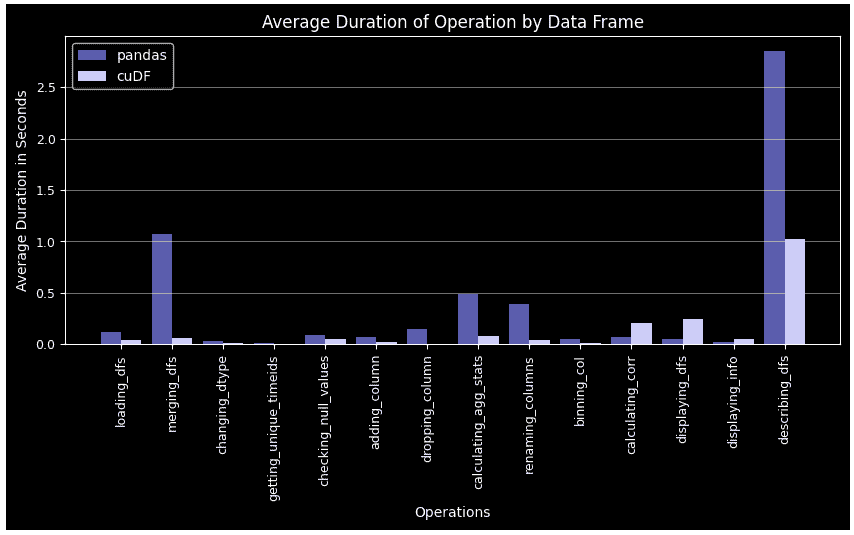

展示-19：Pandas 数据框和 cuDF 的操作平均时长（作者图片）

第二个图表显示了“按操作总时长”，即每个任务在 30 轮中的总时间。

```py
def plot_diff_by_df(pd_summary, cudf_summary, labels):

   # Figure size
   fig = plt.subplots(figsize =(12, 6))

   # Total duration by operation for each data frame
   pd_total = [value[0] for key, value in pd_summary.items()]
   cudf_total = [value[0] for key, value in cudf_summary.items()]

   # Difference of total duration by operation for each data frame
   diff = [x[0]-x[1] for x in zip(pd_total, cudf_total)]

   # Set width of bar
   barWidth = 0.25

   # Set position of bar on X axis
   br1 = np.arange(len(labels))
   br2 = [x + barWidth for x in br1]
   br3 = [x + barWidth for x in br2]

   plt.bar(br1, pd_total, barWidth, color = '#5A5AAF', label = 'pandas', align='center')
   plt.bar(br2, cudf_total, barWidth, color = '#C8C8FF', label = 'cuDF', align='center')
   plt.bar(br3, diff, barWidth, color = '#AA1E1E', label = 'difference', align='center')

   plt.xticks([r + barWidth for r in range(len(labels))], labels, fontsize=9, rotation=90)
   plt.yticks(fontsize=9)
   plt.xlabel("Operations", fontsize=10)
   plt.ylabel("Total Duration in Seconds", fontsize=10)
   plt.grid(axis='y', color="#E4E4E4", alpha=0.5)
   plt.title("Total Duration of Operation by Data Frame", fontsize=12)
   plt.legend()
   plt.show()
```

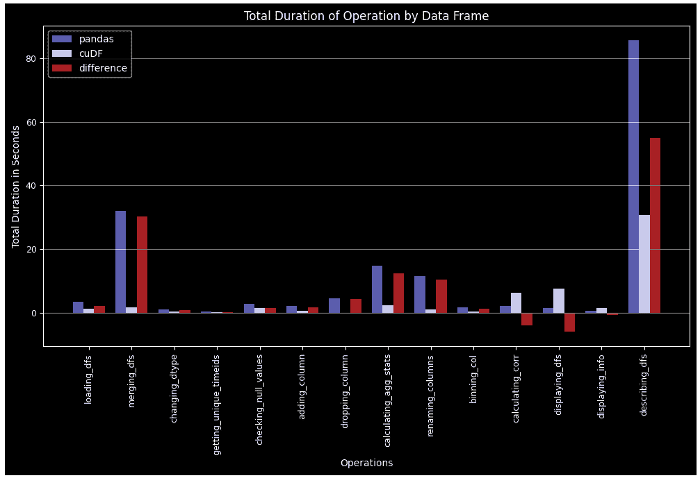

展示-20：Pandas 数据框和 cuDF 在 30 轮中的操作总时长（作者图片）

最终图表是“按轮次总时长”，显示了每轮中所有操作的总时间。

```py
def plot_total_by_df(round_total):

    # Figure size
   fig = plt.subplots(figsize =(10, 6))

   X_axis = np.arange(1, ROUNDS+1)

   # Total duration by round for each data frame
   pd_round_total = [value[0] for key, value in round_total.items()]
   cudf_round_total = [value[1] for key, value in round_total.items()]

   # Difference of total duration by round for each data frame
   diff = [x[0]-x[1] for x in zip(pd_round_total, cudf_round_total)]

   plt.plot(X_axis, pd_round_total, linestyle="-", linewidth=3, color = '#5A5AAF', label = "pandas")
   plt.plot(X_axis, cudf_round_total, linestyle="-", linewidth=3, color = '#B0B05A', label = "cuDF")
   plt.plot(X_axis, diff, linestyle="--", linewidth=3, color = '#AA1E1E', label = "difference")

   plt.xticks(X_axis, fontsize=9)
   plt.yticks(fontsize=9)
   plt.xlabel("Rounds", fontsize=10)
   plt.ylabel("Total Duration in Seconds", fontsize=10)
   plt.grid(axis='y', color="#E4E4E4", alpha=0.5)
   plt.title("Total Duration by Round", fontsize=12)
   plt.legend()
   plt.show()
```

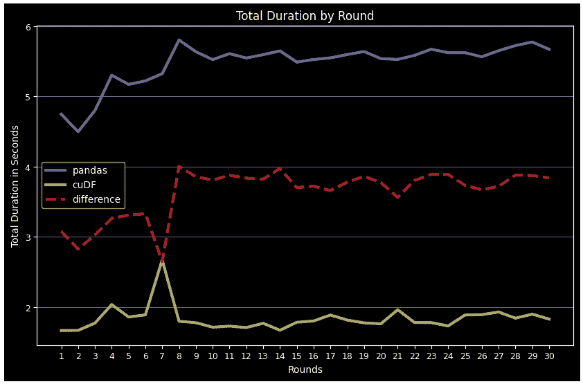

展示-21：Pandas 数据框和 cuDF 每轮所有操作的总时长（作者图片）

尽管我们没有涵盖数据集上每个特征工程任务，但它们与我们在这里展示的任务相同或类似。通过逐个解释 14 个操作，我们试图记录*Pandas* 数据框和*cuDF*的相对性能，并实现可重复性。

在所有情况下，除了相关性计算和数据框显示外，*cuDF* 都优于*Pandas*。这种性能优势在复杂任务如 groupby、merge、agg 和 describe 中尤为显著。另一个方面是，当更多轮次进行时，*Pandas* 数据框会变得疲惫，而*cuDF*则保持更稳定的模式。

请记住，我们只以一个股票作为例子进行回顾。如果我们处理所有 112 只股票，我们可以预期*cuDF*会表现得更好。如果股票的数量增加到数百只，*cuDF*的性能甚至可能更为显著。在大数据的情况下，执行并行任务是可能的，像*Dask-cuDF*这样的分布式框架，可以将并行计算扩展到*cuDF* GPU 数据框，是合适的工具。

## 参考文献

[1] RAPIDS 定义，[`www.heavy.ai/technical-glossary/rapids`](https://www.heavy.ai/technical-glossary/rapids)

[2] 10 分钟了解 cuDF 和 Dask-cuDF，[`docs.rapids.ai/api/cudf/stable/user_guide/10min/`](https://docs.rapids.ai/api/cudf/stable/user_guide/10min/)

[3] Optiver 实现的波动率预测，[`www.kaggle.com/competitions/optiver-realized-volatility-prediction/data`](https://www.kaggle.com/competitions/optiver-realized-volatility-prediction/data)

[4] 向前填充图书数据，[`www.kaggle.com/competitions/optiver-realized-volatility-prediction/discussion/251277`](https://www.kaggle.com/competitions/optiver-realized-volatility-prediction/discussion/251277)

**[Hasan Serdar Altan](https://twitter.com/HSerdarAltan)** 是数据科学家和 AWS 云架构师助理。

### 相关主题

+   [RAPIDS cuDF 备忘单](https://www.kdnuggets.com/2023/05/cudf-data-science-cheat-sheet.html)

+   [RAPIDS cuDF 加速你的数据科学工作流](https://www.kdnuggets.com/2023/04/rapids-cudf-speed-next-data-science-workflow.html)

+   [RAPIDS cuDF 在 Google Colab 上加速数据科学](https://www.kdnuggets.com/2023/01/rapids-cudf-accelerated-data-science-google-colab.html)

+   [构建 GPU 机器与使用 GPU 云](https://www.kdnuggets.com/building-a-gpu-machine-vs-using-the-gpu-cloud)

+   [2022 特征存储峰会：一个关于特征工程的免费会议](https://www.kdnuggets.com/2022/10/hopsworks-feature-store-summit-2022-free-conference-feature-engineering.html)

+   [前往与归来……一个 RAPIDS 故事](https://www.kdnuggets.com/2023/06/back-again-rapids-tale.html)
