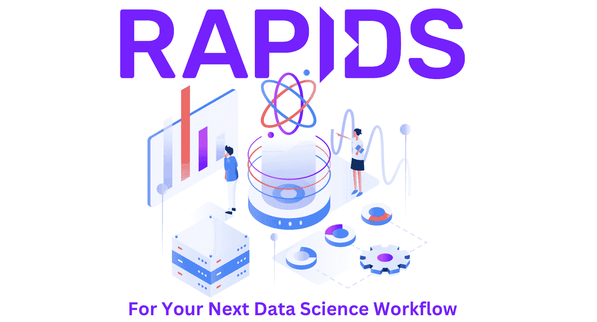
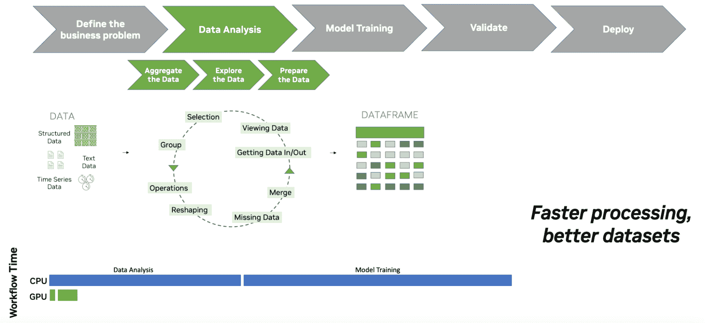
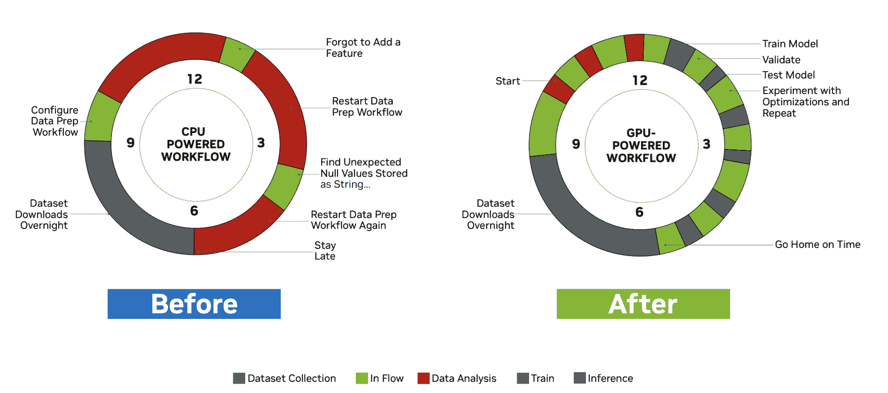
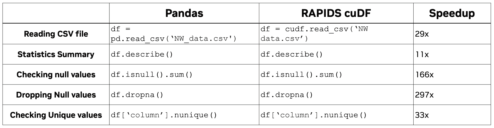
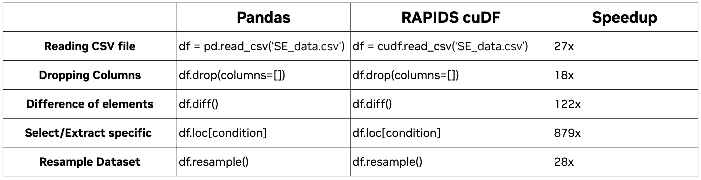

# RAPIDS cuDF 加速你的下一次数据科学工作流

> 原文：[`www.kdnuggets.com/2023/04/rapids-cudf-speed-next-data-science-workflow.html`](https://www.kdnuggets.com/2023/04/rapids-cudf-speed-next-data-science-workflow.html)

图片来源：作者

多年来，数据科学应用呈指数级增长，得益于从各种来源收集的数据。在过去 10 年里，我们见证了数据科学、机器学习和深度学习的实施。尽管我们听到更多关于机器学习和深度学习的消息，但许多公司关注的是核心数据科学技术，因为这是他们赚钱和节省大量资金的地方。

* * *

## 我们的前三大课程推荐

 1\. [谷歌网络安全证书](https://www.kdnuggets.com/google-cybersecurity) - 快速进入网络安全职业道路

 2\. [谷歌数据分析专业证书](https://www.kdnuggets.com/google-data-analytics) - 提升你的数据分析技能

 3\. [谷歌 IT 支持专业证书](https://www.kdnuggets.com/google-itsupport) - 支持你的组织在 IT 方面

* * *

然而，研究表明 [68% 的数据研究未被使用，90% 的数据未被结构化](https://www.forbes.com/sites/forbestechcouncil/2022/03/11/massive-data-means-massive-opportunity-key-questions-to-help-your-company-find-a-way-out-of-data-stagnation/)。这是因为公司未能关注数据分析处理阶段，因为这可能需要大量的时间、金钱和资源。

数据分析阶段包括数据聚合、数据探索和模型准备，占据数据科学家在数据管道中 40% 的时间。当前的 CPU 解决方案可能会使这一过程变得更长，从而拖慢模型开发。为了解决这个问题，有一个名为 RAPIDS 的 GPU 隔离解决方案。

# 什么是 RAPIDS？

RAPIDS 是一个 GPU 数据科学隔离平台，你可以在 GPU 上完成端到端的数据科学管道开发。如前所述，数据分析阶段占据了数据科学家 40% 的时间。然而，使用 RAPIDS 可以显著缩短你的数据分析时间。

从下图中，你可以看到在数据分析阶段使用 CPU 和 GPU 的工作流时间差异。

图片来源：Nvidia

从 CPU 转到 GPU 使你能够：

+   利用 NVIDIA CUDA 实现更快的工作流

+   缩短训练时间并实现更快的部署

+   在 GPU 上加速整个数据科学管道

+   通过一行代码更改加速熟悉的数据科学库

+   简化了在 NVIDIA GPU 上的数据科学工作

+   提高现有 Python 用户的生产力

+   用于内存中数据准备的 GPU 加速计算

+   针对大数据集的分析进行了优化

+   从大型数据集中提供实时洞察

在下面的图像中，你可以看到使用 CPU 和 GPU 的典型数据科学工作流之间的区别：

图片来源于 Nvidia

# RAPIDS cuDF

RAPIDS cuDF 是一个 Python 中的 GPU 数据框架库，具有类似 Pandas 的 API，集成在 PyData 生态系统中。用户可以从文件、NumPy 数组和 Pandas 数据框架创建 GPU 数据框架，并利用 RAPIDS 的其他 GPU 加速库轻松创建机器学习管道。

cuDF 与 Pandas API 非常接近，但并不完全替代 Pandas。cuDF 和 Pandas 之间有一些相似之处和不同之处。例如，cuDF 支持类似于 Pandas 的数据结构和操作，如索引、筛选、连接、联接、分组等。要检查 cuDF 是否支持特定的 Pandas API，可以查看[API 文档](https://docs.rapids.ai/api/cudf/stable/api_docs/index.html)。

### 探索性数据分析

探索性数据分析是分析和总结数据集的过程，以便获得更多关于数据的见解和对模式的更好理解。你可以通过使用总结统计来量化数据，以了解分布情况，并能够检测异常值、异常情况和缺失数据。

探索性数据分析面临的挑战包括：

+   处理大型和复杂的数据集

+   理解多个变量之间的关系

+   执行计算密集型、运行时间长的查询

+   识别并用适当的方法填补缺失的数据点

+   处理维度灾难

+   ，以及更多。

你可以自然地提高探索数据的时间，通过使用类似 Pandas 的操作，但运行速度显著更快。

### 时间序列数据处理

时间序列数据处理是指在固定时间间隔内收集的数据点，例如股票价格、天气数据和传感器读数。这有助于识别趋势、预测未来事件和检测异常。

时间序列数据面临的挑战包括：

+   数据来自多种来源，格式各异

+   数据质量可能受到众多现实世界事件的影响

+   缺失数据、异常值和虚假记录使得处理变得复杂

+   模式和关系可能随着时间变化

+   模型和预测迅速变得过时

+   高维度需要大量的计算能力和内存

+   ，以及更多。

再次，cuDF 通过几乎相同的 pandas 端点支持复杂的数据操作。

如你所见，Pandas 和 cuDF 在代码方面差异不大。然而，速度上有显著差异。

# 结论

每位数据科学家都希望减少数据科学流程中的几天或几周的时间浪费。为何不通过升级到 RAPIDS cuDF 来改变这段时间的浪费呢？

此外，RAPIDS cuDF 现在已在 Google Colab 上推出。请查看这里：[RAPIDS cuDF Google Colab](https://colab.research.google.com/github/rapidsai-community/showcase/blob/main/getting_started_tutorials/cudf_pandas_colab_demo.ipynb?ncid=ref-inor-594904)

如果你想了解更多关于 cuDF 和 Pandas 之间的差异，或想了解更多关于 cuDF 的信息以及如何将其用于你的下一次数据科学流程，请阅读：

+   [cuDF 与 Pandas 的比较](https://docs.rapids.ai/api/cudf/stable/user_guide/pandas-comparison.html)。

+   [10 分钟了解 cuDF 和 Dask-cuDF](https://docs.rapids.ai/api/cudf/stable/user_guide/10min.html)

+   [开始使用 RAPIDS 的方法](https://developer.nvidia.com/rapids)

**[Nisha Arya](https://www.linkedin.com/in/nisha-arya-ahmed/)**是一位数据科学家、自由技术作家及 KDnuggets 的社区经理。她特别感兴趣于提供数据科学职业建议或教程以及数据科学相关的理论知识。她还希望探索人工智能如何在提升人类生命长度方面发挥作用。作为一个热衷学习的人，她寻求拓宽技术知识和写作技能，同时帮助指导他人。

### 更多相关话题

+   [RAPIDS cuDF 在 Google Colab 上的加速数据科学](https://www.kdnuggets.com/2023/01/rapids-cudf-accelerated-data-science-google-colab.html)

+   [RAPIDS cuDF 速查表](https://www.kdnuggets.com/2023/05/cudf-data-science-cheat-sheet.html)

+   [使用 RAPIDS cuDF 利用 GPU 进行特征工程](https://www.kdnuggets.com/2023/06/rapids-cudf-leverage-gpu-feature-engineering.html)

+   [那里与回来… RAPIDS 的故事](https://www.kdnuggets.com/2023/06/back-again-rapids-tale.html)

+   [7 种 GPT 帮助改进数据科学工作流程](https://www.kdnuggets.com/7-gpts-to-help-improve-your-data-science-workflow)

+   [通过 Scikit-learn 管道简化你的机器学习工作流程](https://www.kdnuggets.com/streamline-your-machine-learning-workflow-with-scikit-learn-pipelines)
