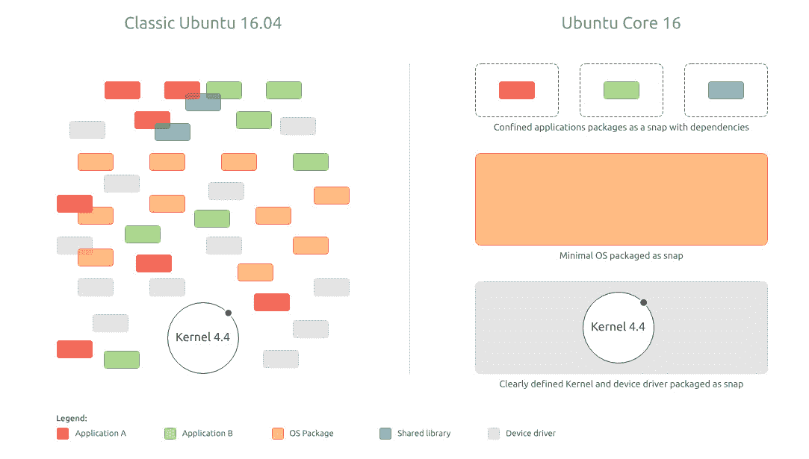
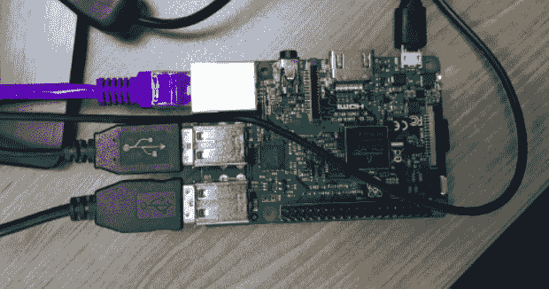
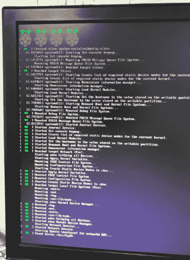
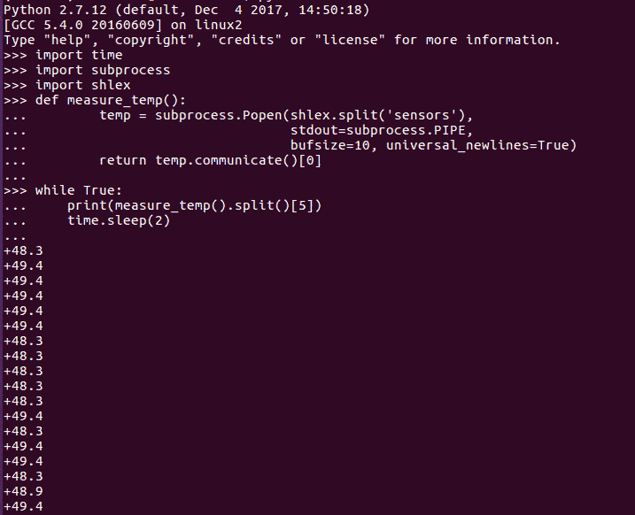
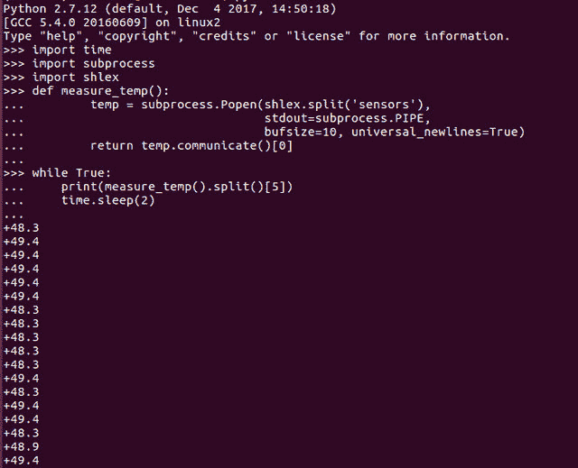
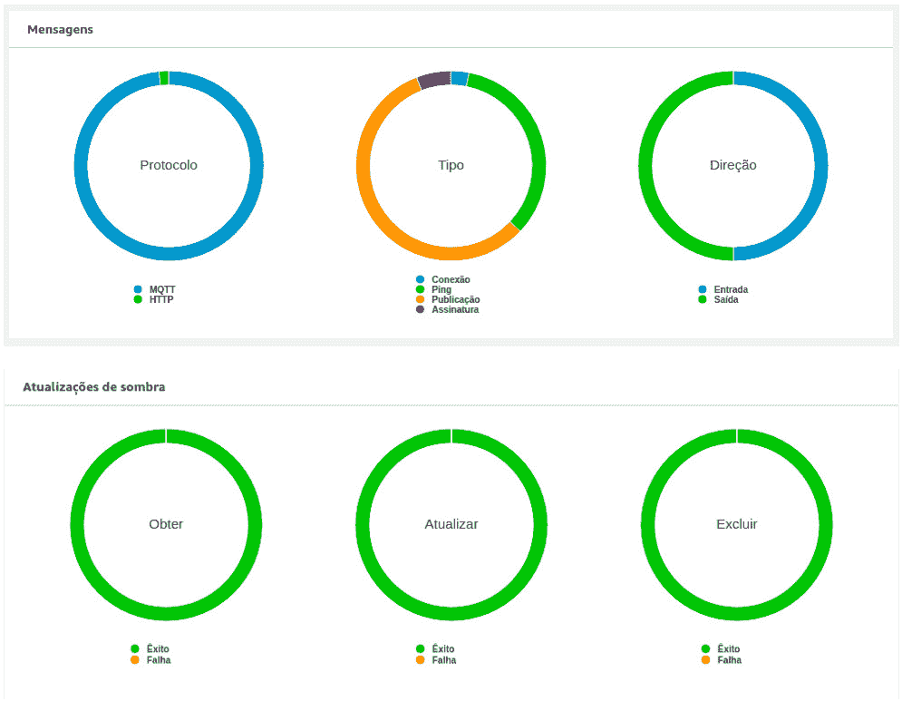

# 树莓派 IoT 项目：乐趣与利润

> 原文：[`www.kdnuggets.com/2018/09/raspberry-pi-iot-projects-fun-profit.html`](https://www.kdnuggets.com/2018/09/raspberry-pi-iot-projects-fun-profit.html)

 评论

**由 鲁本斯·津布雷斯，数据科学家**

软件和硬件之间的边界令人着迷。我们数据科学家习惯于为商业目的开发机器学习算法，这些模型的输出通常以利润、成本节约甚至无形的成果（如客户满意度）来衡量。当然，我们可以使用 Power BI、Tableau 或云端的 Kibana、Quick Sight 或 Tago 等仪表盘来可视化我们的模型输出。但看到我们模型的结果在现实世界中展现出来，而不仅仅是屏幕上，这是一种相当有成就感的体验。

* * *

## 我们的三大课程推荐

 1\. [Google 网络安全证书](https://www.kdnuggets.com/google-cybersecurity) - 快速进入网络安全职业道路。

 2\. [Google 数据分析专业证书](https://www.kdnuggets.com/google-data-analytics) - 提升你的数据分析能力

 3\. [Google IT 支持专业证书](https://www.kdnuggets.com/google-itsupport) - 支持你所在组织的 IT 工作

* * *

我一直在金融和电信领域从事 IoT 工作。可以轻松地在仪表盘上生成关于特定系统故障的警报，例如 BTS（基站）的饱和，即电信信号通过的节点。现在想象一下，除了在仪表盘上的警报外，我们还会自动将电信数据流量重定向到另一个位置，以确保销售点（POS）始终保持连接。这将提高收单方的利润和商家的满意度。我们甚至可以在现实世界中调整机器的设置。

在 IoT 项目中，我们与硬件密切合作。设备如 POS、功率和水表、甘蔗磨、Libelium 套件（用于农业）、电梯、健康设备会发送可以进行分析的遥测数据，以开发预测维护模型，从而帮助企业降低成本、提高效率，同时优化物流。在这些情况下，可以使用 SIM 卡、Wi-Fi、蓝牙或无线信号（LoRa）实现连接。

IoT 解决方案的一部分是网关。它在设备（温度、湿度传感器）和云之间充当中介。在我之前的帖子中，我解释了如何将笔记本电脑转换为 IoT 设备，提供了如何将数据从设备发送到 AWS，并实现端到端解决方案的详细信息 (kdnuggets.com/2018/06/zimbres-iot-aws-machine-learning-dashboard.html)。

在这篇文章中，我将解释如何从命令行运行 IoT 项目，不使用图形界面，使用树莓派 3 的 Ubuntu Core。更简单的方法是使用 Raspbian，它为你的项目提供了图形界面。Raspbian 是一个基于 Debian 的计算机操作系统。然而，我决定尝试 Ubuntu Core，因为安全性应成为 IoT 中的主要关注点。Ubuntu Core 可以用于数字标牌、机器人、无人机和边缘网关。这是一个更具挑战性和安全性的决定。

下图显示了普通 Linux 系统和 Ubuntu Core 之间的区别：



Ubuntu Core 是一个轻量级系统，核心在于**安全**。它由 snaps 组成，即“自包含、隔离和保护的代码片段”。即使使用 vim 命令 `ESC :w !sudo tee %`，也很难修改系统中的只读文件。

由于这是一个 ARM 系统，在其上安装机器学习库是相当不同的，因为有一些特定于此类型系统的包，并且许多依赖项没有包含，连“wget”也没有。所以，让我们开始吧。当你购买树莓派时，它没有能源源（右上角下面）和 SD 卡（右侧突出）。Model 3 B 具有 4 个 USB 接口和一个以太网接口。它还包含 HDMI、音频和摄像头接口。在这个项目中，我们不会使用鼠标，显示器、以太网电缆和键盘仅在系统的第一次运行中用于设置互联网连接。



首先要做的是在 SD 卡（micro）上安装操作系统。因此，从他们的网站下载 Ubuntu Core 镜像：[`cdimage.ubuntu.com/ubuntu-core/16/stable/current/ubuntu-core-16-pi3.img.xz`](http://cdimage.ubuntu.com/ubuntu-core/16/stable/current/ubuntu-core-16-pi3.img.xz)

然后，下载 Etcher 以将映像刷入卡中：[`etcher.io/`](https://etcher.io/)

现在，你需要生成私钥和公钥，这些密钥将上传到你的 Ubuntu One 账户（https://login.ubuntu.com/）。

```py

mkdir ~/.ssh
chmod 700 ~/.ssh
ssh-keygen -t rsa -b 4096

```

然后，复制密钥代码并粘贴到你的 Ubuntu One 账户中：

```py

ssh-rsa ABCDEF1234512345 user@Dell

```

将卡插入树莓派，并打开电源开关。瞧，系统将启动：



初次运行时需要几秒钟，然后你将被引导到网络配置界面。配置 DHCP 以及你的 Wi-Fi 用户名和密码。然后 Ubuntu Core 会提供你应该用来 ssh 的地址。

以防万一，请确保端口 22（用于 ssh）已开启：

```py

sudo ufw allow 22

```

现在，我们将把密钥复制到客户端计算机中的新目录 `.ssh`：

```py

ssh-keygen -R 192.168.15.XXX
mkdir .ssh
cp id_rsa ~/.ssh/id_rsa
cp id_rsa.pub ~/.ssh/id_rsa.pub
cd .ssh

```

我们准备通过 ssh 连接到我们的 Raspberry。运行：

```py

ssh -vvv user@192.168.15.XXX 
Or
ssh -vvv 192.168.15.XXX -l user

```

-vvv 命令将为你提供关于 ssh 连接的详细信息。连接时，会弹出一个窗口要求输入密码。你已连接，登录信息将发生变化：

`user@localhost:~$`

此时，你可以断开显示器、键盘和以太网电缆，因为通信将通过 Wi-Fi 完成，整个项目将通过命令行进行。现在，让我们安装 snap classic，一个容器，我们将在其中安装机器学习库：

```py

sudo snap install classic --edge --devmode
sudo classic

Creating classic environment
Parallel unsquashfs: Using 4 processors
11111 inodes (11975 blocks) to write
[===========================================================/] 11975/11975 100%

(classic)user@localhost:~$ sudo apt update
(classic)user@localhost:~$ sudo apt install snapcraft build-essential git

```

此时，你可以回到我之前的文章，测量 CPU 温度并发送到 Amazon AWS（kdnuggets.com/2018/06/zimbres-iot-aws-machine-learning-dashboard.html），或者我们可以继续：

```py

export LC_ALL=C
source .bashrc
pip install setuptools
pip install AWSIoTPythonSDK

```



在 Ubuntu Core 中，生成和编辑笔记本并不简单。你不能打开 Jupyter、Spyder 或甚至 Notepad 创建新文件，因为没有图形界面。你必须使用命令 “touch” 创建文件：

```py

touch AWS_Send_0.py

```

创建新文件后，你可以使用 “vim” 命令打开和编辑文件，并粘贴代码：

```py

vi AWS_Send_0.py

```

输入“i”，然后 CTRL+SHIFT+V 代码，地址为： https://github.com/RubensZimbres/Repo-2018/blob/master/CPU%20Temperature%20-%20IoT%20Project/AWS_Send_test.py

之后，输入：

```py

ESC :wq ENTER

```



这会保存文件。请记得将 rootCA.pem + *.crt + *private.pem.key + *.public.pem.key 复制到你的 Raspberry 上，以便正确访问 AWS IoT Core。

运行以下命令将 Raspberry CPU 温度发送到 AWS：

```py

python AWS_Send_0.py -e a23312345.iot.us-east-1.amazonaws.com -r rootCA.pem -c 123412345-certificate.pem.crt -k 12345-private.pem.key -id arn:aws:iot:us-east-1:1123112345:thing/CPUDevice -t 'Topic'

```

你将通过 IoT Core 仪表板检查你的连接：



重要的是要注意，你是在 Ubuntu classic 环境下的 chroot 中运行 Python。因此，需要使用 “sudo python” 来访问 Raspberry 的 GPIO（通用输入/输出）。

### 更多相关主题

+   [使用 tqdm 在 Python 中创建进度条以获取乐趣和利润](https://www.kdnuggets.com/2022/09/progress-bars-python-tqdm-fun-profit.html)

+   [初学者友好的 Python 项目，充满乐趣！](https://www.kdnuggets.com/2022/10/beginner-friendly-python-projects-fun.html)

+   [短小有趣的课程，让你快速了解生成性 AI](https://www.kdnuggets.com/short-and-fun-courses-to-get-you-up-to-speed-about-generative-ai)

+   [AIoT 革命：人工智能和物联网如何改变我们的世界](https://www.kdnuggets.com/2022/07/aiot-revolution-ai-iot-transforming-world.html)

+   [KDnuggets 新闻，7 月 27 日：AIoT 革命：人工智能和物联网如何…](https://www.kdnuggets.com/2022/n30.html)

+   [机器学习项目中的简单快速数据流](https://www.kdnuggets.com/2022/11/simple-fast-data-streaming-machine-learning-projects.html)
