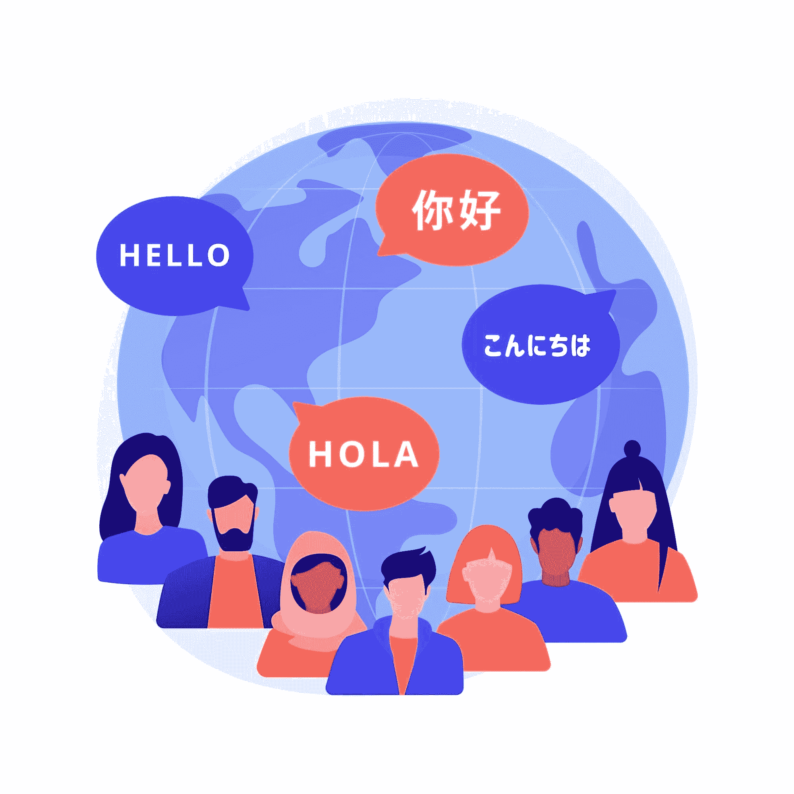
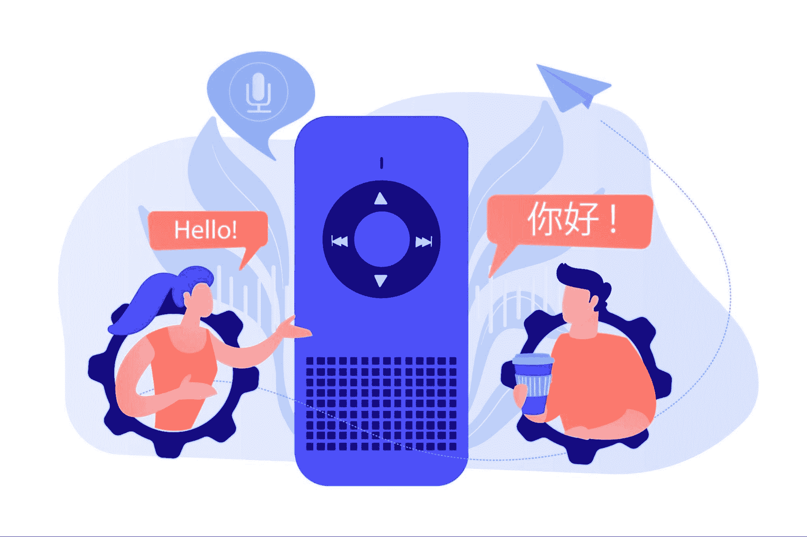
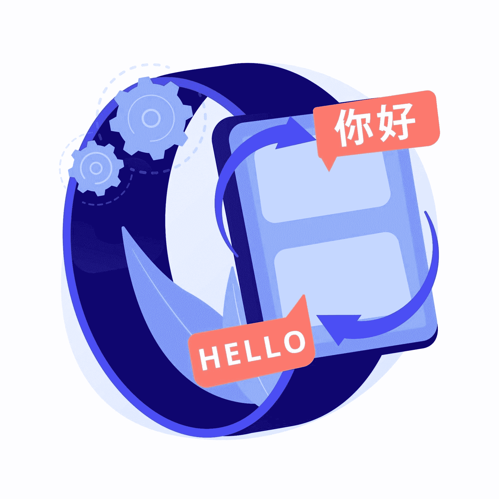
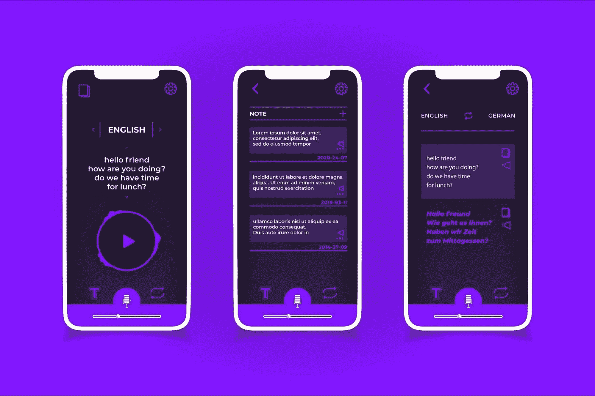

# 人工智能的实时翻译

> 原文：[`www.kdnuggets.com/2022/07/realtime-translations-ai.html`](https://www.kdnuggets.com/2022/07/realtime-translations-ai.html)

무궁화 꽃이 피었습니다

这就是《鱿鱼游戏》中娃娃所说的。但你怎么知道呢！你有字幕在屏幕上。

* * *

## 我们的前三大课程推荐

 1\. [谷歌网络安全证书](https://www.kdnuggets.com/google-cybersecurity) - 快速进入网络安全职业的快车道。

 2\. [谷歌数据分析专业证书](https://www.kdnuggets.com/google-data-analytics) - 提升你的数据分析技能

 3\. [谷歌 IT 支持专业证书](https://www.kdnuggets.com/google-itsupport) - 支持你所在的组织的 IT

* * *

像《鱿鱼游戏》和《纸钞屋》这样的节目在 Netflix 排行榜上名列前茅，为观众提供了全新的戏剧和娱乐类型，探索不同语言的内容。在疫情期间，人们被锁在家中，这种特殊的方式让世界更加紧密地联系在一起。尽管这种亲近感已经在逐渐增长，但全球各地的各种发展使得“世界是一个大家庭”的概念比以往任何时候都更加真实。现代技术正在帮助我们以越来越无缝和实时的方式解读和翻译我们周围的世界。尽管当今世界充满了商业和经济活动，但随着贸易和商业活动跨越国界，国家之间的沟通也显著增加。在这种情况下，翻译是唯一允许跨通信的方法，也是将所有社会联系在一起的关键。因此，我们还没有完全实现，但语言的障碍比以往任何时候都小，而实时翻译的概念在人工智能的帮助下已不再是幻想。

# 什么是实时翻译？

实时翻译技术是一种技术驱动的解决方案，能够快速将材料从一种语言翻译成另一种语言。实时翻译是一项功能，可以即时将另一种语言翻译成用户选择的语言。任何人都可以使用这种技术来快速核实事实、获取快速翻译，并与说外语的人沟通。这提高了效率，并在企业层面提升了客户体验，使公司能够用数百种语言与客户连接，同时仍然利用现有的联络中心、服务台和员工。这项技术对全球组织来说是一个游戏规则改变者。它消除了对双语人员的需求，同时将公司与以前难以触及的客户、员工和合作伙伴连接起来。

# 实时翻译如何与人工智能协作？

随着时间的推移，实时翻译的方法经历了重大变化。旧版本的这项技术会将语音转换为文本，然后再翻译成目标语言。随着 AI 的使用，这一方法得到了进一步改进。当前的实时翻译技术基于人工智能和几种类型的[机器学习](https://algoscale.com/artificial-intelligence-solution-providers/)，采用了能够区分噪声的高级模式匹配软件。它使用声音识别软件来匹配模式。为了准确理解所说内容并在词汇和句子的上下文中理解，使用了神经网络和深度学习程序。

这项技术正试图更快地翻译语音。该技术还访问了一个包含常见词汇、意义和其他数据的大型数据库，这些数据是通过对数百万份多语言文档的过去分析获得的。这些工具通过分析声音波形，聆听正在说的词语，并将与翻译相关的语音部分进行分类。它分析声音波形，以确定哪些语音部分与其翻译相关。然后，该技术将语音转换为其在目标语言中识别为常见的内容。

# 当前情况

近年来，实时翻译技术已经进步到完成翻译的预期时间现在少于 2 到 5 秒。由于许多翻译技术依赖于基于云的数据，语音和翻译之间存在差距。随着网络速度的提高，这一差距很可能会增加。[阿里巴巴](https://www.alibabacloud.com/blog/alibaba-ai-broadcasted-live-with-real-time-translation-in-214-languages_596952)于 2020 年 10 月 21 日进行了全球首场实时翻译 214 种语言的电子商务直播。Facebook 在社交网络、Messenger 和 Instagram 上使用人工智能，每天进行超过 60 亿次翻译。

Google Translate 主导了在线翻译领域，提供将全球数百万种语言翻译的工具。用户可以使用 Google Translate 进行文本、文档和网页的跨语言翻译，这是 Google 开发的多语言神经机器翻译服务。截至 2021 年 12 月，它支持 109 种语言，并且截至 2016 年 4 月，它拥有超过 5 亿的累计用户，每天翻译超过 1000 亿个词。Google 还发布了包括实时语言翻译功能的无线耳机和 Pixel Buds。这一功能可以实时翻译两个讲不同语言的人的对话。此外，Google 最近表示，这一实时翻译功能将应用于所有支持 Google Assistant 的智能手机和耳机，使实时翻译对每个人都可用。

Google AI 还发布了 Translatotron 的第二个迭代版本，即 S2ST 模型，它可以在不使用多个中间子系统的情况下直接进行两种语言之间的语音翻译。Translatotron 于 2019 年发布，是由 Google AI 团队开发的端到端语音到语音翻译模型，该公司表示这是第一个将一种语言的语音直接转换为另一种语言的语音的端到端框架。

# 前进中的挑战

随着网络工具和机器学习的进步，预计大多数企业将采用实时语言翻译技术，这将帮助他们开发新的收入渠道。然而，为了满足需求，连接必须足够可靠，以加快翻译过程的速度。尽管近年来翻译领域取得了显著进展，但不要期望你的手机、智能音响、PC 或耳机能够很快打破所有语言障碍。同时，尽管有些翻译方法依赖于机器，但 AI 驱动的机器翻译方法不可能取代在高风险政治、法律、金融和健康相关对话中的昂贵且熟练的人类口译员、翻译员和多语言专家。另一个问题是，翻译在受控条件下或在有大量数据训练模型的情况下效果最好，而在当前的语言环境下可能并非如此。虽然实时语言翻译系统可以帮助打破语言障碍，但获得理解和信任需要一套更复杂的行为和对文化差异的尊重。

# 结论

随着世界向更精细的沟通形式发展，实时翻译将为更统一、高效和专业的翻译系统铺平道路，这一系统由技术引导，并依托于以往的翻译努力。这就是为什么，由于实时翻译技术将会持续存在，公司应该利用它来加速翻译过程。实时语言翻译很快将可在所有渠道和平台上使用，包括社交媒体和面对面交流。虽然人类翻译员的效能无可争议，但有了[人工智能](https://algoscale.com/artificial-intelligence-solution-providers/)的团队，实时翻译技术将成为翻译的未来之路。

**[Neeraj Agarwal](https://www.linkedin.com/in/neeagl/)**是[Algoscale](https://www.linkedin.com/company/algoscale)的创始人，这是一家数据咨询公司，涵盖数据工程、应用人工智能、数据科学和产品工程。他在这一领域拥有超过 9 年的经验，帮助了从初创公司到财富 100 强企业的各种组织摄取和存储大量原始数据，以便将其转化为可操作的见解，从而实现更好的决策和更快的商业价值。
