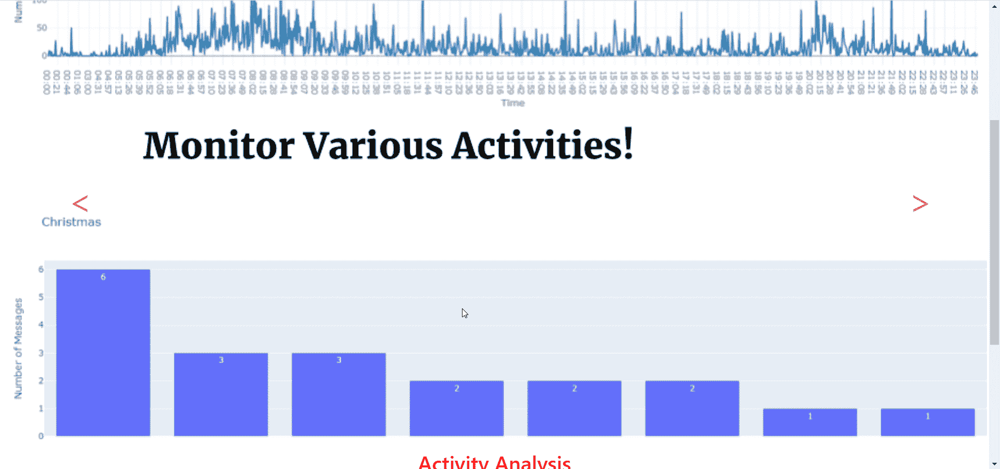
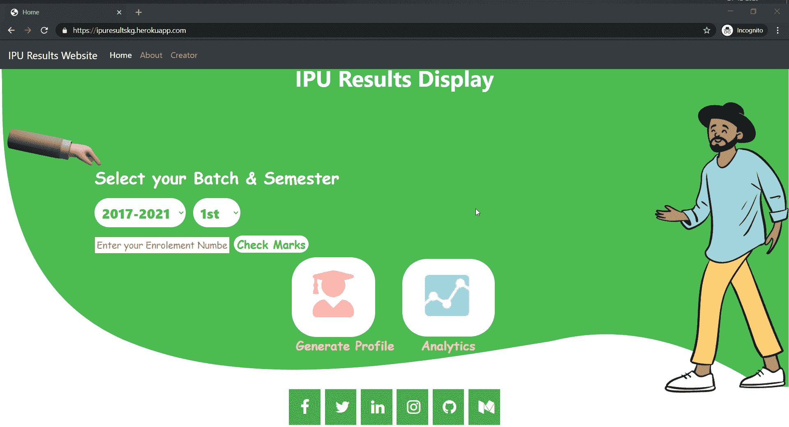
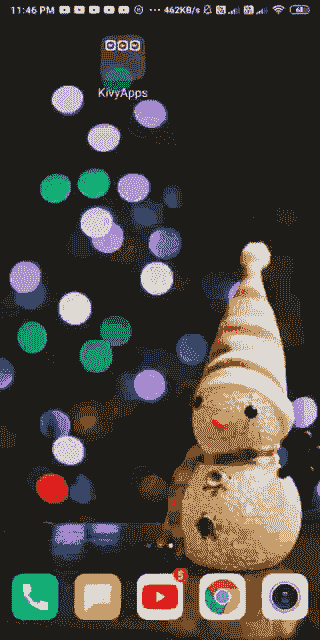
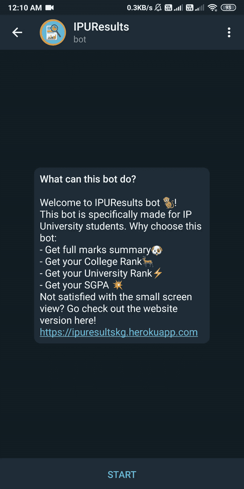
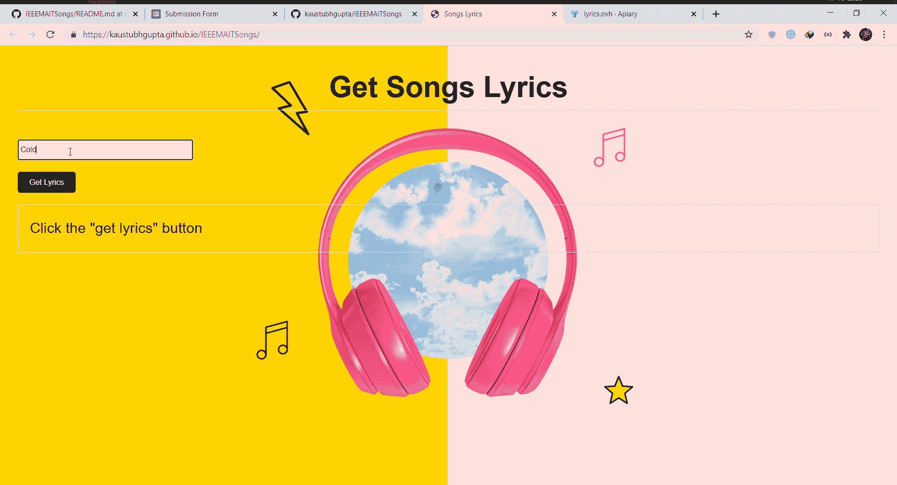
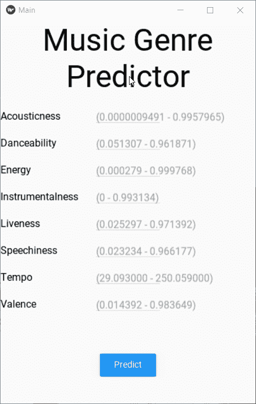
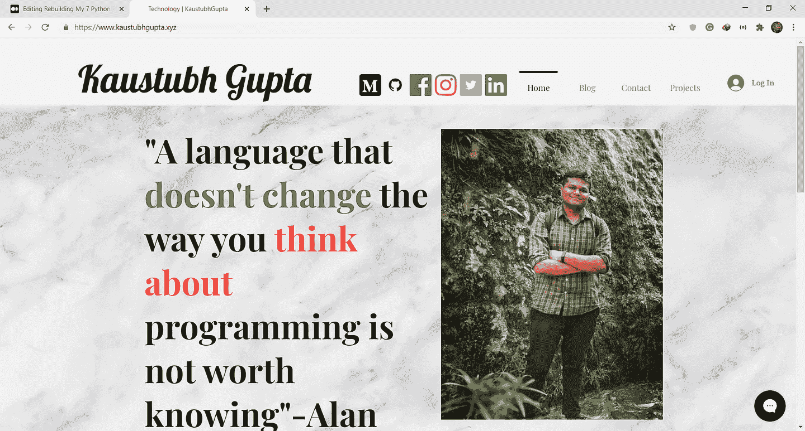

# 重建我的 7 个 Python 项目

> 原文：[`www.kdnuggets.com/2021/05/rebuilding-7-python-projects.html`](https://www.kdnuggets.com/2021/05/rebuilding-7-python-projects.html)

评论

**由[Kaustubh Gupta](https://www.linkedin.com/in/kaustubh-gupta/)，Python 开发者**

照片由[Fotis Fotopoulos](https://unsplash.com/@ffstop?utm_source=medium&utm_medium=referral)提供，来源于[Unsplash](https://unsplash.com/?utm_source=medium&utm_medium=referral)

* * *

## 我们的前三大课程推荐

 1\. [谷歌网络安全证书](https://www.kdnuggets.com/google-cybersecurity) - 快速进入网络安全职业生涯。

 2\. [谷歌数据分析专业证书](https://www.kdnuggets.com/google-data-analytics) - 提升你的数据分析技能

 3\. [谷歌 IT 支持专业证书](https://www.kdnuggets.com/google-itsupport) - 支持你的组织的 IT 工作

* * *

Python 是像我这样的编程爱好者最喜欢的语言。我对这门语言有浓厚的兴趣，并且使用了超过 2 年。今年我有很多闲暇时间来提升我的编程技能，并开发了许多围绕网页开发、安卓应用和数据科学的项目。在这篇文章中，我将解释每个项目的目的、我是如何制作的、与该项目相关的文章以及 GitHub 仓库链接。也许这能激发你脑海中的类似项目想法！让我们来探索这些项目吧。

### 1\. PortfolioFy

作为开发者，我们创建了数以百计的仓库，但其中很少有真正成为我们在社交媒体/LinkedIn 上展示的最终项目。这项 GitHub 操作允许你生成一个自我更新的作品集，包含项目、黑客马拉松和最新博客。这个操作生成一个索引文件，并借助 GitHub 页面在提交到仓库后立即部署。这个项目的主要目的是帮助你展示你作为开发者的技能。

由此操作生成的示例预览！

最初，该项目仅支持一个非常基本的主题，但随着我不断收到社区的反馈，另一个主题被添加到项目中。现在，这个操作变得更加灵活，可以选择约束条件，例如是否添加博客、黑客马拉松，选择你想展示的 GitHub 统计数据类型，所有这些在较新版本中都变为可选项。

**[相关文章](https://towardsdatascience.com/github-action-that-automates-portfolio-generation-bc15835862dc)**

**[GitHub 仓库](https://github.com/kaustubhgupta/PortfolioFy)**

### 2\. WhatsApp 群聊分析器

作为数据科学的追随者，我总是对发现数据中的趋势充满好奇。我总是尝试寻找可以轻松获取数据的现实世界场景，当我发现 WhatsApp 具有导出群聊的功能时，我忍不住要分析这些数据。我为我的大学小组做了这项工作，对此感到满意，但随后产生了一个想法：为什么不开发一个通用的网络应用程序，让任何人都可以上传他们的聊天文件并获取一些有趣的见解呢！这正是这个项目的目的。

展示网络应用使用情况的 GIF

它会处理导出的聊天记录文件（不包括媒体文件），对其进行清理，运行所有统计生成的自定义函数，并实时展示给用户！上传的文件在统计生成后会立即删除，以保护隐私。这个网络应用展示了总的表情符号计数、在群成员中的使用情况、每天成员的活动情况、总体活动情况及指定假期的活动情况，还有一些其他功能！这是一个优秀的数据清理和可视化项目，或者你可以基于这些数据开发一个预测模型，预测某人下一次的聊天内容。可能性无限！

**[相关文章](https://towardsdatascience.com/is-family-group-that-bad-results-will-shock-you-573f64e194be)**

**[GitHub 仓库](https://github.com/kaustubhgupta/WhatsApp-Groups-Analyser)**

### 3\. 大学成绩门户

我目前在印度上大学（大三），正在攻读本科学位。我的大学以长 PDF 的形式发布学期考试成绩，这些 PDF 通常包含大量对学生不相关的信息。甚至科目名称也是以编码形式出现，很难计算获得的学分。此外，由于每年每个批次大约有 6000 名学生，手动预测候选人的排名几乎是不可能的。为了简化这个过程，我开发了一个解析脚本，可以读取这些长 PDF（有些接近 400 页！），将其存储为可读格式，应用所有的数据转换技术，以获得学分点、百分比以及在学院和大学级别的排名！

IPU 是我的大学的名字

假设每学期平均有 5000 条记录，我拥有 2017 年批次及以后的记录，每年有两个学期。因此，到目前为止我大概有 6 万条记录！该网站还提供了生成个人资料的功能，可以调取所有前一个学期的结果。这是我做过的最大的项目之一，整个过程花了大约 2 个月才完全满意。

**[相关文章](https://towardsdatascience.com/how-pandemic-has-affected-college-scores-analysis-on-real-dataset-e6cea8c469b1)**

**[网站链接](https://ipuresultskg.herokuapp.com/)**

### 4\. 大学安卓应用

由于我成功地开发了网站，是时候将此功能扩展到其他平台，并发现如何用 Python 制作 Android 应用。这个过程得益于一个了不起的库——Kivy，以及 Kivymd 的材料设计。它能够向后端 API 发起请求，并以表格形式显示结果。掌握这个库花费了很多时间，但值得。

展示应用使用的 GIF

一旦我开发了这个应用，我对它产生了浓厚的兴趣，于是我在 Medium 上写了一个完整的系列文章，如果你有兴趣了解这个库，这里是第一部分：

[**用 Python 构建 Android 应用：第一部分**](https://towardsdatascience.com/building-android-apps-with-python-part-1-603820bebde8)

**[GitHub 仓库](https://github.com/kaustubhgupta/IPUResultAndroidApp)**

### 5\. Telegram 机器人！

我认为，我在这个结果项目上做得太多了，还制作了一个 Telegram 机器人！在开发机器人的第一个版本时，我犯了一个大错误，运行了一个无限循环来检查新消息，这个过程消耗了大量资源。当我第一次将其部署到 Heroku 时，第二天我收到邮件，说我当前的小时数已被消耗，那时我才意识到我犯了一个大错误。为了解决这个问题，我采用了 Telegram 的 webhook 概念，使得消息能够直接重定向到我的链接。

另一件我做的事是将机器人集成到 Flask 服务器中，这有助于防止机器人进入无限循环！现在每当有人发起结果请求时，它会将请求发送到休眠中的 Heroku 应用程序，并且通过这个请求，应用程序状态发生变化，结果也会被发送出去。

**[GitHub 仓库](https://github.com/kaustubhgupta/TelegramBot-IPU)**

**[机器人链接](https://t.me/ipuBOT)**

### 6\. 歌词提取器

这个项目对我来说很特别，因为通过这个项目，我赢得了一个比赛！这个项目使用了 Brython，使你可以在前端网站上运行 Python 代码，而无需使用 Flask、Django 或其他服务器。我做了一个歌曲歌词提取器，它根据传递给网站的艺术家名字和专辑进行 API 调用。这个项目非常简单，我将其托管在 GitHub Pages 上，确保了更长的正常运行时间且没有持续成本！

作者提供的 GIF 示例

**[相关文章](https://towardsdatascience.com/run-python-code-on-websites-exploring-brython-83c43fb7ac5f)**

**[GitHub 仓库](https://github.com/kaustubhgupta/IEEEMAITSongs)**

### 7\. KivyML 应用

在发现 Kivy & Kivymd 库时，我发现我可以在安卓上部署机器学习模型。这是一种间接的方法，因为目前 python-to-android 不支持 sklearn。我不得不将模型作为 API 部署在 Heroku 上，然后通过 GET 请求获取预测结果，并将其显示在用户屏幕上。虽然这是一种初步的方法，还有许多其他东西可以在这里实现，但这就是我在构建这个项目时能想到的所有方法。

**[相关文章](https://analyticsindiamag.com/deploying-machine-learning-models-in-android-apps-using-python/)**

**[GitHub 仓库](https://github.com/kaustubhgupta/KivyMLApp)**

### 额外项目 - 我的个人网站！

这不是一个基于 Python 的项目，而是一个自动生成的 Wix 网站，我于 2019 年 7 月购买用于博客目的。尽管一旦我转向 Medium 平台进行博客写作后，我对这个网站的维护就减少了，而且由于年末我承诺升级所有可以展示的项目，我不得不对其进行调整，以便访客能够舒适地浏览。

作者网站的图片预览

[**KaustubhGupta (www.kaustubhgupta.xyz) - 了解所有关于技术和一般生活方式的内容**](https://www.kaustubhgupta.xyz/)

这个网站包含了我所有个人和非技术性的文章，我每年写这些文章的次数非常少。

### 结论

这就是我今年如何升级和管理我的 Python 项目。我还做了很多其他项目，但这些是我为这篇文章挑选的前 7 个。做一个项目是一个系统的过程，从构思、设计、编码，如果适用的话，还包括在互联网上部署。我希望我给读者们提供了一些激励，让你们能提出自己的想法，并向世界展示你们的技能。

至此，我们来到了这篇文章的结尾，也告别了 2020 年！祝所有读者圣诞快乐（我的生日也在这一天：圣诞节????），如果你喜欢我的文章或者从中受益，请确保在 Medium 上关注我，或者你可以通过 LinkedIn 联系我。再见！

**简历: [Kaustubh Gupta](https://www.linkedin.com/in/kaustubh-gupta/)** 是一位对数据科学和机器学习感兴趣的 Python 开发者，曾参与多个数据相关项目，对机器学习的实际应用充满兴趣。

[原文](https://towardsdatascience.com/rebuilding-my-7-python-projects-8c629079c8e6)。经许可转载。

**相关:**

+   如何在 2021 年组织你的数据科学项目

+   数据科学家的软件工程最佳实践

+   2020 年 10 个令人惊叹的机器学习项目

### 更多相关内容

+   [每个数据科学家都应该知道的三个 R 库（即使你使用 Python）](https://www.kdnuggets.com/2021/12/three-r-libraries-every-data-scientist-know-even-python.html)

+   [什么让 Python 成为初创企业的理想编程语言](https://www.kdnuggets.com/2021/12/makes-python-ideal-programming-language-startups.html)

+   [停止学习数据科学以寻找目标，并通过…寻找目标](https://www.kdnuggets.com/2021/12/stop-learning-data-science-find-purpose.html)

+   [一个 90 亿美元的 AI 失败案例分析](https://www.kdnuggets.com/2021/12/9b-ai-failure-examined.html)

+   [学习数据科学统计的顶级资源](https://www.kdnuggets.com/2021/12/springboard-top-resources-learn-data-science-statistics.html)

+   [成功数据科学家的 5 个特征](https://www.kdnuggets.com/2021/12/5-characteristics-successful-data-scientist.html)
