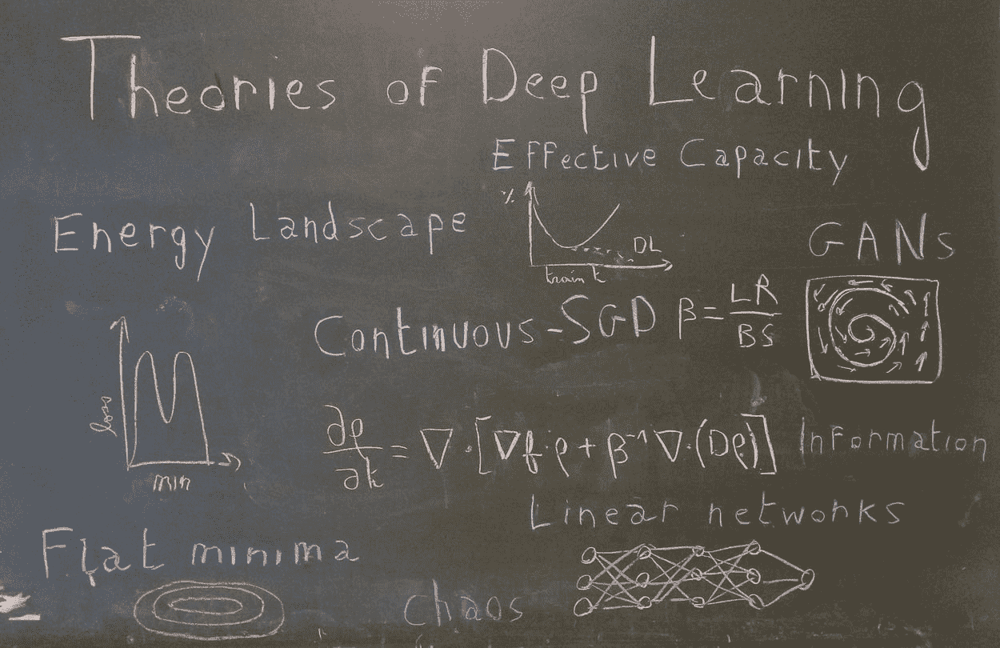
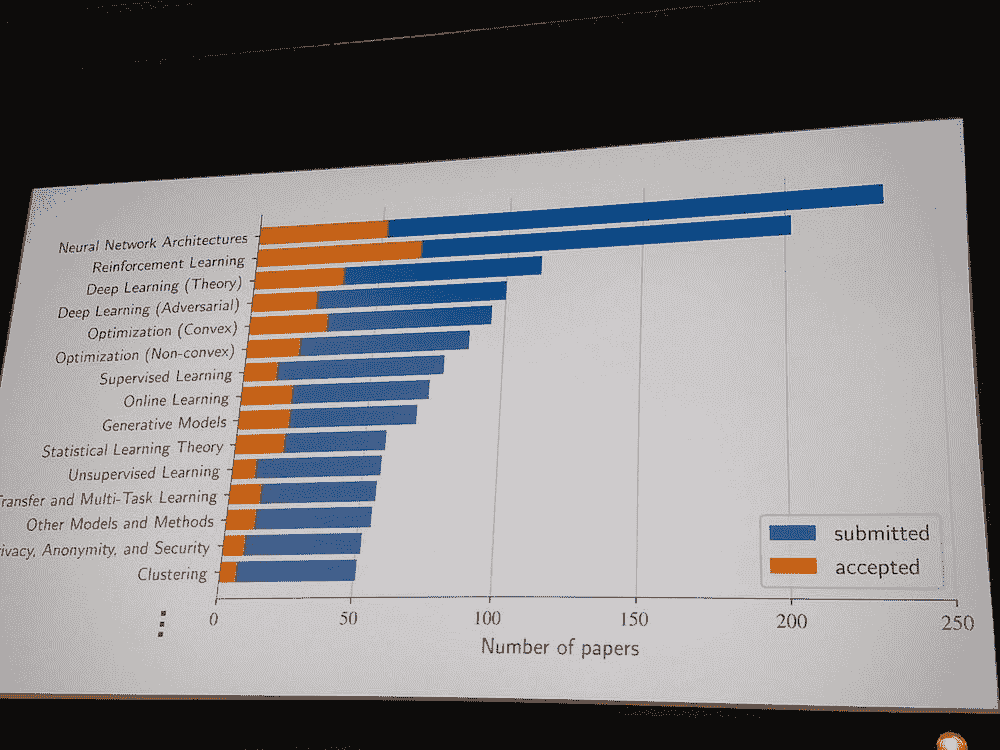
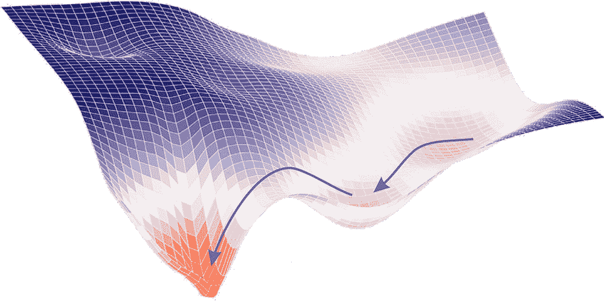
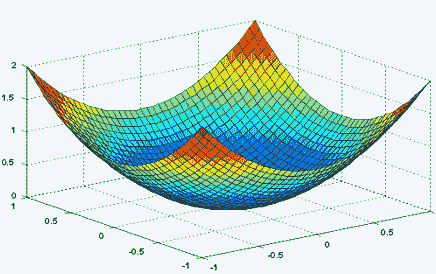
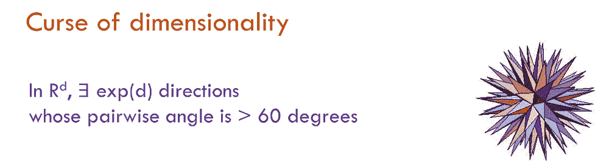
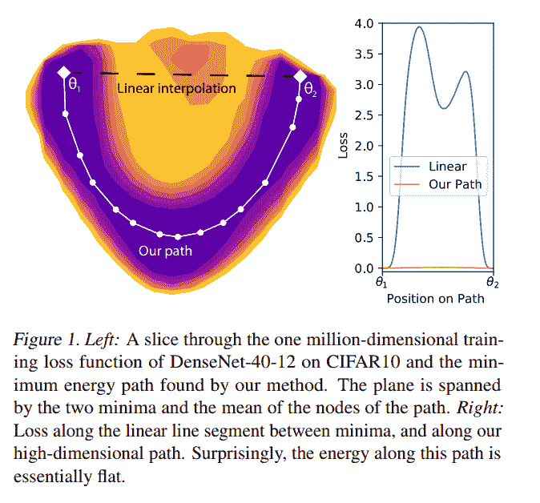
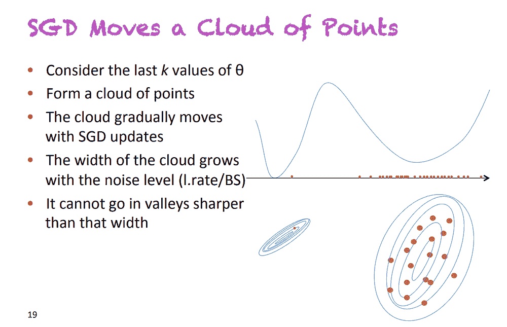
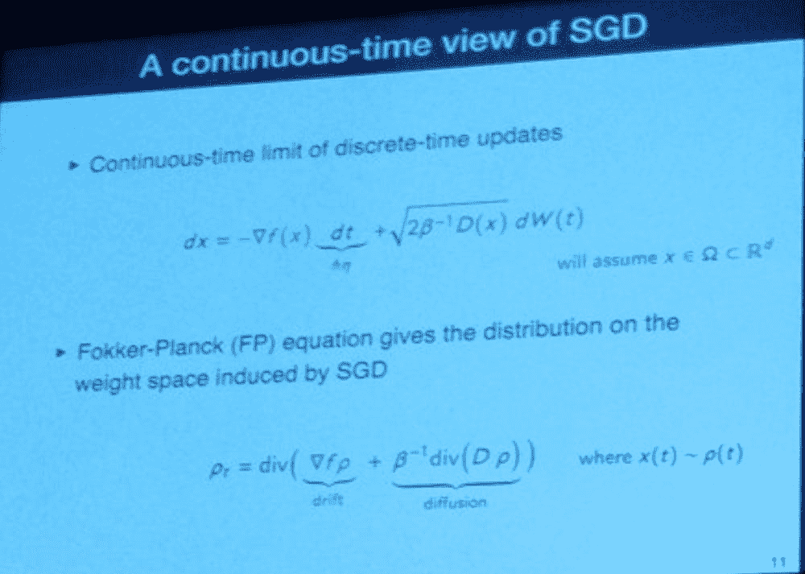
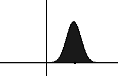
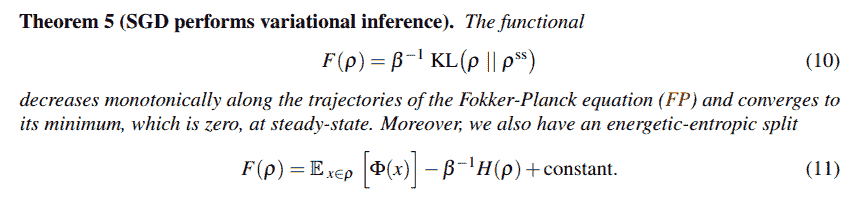

# 最近为了更好理解深度学习的进展

> 原文：[`www.kdnuggets.com/2018/10/recent-advances-deep-learning.html`](https://www.kdnuggets.com/2018/10/recent-advances-deep-learning.html)

 评论

**由[Arthur Pesah](https://twitter.com/artix41?lang=en)**。

> *我希望生活在一个建立在**严谨、可靠、可验证的知识**基础上的世界，而不是炼金术的世界。[...] 简单的实验和简单的定理是帮助理解复杂现象的**基石**。*

对深度学习的更好**理解**的呼吁是 Ali Rahimi 在 2017 年 12 月 NIPS 上[Test-of-Time Award presentation](http://www.argmin.net/2017/12/05/kitchen-sinks/)的核心。通过将深度学习与炼金术进行比较，Ali 的目标不是要抛弃整个领域，而是[“开启对话”](http://www.argmin.net/2017/12/11/alchemy-addendum/)。这个目标[确实已实现](https://syncedreview.com/2017/12/12/lecun-vs-rahimi-has-machine-learning-become-alchemy/)且人们[仍在争论](https://twitter.com/RandomlyWalking/status/1017899452378550273)我们当前的深度学习实践是否应被视为炼金术、工程还是科学。

七个月后，机器学习社区再次聚集，这次是在斯德哥尔摩举行的国际机器学习会议（ICML）。会议吸引了超过 5000 名参与者和 629 篇论文，是关于基础机器学习研究的最重要事件之一。而**深度学习理论**已成为会议的最大主题之一。

这种重新引起的兴趣在第一天就显露出来，会议中最大的一个房间里充满了准备听取[Sanjeev Arora 的深度学习理论理解](http://unsupervised.cs.princeton.edu/deeplearningtutorial.html)讲座的机器学习从业者。在他的演讲中，普林斯顿大学计算机科学教授总结了当前深度学习理论研究的领域，将其分为四个分支：

+   **非凸优化**：我们如何理解与深度神经网络相关的高度非凸损失函数？为什么随机梯度下降算法甚至能够收敛？

+   **过度参数化与泛化**：在经典统计理论中，泛化依赖于参数的数量，但在深度学习中却不是这样。为什么？我们能否找到其他好的泛化衡量指标？

+   **深度的作用**：深度如何帮助神经网络收敛？深度与泛化之间有什么联系？

+   **生成模型**：为什么生成对抗网络（GANs）效果如此好？我们可以利用哪些理论属性来稳定它们或避免模式崩溃？

在这系列文章中，我们将基于最新的论文尝试在这四个领域建立直觉，特别关注 ICML 2018。

这篇文章将集中于深度网络中非凸优化的奥秘。

### **非凸优化**

> *我敢打赌，你们很多人都尝试过从头开始训练一个深度网络，却因为无法使其表现良好而感到沮丧。我认为这不是你的错，而是梯度下降的问题。*

Ali Rahimi 在 NIPS 的讲座中以挑衅的语气说道。随机梯度下降（SGD）确实是深度学习的基石。它应该能够找到一个高度非凸优化问题的解决方案，理解它何时有效或无效以及原因，是我们在深度学习的一般理论中必须解决的最根本的问题之一。更具体地说，非凸优化在深度神经网络中的研究可以分为两个问题：

+   损失函数的样子是什么？

+   为什么 SGD 会收敛？

### **损失函数的样子是什么？**

如果我让你可视化一个全局最小值，很可能你脑海中第一个出现的表示方式会像这样：

这很正常。在二维世界中，围绕全局最小值找到一个**严格**凸的问题并不罕见（这意味着此点的 Hessian 矩阵的两个特征值都将严格为正）。但在拥有数十亿参数的世界中，例如深度学习中，围绕全局最小值的方向没有一个是平坦的几率是多少？或者等效地，Hessian 矩阵中不含单个零（或接近零）特征值的几率是多少？

Sanjeev Arora 在他的教程中提到的第一个评论是，损失函数上可以采取的可能方向的数量随着维度的增加而呈指数增长。

然后，直观上，全局最小值似乎不可能是一个点，而是一个**连接的流形**。这意味着如果你达到了全局最小值，你应该能够在一个平坦的路径上行走，其中所有的点也都是最小值。这一点已经在大型网络中被海德堡大学的一组团队在他们的论文[ 神经网络能量景观中的基本无障碍](https://icml.cc/Conferences/2018/Schedule?showEvent=2780) [1]中通过实验验证。他们提出了一个更为普遍的论断，即任何两个全局最小值可以通过平坦路径连接。

已经知道这对于 MNIST 上的 CNN 或 PTB 上的 RNN [2] 是成立的，但这项工作将这一知识扩展到更大的网络（一些 DenseNets 和 ResNets），这些网络在更高级的数据集（CIFAR10 和 CIFAR100）上进行训练。为了找到这条路径，他们使用了来自分子统计力学的启发式方法，称为 AutoNEB。其思想是创建一个初始路径（例如线性路径）在两个最小值之间，并在该路径上放置支点。然后，迭代地修改支点的位置，以最小化每个支点的损失，并确保支点之间的距离保持大致相同（通过用弹簧建模支点之间的空间）。

如果他们没有理论上证明这一结果，他们给出了一些关于为什么存在这样的路径的直观解释：

> *如果我们扰动一个参数，比如通过添加一个小常数，但让其他参数自由适应这种变化以仍然最小化损失，可以认为通过某种调整，其他无数参数可以“弥补”对仅一个参数施加的变化*

因此，这篇论文的结果可以帮助我们通过过参数化和高维空间的视角以不同的方式看待最小值。

更一般地，当考虑神经网络的损失函数时，你应该始终记住，在某一点上的可能方向数是巨大的。另一个后果是鞍点必须比局部最小值更加丰富：在给定（关键）点上，在数十亿个可能方向中，很可能会找到一个向下的方向（如果你不在全局最小值中）。这种直觉在一篇发表于 NIPS 2014 的论文中被严谨地形式化和实证证明： [高维非凸优化中的鞍点问题识别与攻击](https://arxiv.org/abs/1406.2572) [6]

### 为什么 SGD 会收敛（或不收敛）？

优化深度神经网络的第二个重要问题与 SGD 的收敛性质有关。虽然这个算法长期以来被视为梯度下降的更快但近似版本，但我们现在有证据表明 SGD 实际上收敛到更好、更通用的最小值 [3]。但我们能否形式化它并定量解释 SGD 逃离局部最小值或鞍点的能力？

#### SGD 修改了损失函数

论文 [一种替代视角：SGD 何时逃离局部最小值？](https://arxiv.org/abs/1802.06175) [4] 显示，执行 SGD 等同于对卷积（因此平滑的）损失函数进行常规梯度下降。从这一观点出发，在某些假设（作者证明在实践中通常是正确的）下，他们证明了 SGD 能够逃离局部最小值，并收敛到全局最小值附近的一个小区域。

#### SGD 由随机微分方程支配

另一种真正改变了我对这一算法看法的方法是*连续 SGD*。这个想法是由 Yoshua Bengio 在他的讲座[关于随机梯度下降、平坦性和泛化](http://www.iro.umontreal.ca/~bengioy/talks/ICMLW-nonconvex-14july2018.pptx.pdf)中提出的，该讲座在 ICML 非凸优化研讨会上进行。SGD 并不是在损失函数上移动一个点，而是移动一个**点云**，或者换句话说，**一个分布**。

幻灯片摘自讲座[关于随机梯度下降、平坦性和泛化](http://www.iro.umontreal.ca/~bengioy/talks/ICMLW-nonconvex-14july2018.pptx.pdf)*，由 Y. Bengio 在 ICML 2018 上进行。他展示了看待 SGD 的一种替代方式，在这种方式中，你将点替换为分布（点云）*

这个点云的大小（即相关分布的方差）与因子*learning_rate / batch_size* 成正比。Pratik Chaudhari 和 Stefano Soatto 在研讨会上展示的精彩论文[随机梯度下降执行变分推断，收敛到深度网络的极限周期](https://arxiv.org/pdf/1710.11029.pdf) [5]中给出了这个证明。这个公式相当直观：较低的批量大小意味着梯度噪声很大（因为是基于数据集的一个非常小的子集计算的），而较高的学习率意味着步伐噪声较大。

看到 SGD 作为随时间变化的分布的结果是，控制下降的方程现在是[随机偏微分方程](https://en.wikipedia.org/wiki/Stochastic_partial_differential_equation)。更准确地说，在某些假设下，[5] 表明控制方程实际上是一个[**Fokker-Planck 方程**](https://en.wikipedia.org/wiki/Fokker%E2%80%93Planck_equation)。

幻灯片摘自讲座*高维几何与深度网络的随机梯度下降动力学，由 P. Chaudhari 和 S. Soatto 在 ICML 2018 上进行。他们展示了如何将离散系统转化为由 Fokker-Planck 方程描述的连续系统*

在统计物理中，这类方程描述了暴露于拖曳力（使分布漂移，即移动其均值）和随机力（使分布扩散，即增加其方差）的粒子的演化。在 SGD 中，拖曳力由真实梯度建模，而随机力对应于算法固有的噪声。正如上面的幻灯片所示，扩散项与温度项*T=1/β=learning_rate/(2*batch_size)*成正比，这再次显示了这个比率的重要性！

根据 Fokker-Planck 方程，分布的演化。它向左漂移并随时间扩散。来源：[Wikipedia](https://en.wikipedia.org/wiki/Fokker%E2%80%93Planck_equation)

利用这个框架，Chaudhari 和 Soatto 证明了我们的分布将单调收敛到某个稳态分布（从[KL 散度](https://en.wikipedia.org/wiki/Kullback%E2%80%93Leibler_divergence)的角度）：

[5]中的主要定理之一，证明了分布对稳态的单调收敛（从 KL 散度的角度）。第二个方程表明，最小化 F 等同于最小化某个潜力ϕ，并最大化分布的熵（由温度 1/β控制的权衡）。

在上述定理中有几个有趣的点需要评论：

+   SGD 最小化的泛函可以重写为两个项的和（方程 11）：一个潜力Φ的期望值和分布的熵。温度*1/β*控制这两个项之间的权衡。

+   潜力Φ仅取决于数据和网络的架构（而不是优化过程）。如果它等于损失函数，SGD 将收敛到全局最小值。然而，论文表明，这种情况很少发生，了解Φ离损失函数的距离将告诉你 SGD 收敛的可能性。

+   最终分布的熵取决于*learning_rate/batch_size*（温度）。直观上，熵与分布的大小相关，而高温通常意味着具有高方差的分布，这通常表示一个平坦的最小值。由于平坦的最小值通常被认为具有更好的泛化性，这与高学习率和低批量大小通常导致更好最小值的经验发现是一致的。

因此，将 SGD 视为一个随时间变化的分布使我们发现*learning_rate/batch_size*比每个超参数单独考虑在收敛性和泛化性方面更有意义。此外，这使得引入与收敛相关的网络潜力成为可能，这可以为架构搜索提供一个良好的度量。

### **结论**

寻找深度学习理论的过程可以分为两部分：首先，通过玩具模型和实验建立对其如何以及为何有效的直觉，其次，将这些直觉表达为可以帮助解释我们当前结果并取得新成果的数学形式。

在这篇文章中，我们试图传达关于神经网络的高维损失函数和 SGD 的更多直觉，同时展示了为了拥有真正的深度神经网络优化数学理论，新的形式主义正在被构建。

然而，尽管非凸优化是深度学习的基石，其成功主要来自于其能够在层数和参数数量庞大的情况下仍能很好地泛化。这将是下一部分的内容。

### **参考文献**

[1] Felix Draxler, Kambis Veschgini, Manfred Salmhofer, Fred Hamprecht. [神经网络能量景观中的实质性无障碍](https://icml.cc/Conferences/2018/Schedule?showEvent=2780), *ICML 2018.*

[2] C. Daniel Freeman, Joan Bruna. [半矩形网络优化的拓扑与几何](https://arxiv.org/abs/1611.01540), a*rXiv:1611.01540*, 2016.

[3] Nitish Shirish Keskar, Dheevatsa Mudigere, Jorge Nocedal, Mikhail Smelyanskiy, Ping Tak Peter Tang. [关于深度学习的大批量训练：泛化差距与尖锐极小值](https://arxiv.org/pdf/1609.04836.pdf), *ICLR 2017*

[4] Robert Kleinberg, Yuanzhi Li, Yang Yuan. [另一种观点：SGD 何时逃离局部最小值？](https://arxiv.org/abs/1802.06175), *ICML 2018*

[5] Pratik Chaudhari, Stefano Soatto. [随机梯度下降进行变分推断](https://arxiv.org/pdf/1710.11029.pdf)，收敛到深度网络的极限周期， *ICLR 2018*

[6] Yann Dauphin, Razvan Pascanu, Caglar Gulcehre, Kyunghyun Cho, Surya Ganguli, Yoshua Bengio. [识别并解决高维非凸优化中的鞍点问题](https://arxiv.org/abs/1406.2572), *NIPS 2014*

**简介**: [Arthur Pesah](https://twitter.com/artix41?lang=en) 是 KTH 理论物理学的硕士研究生。机器学习爱好者，物理和数学爱好者，计算机极客。

[原创](https://towardsdatascience.com/recent-advances-for-a-better-understanding-of-deep-learning-part-i-5ce34d1cc914)。经许可转载。

**相关：**

+   [深度学习中的幂律 2：普遍性](https://www.kdnuggets.com/2018/09/power-laws-deep-learning-2-universality.html)

+   [“自动化什么？”——自动化机器学习的分类](https://www.kdnuggets.com/2018/09/auto-what-taxonomy-automated-machine-learning.html)

+   [深度学习框架能力评分 2018](https://www.kdnuggets.com/2018/09/deep-learning-framework-power-scores-2018.html)

* * *

## 我们的前三个课程推荐

 1\. [谷歌网络安全证书](https://www.kdnuggets.com/google-cybersecurity) - 快速进入网络安全职业生涯。

 2\. [谷歌数据分析专业证书](https://www.kdnuggets.com/google-data-analytics) - 提升你的数据分析技能

 3\. [谷歌 IT 支持专业证书](https://www.kdnuggets.com/google-itsupport) - 支持你的组织的 IT

* * *

### 更多相关话题

+   [停止学习数据科学以寻求目标，并寻求目标…](https://www.kdnuggets.com/2021/12/stop-learning-data-science-find-purpose.html)

+   [学习数据科学统计的顶级资源](https://www.kdnuggets.com/2021/12/springboard-top-resources-learn-data-science-statistics.html)

+   [9 亿美元 AI 失败的检讨](https://www.kdnuggets.com/2021/12/9b-ai-failure-examined.html)

+   [成功的数据科学家的 5 个特征](https://www.kdnuggets.com/2021/12/5-characteristics-successful-data-scientist.html)

+   [是什么让 Python 成为创业公司的理想编程语言](https://www.kdnuggets.com/2021/12/makes-python-ideal-programming-language-startups.html)

+   [每个数据科学家都应该知道的三个 R 库（即使你使用 Python）](https://www.kdnuggets.com/2021/12/three-r-libraries-every-data-scientist-know-even-python.html)
