# 使用卷积自编码器重建指纹

> 原文：[`www.kdnuggets.com/2020/03/recreating-fingerprints-using-convolutional-autoencoders.html`](https://www.kdnuggets.com/2020/03/recreating-fingerprints-using-convolutional-autoencoders.html)

评论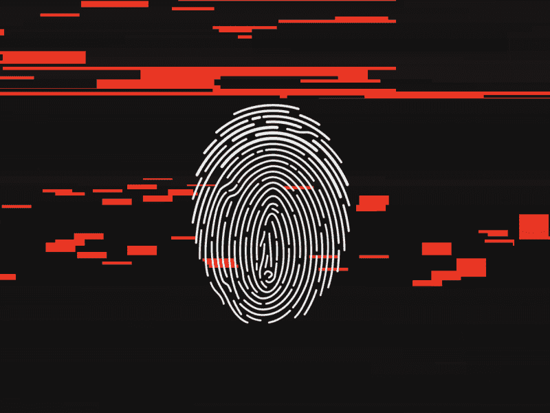

[来源](https://www.pinterest.com/pin/151152131219099327/)

> **生物识别技术** 是身体测量和计算的技术术语。它指的是与人类特征相关的度量。生物识别认证（或现实认证）在计算机科学中用作身份识别和访问控制的一种形式。它也用于识别处于监控中的个人。

生物识别认证系统被分为两种类型：生理生物识别和行为生物识别。生理生物识别主要包括面部识别、指纹、手部几何、虹膜识别和 DNA。而行为生物识别包括击键、签名和语音识别。

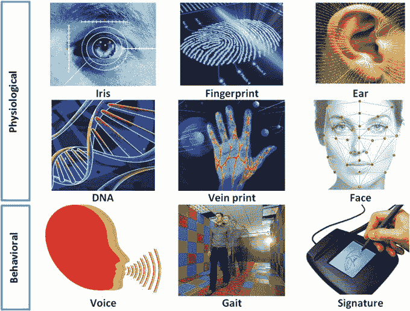

[生物识别类型](https://www.researchgate.net/figure/Various-types-of-biometric-modalities_fig1_321082969)

指纹是用于个人身份识别的最可靠的特征，并且因其独特性和一致性被广泛应用于生物识别认证系统。指纹识别系统在需要高信任度验证或识别个人的许多场合中发挥着关键作用。

尽管自动指纹识别系统（AFIS）取得了巨大的进展，高效且准确的指纹匹配仍然是一个关键挑战。

### 指纹：如同你一样独特

想象一下你把智能手机放错了地方，开始感到恐慌，因为手机里有大量个人信息。你担心，因为你不希望捡到手机的人能够访问它。但随后你记得你已经设置了安全措施，以防这种情况发生。只有你自己才能解锁手机，它知道是你，因为你使用了指纹。

**指纹** 和脚趾印可以用于识别单个个体，因为它们对每个人都是独一无二的，并且不会随着时间而改变。令人惊讶的是，即使是同卵双胞胎的指纹也各不相同，你的手指之间也没有相同的指纹。指纹由**脊线**（即隆起的线条）和**沟壑**（即这些线条之间的凹陷）组成。正是这些脊线和沟壑的图案在每个人身上都是不同的。

脊线的图案是当你的手指触碰到一个表面时留下的印记。如果你留下了指纹，这些脊线会印在纸上，并可以用来匹配你可能在其他地方留下的指纹。

> **人类指纹细节丰富、几乎唯一、难以修改且在个体一生中保持耐用，使其成为长期标记人类身份的合适选择。**

### 指纹特征

第一次接触指纹时，它们看起来复杂。你可能会想知道法医和执法人员如何利用它们。指纹可能看起来复杂，但实际上它们有一般的脊线图案，每个人的指纹都是独一无二的，这使得系统化分类成为可能。

指纹有三种基本脊线图案：“拱形”、“环形”和“涡纹/核心”。

### 拱形纹路

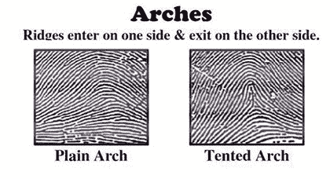

在这种图案类型中，脊线从一侧进入，从另一侧退出。相信全球 5%的人口在指纹中有拱形纹路。

### 环形纹路

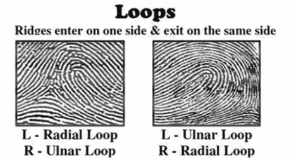

这种图案类型的脊线从一侧进入，从同一侧退出。相信全球 60%–65%的人口在指纹中有环形纹路。

### 涡纹/核心

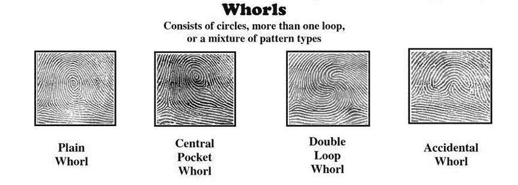

包含圆圈、多个环形或图案类型的混合。相信全球 30%–35%的人口在指纹中有涡纹。

**指纹的独特性**完全由局部脊线特征及其关系决定。指纹中的脊线和沟壑交替，沿局部恒定方向流动。最显著的局部脊线特征有：1) **脊线终点** 和 2) **脊线分叉**。脊线终点定义为脊线突然结束的点。脊线分叉定义为脊线分叉或分裂成支脊的点。这些特征统称为 ***细节点***。

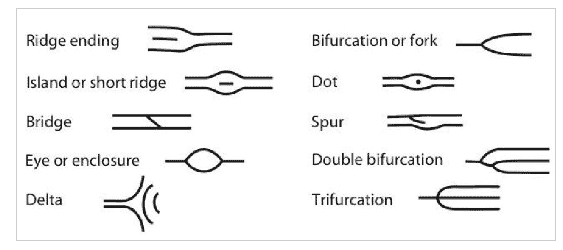  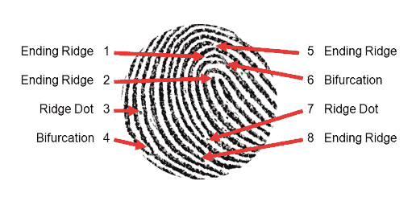

细节点

细节点集合被认为是指纹表示中最独特的特征，并广泛用于指纹匹配。曾认为细节点集合不包含足够的信息来重建提取细节点的原始指纹图像。然而，最近的研究表明，确实可以从细节点表示中重建指纹图像。

### 构建卷积自编码器

在概览指纹及其特征后，是时候利用我们新学会的技能来构建一个能够重建或再现指纹图像的神经网络了。

首先，我们将探索数据集，包括它包含哪些图像、如何读取图像、如何创建图像数组、探索指纹图像，最后对它们进行预处理，以便能够输入模型。

我使用了卷积自编码器来训练模型。接下来，我们将可视化训练和验证损失图，并最终预测测试集。

在这里，我假设你们对卷积神经网络和自编码器已经很熟悉了。不过，我还是会尝试用一句话来解释它们。

一个**卷积神经网络**（CNN）是一个具有一个或多个卷积层的神经网络，主要用于图像处理、分类和分割。

**好的。什么是自编码器？**

自编码器是一类神经网络，其输入与输出是相同的。它们通过将输入压缩到一个潜在空间表示中，然后从该表示中重建输出。了解更多请查看 [这个](http://ufldl.stanford.edu/tutorial/unsupervised/Autoencoders/)。

**那么卷积自编码器是什么？**

卷积运算符允许对输入信号进行滤波，以提取其内容的一部分。传统形式的自编码器没有考虑到信号可以视为其他信号的总和这一事实。而卷积自编码器则使用卷积运算符来利用这一观察结果。它们学习将输入编码成一组简单的信号，然后尝试从这些信号中重建输入。更多信息请 [查看这里](https://pgaleone.eu/neural-networks/2016/11/24/convolutional-autoencoders/)。

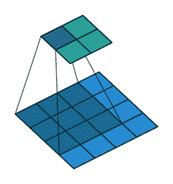

一个 4x4x1 输入与一个 3x3x1 卷积滤波器的卷积操作。

结果是一个 2x2x1 的激活图。 [来源](https://github.com/vdumoulin/conv_arithmetic)

我使用的数据集是 FVC2002 指纹数据集。它由 4 种不同的传感器指纹组成，即低成本光学传感器、低成本电容传感器、光学传感器和合成生成器，每种传感器具有不同的图像尺寸。数据集中有 320 张图片，每种传感器 80 张图片。

[下载数据集](http://bias.csr.unibo.it/fvc2002/databases.asp)。

**加载所需的库：**

```py
import cv2
import matplotlib.pyplot as plt
%matplotlib inline
from skimage.filters import threshold_otsu
import numpy as np
from glob import glob
import scipy.misc
from matplotlib.patches import Circle,Ellipse
from matplotlib.patches import Rectangle
import os
from PIL import Imageimport keras
from matplotlib import pyplot as plt
import numpy as np
import gzip
%matplotlib inline
from keras.layers import Input,Conv2D,MaxPooling2D,UpSampling2D
from keras.models import Model
from keras.optimizers import RMSprop
from keras.layers.normalization import BatchNormalization
```

**加载数据集：**

```py
data = glob('./drive/My Drive/fingerprint/DB*/*')images = []
def readImages(data):
    for i in range(len(data)):
        img = scipy.misc.imread(data[i])
        img = scipy.misc.imresize(img,(224,224))
        images.append(img)
    return imagesimages = readImages(data)
```

现在将这些图像转换为 float32 数组。

```py
images_arr = np.asarray(images)
images_arr = images_arr.astype('float32')
images_arr.shape
```

一旦数据正确加载，你就可以开始分析它，以获取对数据集的一些直观理解。

**数据探索：**

```py
print("Dataset (images) shape: {shape}".format(shape=images_arr.shape))##Dataset (images) shape: (320, 224, 224)
```

从上述输出中，你可以看到数据的形状为 320 x 224 x 224，因为有 320 个样本，每个样本是 224 x 224 维的矩阵。

查看数据集中前 5 张图片：

```py
# Display the first 5 images in training data
for i in range(5):
    plt.figure(figsize=[5, 5])
    curr_img = np.reshape(images_arr[i], (224,224))
    plt.imshow(curr_img, cmap='gray')
    plt.show()
```

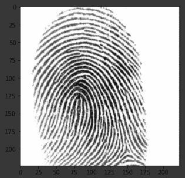    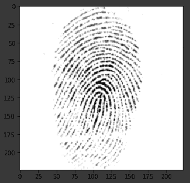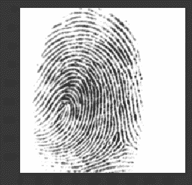  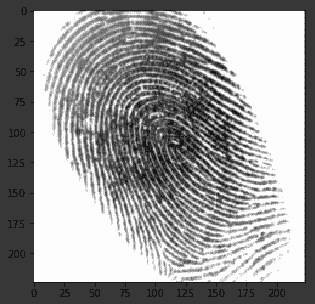

数据集

由于我们可以看到指纹并不是很清晰，因此观察卷积自编码器是否能够学习特征并正确重建这些图像将会很有趣。

数据集中的图像是灰度图像，像素值范围从 0 到 255，尺寸为 224 x 224，因此在将数据输入模型之前，预处理非常重要。我们将首先把每个 224 x 224 的图像转换为 224 x 224 x 1 的矩阵，这样我们就可以将其输入神经网络：

```py
images_arr = images_arr.reshape(-1, 224,224, 1)
images_arr.shape##(320, 224, 224, 1)
```

接下来，我们需要确保检查 NumPy 数组的数据类型；它应该是**float32**格式，如果不是，你需要将其转换为这种格式，你还需要将像素值重新缩放到 0–1 的范围内。

```py
images_arr.dtype
```

如果我们验证，应该得到`dtype('float32')`

接下来，用数据中图像的最大像素值来重新缩放数据：

```py
np.max(images_arr)
images_arr = images_arr / np.max(images_arr)
```

让我们验证数据的最大值和最小值，重新缩放后应该是 0.0 和 1.0！

```py
np.max(images_arr), np.min(images_arr)
```

如果我们验证，应该得到`(1.0, 0.0)`

为了使你的模型能够很好地泛化，你将数据分为两部分：训练集和验证集。你将在 80%的数据上训练模型，并在剩余训练数据的 20%上验证它。

这也有助于减少过拟合的可能性，因为你将在训练阶段未见过的数据上验证你的模型。

```py
from sklearn.model_selection import train_test_split
train_X,valid_X,train_ground,valid_ground = train_test_split(images_arr,images_arr,test_size=0.2,random_state=13)
```

我们不需要训练和测试标签，这就是为什么我们将训练图像传递两次。我们的训练图像将同时作为输入和地面真实值，类似于分类任务中的标签。

现在我们可以定义网络并将数据输入网络。

**卷积自编码器**

图像的大小为 224 x 224 x 1 或 50,176 维的向量。我们将图像矩阵转换为数组，将其重新缩放到 0 和 1 之间，调整形状使其为 224 x 224 x 1，然后将其作为输入提供给网络。

此外，我们将使用 128 的批量大小，使用 256 或 512 的较大批量大小也是可取的，这完全取决于你训练模型的系统。这对确定学习参数和影响预测准确性有很大作用。我们将训练你的网络 300 个 epochs。

```py
batch_size = 128
epochs = 300
x, y = 224, 224
input_img = Input(shape = (x, y, 1))
```

正如你可能已经知道的那样，自编码器分为两部分：编码器和解码器。

**编码器**

+   第一层将具有 32 个 3 x 3 的滤波器，随后是一个下采样（最大池化）层，

+   第二层将具有 64 个 3 x 3 的滤波器，随后是另一个下采样层，

+   编码器的最终层将具有 128 个 3 x 3 的滤波器。

**解码器**

+   第一层将具有 128 个 3 x 3 的滤波器，随后是一个上采样层，

+   第二层将具有 64 个 3 x 3 的滤波器，随后是另一个上采样层，

+   编码器的最终层将具有一个 3 x 3 的滤波器。

最大池化层每次使用时将输入下采样两倍，而上采样层每次使用时将输入上采样两倍。

**注意**：滤波器的数量、滤波器的大小、层的数量、训练模型的周期数，都是超参数，应该根据你自己的直觉来决定，你可以通过调整这些超参数来进行新的实验，并测量模型的性能。这就是你逐步学习深度学习艺术的方法！

```py
def autoencoder(input_img):
    #encoder
    #input = 28 x 28 x 1 (wide and thin)
    conv1 = Conv2D(32, (3, 3), activation='relu', padding='same')(input_img) #28 x 28 x 32
    pool1 = MaxPooling2D(pool_size=(2, 2))(conv1) #14 x 14 x 32
    conv2 = Conv2D(64, (3, 3), activation='relu', padding='same')(pool1) #14 x 14 x 64
    pool2 = MaxPooling2D(pool_size=(2, 2))(conv2) #7 x 7 x 64
    conv3 = Conv2D(128, (3, 3), activation='relu', padding='same')(pool2) #7 x 7 x 128 (small and thick)#decoder
    conv4 = Conv2D(128, (3, 3), activation='relu', padding='same')(conv3) #7 x 7 x 128
    up1 = UpSampling2D((2,2))(conv4) # 14 x 14 x 128
    conv5 = Conv2D(64, (3, 3), activation='relu', padding='same')(up1) # 14 x 14 x 64
    up2 = UpSampling2D((2,2))(conv5) # 28 x 28 x 64
    decoded = Conv2D(1, (3, 3), activation='sigmoid', padding='same')(up2) # 28 x 28 x 1
    return decodedautoencoder = Model(input_img, autoencoder(input_img))
```

注意，你还必须通过参数 loss 指定损失类型。在这种情况下，是均方误差，因为每个批次后的损失将通过逐像素均方误差计算预测输出批次和真实值之间的差距：

```py
autoencoder.compile(loss='mean_squared_error', optimizer = RMSprop())
```

让我们通过使用 summary 函数来可视化你在上述步骤中创建的层；这将显示每一层中的参数（权重和偏差）数量，以及模型中的总参数。

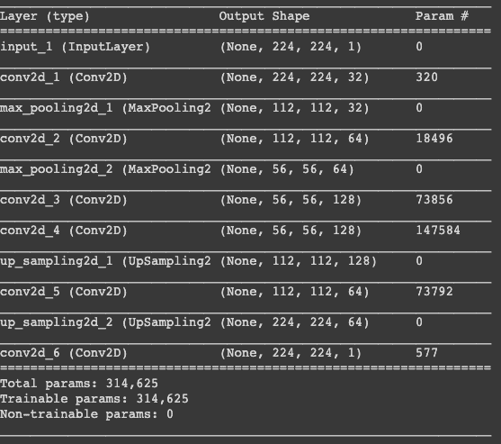

终于到了用 Keras 的 fit()函数训练模型的时候了！模型训练了 300 个周期。

```py
#Training
autoencoder_train = autoencoder.fit(train_X, train_ground, batch_size=batch_size,epochs=epochs,verbose=1,validation_data=(valid_X, valid_ground))
```

最终！你在指纹数据集上训练了 300 个周期的模型，现在，让我们绘制训练和验证数据之间的损失图，以可视化模型性能。

```py
loss = autoencoder_train.history['loss']
val_loss = autoencoder_train.history['val_loss']
epochs = range(300)
plt.figure()
plt.plot(epochs, loss, 'bo', label='Training loss')
plt.plot(epochs, val_loss, 'b', label='Validation loss')
plt.title('Training and validation loss')
plt.legend()
plt.show()
```

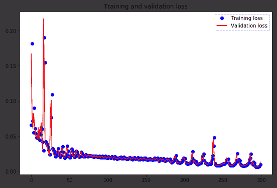

最后，你可以看到验证损失和训练损失都保持同步。这表明你的模型没有过拟合：验证损失在减少而不是增加，

因此，你可以说你的模型的泛化能力很好。

最后，是时候使用 Keras 的 predict()函数来重建测试图像，看看你的模型能多好地重建测试数据。

```py
#Prediction
pred = autoencoder.predict(valid_X)#Reconstruction of Test Images
plt.figure(figsize=(20, 4))
print("Test Images")
for i in range(5):
    plt.subplot(1, 5, i+1)
    plt.imshow(valid_ground[i, ..., 0], cmap='gray')
plt.show()    
plt.figure(figsize=(20, 4))
print("Reconstruction of Test Images")
for i in range(5):
    plt.subplot(1, 5, i+1)
    plt.imshow(pred[i, ..., 0], cmap='gray')  
plt.show()
```

测试图像：

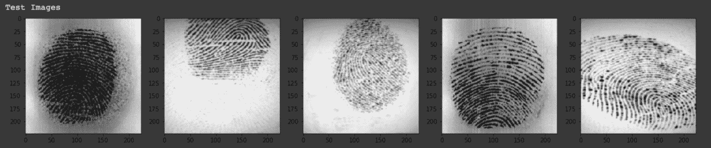

重建图像：

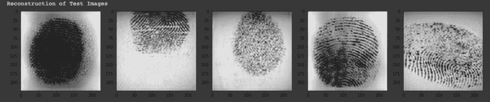

从上述图像中，你可以观察到你的模型在重建你用模型预测的测试图像时表现非常出色。至少在视觉上，测试图像和重建图像看起来几乎相似。

你还可以在我的 Github 中找到代码。

**[nageshsinghc4/Recreating-Fingerprints-using-Convolutional-Autoencoders](https://github.com/nageshsinghc4/Recreating-Fingerprints-using-Convolutional-Autoencoders)**

构建一个能够重建或再现指纹图像的神经网络。我使用的数据集…

### 结论

从未预见到，用于抓捕罪犯的指纹科学会被用于解锁手机和验证支付。当一个注册了的手指放在传感器上时，手机会立即解锁，但它拒绝识别旁边的手指，这就是指纹唯一性的实际体现。

好的，这就是本文的全部内容，希望大家阅读愉快，如果这篇文章对你有帮助，我将非常高兴。欢迎在评论区分享你的评论/想法/反馈。

感谢阅读!!!

**简介：[Nagesh Singh Chauhan](https://www.linkedin.com/in/nagesh-singh-chauhan-6936bb13b/)** 是 CirrusLabs 的大数据开发人员。他在电信、分析、销售、数据科学等多个领域拥有超过 4 年的工作经验，专注于各种大数据组件。

[原始链接](https://towardsdatascience.com/recreating-fingerprints-using-convolutional-autoencoders-5c576e479d4f)。转载已获许可。

**相关：**

+   神经网络 201：关于自编码器的一切

+   使用时间序列分析进行股票市场预测

+   使用机器学习进行系外行星猎寻

* * *

## 我们的三大课程推荐

 1\. [谷歌网络安全证书](https://www.kdnuggets.com/google-cybersecurity) - 快速通道进入网络安全职业。

 2\. [谷歌数据分析专业证书](https://www.kdnuggets.com/google-data-analytics) - 提升您的数据分析技能

 3\. [谷歌 IT 支持专业证书](https://www.kdnuggets.com/google-itsupport) - 支持您的组织的 IT 工作

* * *

### 更多相关主题

+   [使用卷积神经网络 (CNNs) 进行图像分类](https://www.kdnuggets.com/2022/05/image-classification-convolutional-neural-networks-cnns.html)

+   [卷积神经网络综合指南](https://www.kdnuggets.com/2023/06/comprehensive-guide-convolutional-neural-networks.html)

+   [使用 PyTorch 构建卷积神经网络](https://www.kdnuggets.com/building-a-convolutional-neural-network-with-pytorch)

+   [使用 Python 自动化 Microsoft Excel 和 Word](https://www.kdnuggets.com/2021/08/automate-microsoft-excel-word-python.html)

+   [如何使用 Python 确定最佳拟合数据分布](https://www.kdnuggets.com/2021/09/determine-best-fitting-data-distribution-python.html)

+   [使用 Datawig，一个 AWS 深度学习库进行缺失值插补](https://www.kdnuggets.com/2021/12/datawig-aws-deep-learning-library-missing-value-imputation.html)
