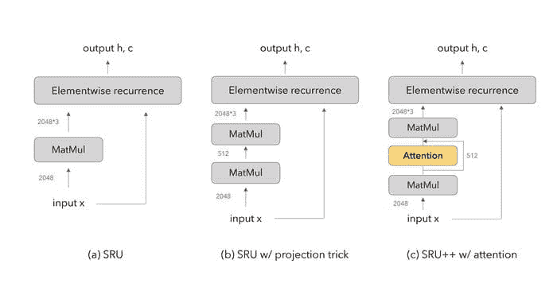
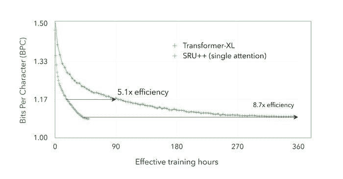

# 使用 SRU++ 降低 NLP 模型训练的高成本

> 原文：[`www.kdnuggets.com/2021/03/reducing-high-cost-training-nlp-models-sru.html`](https://www.kdnuggets.com/2021/03/reducing-high-cost-training-nlp-models-sru.html)

评论

**由 [Tao Lei, PhD](https://www.asapp.com/blog/author/taolei/)，ASAPP 研究负责人和科学家撰写** 

自然语言模型在 NLP 和相关领域取得了各种突破性成果 [[1](https://arxiv.org/abs/1810.04805), [2](https://arxiv.org/abs/2005.14165), [3](https://openai.com/blog/dall-e/), [4](https://arxiv.org/abs/1910.13461)]。与此同时，这些模型的规模大幅增加，参数量达到百万（甚至十亿），同时财务成本也显著上升。

训练大型模型的成本限制了研究社区的创新能力，因为一个研究项目通常需要大量实验。考虑在 [Billion Word](https://opensource.google/projects/lm-benchmark) 基准上训练一个顶级语言模型 [[5](https://arxiv.org/abs/1809.10853)]。一个实验需要 384 GPU 天（6 天 * 64 V100 GPU，或者使用 AWS 按需实例花费高达 $36,000）。构建此类模型的高成本阻碍了它们在实际业务中的使用，并使 AI 和 NLP 技术的货币化变得更加困难。

> 我们的模型在使用 2.5 倍到 10 倍更少的训练时间和成本的情况下，获得了更好的困惑度和每字符比特数（bpc）。我们的结果重申了经验观察，即注意力机制并非我们所需的一切。
> 
> —[Tao Lei, PhD](https://www.asapp.com/blog/author/taolei/)

计算时间和成本的增加突显了发明计算效率高的模型的重要性，这些模型在减少或加速计算的情况下保持顶级建模能力。

Transformer [架构](https://arxiv.org/abs/1706.03762) 被提出以加速 NLP 模型的训练。具体来说，它完全基于自注意力机制，避免使用递归。这一设计选择的理由，如原始工作中所述，是为了实现强大的并行化（通过充分利用 GPU 和 TPU 的计算能力）。此外，注意力机制是一个极其强大的组件，允许高效建模变长输入。这些优势使得 Transformer 成为一种表达能力强且高效的单元，从而成为 NLP 的主要架构。

在 Transformer 发展之后，出现了一些有趣的问题：

+   我们建模时是否只需要注意力机制？

+   如果递归不是计算瓶颈，我们能否找到更好的架构？

### **SRU++ 和相关工作**

我们提出 SRU++ 作为上述问题的可能答案。SRU++ 的灵感来源于两方面的研究：

首先，以前的研究已经解决了 RNN 的并行化/速度问题，并提出了各种快速递归网络 [[7](https://arxiv.org/abs/1611.01576)，[8](https://arxiv.org/abs/1709.02755)，[9](https://arxiv.org/abs/1708.06834)，[10](https://arxiv.org/abs/1905.13324)]。例如，[Quasi-RNN](https://github.com/salesforce/pytorch-qrnn) 和简单递归单元（[SRU](https://github.com/asappresearch/sru)），都是高度并行的 RNN。**这一进展消除了为了提高训练效率而避免使用递归的需求**。

其次，近年来有几项研究通过结合递归和自注意力取得了优异的结果。例如，[Merity](https://arxiv.org/abs/1911.11423)（2019）展示了单头注意力 LSTM（[SHA-LSTM](https://github.com/Smerity/sha-rnn)）足以在字符级语言建模任务中取得有竞争力的结果，同时所需的训练时间显著减少。此外，RNN 被融入了 Transformer 架构中，导致在机器翻译和自然语言理解任务中取得了更好的结果 [[8](https://arxiv.org/abs/1709.02755)，[12](https://arxiv.org/abs/2003.07000)]。**这些结果表明递归和注意力在序列建模中是互补的**。

针对之前的研究，我们通过将自注意力纳入 SRU 架构来增强其建模能力。图 1c 展示了结果架构 SRU++ 的简单示意图。

图 1: SRU 和 SRU++ 网络的示意图。 (a) 原始 SRU 网络，(b) 使用投影技巧减少参数数量的 SRU 变体，Lei 等（2018）进行的实验，以及 (c) 本研究提出的 SRU++。数字表示中间输入/输出的隐藏尺寸。SRU 和 SRU++ 的更详细描述见我们的论文。

SRU++ 通过首先将输入投影到较小的维度来替代输入的线性映射（图 1a）。然后应用注意力操作，接着是残差连接。该维度被投影回 SRU 的逐元素递归操作所需的隐藏尺寸。此外，并不是每个 SRU++ 层都需要注意力。当 SRU++ 中禁用注意力时，网络会降级为使用维度减少的 SRU 变体，从而减少参数数量（图 1b）。

### **结果**

**1\. SRU++ 是一种高效的神经网络架构**

我们在多个语言建模基准上评估了 SRU++，如 Enwik8 数据集。与 Transformer 模型（如 Transformer-XL）相比，SRU++ 可以在只使用一部分资源的情况下实现类似的结果。图 2 比较了两者在直接可比训练设置下的训练效率。SRU++ 的效率比 Transformer-XL 高 8.7 倍，并且达到 BPC（每字符位数）1.17 的效率提高了 5.1 倍。

图 2：Enwik8 数据集上的开发 BPC 与用于训练的 GPU 小时数的关系。SRU++ 和 Transformer-XL 模型均具有 41-42M 参数，并使用 fp32 精度和可比设置（例如学习率）进行训练。

| **模型** | **数据集** | **结果** | **GPU 天数** |
| --- | --- | --- | --- |
| [Longformer](https://arxiv.org/pdf/2004.05150.pdf) | Enwik8 | 0.99 | 104* |
| [全注意力网络](https://arxiv.org/pdf/1907.01470.pdf) | Enwik8 | 0.98 | 64 |
| SRU++ | Enwik8 | 0.97 | 7* |
| SRU++ | Enwik8 | 0.96 | 15* |
| [Transformer](https://arxiv.org/pdf/1809.10853.pdf) | Wiki-103 | 18.7 | 22* |
| [反馈 Transformer](https://arxiv.org/pdf/2002.09402v2.pdf) | Wiki-103 | 18.2 | 214 |
| SRU++ | Wiki-103 | 18.4 | 8* |
| SRU++ | Wiki-103 | 17.8 | 12* |

表 1：SRU++ 与各种 Transformer 模型之间报告的训练成本（以总 GPU 天数为度量）和测试结果的比较。（*）表示混合精度训练。数值越低越好。

表 1 进一步比较了 SRU++ 的训练成本与领先的基于 Transformer 的模型在 [Enwik8](http://mattmahoney.net/dc/textdata) 和 [Wiki-103](https://www.salesforce.com/products/einstein/ai-research/the-wikitext-dependency-language-modeling-dataset/) 数据集上的报告成本。我们的模型可以实现超过 10 倍的成本降低，同时在测试困惑度或 BPC 上仍然优于基线模型。

**2. 由于递归，所需的注意力较少**

类似于 Merity（2019）的观察，我们发现使用几层注意力足以获得最先进的结果。表 2 显示了仅在每 k 层 SRU++ 中启用注意力计算的分析。

| **带有注意力的层数** | **测试 BPC** (42M 模型) | **测试 BPC** (108M 模型) |
| --- | --- | --- |
| 0 | 1.190 | – |
| 1 | 1.033 | 0.991 |
| 2 | 1.032 | 0.980 |
| 5 | 1.025 | 0.977 |
| 10 | 1.022 | 0.974 |

表 2：在 Enwik8 数据集上通过调整 SRU++ 模型中活跃注意力子层的数量来测试 BPC。我们测试了两个具有 42M 和 108M 参数的 10 层 SRU++ 模型。大多数收益是通过使用 1 或 2 个注意力子层获得的。数值越低越好。

### **结论**

我们提出了一种带有可选内置自注意力的递归架构，达到了领先的模型能力和训练效率。我们展示了通过结合注意力和快速递归，可以得出高度表现力和高效的模型。我们的结果重新确认了观察到的经验事实，即注意力并不是我们所需的一切，还可以通过其他序列建模模块进行补充。

*如需进一步阅读，ASAPP 还进行研究以降低模型推理的成本。请参阅我们发表的关于模型[蒸馏](https://www.aclweb.org/anthology/2020.emnlp-main.494.pdf)和[剪枝](https://www.aclweb.org/anthology/2020.emnlp-main.496.pdf)的工作。*

**简介：[Tao Lei，博士](https://www.asapp.com/blog/author/taolei/)** 是 ASAPP 的研究负责人和科学家，领导着一个应用研究团队，专注于自然语言处理 (NLP) 和机器学习。在加入 ASAPP 之前，Lei 博士于 2017 年从 MIT 获得博士学位，导师为 Regina Barzilay 教授。Lei 博士的研究兴趣在于机器学习的算法视角及其在 NLP 中的应用。

[原文](https://www.asapp.com/blog/reducing-the-high-cost-of-training-nlp-models-with-sru/)。经授权转载。

**相关：**

+   Google 的模型搜索：一个利用神经网络构建神经网络的新开源框架

+   深度学习先驱 Geoff Hinton 论他的最新研究与 AI 的未来

+   2011：DanNet 引发深度 CNN 革命

* * *

## 我们的前三大课程推荐

 1\. [Google 网络安全证书](https://www.kdnuggets.com/google-cybersecurity) - 快速进入网络安全职业道路

 2\. [Google 数据分析专业证书](https://www.kdnuggets.com/google-data-analytics) - 提升您的数据分析技能

 3\. [Google IT 支持专业证书](https://www.kdnuggets.com/google-itsupport) - 支持您的组织的 IT 需求

* * *

### 更多相关主题

+   [你应该了解的 5 个梯度下降和成本函数的概念](https://www.kdnuggets.com/2020/05/5-concepts-gradient-descent-cost-function.html)

+   [HuggingChat Python API：您的无成本替代方案](https://www.kdnuggets.com/2023/05/huggingchat-python-api-alternative.html)

+   [学术界是否因过度关注方法论而忽视了真正的见解？](https://www.kdnuggets.com/is-academia-obsessing-over-methodology-at-the-cost-of-true-insights)

+   [大型语言模型的生成式 AI：动手培训](https://www.kdnuggets.com/2023/07/generative-ai-large-language-models-handson-training.html)

+   [数据科学家的高薪副业](https://www.kdnuggets.com/2022/01/high-paying-side-hustles-data-scientists.html)

+   [AI 的人才管理：构建高效能 AI 团队](https://www.kdnuggets.com/2022/03/people-management-ai-building-highvelocity-ai-teams.html)
