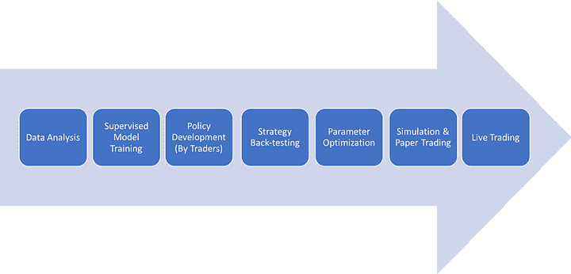
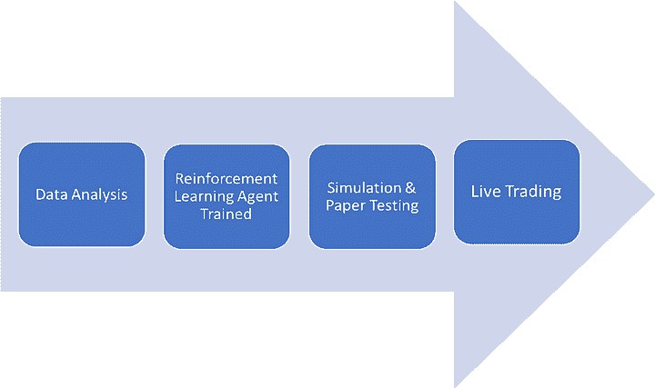
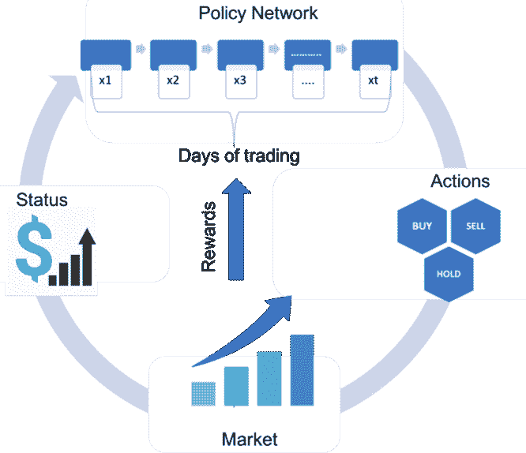
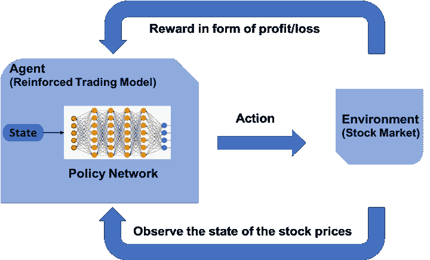

# 强化学习：商业用例，第二部分

> 原文：[`www.kdnuggets.com/2018/08/reinforcement-learning-business-use-case-part-2.html`](https://www.kdnuggets.com/2018/08/reinforcement-learning-business-use-case-part-2.html)

 评论

**由 [Aishwarya Srinivasan](https://www.linkedin.com/in/aishwarya-srinivasan/)，深度学习研究员**

在我 [上一篇文章](https://medium.com/inside-machine-learning/reinforcement-learning-the-business-use-case-part-1-65976c745319)中，我专注于强化学习的计算和数学视角的理解，以及在商业用例中使用该算法时面临的挑战。

在这篇文章中，我将探讨强化学习在交易中的应用。金融行业一直在探索人工智能和机器学习在其用例中的应用，但经济风险导致了其犹豫。传统的算法交易近年来有所发展，现在高计算系统自动化了任务，但交易员仍然制定管理买卖选择的政策。一个基于估值和增长指标条件的股票购买算法模型可能定义一个“买入”或“卖出”信号，这些信号会被交易员定义的某些特定规则触发。

例如，一种算法方法可能是每当 S&P 指数收盘价高于过去 30 天的最高点时就买入，或者每当收盘价低于过去 30 天的最低点时就平仓。这些规则可能是趋势跟随型、逆势型，或者基于自然中的模式。不同的技术分析师不可避免地会以不同的方式定义模式和确认条件。为了使这种方法具有系统性，交易员必须指定精确的数学条件，以明确地定义是否形成了头肩形态，以及定义该模式确认的精确条件。

在当前金融市场的先进机器学习领域，我们可以关注 2017 年 10 月 EquBot 推出的基于 AI 的交易型基金（ETFs）。EquBot 自动化这些 ETF，以从数千家美国公司的市场信息、超过一百万个市场信号、季度新闻文章和社交媒体帖子中汇总数据。一个 ETF 可能会选择 30 到 70 家市场升值机会较大的公司，并且它会随着每笔交易不断学习。另一家知名市场参与者 Horizons 推出了类似的主动 AI 全球 ETF，该 ETF 由 Horizons 开发，使用了包括交易员政策制定在内的监督机器学习。通过监督学习方法，人类交易员帮助选择阈值，考虑延迟，估算费用等。

图 1：使用监督学习的交易流程

当然，如果要完全自动化，一个由 AI 驱动的交易模型必须做的不仅仅是预测价格。它需要一个基于规则的策略，该策略以股票价格作为输入，然后决定是买入、卖出还是持有。

在 2018 年 6 月，摩根士丹利任命了[**迈克尔·凯恩斯**](https://en.wikipedia.org/wiki/Michael_Kearns_%28computer_scientist%29)，一位来自宾夕法尼亚大学的计算机科学家，以扩大人工智能的应用。在接受彭博社采访时，凯恩斯博士指出，“虽然标准机器学习模型可以对价格进行预测，但它们并未指定最佳行动时间、交易的最佳规模或其对市场的影响。”他补充道，“通过强化学习，你可以学习做出预测，这些预测考虑了你的行为对市场状态的影响。”

强化学习允许端到端的优化，并最大化奖励。关键在于，RL 智能体自身调整参数以找到最佳结果。例如，我们可以设想在出现超过 30%的回撤时，给予大负奖励，这迫使智能体考虑不同的策略。我们还可以构建模拟，以改善在关键情况下的反应。例如，我们可以在强化学习环境中模拟延迟，以对智能体生成负奖励。这个负奖励反过来促使智能体学习处理延迟的方法。类似的策略使智能体能够随着时间的推移进行自动调优，不断增强其能力和适应性。

图 2：使用强化学习模型的交易流程

在 IBM，我们在[**DSX 平台**](https://www.ibm.com/products/data-science-experience)上构建了一个复杂的系统，利用强化学习的力量进行金融交易。该模型通过使用随机行动对历史股票价格数据进行训练，我们根据每次交易的盈亏来计算奖励函数。

> ‘IBM 数据科学体验是一个企业数据科学平台，为团队提供最广泛的开源和数据科学工具，适用于任何技能水平，具有在多云环境中构建和部署的灵活性，以及更快地将数据科学结果付诸实践的能力。’

以下图表将强化学习方法与金融交易的用例结合起来。

图 3：强化学习交易模型

我们使用 alpha 指标（投资的主动回报）来衡量强化交易模型的表现，并评估投资与代表市场整体走势的市场指数的表现。最后，我们将模型与简单的 [买入并持有策略](https://www.investopedia.com/terms/b/buyandhold.asp) 和 [ARIMA-GARCH](https://www.quantstart.com/articles/ARIMA-GARCH-Trading-Strategy-on-the-SP500-Stock-Market-Index-Using-R) 进行对比。我们发现，该模型根据市场走势进行了更加精细的调整，甚至能够捕捉到 [头肩形态](https://www.investopedia.com/university/charts/charts2.asp)，这些非平凡的趋势可以预示市场的反转。

强化学习可能并不适用于每一个商业案例，但它在捕捉金融交易的细微之处方面的能力确实展示了其复杂性、强大和更大的潜力。

请继续关注，我们将测试强化学习在更多商业用例中的表现！

**个人简介：[Aishwarya Srinivasan](https://www.linkedin.com/in/aishwarya-srinivasan/)**：哥伦比亚大学数据科学硕士 || IBM 数据科学精英 || 数据科学领域的独角兽 || Scikit-Learn 贡献者 || 深度学习研究员

[原始文章](https://medium.com/inside-machine-learning/reinforcement-learning-the-business-use-case-part-2-c175740999)。经许可转载。

**相关内容：**

+   关于强化学习你需要知道的 5 件事

+   解释强化学习：主动与被动

+   强化学习不应使用的情况？

* * *

## 我们的前三大课程推荐

 1\. [谷歌网络安全证书](https://www.kdnuggets.com/google-cybersecurity) - 快速进入网络安全职业轨道。

 2\. [谷歌数据分析专业证书](https://www.kdnuggets.com/google-data-analytics) - 提升您的数据分析能力

 3\. [谷歌 IT 支持专业证书](https://www.kdnuggets.com/google-itsupport) - 支持您组织的 IT 工作

* * *

### 更多相关话题

+   [实践强化学习课程第三部分：SARSA](https://www.kdnuggets.com/2022/01/handson-reinforcement-learning-course-part-3-sarsa.html)

+   [实践强化学习课程第一部分](https://www.kdnuggets.com/2021/12/hands-on-reinforcement-learning-course-part-1.html)

+   [实践强化学习课程第二部分](https://www.kdnuggets.com/2021/12/hands-on-reinforcement-learning-part-2.html)

+   [使用 Python 进行自动化机器学习：案例研究](https://www.kdnuggets.com/2023/04/automated-machine-learning-python-case-study.html)

+   [Chip Huyen 分享了实现机器学习系统的框架和案例研究](https://www.kdnuggets.com/2023/02/sphere-chip-huyen-shares-frameworks-case-studies-implementing-ml-systems.html)

+   [自研大型语言模型的案例](https://www.kdnuggets.com/the-case-of-homegrown-large-language-models)
