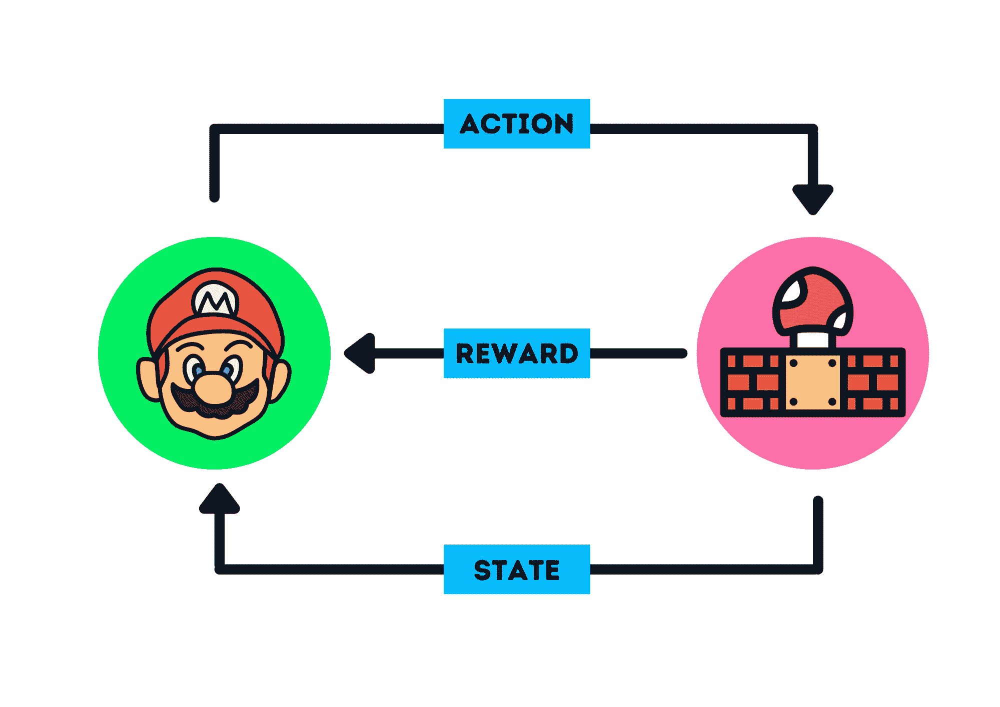
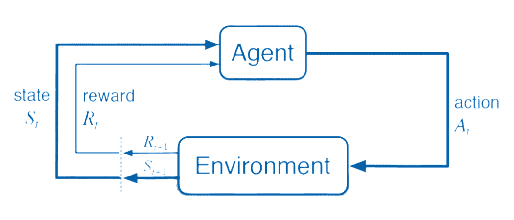

# 强化学习入门

> 原文：[`www.kdnuggets.com/2022/05/reinforcement-learning-newbies.html`](https://www.kdnuggets.com/2022/05/reinforcement-learning-newbies.html)

作者提供的图片

# 什么是强化学习（RL）

* * *

## 我们的前三个课程推荐

 1\. [谷歌网络安全证书](https://www.kdnuggets.com/google-cybersecurity) - 快速开启网络安全职业生涯。

 2\. [谷歌数据分析专业证书](https://www.kdnuggets.com/google-data-analytics) - 提升您的数据分析技能

 3\. [谷歌 IT 支持专业证书](https://www.kdnuggets.com/google-itsupport) - 支持您组织中的 IT 工作

* * *

强化学习（RL）是一种机器学习模型，代理通过试错法学习以实现目标。这是一种以目标为导向的算法，当代理执行正确的动作时会获得奖励。这些奖励帮助代理在复杂的环境中导航以实现最终目标。就像幼儿通过试错法学习走路一样，机器也能在没有人工干预的情况下学习执行复杂任务。

RL 与其他机器学习算法有很大不同。它从环境中学习，并比人类表现更好。而监督学习和无监督学习模型依赖于从人类那里收集的现有数据，受限于人类智能。例如，Deepmind 的[AlphaGo](https://deepmind.com/blog/alphago-zero-learning-scratch/)自行学习了各种策略以击败围棋世界冠军。

# 强化学习如何工作？

以一个马里奥游戏为例。在游戏开始时，代理（马里奥）处于状态零，基于其状态，代理将采取一个动作。在这种情况下，马里奥将向前移动。现在代理处于新状态（新帧）。代理会因为向前移动而获得奖励。代理将继续移动，直到完成关卡或在过程中死亡。RL 的主要目标是通过最小化步骤来最大化奖励的收集。

# RL 的应用是什么？

目前，机器学习应用仅限于单一任务，并依赖于现有数据。但未来一切将发生变化，我们将把 RL 与计算机视觉、机器翻译以及各种模型结合起来，以实现超人类的表现，例如：

1.  **自动驾驶汽车**：旅行变得更安全和快速

1.  **行业自动化**：仓库管理

1.  **交易和金融**：股票价格预测

1.  **自然语言处理（NLP）**：文本摘要、问答和机器翻译

1.  **医疗保健**：有效的疾病检测和治疗

1.  **工程**：优化大规模生产。

1.  推荐系统：提供更好的新闻、电影和产品推荐。

1.  **游戏**：制作更好的游戏关卡以优化玩家的参与度。

1.  **营销与广告**：识别个人并根据需求通过广告进行精准投放。

1.  **机器人技术**：执行复杂和重复的任务。

# 强化学习的关键组件

在我们开始构建自己的系统之前，有很多关于强化学习的知识需要学习。在这一部分，我们将学习强化学习的关键组件以及每个组件如何相互作用。

+   **代理**：可以是游戏角色、机器人或汽车。代理是一个执行动作的算法。在现实生活中，代理是人类。

+   **动作（A）**：是代理可以执行的所有可能移动的集合。例如，马里奥可以跳跃、向左移动、向右移动和蹲下。

+   **折扣因子**：未来的奖励会被折扣，所以它的价值低于即时行动，以便对代理施加短期享乐主义。

+   **环境**：这是一个与代理交互的世界。在马里奥游戏中，环境就是地图。它将当前状态和代理的动作作为输入，并返回奖励和下一个状态。

+   **状态（S）**：就像一个帧。当代理采取一个动作时，状态从当前帧改变到马里奥游戏中的下一帧。当前状态和下一个状态由环境提供。

+   **奖励（R）**：是基于之前动作给予代理的反馈或奖励。如果代理完成了任务，奖励可能是正面的；如果失败，奖励可能是负面的。奖励也可以是即时的或延迟的。

+   **策略（？）**：是代理为了基于状态和动作获得最高奖励而采取的策略。简单来说，它定义了代理如何根据当前状态采取行动。

+   **价值（V）**：是带有折扣的预期长期回报。

+   **轨迹**：是状态和由这些状态影响的动作的序列。

+   **回合**：代理的一个完整周期，从开始到结束。例如，马里奥从开始处开始，当当前阶段完成时，第一个回合结束。当马里奥死亡时，回合也结束。

+   **利用**：采取最佳行动以最大化奖励收集。

+   **探索**：采取随机行动以探索环境，而不考虑奖励。

# 学习资源

这只是一个开始，如果你想深入了解强化学习，可以从学习基础知识开始。观看 YouTube 教程或完成一个课程。之后，开始进行一个项目或参加竞赛。我通过参与 Kaggle 竞赛学习了所有关于 RL 的知识，如果在过程中遇到困难，我会阅读博客或各种教程来扩展我的知识。

**教程**

+   [训练 AI 玩蛇 – 强化学习课程（Python, PyTorch, Pygame）](https://www.youtube.com/watch?v=L8ypSXwyBds)

+   [25 分钟 Python 强化学习教程](https://www.youtube.com/watch?v=nRHjymV2PX8)

+   [MIT 6.S091: 深度强化学习导论 (Deep RL)](https://www.youtube.com/watch?v=zR11FLZ-O9M)

+   [强化学习教程 | 斯坦福汽车研究中心](https://cars.stanford.edu/video/tutorial-reinforcement-learning)

**课程**

+   [CS234: 强化学习 | 2019 冬季](https://www.youtube.com/playlist?list=PLoROMvodv4rOSOPzutgyCTapiGlY2Nd8u)

+   [Hugging Face 深度强化学习课程](https://github.com/huggingface/deep-rl-class)

+   [金融中的强化学习](https://www.coursera.org/learn/reinforcement-learning-in-finance)

+   [深度强化学习在线课程](https://www.udacity.com/course/deep-reinforcement-learning-nanodegree--nd893?irclickid=QlxSPkwh5xyIWdTRvMzWh2bTUkGXaQwyX1mS2o0&irgwc=1&utm_source=affiliate&utm_medium=&aff=397676&utm_term=&utm_campaign=_dddrl01_&utm_content=&adid=788805)

**竞赛**

+   [Connect X](https://www.kaggle.com/competitions/connectx)

+   [IJCAI 2022 - 神经 MMO 挑战](https://www.aicrowd.com/challenges/ijcai-2022-the-neural-mmo-challenge?utm_source=mlc&utm_medium=post&utm_campaign=neural-mmo-22)

+   [Kore 2022](https://www.kaggle.com/competitions/kore-2022)

+   [石头剪子布](https://www.kaggle.com/competitions/rock-paper-scissors)

**书籍**

+   [强化学习：智能体的工业应用](https://www.amazon.in/Reinforcement-Learning-Industrial-Applications-Intelligent/dp/9385889508?dchild=1&keywords=Reinforcement+learning&qid=1619894949&sr=8-8&linkCode=sl1&tag=techohealth-21&linkId=ec0dafa060a0385a9caf61ebc4e6ebee&language=en_IN&ref_=as_li_ss_tl)

+   [深度强化学习实战](https://www.amazon.in/Deep-Reinforcement-Learning-Action-Alexander/dp/1617295434?dchild=1&keywords=Reinforcement+learning&qid=1619884459&sr=8-6&linkCode=sl1&tag=techohealth-21&linkId=5464e5df6a4cdf08eda555f94338fcbe&language=en_IN&ref_=as_li_ss_tl)

+   [深度强化学习实操](https://www.amazon.in/Deep-Reinforcement-Learning-Hands-optimization/dp/1838826998?dchild=1&keywords=Reinforcement+learning&qid=1619884459&sr=8-4&linkCode=sl1&tag=techohealth-21&linkId=13f8a2546748c6cae09ef94341ef8280&language=en_IN&ref_=as_li_ss_tl)

+   [深度强化学习精要](https://www.oreilly.com/library/view/grokking-deep-reinforcement/9781617295454/)

**博客**

+   [强化学习简介](https://blog.paperspace.com/introduction-to-reinforcement-learning/)

+   [强化学习简要介绍](https://www.freecodecamp.org/news/a-brief-introduction-to-reinforcement-learning-7799af5840db/)

+   [什么是强化学习？奖励与惩罚](https://towardsdatascience.com/what-is-reinforcement-learning-99f9615918e3)

+   [深度强化学习初学者指南](https://wiki.pathmind.com/deep-reinforcement-learning)

**[Abid Ali Awan](https://www.polywork.com/kingabzpro)**（[@1abidaliawan](https://twitter.com/1abidaliawan)）是一位认证的数据科学专业人士，热衷于构建机器学习模型。目前，他专注于内容创作和撰写关于机器学习和数据科学技术的技术博客。Abid 拥有技术管理硕士学位和电信工程学士学位。他的愿景是利用图神经网络为遭受心理疾病困扰的学生构建一个 AI 产品。

### 更多相关话题

+   [实战强化学习课程第三部分：SARSA](https://www.kdnuggets.com/2022/01/handson-reinforcement-learning-course-part-3-sarsa.html)

+   [实战强化学习课程，第一部分](https://www.kdnuggets.com/2021/12/hands-on-reinforcement-learning-course-part-1.html)

+   [实战强化学习课程，第二部分](https://www.kdnuggets.com/2021/12/hands-on-reinforcement-learning-part-2.html)

+   [强化学习：教计算机做出最优决策](https://www.kdnuggets.com/2023/07/reinforcement-learning-teaching-computers-make-optimal-decisions.html)

+   [HuggingFace 推出了免费深度强化学习课程](https://www.kdnuggets.com/2022/05/huggingface-launched-free-deep-reinforcement-learning-course.html)

+   [学习数据科学、机器学习和深度学习的可靠计划](https://www.kdnuggets.com/2023/01/mwiti-solid-plan-learning-data-science-machine-learning-deep-learning.html)
