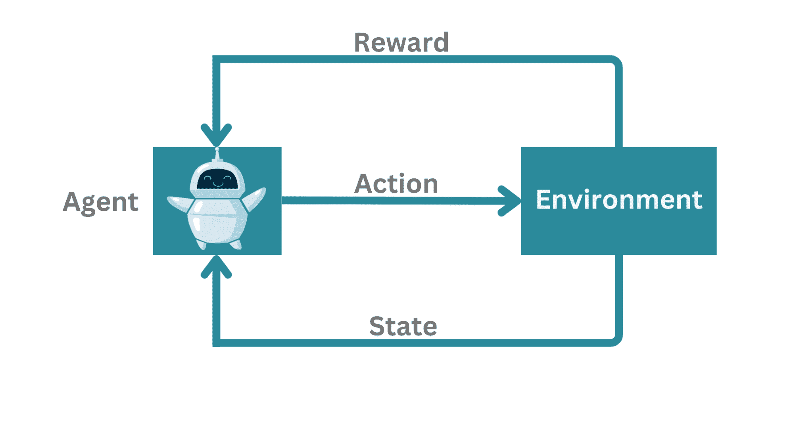
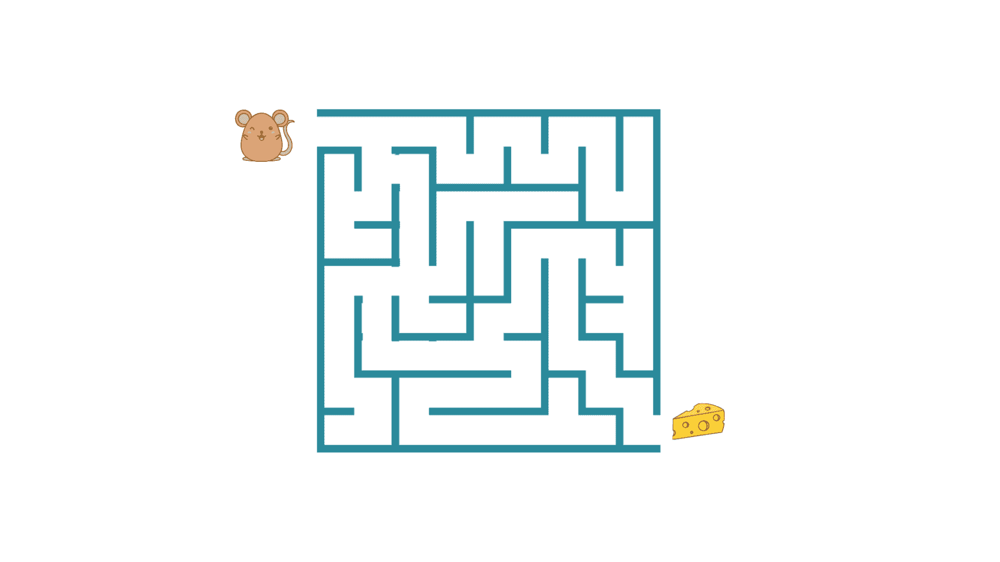
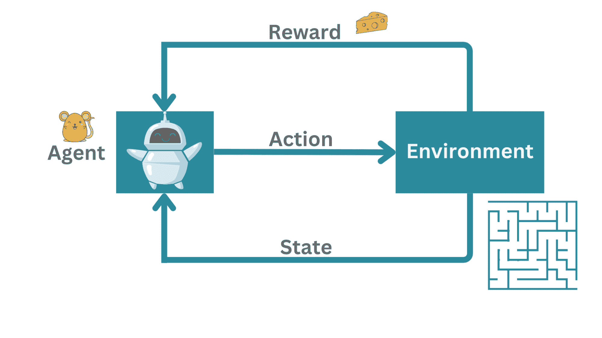
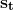
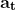
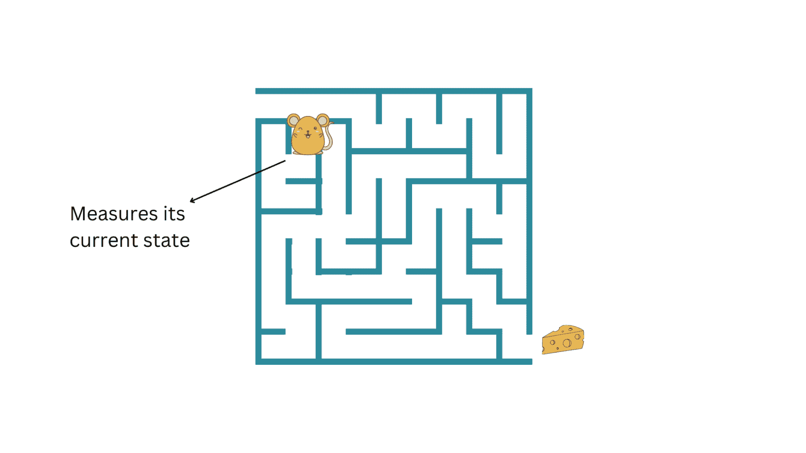
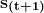
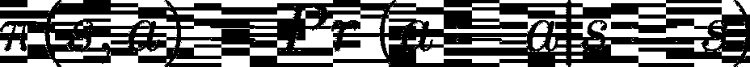
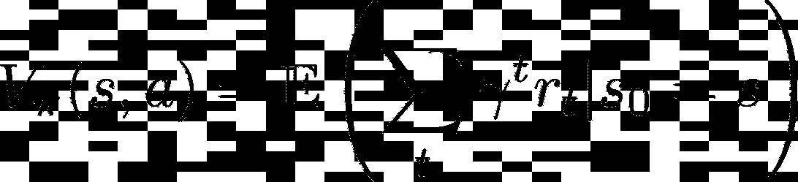
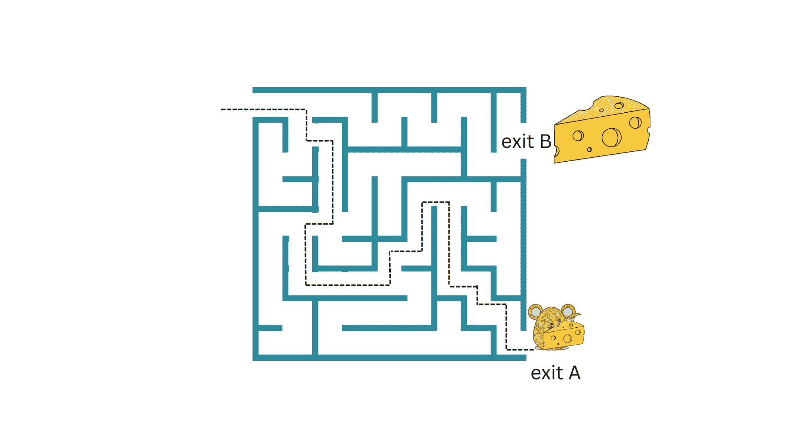

# 强化学习：教计算机做出最佳决策

> 原文：[`www.kdnuggets.com/2023/07/reinforcement-learning-teaching-computers-make-optimal-decisions.html`](https://www.kdnuggets.com/2023/07/reinforcement-learning-teaching-computers-make-optimal-decisions.html)

# 什么是强化学习？

强化学习是机器学习的一个分支，它涉及智能体通过经验学习如何与复杂环境互动。

从在复杂棋盘游戏（如象棋和围棋）中超越人类表现的 AI 智能体，到自主导航，强化学习具有一系列有趣且多样的应用。

在强化学习领域的显著突破包括 DeepMind 的智能体[AlphaGo Zero](https://www.deepmind.com/blog/alphago-zero-starting-from-scratch)，它可以击败甚至人类围棋冠军，以及[AlphaFold](https://www.deepmind.com/research/highlighted-research/alphafold)，它可以预测复杂的 3D 蛋白质结构。

本指南将介绍强化学习范式。我们将通过一个简单但有启发性的现实世界例子来理解强化学习框架。

# 强化学习框架

我们首先来定义强化学习框架的组成部分。

强化学习框架 | 图片由作者提供

在典型的强化学习框架中：

+   有一个**智能体**在学习如何与**环境**互动。

+   智能体可以测量其**状态**，采取**行动**，并偶尔获得**奖励**。

这种设置的实际例子：智能体可以与对手对弈（比如，一场象棋比赛）或尝试在复杂环境中导航。

作为一个超级简化的例子，考虑一个在迷宫中的鼠标。这里，智能体*不是*与对手对战，而是试图找出通向出口的路径。如果有多个路径通向出口，我们可能会选择最短的路径。

迷宫中的鼠标 | 图片由作者提供

在这个例子中，*鼠标*是试图在*迷宫*中导航的*智能体*。这里的*行动*是鼠标在迷宫中的移动。当它成功找到出口时，它会获得一块*奶酪*作为*奖励*。

示例 | 图片由作者提供

行动序列发生在离散的时间步骤中（比如，t = 1, 2, 3,...）。在任何时间步骤**t**，鼠标只能测量其在迷宫中的当前状态。它还不知道整个迷宫的情况。

所以代理（小鼠）在时间步**t**测量其环境状态 ，采取一个有效的行动 并移动到状态 。

状态 | 作者提供的图像

## 强化学习有什么不同？

注意观察小鼠（代理）如何通过**试错法**找出迷宫的出口。如果小鼠碰到迷宫的墙壁，它必须尝试找到回去的路，并绘制一条不同的路线到达出口。

如果这是一个监督学习环境，那么在每次移动后，代理会知道该行动是否正确，并是否会导致奖励。监督学习就像是从教师那里学习。

当教师事先告诉你时，批评者总是在表演结束后告诉你—你的表现有多好或多坏。因此，强化学习也被称为在*批评者存在下的学习*。

## 终端状态和回合

当小鼠到达出口时，它达到了**终端状态**。这意味着它不能再进一步探索。

从初始状态到终端状态的一系列行动称为一个回合。对于任何学习问题，我们需要多个回合让代理学习导航。在这里，为了让我们的代理（小鼠）学习到达出口的行动序列，并随之获得奶酪，我们需要很多回合。

## 密集奖励和稀疏奖励

每当代理采取正确的行动或一系列正确的行动时，它就会获得一个**奖励**。在这种情况下，小鼠因绘制有效路径—穿越迷宫（环境）—到达出口而获得奶酪作为奖励。

在这个例子中，小鼠只有在最后—即到达出口时—才会得到一块奶酪。这是一个*稀疏*且延迟的奖励示例。

如果奖励更频繁，那么我们将拥有一个*密集*的奖励系统。

回顾过去，我们需要弄清楚（这并不简单）是哪一个行动或一系列行动使代理获得了奖励；这通常被称为[信用分配问题](https://ai.stackexchange.com/questions/12908/what-is-the-credit-assignment-problem)。

# 策略、价值函数和优化问题

环境通常不是确定性的，而是概率性的，策略也是如此。给定一个状态 ，代理会采取一个行动并以一定的概率转移到另一个状态 。

策略有助于定义从可能状态集合到行动的映射。它有助于回答诸如以下问题：

+   应采取什么行动以最大化期望奖励？

+   或者更好地说：给定一个状态，代理能采取的最佳行动是什么，以最大化期望奖励？

因此，你可以把代理看作是*执行策略* π：

另一个相关且有帮助的概念是价值函数。**价值函数**定义为：

这表示在给定策略π的情况下处于某状态的价值。这个量表示如果代理从某状态开始并随后执行策略π，那么未来的期望奖励。

总结一下：强化学习的目标是优化策略，以最大化期望的未来奖励。因此，我们可以将其视为一个优化问题，求解π。

## 折扣因子

注意到我们有了一个新的量ɣ。它代表什么？ɣ被称为**折扣因子**，一个介于 0 和 1 之间的量。意味着未来的奖励会被折扣（即：现在的价值大于未来）。

# 探索与利用的权衡

回到老鼠在迷宫中的食物循环示例：如果老鼠能够找到通向出口 A 的路线，并获得一小块奶酪，它可以不断重复这一过程并收集奶酪。但如果迷宫还有另一个出口 B，那里有一块更大的奶酪（更大的奖励）呢？

只要老鼠继续*利用*当前策略而不*探索*新策略，它就无法获得出口 B 处更大奶酪的更大奖励。

探索与利用 | 图片作者

但探索新策略和未来奖励的*不确定性*更大。那么我们如何在利用和探索之间取得平衡呢？这种在利用当前策略和探索具有潜在更好奖励的新策略之间的权衡被称为**探索与利用的权衡**。

一种可能的方法是*ε-贪婪搜索*。给定所有可能的行动，*ε-贪婪搜索*以概率*ε*探索可能的行动之一，同时以概率 1 - *ε*利用当前策略。

# 总结和下一步

让我们总结一下我们到目前为止学到的内容。我们学习了强化学习框架的组成部分：

+   代理与环境互动，测量其当前状态，采取行动，并获得作为正向强化的奖励。该框架是概率性的。

+   然后我们讨论了价值函数和策略，以及优化问题如何通常归结为找到最大化期望未来奖励的最优策略。

你现在已经学到了足够的知识来导航强化学习领域。接下来该怎么做？我们在本指南中没有讨论强化学习算法，你可以探索一些基本算法：

+   如果我们对环境了解一切（并且可以完全建模），我们可以使用基于模型的算法，如 [策略迭代和价值迭代](http://www.cs.cmu.edu/afs/cs.cmu.edu/academic/class/15381-f01/www/handouts/111301.pdf)。

+   然而，在大多数情况下，我们可能无法完全建模环境。在这种情况下，你可以查看无模型算法，如 [Q-learning](https://deeplizard.com/learn/video/qhRNvCVVJaA)，它优化状态-动作对。

如果你想进一步了解强化学习，YouTube 上的 [David Silver 强化学习讲座](https://www.youtube.com/watch?v=2pWv7GOvuf0) 和 [Hugging Face 深度强化学习课程](https://huggingface.co/learn/deep-rl-course/unit0/introduction) 是一些不错的资源。

**[Bala Priya C](https://www.linkedin.com/in/bala-priya/)** 是一位来自印度的开发者和技术作者。她喜欢在数学、编程、数据科学和内容创作的交集上工作。她的兴趣和专长领域包括 DevOps、数据科学和自然语言处理。她喜欢阅读、写作、编程和咖啡！目前，她正在通过编写教程、操作指南、评论文章等与开发者社区分享她的知识。

* * *

## 我们的前三大课程推荐

 1\. [Google 网络安全证书](https://www.kdnuggets.com/google-cybersecurity) - 快速入门网络安全职业。

 2\. [Google 数据分析专业证书](https://www.kdnuggets.com/google-data-analytics) - 提升你的数据分析技能

 3\. [Google IT 支持专业证书](https://www.kdnuggets.com/google-itsupport) - 支持你的组织在 IT 方面

* * *

### 更多相关话题

+   [使用 Pandas fillna() 输入缺失数据的最佳方法](https://www.kdnuggets.com/2023/02/optimal-way-input-missing-data-pandas-fillna.html)

+   [通用且可扩展的最优稀疏决策树(GOSDT)](https://www.kdnuggets.com/2023/02/generalized-scalable-optimal-sparse-decision-treesgosdt.html)

+   [驱动更好的商业决策](https://www.kdnuggets.com/2022/04/informs-driving-better-business-decisions.html)

+   [可解释的 AI：揭示模型决策的 10 个 Python 库](https://www.kdnuggets.com/2023/01/explainable-ai-10-python-libraries-demystifying-decisions.html)

+   [实践强化学习课程第三部分：SARSA](https://www.kdnuggets.com/2022/01/handson-reinforcement-learning-course-part-3-sarsa.html)

+   [动手实践强化学习课程，第一部分](https://www.kdnuggets.com/2021/12/hands-on-reinforcement-learning-course-part-1.html)
