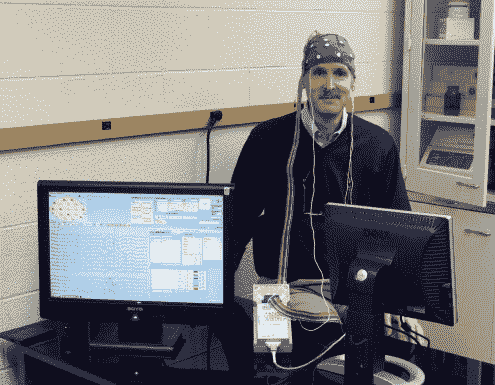

# 我已被分析机器人取代

> 原文：[`www.kdnuggets.com/2015/05/replaced-by-analytics-robot.html`](https://www.kdnuggets.com/2015/05/replaced-by-analytics-robot.html)

 评论

**作者：Bob Muenchen (r4stats)**

就在几年前，[纽约时报](http://www.nytimes.com/2009/08/06/technology/06stats.html?_r=0)称我的工作“性感”。我以前的统计学家职位听起来既平淡又沉闷，但后来充满了令人兴奋的术语：我是一名*数据科学家*，从事*预测分析*，偶尔还涉及*大数据*。在一个职位描述中出现了三个热门术语！然而，近年来，使我的工作如此引人注目的强大技术让我开始思考这一领域的未来。自动生成复杂模型的计算机程序变得越来越普遍。Rob Hyndman 的[R 包](http://robjhyndman.com/software/forecast/)、SAS Institute 的[Forecast Studio](http://www.sas.com/en_us/software/analytics/forecastserver.html)和 IBM 的[SPSS Forecasting](http://www-03.ibm.com/software/products/en/spss-forecasting) 提供了生成预测的能力，这些预测曾经需要多年训练才能开发出来。类似的工具现在也适用于其他类型的模型。

* * *

## 我们的前 3 个课程推荐

 1\. [谷歌网络安全证书](https://www.kdnuggets.com/google-cybersecurity) - 快速进入网络安全职业道路。

 2\. [谷歌数据分析专业证书](https://www.kdnuggets.com/google-data-analytics) - 提升你的数据分析能力

 3\. [谷歌 IT 支持专业证书](https://www.kdnuggets.com/google-itsupport) - 支持你的组织在 IT 领域

* * *

无数其他职业已经因为新技术而消失。美国曾经有超过 70% 的人口从事农业工作，而今天不到 2% 的人是农民。事物总在变化，人们转向其他职业。KDnuggets 最近询问了读者，

“何时大多数专家级预测分析/数据科学任务——目前由人工数据科学家完成——会被自动化？”

51% 的受访者——其中大多数是数据科学家——估计这一情况将在 10 年内发生。然而，并非所有受访者都持如此悲观的观点；19% 的人表示这将永远不会发生。

我的脑袋被取代我脑袋的机器分析了！(摄影：[Mike O’Neil](https://www.flickr.com/photos/16212284@N00/))

如果你在 1980 年问我，自动化将会首先淘汰我工作的哪个部分，我可能会说：[脑电波分析](https://en.wikipedia.org/wiki/Electroencephalography)。这比我做的其他任何工作都涉及更多的步骤。我们测量大脑许多部位的电活动，频率达到每秒数千次。仅仅比较两个组的分析就需要几周的全职工作。令人惊讶的是，这是我工作的第一个被淘汰的部分。然而，我们的统计咨询团队支持许多不同的部门，因此当工作停止从脑电图实验室送来时，我并没有真正注意到。几年后，我接到了新实验室主任的电话，邀请我认识我的替代者：一个名为[LORETA](http://www.uzh.ch/keyinst/loreta.htm)的“机器人”。

当我访问实验室时，我被装备上了通常的满是电极的“洗澡帽”。脑电图胶（基本上是 K-Y 凝胶）被挤入每个电极的孔中，以确保良好的接触，然后机器开始记录我的脑电波。我使用生物反馈生成 alpha 波，这使得一辆车在一个简单的视频游戏中绕着轨道行驶。当你进入非常放松、冥想的状态时，你的大脑会产生 alpha 波。在我完成后不久，LORETA 已经分析了我的脑电波。“她”在短短几分钟内完成了几周的分析工作。

所以我职业生涯的那部分早已结束，但当时我并没有真正注意到。我太忙于利用 LORETA 节省下来的时间来学习使用[ImageJ](http://imagej.net/Welcome)进行图像分析、使用[WordStat](http://provalisresearch.com/products/content-analysis-software/)和[SAS Text Miner](http://www.sas.com/en_us/software/analytics/text-miner.html)进行文本挖掘，以及利用各种任务的无限可能性。

[R 语言](http://www.r-project.org/)。我从未有过没有充满有趣新工作的时刻。

我的领域还有一个容易被忽视的方面。当我开始我的职业生涯时，90%的时间都花在与计算机“搏斗”上。它们非常难以操作。今天，有人可能会给你发送一个数据文件，你在收到后几秒钟内就能看到数据。在 1980 年，数据是通过磁带传输的，每个计算机制造商使用不同的磁带格式，且每种格式都有许多不兼容的变体。除非你拥有创建磁带的程序，否则可能需要几天的繁琐编程才能将数据提取出来。即便是让计算机运行程序，也需要错误频出的[作业控制语言](https://en.wikipedia.org/wiki/Job_Control_Language)。从这个角度来看，更易用的计算技术已经消除了我工作中 90%的内容。那部分工作并不有趣，所以这是一个积极的变化。

新兴的数据科学领域是否会通过为每一个需要解决的问题开发 LORETA 而自我淘汰？我们是否会让我们的星际迷航级计算机和机器人为我们工作，而我们自己则悠闲自得地[自我实现](https://en.wikipedia.org/wiki/Self-actualization)？也许有一天会，但我怀疑这会很快发生！

[原文](http://r4stats.com/2015/05/18/ive-been-replaced-by-an-analytics-robot/)

简介：罗伯特·A·缪恩琴，[@BobMuenchen](https://twitter.com/BobMuenchen) 是 [*R for SAS and SPSS Users*](http://r4stats.com/books/r4sas-spss/ "R for SAS and SPSS Users") 的作者，与约瑟夫·M·希尔比共同著作了 [*R for Stata Users*](http://r4stats.com/books/r4stata/)。他还是 [`r4stats.com`](http://r4stats.com) 的创始人，这是一个致力于分析分析软件趋势并帮助人们学习 R 语言的热门网站。Bob 是一个拥有 30 年经验的 ASA 认证专业统计师™，目前是田纳西大学 OIT 研究计算支持（前身为统计咨询中心）的经理。

**相关内容：**

+   **数据科学家将在 2025 年被自动化取代并失业？**

+   **数据科学历史信息图：5 个领域**

+   **采访：加里·肖特，昆泰尔斯谈医疗保健的未来与大数据技能**

+   **采访：迈克尔·布罗迪谈行业经验、知识发现与未来趋势**

### 更多相关话题

+   [GPT-4 细节已泄露！](https://www.kdnuggets.com/2023/07/gpt4-details-leaked.html)

+   [人工智能、分析、机器学习、数据科学、深度学习…](https://www.kdnuggets.com/2021/12/developments-predictions-ai-machine-learning-data-science-research.html)

+   [2021 年数据科学与分析行业主要发展及关键…](https://www.kdnuggets.com/2021/12/developments-predictions-data-science-analytics-industry.html)

+   [我如何在 14 年内将薪水提高 14 倍，作为数据分析/科学专业人员](https://www.kdnuggets.com/2021/12/14x-salary-in-14-years-data-professional.html)

+   [2022 年及以后 10 大关键 AI 与数据分析趋势](https://www.kdnuggets.com/2021/12/10-key-ai-trends-for-2022.html)

+   [如果没有相关学位，如何进入数据分析领域](https://www.kdnuggets.com/2021/12/how-to-get-into-data-analytics.html)
