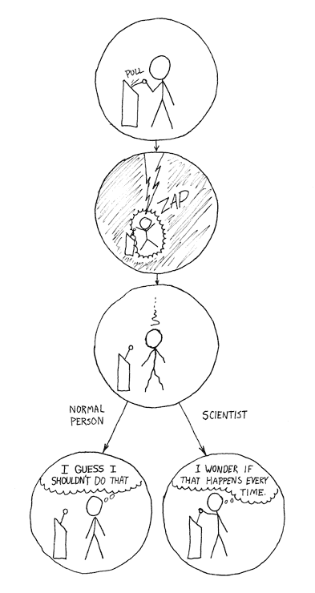
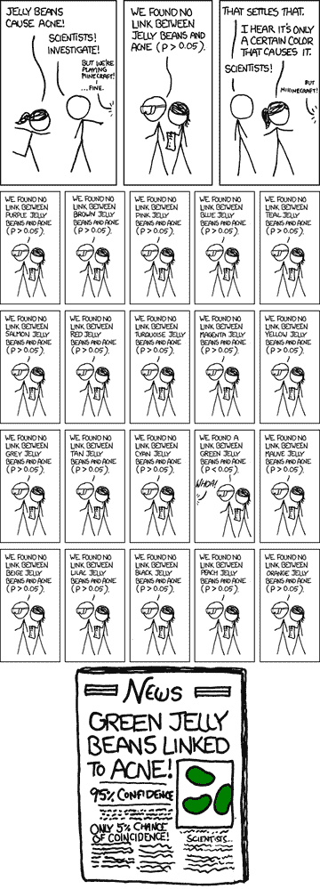

# 可重复性、再现性和数据科学

> 原文：[`www.kdnuggets.com/2019/11/reproducibility-replicability-data-science.html`](https://www.kdnuggets.com/2019/11/reproducibility-replicability-data-science.html)

评论

**由 [Sydney Firmin](https://www.linkedin.com/in/sydney-firmin-4369a65b/)，Alteryx**。

可重复性和再现性是科学探究的基石。虽然在术语[和定义](https://www.kdnuggets.com/2015/10/statistically-rigorous-scientifically-meaningful-definition-replication.html)上存在一些争论，但如果某项结果是可重复的，这意味着可以通过遵循一组特定步骤和一致的数据集来再现相同的结果。如果某项结果是可再现的，这意味着可以使用稍微不同的数据或过程找到相同的结论或结果。没有可重复性，过程和发现无法得到验证。没有可再现性，很难信任单一研究的发现。

* * *

## 我们的前三大课程推荐

 1\. [谷歌网络安全证书](https://www.kdnuggets.com/google-cybersecurity) - 快速进入网络安全职业轨道

 2\. [谷歌数据分析专业证书](https://www.kdnuggets.com/google-data-analytics) - 提升你的数据分析能力

 3\. [谷歌 IT 支持专业证书](https://www.kdnuggets.com/google-itsupport) - 支持你的组织 IT 需求

* * *

科学方法旨在通过标准化科学探究过程来鼓励可重复性和可再现性。通过遵循如何提问和探索问题的共享过程，我们可以确保得出结论的一致性和严谨性。这也使其他研究人员更容易收敛于我们的结果。数据科学生命周期也不例外。[数据科学生命周期](https://community.alteryx.com/t5/Data-Science-Blog/The-Data-Science-Lifecycle/ba-p/408625)

尽管有这些及其他旨在鼓励稳健科学研究的过程，但在过去几十年里，整个科学研究领域一直面临[重复危机](https://en.wikipedia.org/wiki/Replication_crisis)。许多高影响力期刊上发表的研究论文，如*自然*和*科学*，在后续研究中无法重复。尽管一些[研究者](https://www.pnas.org/content/115/11/2628.short)认为这一叙述危机略显危言耸听且适得其反，但你可能会将其视为研究中存在的问题，即人们发布了虚假的积极结果和无法验证的发现。

对不可重复研究的日益关注，部分归因于技术——我们联系更加紧密，科学发现的传播比以往任何时候都要广泛。技术还使我们能够识别和利用策略，使科学研究比以往任何时候都更具可重复性。

*差异： https://xkcd.com/242/*

数据科学位于统计学和计算机科学的交汇点，旨在促进学术研究和行业中的可重复性和再现性。

### 为什么可重复性很重要

作为研究人员或数据科学家，你可能无法控制很多事情。你可能无法以最理想的方式收集数据，也无法确保你捕捉到你尝试测量的内容。你不能真正保证你的研究或项目会被再现。你唯一能保证的是你的工作是可重复的。

此外，鼓励和标准化工作中的可重复性范式可以提高效率和准确性。在科学研究和数据科学项目中，我们通常希望在已有的工作基础上进行改进——这些工作可能是我们自己完成的，也可能是其他研究者完成的。包括可重复的方法——或者更好的是，可重复的代码——可以防止重复劳动，使我们可以更多地关注新的、具有挑战性的问题。这也使得其他研究人员（包括未来的自己）更容易检查你的工作，确保你的过程是正确的且[无错误](https://en.wikipedia.org/wiki/Software_bug)。

### 使你的项目具有可重复性

可重复性在数据科学和科学研究中是一种最佳实践，在许多方面，它归结为拥有一种软件工程的思维方式。它是关于以一种可重复的方式（最好是由计算机完成）并且文档化良好的方式来设置所有的流程。以下是一些（希望对你有帮助的）提示，帮助你使工作具有可重复性。

首先，也是可能最简单的事情是为所有事情使用可重复的方法——不再用 Excel 随意编辑数据，然后可能在记事本中记录你所做的事情。利用可以保存、注释和共享的代码或软件，这样其他人可以运行你的工作流程并完成相同的任务。如果你发现你重复使用相同的过程（超过几次）或用于不同的项目，最好将你的代码或工作流程转换为[函数](https://en.wikipedia.org/wiki/Function_(mathematics)#In_computer_science)或[宏](https://help.alteryx.com/2018.2/Macro_Modules.htm)，以便共享和轻松重用。

记录你的过程也是至关重要的。在你的代码（或工作流程）中写下注释，以便其他人（或者你自己在六个月后）能迅速理解你当时的意图。代码和工作流程通常在简单且易于解释时最为优雅，但并不能保证查看你工作的人员会与你有相同的理解；不要冒这个险，花额外的时间来描述你正在做什么。

另一个最佳实践是保留每个版本的所有内容；无论是工作流程还是数据，以便你可以跟踪变化。能够回溯版本的数据和过程使你能够了解过程中的任何变化，并追踪潜在错误可能被引入的地方。你可以使用版本控制系统，如[Git](https://en.wikipedia.org/wiki/Git)或[DVC](https://www.kdnuggets.com/2019/09/version-control-data-science-tracking-machine-learning-models-datasets.html)。除了是控制代码版本的好方法外，像 Git 这样的版本控制系统可以处理许多不同的软件文件和数据格式。对数据进行版本控制对于数据科学项目是个好主意，因为分析或模型直接受其训练的数据集的影响。

除了将所有材料保存在共享的中央位置，版本控制对协作工作至关重要，或帮助你的队友跟上你已完成的项目的进度。拥有一个位于共享位置而非你电脑上的版本控制库的额外好处无法过分强调——有趣的是，这是我在上周电脑被[砖化](https://en.wikipedia.org/wiki/Brick_(electronics))后第二次尝试编写这篇文章。我现在强迫自己将所有工作都保存在[云端](https://www.vox.com/2015/4/30/11562024/too-embarrassed-to-ask-what-is-the-cloud-and-how-does-it-work)。

### 可重复性的挑战（及可能的解决方案）

尽管利用代码或其他可重复的方法来使科学研究和数据科学项目更具可重复性有很大的潜力，但仍然存在[使可重复性具有挑战性的障碍](https://osf.io/preprints/socarxiv/g3pdb/)。

这些障碍之一是计算环境。当你分享脚本时，你不能保证接收脚本的人拥有与你相同的环境组件——例如，Python 或 R 的相同版本。这可能会导致你记录和编写的过程在不同的机器上产生不同的结果。

这个用例正是[Docker](https://www.docker.com/)容器、像[AWS](https://aws.amazon.com/)这样的云服务以及[Python 虚拟环境](https://docs.python.org/3/tutorial/venv.html)创建的目的。通过共享一个支持你的过程的迷你环境，你在确保你的过程可重复性方面迈出了额外的一步。当你与合作者一起工作时（可以说，这对于复制性很重要），这种额外的步骤尤为重要。

### 为什么复制性很重要

复制性通常是科学研究的目标。我们求助于科学来获得共享的、经验性的事实和真理。当我们的发现可以被其他实验室用不同的数据或略微不同的过程支持或确认时，我们就知道我们发现了可能有意义或真实的东西。

复制性比可重复性更难以保证，但研究人员也有一些实践，比如 p-hacking，使得期待你的结果能被复制变得不切实际。

*Significant: https://xkcd.com/882/*

### P-Hacking

P-hacking（也称为[data dredging](https://en.wikipedia.org/wiki/Data_dredging)或数据钓鱼）是指科学家或不诚实的统计学家对数据集进行大量统计测试，直到发现一个“统计显著”的关系（通常定义为 p < 0.05）。

你可以在 FiveThirtyEight 发布的文章[Science Isn’t Broken](https://fivethirtyeight.com/features/science-isnt-broken/)中阅读更多关于 p-hacking 的内容（并玩一个演示其工作原理的有趣互动应用）。这个[CrashCourseStatistics 的视频](https://www.youtube.com/watch?v=Gx0fAjNHb1M)也很棒。

通常，p-hacking 并非出于恶意。在学术研究中，有各种各样的激励措施驱使研究人员操控他们的数据，直到他们找到一个有趣的结果。尝试找到支持你假设的数据也是很自然的。作为科学家或分析师，你必须在如何处理分析的不同方面上做出大量决策——从去除（或保留）异常值，到选择哪些预测变量来包含、转换或删除。p-hacking 通常是特定研究者偏见的结果——你相信某种方法有效，所以你折磨你的数据，直到它承认你“知道”的真相。研究人员对他们的假设情有独钟，并且（有意识或无意识地）操控数据直到证明自己是对的，这种情况并不罕见。

### 设置你的项目以进行复制

虽然确保复制性比确保可重复性更困难，但作为数据科学家，你可以采用一些最佳实践，以便在更广泛的世界中使你的发现取得成功。

在数据科学项目中，你可以做的一个相对简单而具体的事情是确保你的模型不过拟合；通过使用保留数据集进行评估或利用交叉验证来验证这一点。过拟合是指你的模型捕捉到了训练数据集中随机的变异，而不是找到变量之间的“真实”关系。这种随机变异在样本训练数据之外不会存在，因此使用不同的数据集评估你的模型可以帮助你发现这一点。

另一个有助于重复性的因素是确保你使用的是足够大的数据集。关于数据集何时“足够大”没有严格的规定——这完全取决于你的用例和你使用的建模算法的类型。

除了对统计分析有深刻的理解和获得足够大的样本量外，我认为提高你的研究或项目有可能重复的最重要的措施是让更多的人参与到开发或审查你的项目中。

在研究中引入多样化的团队有助于降低偏见的风险，因为你将不同的观点融入到问题的设置和数据的评估中。在这个意义上，聘请不同类型的研究人员，例如在生命科学研究的问题定义阶段包括一名统计学家，可以确保考虑到不同的问题和视角，使得最终的研究更加严谨。

同样地，接受研究是一个迭代过程，并将失败作为可能结果来对待是至关重要的。

最重要的是，必须承认不确定性，以及成功的结果可能是发现你拥有的数据无法回答你提出的问题，或者你怀疑的事情并没有得到数据的支持。大多数科学实验以“失败”告终，在许多方面，如果你进行了稳健的分析，这种失败可以被视为一种成功。即使你确实发现了“显著”的关系或结果，也可能很难保证模型在未来或在不同人群的样本数据中表现如何。承认分析的局限性或可能的缺陷是很重要的。承认科学方法以及数据科学和统计学中的固有不确定性，将帮助你更现实和准确地传达你的发现。

### 数据科学中的可重复性和再现性

科学的一个原则是自我纠正。如果一项研究被发表或接受，但最终被证明是错误的，它将被后续的研究纠正，随着时间的推移，科学可以趋向于“真理”。虽然这在实践中[可能有些问题](https://slate.com/technology/2019/06/science-replication-conservatives-liberals-reacting-to-threats.html)，但好消息是互联网似乎正在提供帮助。我们比以往任何时候都更紧密地联系在一起——因此，科学有机会自我纠正并严格测试，自我纠正，并传播发现。

数据科学可以被视为一个独立的科学探究领域。我们作为数据科学家的工作应当具备与其他领域相同的严谨标准。作为数据科学家，我们有责任保持这些标准。数据科学在许多方面已经为这些领域的成功奠定了基础。我们的工作本质上是计算机驱动的（因此是可重复的），而且是跨学科的——这意味着我们应该与拥有不同技能和背景的人组成团队。

[原文](https://community.alteryx.com/t5/Data-Science-Blog/Reproducibility-Replicability-and-Data-Science/ba-p/471058)。经许可转载。

**个人简介：** 训练有素的地理学家和心中有数据的极客，[Sydney Firmin](https://www.linkedin.com/in/sydney-firmin-4369a65b/) 坚信，当数据和知识能够被清晰地传达和理解时，它们才最有价值。在她目前的角色中，作为 Alteryx 数据科学创新团队的数据显示科学家，她为广泛的用户开发数据科学工具。

**相关：**

+   [数据版本控制：迭代机器学习](https://www.kdnuggets.com/2017/05/data-version-control-iterative-machine-learning.html)

+   [我们需要一个统计上严谨且科学有意义的复制定义](https://www.kdnuggets.com/2015/10/statistically-rigorous-scientifically-meaningful-definition-replication.html)

+   [如何（以及为什么）创建一个好的验证集](https://www.kdnuggets.com/2017/11/create-good-validation-set.html)

### 更多相关话题

+   [机器学习中可重复性的重要性](https://www.kdnuggets.com/2023/06/importance-reproducibility-machine-learning.html)

+   [2022 年及以后顶级 AI 和数据科学工具和技术](https://www.kdnuggets.com/2022/03/nvidia-0317-top-ai-data-science-tools-techniques-2022-beyond.html)

+   [SQL 分组与分区场景：何时以及如何结合数据…](https://www.kdnuggets.com/sql-group-by-and-partition-by-scenarios-when-and-how-to-combine-data-in-data-science)

+   [KDnuggets™ 新闻 22:n06, 2 月 9 日：数据科学编程…](https://www.kdnuggets.com/2022/n06.html)

+   [KDnuggets 新闻, 11 月 30 日：什么是切比雪夫定理及其如何…](https://www.kdnuggets.com/2022/n46.html)

+   [停止学习数据科学以寻找目标，并通过寻找目标来…](https://www.kdnuggets.com/2021/12/stop-learning-data-science-find-purpose.html)
