# 研究指南：用于机器学习模型的高级损失函数

> 原文：[`www.kdnuggets.com/2019/11/research-guide-advanced-loss-functions-machine-learning-models.html`](https://www.kdnuggets.com/2019/11/research-guide-advanced-loss-functions-machine-learning-models.html)

comments

除了良好的训练数据和正确的模型架构，损失函数是训练准确机器学习模型的最重要部分之一。在这篇文章中，我希望给开发者概述一些更高级的损失函数及其如何用来提高模型的准确性，或者解决全新的任务。

例如，[语义分割](https://heartbeat.fritz.ai/a-2019-guide-to-semantic-segmentation-ca8242f5a7fc)模型在训练过程中通常使用简单的交叉类别熵损失函数，但如果我们想分割具有许多细节的对象，如头发，向模型中添加梯度损失函数可以显著改善结果。

* * *

## 我们的前三大课程推荐

 1\. [谷歌网络安全证书](https://www.kdnuggets.com/google-cybersecurity) - 快速进入网络安全职业生涯。

 2\. [谷歌数据分析专业证书](https://www.kdnuggets.com/google-data-analytics) - 提升你的数据分析技能

 3\. [谷歌 IT 支持专业证书](https://www.kdnuggets.com/google-itsupport) - 支持你的组织的 IT 工作

* * *

这只是一个例子——以下指南探讨了围绕各种高级损失函数进行的研究。

### 基于布雷格曼散度的鲁棒双温度逻辑回归损失

当数据非常嘈杂时，逻辑回归损失函数在训练过程中表现不佳。这种噪声可能是由异常值和标记错误的数据造成的。在这篇论文中，谷歌大脑的作者通过用其对应的“温和”版本替换对数和指数函数，旨在解决逻辑回归损失函数的不足。

[**双温度逻辑回归损失用于训练含噪声数据的神经网络**](https://ai.googleblog.com/2019/08/bi-tempered-logistic-loss-for-training.html?source=post_page-----aee68ed8a38c----------------------)

机器学习（ML）算法所生产模型的质量直接取决于训练数据的质量……

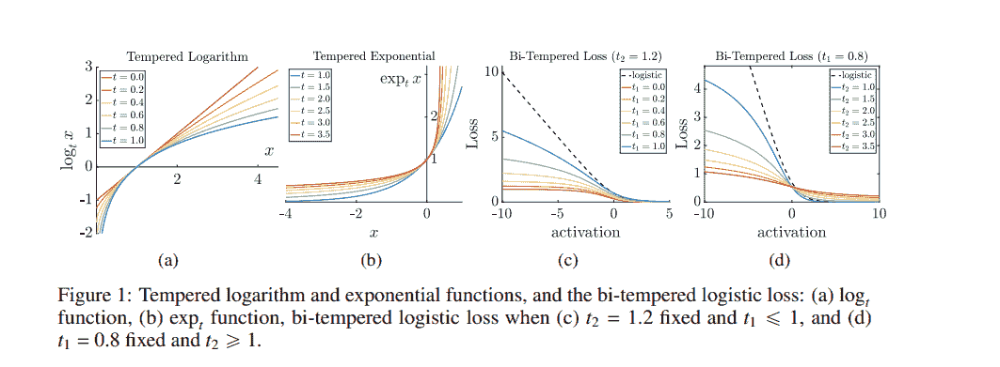

[source](https://arxiv.org/pdf/1906.03361.pdf)

作者在指数函数中引入温度，并用高温的广义版本替换神经网络的 softmax 输出层。对数损失中使用的算法被低温对数替换。这两种温度经过调整，以创建非凸的损失函数。

最后一层神经网络被替换为逻辑损失的双温度推广。这使训练过程对噪声更具鲁棒性。本文提出的方法基于[Bregman 散度](https://arxiv.org/abs/1905.11545)。其性能可以在下图中可视化。

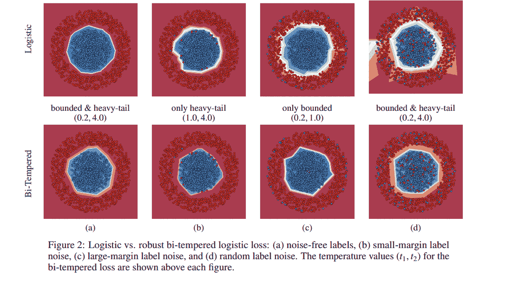

[源文档](https://arxiv.org/pdf/1906.03361.pdf)

为了进行实验，作者向 MNIST 和 CIFAR-100 数据集添加了合成噪声。然后将其双温度损失函数获得的结果与普通逻辑损失函数进行了比较。双温度损失在 MNIST 上获得 98.56%的准确率，在 CIFAR-100 上为 62.5%。下图详细展示了性能。

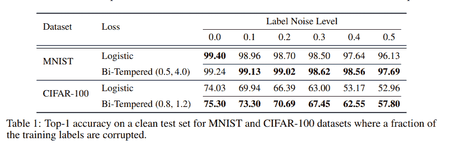

[源文档](https://arxiv.org/pdf/1906.03361.pdf)

> 机器学习模型正越来越接近边缘设备。Fritz AI 来帮助这一过渡。[探索我们的开发者工具套件，使设备学习看、听、感知和思考变得容易。](https://www.fritz.ai/product/premium.html?utm_campaign=buildmodels4&utm_source=heartbeat)

### **GANs 损失函数**

判别器损失旨在最大化对真实图像和假图像的概率。最小最大损失在[介绍 GAN 的论文中](https://arxiv.org/abs/1406.2661)被使用。这是一种旨在减少最坏情况下可能损失的策略。它简单地最小化最大损失。这种损失也用于两人游戏，以减少一层的最大损失。

[**GANs 是否相等？大规模研究**](https://arxiv.org/abs/1711.10337?source=post_page-----aee68ed8a38c----------------------)

生成对抗网络（GAN）是生成模型的一个强大子类。尽管研究非常丰富...

在 GAN 的情况下，两位玩家是生成器和判别器。这涉及到生成器损失的最小化和判别器损失的最大化。判别器损失的修改形成了非饱和 GAN 损失，其目标是解决饱和问题。这涉及生成器最大化判别器概率的对数。这是针对生成的图像进行的。

最小二乘 GAN 损失是为应对二进制交叉熵损失的挑战而开发的，该损失导致生成的图像与真实图像非常不同。这个损失函数被用于判别器。由于这个原因，使用此损失函数的 GAN 能够生成比常规 GAN 更高质量的图像。下一图展示了两者的比较。

[**NIPS 2016 教程：生成对抗网络**](https://arxiv.org/abs/1701.00160?source=post_page-----aee68ed8a38c----------------------)

本报告总结了作者在 NIPS 2016 上关于生成对抗网络（GANs）展示的教程。...

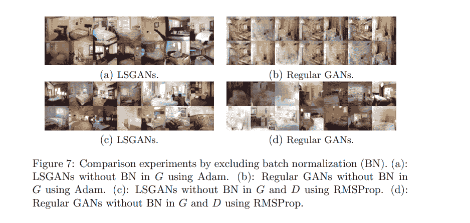

[sources](https://arxiv.org/pdf/1611.04076.pdf)

Wasserstein 损失函数依赖于 GAN 架构的修改，其中鉴别器不进行实例分类。相反，鉴别器对每个实例输出一个数字。它试图使真实实例的数字大于虚假实例的数字。

在这个损失函数中，鉴别器试图最大化真实实例输出与虚假实例输出之间的差异。另一方面，生成器试图最大化鉴别器对其虚假实例的输出。

[**Wasserstein GAN**](https://arxiv.org/abs/1701.07875?source=post_page-----aee68ed8a38c----------------------)

我们介绍了一种名为 WGAN 的新算法，作为传统 GAN 训练的替代方案。在这个新模型中，我们展示了...

这里是一张展示使用这种损失函数的 GANs 性能的图像。

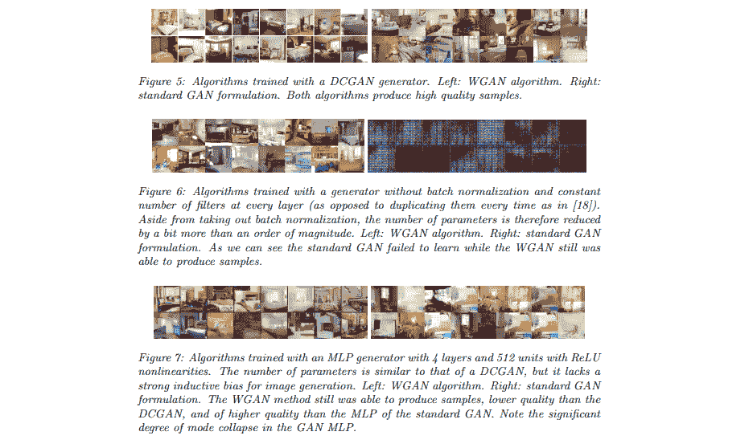

[source](https://arxiv.org/abs/1701.07875)

### 焦点损失用于密集目标检测

本文通过重塑标准交叉熵标准提出了一种改进，使其对分类正确的样本分配的损失减小——焦点损失。该损失函数旨在解决类别不平衡问题。

焦点损失旨在对一组稀疏的困难样本进行训练，防止简单的负样本在训练中压倒[检测器](https://www.fritz.ai/object-detection/)。在测试中，作者开发了 RetinaNet——一个简单的密集检测器。

[**Focal Loss for Dense Object Detection**](https://arxiv.org/abs/1708.02002?source=post_page-----aee68ed8a38c----------------------)

迄今为止，最高精度的目标检测器基于 R-CNN 推广的两阶段方法，其中...

在这个损失函数中，交叉熵损失与随着正确类置信度增加而递减的缩放因子一起缩放。缩放因子会自动减少训练时简单样本的贡献，专注于困难样本。

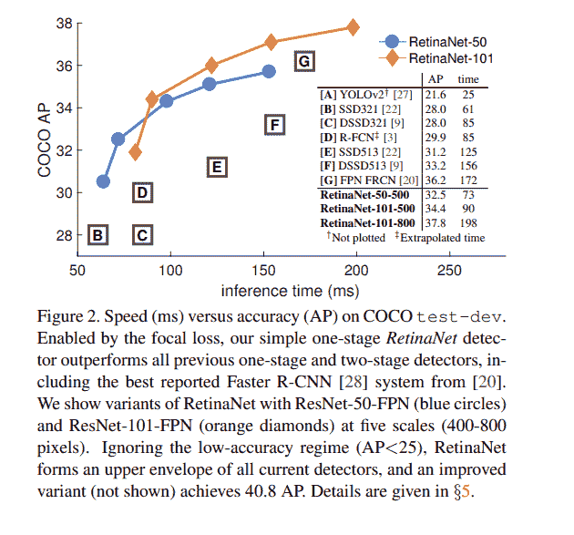

[source](https://arxiv.org/abs/1708.02002)

这里是通过焦点损失函数在 RetinaNet 上获得的结果。

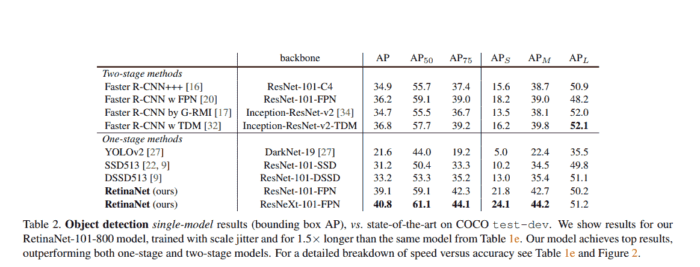

[source](https://arxiv.org/abs/1708.02002)

### 针对单阶段目标检测的 Intersection over Union (IoU)-平衡损失函数

单阶段检测器采用的损失函数在定位上表现不佳。本文提出了一种基于 IoU 的损失函数，包括 IoU-平衡分类和 IoU-平衡定位损失。

[**IoU-balanced Loss Functions for Single-stage Object Detection**](https://arxiv.org/abs/1908.05641?source=post_page-----aee68ed8a38c----------------------)

单阶段检测器效率高。然而，我们发现单阶段检测器采用的损失函数是...

IoU 平衡分类损失专注于高 IoU 的正面场景，可以增加分类与定位任务之间的相关性。该损失旨在减少低 IoU 示例的梯度，并增加高 IoU 示例的梯度。这提高了模型的定位准确性。

下面展示了该损失在 COCO 数据集上的表现。

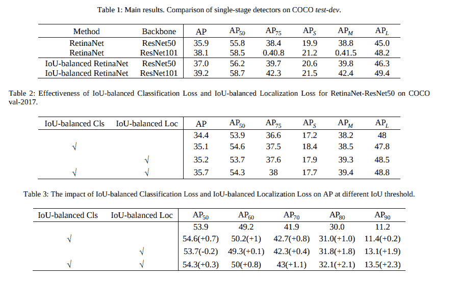

[来源](https://arxiv.org/pdf/1908.05641.pdf)

### 针对高度不平衡分割的边界损失

这篇[论文提出了一种边界损失](http://proceedings.mlr.press/v102/kervadec19a/kervadec19a.pdf)用于高度不平衡的分割。该损失形式为轮廓空间上的距离度量，而非区域。这是为了应对高度不平衡[分割](https://www.fritz.ai/image-segmentation/)问题的区域损失挑战。该损失受到计算曲线演变梯度流的离散优化技术的启发。

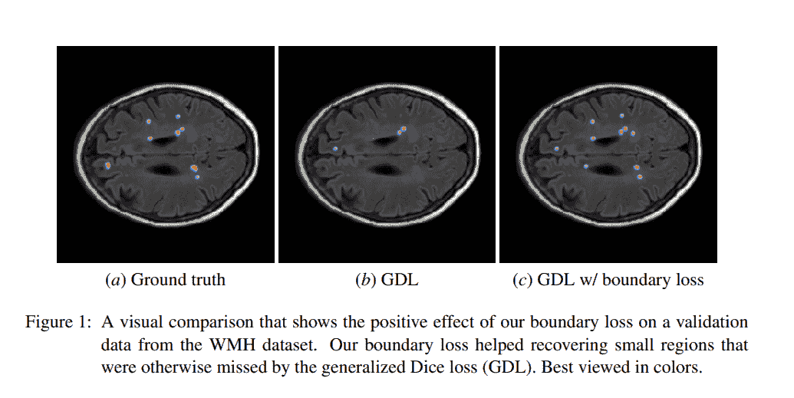

[来源](http://proceedings.mlr.press/v102/kervadec19a/kervadec19a.pdf)

边界损失通过对区域之间的边界进行积分，而不是对区域进行不平衡积分。使用了计算边界变化的积分方法。作者将形状空间上的非对称 L2 距离表示为区域积分。这避免了涉及轮廓点的局部微分计算。最终得到了一个作为网络区域 softmax 概率输出之和的边界损失。该损失可以与区域损失轻松结合，并融入现有的深度网络架构中。

边界损失在[缺血性中风病灶（ISLES）](http://www.isles-challenge.org/)和[白质高信号（WMH）](https://wmh.isi.uu.nl/)基准数据集上进行了测试。

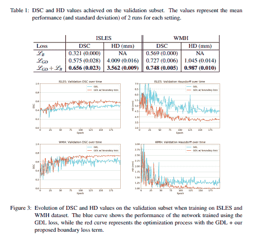

[来源](http://proceedings.mlr.press/v102/kervadec19a/kervadec19a.pdf)

### 感知损失函数

该损失函数用于比较看起来相似的图像。主要用于训练前馈神经网络，用于图像转换任务。

[来源](https://arxiv.org/pdf/1603.08155.pdf)

[**实时风格迁移和超分辨率的感知损失**](https://arxiv.org/abs/1603.08155?source=post_page-----aee68ed8a38c----------------------)

我们考虑图像转换问题，其中输入图像被转换为输出图像。最近的方法...

感知损失函数通过将所有像素中间的平方误差相加并计算均值来工作。

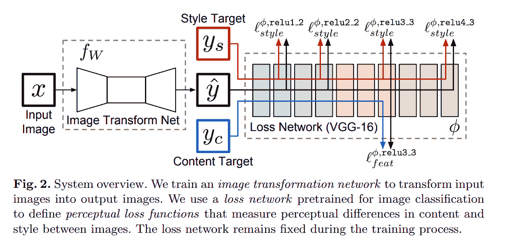

[来源](https://arxiv.org/pdf/1603.08155.pdf)

在[风格迁移](https://www.fritz.ai/style-transfer/)中，感知损失使深度学习模型能够比其他损失函数更好地重建细节。在训练时，感知损失比逐像素损失函数更好地测量图像相似性。它们还使损失网络与转换网络之间的语义知识得以迁移。

### 结论

我们现在应该对一些最常见的——以及几种非常新的——高级损失函数有了了解。

上述提到并链接的论文/摘要也包含了其代码实现的链接。我们很高兴看到你在测试后得到的结果。

**简介： [德里克·姆威提](https://derrickmwiti.com/)** 是一名数据分析师、作家和导师。他致力于在每项任务中取得出色的结果，并且是 Lapid Leaders Africa 的导师。

[原文](https://heartbeat.fritz.ai/research-guide-advanced-loss-functions-for-machine-learning-models-aee68ed8a38c)。已获转载许可。

**相关：**

+   神经架构搜索研究指南

+   变压器研究指南

+   基于深度学习的视频帧插值研究指南

### 更多相关内容

+   [损失函数：详解](https://www.kdnuggets.com/2022/03/loss-functions-explainer.html)

+   [多标签 NLP：类不平衡和损失函数的分析…](https://www.kdnuggets.com/2023/03/multilabel-nlp-analysis-class-imbalance-loss-function-approaches.html)

+   [机器学习模型的高级特征选择技术](https://www.kdnuggets.com/2023/06/advanced-feature-selection-techniques-machine-learning-models.html)

+   [3 种研究驱动的高级提示技术提升 LLM 效率…](https://www.kdnuggets.com/3-research-driven-advanced-prompting-techniques-for-llm-efficiency-and-speed-optimization)

+   [KDnuggets 新闻，8 月 3 日：10 个最常用的 Tableau 函数 • 是…](https://www.kdnuggets.com/2022/n31.html)

+   [深度学习中激活函数的工作原理](https://www.kdnuggets.com/2022/06/activation-functions-work-deep-learning.html)
