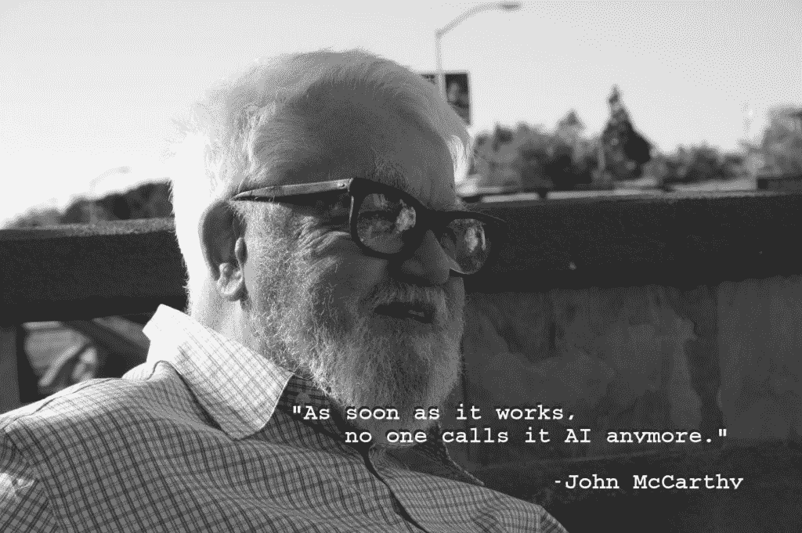
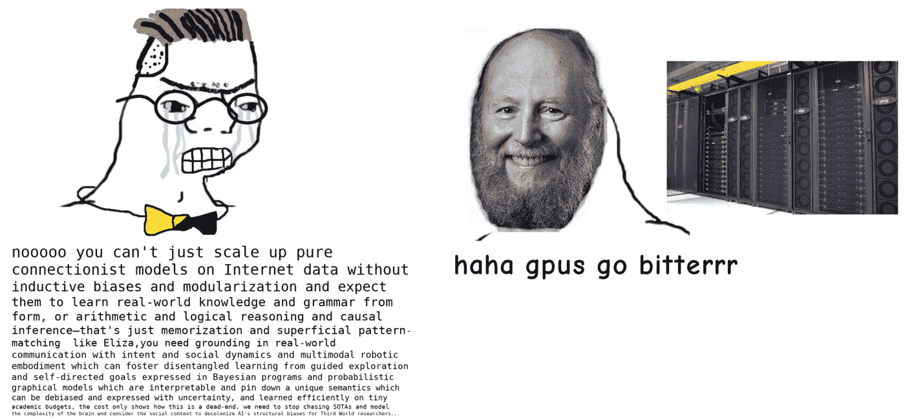
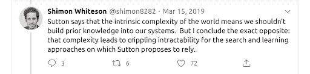
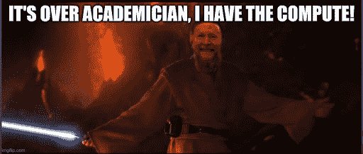

# 计算机嗡嗡声：重新审视萨顿的 AI 苦涩教训

> 原文：[`www.kdnuggets.com/2020/11/revisiting-sutton-bitter-lesson-ai.html`](https://www.kdnuggets.com/2020/11/revisiting-sutton-bitter-lesson-ai.html)

### 回顾理查德·萨顿的 AI 苦涩教训

不久前，在一个与我们今天所居住的世界相差无几的世界里，达特茅斯学院的一个雄心勃勃的项目旨在弥合人类与机器智能之间的差距。那是 1956 年，尽管[Dartmouth Summer Research Project](https://en.wikipedia.org/wiki/Dartmouth_Workshop)并不是第一个考虑思考机器潜力的项目，但它为这一概念命名，并开创了一群有影响力的研究者。在约翰·麦卡锡、马文·明斯基、克劳德·香农和内森尼尔·罗切斯特编写的提案中，作者提出了今天看来颇具天真的雄心：

> *“我们将尝试找到让机器使用语言、形成抽象和概念、解决目前仅限于人类的问题，并自我改进的方法。如果一组精心挑选的科学家在夏季共同研究这些问题，我们认为可以在一个或多个这些问题上取得显著进展。” – [1955 年达特茅斯夏季人工智能研究项目提案](http://www-formal.stanford.edu/jmc/history/dartmouth/dartmouth.html)*

### 人工智能的起点

在这段时间里，[AI 研究](https://blog.exxactcorp.com/category/deep-learning/)经历了一系列热情的起伏。1956 年流行的方法包括细胞自动机、控制论和信息理论。多年来，专家系统、形式推理、连接主义等方法都曾闪耀过一时。

当前 AI 的复兴是由最新形式的连接主义传承——[深度学习](https://blog.exxactcorp.com/category/deep-learning/)驱动的。尽管一些新想法在该领域产生了重大影响（例如注意力机制、残差连接和批量归一化），但关于如何构建和[训练深度神经网络](https://blog.exxactcorp.com/Deep-Learning-Solutions)的许多思想早在 80 年代和 90 年代就已经提出。然而，今天 AI 或 AI 相关技术的角色显然不是以前那些“AI 春天”中的研究者所预见的。例如，很少有人能预测到广告技术和算法新闻推送的普及及其社会影响，我相信许多人对现今社会缺乏机器人感到失望。

*约翰·麦卡锡，达特茅斯提案的共同作者以及“人工智能”一词的创造者。*[*图片*](https://en.wikipedia.org/wiki/File:John_McCarthy_Stanford.jpg)* CC BY SA flickr 用户 null0。*

一个[归因于约翰·麦卡锡的引用](https://cacm.acm.org/blogs/blog-cacm/138907-john-mccarthy/fulltext)抱怨那些在现实世界中找到实际应用的 AI 技术通常会变得不那么令人印象深刻，并在过程中失去“AI”标签。然而，我们今天看到的并非如此，也许我们可以把这归咎于风险投资和政府资助机构，他们激励了相反的情况。伦敦风险投资公司 MMC 的一项[调查](https://web.archive.org/web/20200110183758/https:/www.mmcventures.com/wp-content/uploads/2019/02/The-State-of-AI-2019-Divergence.pdf)发现，2019 年多达 40%的自称为 AI 初创公司的企业实际上并未将 AI 作为其业务的核心组成部分。

### 深度学习与人工智能研究的区别

深度学习时代与之前的人工智能研究高峰之间的区别似乎取决于我们在摩尔定律的 S 型曲线上的位置。许多人将“ImageNet 时刻”视为当前 AI/ML 复兴的开始，当时一个名为[AlexNet](https://en.wikipedia.org/wiki/AlexNet)的模型以显著的优势赢得了 2012 年 ImageNet 大规模视觉识别竞赛（[ILSVRC](http://www.image-net.org/challenges/LSVRC/)）。AlexNet 架构与 20 多年前开发的[LeNet-5](https://en.wikipedia.org/wiki/LeNet)相差不大。

AlexNet 比 LeNet 略大，有 5 层卷积层，而 LeNet 有 3 层，总共有 8 层，而 LeNet 有 7 层（尽管这 7 层包括 2 层池化层）。因此，重大突破来自于实现神经网络原语（卷积和矩阵乘法）以利用图形处理单元（GPU）上的并行执行，以及由 Fei-Fei Li 及其斯坦福实验室开发的[ImageNet 数据集](https://en.wikipedia.org/wiki/ImageNet)的规模和质量。

### 硬件加速中的苦涩教训

硬件加速是今天深度学习从业者理所当然的事情。这是像[PyTorch](https://pytorch.org/)、[TensorFlow](https://www.tensorflow.org/)和[JAX](https://github.com/google/jax)等流行深度学习库的一部分。不断增长的深度学习社区和对 AI/ML 数据产品的商业需求促进了一个[协同反馈循环](https://www.exxactcorp.com/Xilinx-Alveo-Accelerator-Solutions)，这推动了良好的硬件支持。随着基于 FPGA、ASIC，甚至光子或量子芯片的新硬件加速器的出现，主要库中的软件支持必定会紧随其后。

ML 硬件加速器和更广泛计算资源对 AI 研究的影响在 Richard Sutton 的一篇简短而（不）著名的文章 [“The Bitter Lesson.”](http://www.incompleteideas.net/IncIdeas/BitterLesson.html) 中被简洁地描述。在文章中，Sutton 这个实际上（共同）撰写了 [这本书](http://incompleteideas.net/book/the-book-2nd.html) 的人，关于 [强化学习](https://blog.exxactcorp.com/what-you-need-to-know-about-deep-reinforcement-learning/)，似乎声称 AI 研究者所做的所有勤奋努力和巧妙的黑客行为在宏观层面上几乎没有多少意义。 Sutton 认为 AI 进展的主要驱动力是计算资源的日益丰富，应用于我们已经拥有的简单学习和搜索算法，并且几乎没有硬编码的人类知识。具体来说，Sutton 主张基于尽可能通用的方法的 AI，如无约束的搜索和学习。

许多研究人员对 Sutton 的教训有相反反应也不足为奇。毕竟，这些人中的许多人已经将自己的生活献给了开发巧妙的技巧和理论基础，以推动 AI 的进步。许多 AI 研究者不仅对如何最好地陈述最先进的度量感兴趣，而且对一般智能的本质以及更抽象的，人类在宇宙中的角色有着更深入的探索。 Sutton 的声明似乎支持了这样一个令人不满意的结论：从理论神经科学、数学、认知心理学等领域寻找洞见对于推动 AI 进展是无用的。

*来自*[*gwern.net*](https://www.gwern.net/newsletter/2020/05)*的迷因。这是*[*另一个*](https://twitter.com/gwern/status/1286748622122606592)*。*

### 甜腻的怀疑者对苦涩教训

对 Sutton 文章的值得注意的批评包括机器人专家 Rodney Brooks 的 [“A Better Lesson,”](https://rodneybrooks.com/a-better-lesson/) 、来自牛津计算机科学教授 Shimon Whiteson 的 [推文序列](https://twitter.com/shimon8282/status/1106534178676506624) 以及 Shopify 数据科学家 Katherine Bailey 的 [博客文章](https://katbailey.github.io/post/the-wrong-classroom/)。 Bailey 认为，尽管 Sutton 对现代 AI 领域中用作度量的有限范围任务的观点可能是正确的，但这种短视完全错过了要点。 AI 研究的最终目的是以有用的方式理解智能，而不是为每个狭隘的基于度量的任务从零开始训练一个新模型，这会在过程中产生巨大的财务和能源成本。 Bailey 认为现代机器学习从业者常常 [误把度量当作目标](https://en.wikipedia.org/wiki/Goodhart%27s_law)；研究者们并不是为了自身而构建超人类的国际象棋引擎或围棋选手，而是因为这些任务在关键方面似乎体现了人类智能的某些方面。

Brooks 和 Whiteson 认为，Sutton 使用的所有被认为没有人类先验的示例实际上都是大量人类聪明才智的结晶。例如，想象一下没有卷积层的平移不变性的现代 [ResNets](https://en.wikipedia.org/wiki/ResNet) 可能达到的表现是很困难的。我们还可以识别出当前网络的具体短板，例如缺乏旋转不变性或色彩恒常性，这只是众多例子中的两个。架构和训练细节也往往大量依赖于人类直觉和智慧。即使神经架构搜索（NAS）自动化 [有时能找到比人工设计的更优的架构](https://lilianweng.github.io/lil-log/2020/08/06/neural-architecture-search.html)，NAS 算法可用的组件空间也远远小于所有可能操作的空间，而这种缩小有用范围的过程无疑是人类设计师的职责。

*Whiteson 认为，复杂性不仅没有消除，而且还需要人类智慧来构建机器学习系统。*

对于这段痛苦教训的尖锐批评者与 [对深度学习普遍持怀疑态度](https://arxiv.org/abs/2002.06177) 的研究人员之间有很大的重叠。尽管计算预算膨胀和对 [能源](https://arxiv.org/abs/2007.03051) [消耗](https://arxiv.org/abs/1906.02243) 的环境担忧不断增加，深度学习仍然因其规模而令人印象深刻。而且，没有任何保证深度学习不会在未来的某个时刻，可能是很快，就遇到瓶颈。

边际收益何时不再能证明额外开支的合理性？深度学习的进展之所以令人惊讶，是因为模型本身可能几乎不可解；模型的表现是一个拥有数百万到数十亿个参数的复杂系统的涌现产物。预测或分析它们最终可能具备的能力是困难的。

也许我们应该从经典的传统人工智能（GOFAI）参考书中吸取教训： [“人工智能：一种现代的方法”](http://aima.cs.berkeley.edu/) 由 Stuart Russell 和 Peter Norvig 合著。 在最后一章的结尾处，我们发现了这样一个警告，我们首选的人工智能方法，在我们这里是深度学习，可能就像：

> *“…试图通过爬树到达月球；人们可以报告稳定的进展，一直到树顶。“ -AIMA, Russel 和 Norvig*

作者们正在改述 1992 年由[休伯特·德雷福斯](https://en.wikipedia.org/wiki/Hubert_Dreyfus%27s_views_on_artificial_intelligence)所著《计算机不能做什么》一书中的一个类比，该类比经常回到月球旅行的树栖策略。虽然许多原始的*智人*可能曾尝试这种方法，但实际上达到月球需要从树上下来，开始建立太空计划的基础。

### 结果证明了一切

尽管这些批评很有吸引力，但它们可能被视为有些酸葡萄的心态。尽管学术界对“更多计算能力”的智力上令人不满的呼声感到厌烦，但大型私人研究机构的研究人员依然因将工程工作主要应用于[直接扩展](https://blogs.microsoft.com/ai/openai-azure-supercomputer/)的项目而成为头条新闻。

**OpenAI 可能因这种方法而最为臭名昭著。**

OpenAI 的关键人员，该公司去年从非营利组织转型为有限合伙企业结构，一直不吝啬他们对大量计算能力的偏爱。创始人 Greg Brockman 和 Ilya Sutskever[坚定地属于](https://blog.gregbrockman.com/the-openai-mission)Richard Sutton 的“苦涩教训”阵营，许多技术人员也如此。这导致了令人印象深刻的基础设施工程壮举，以支持 OpenAI 为实现里程碑而进行的大规模训练。

OpenAI Five 能够击败（人类）Dota 2 世界冠军 Team OG，而这仅仅是让这些代理进行了 45,0000 个模拟年，或大约[每天 250 年的游戏时间](https://openai.com/blog/openai-five-defeats-dota-2-world-champions/)，才能学会如何玩游戏。这相当于在 10 个月内达到 800 petaflop/s-days。假设世界领先的效率为[每瓦 17 Gigaflop/s](https://en.wikipedia.org/wiki/Performance_per_watt#FLOPS_per_watt)，这相当于[1.1 吉瓦时](https://www.wolframalpha.com/input/?i=%28+800+%28petaFLOPs+days%29+%2F+%28+17e-6+%28petaFLOPs+%2F+%28+Watt%29%29%29%29+to+megaWatt+hour)：相当于一个普通美国家庭 92 年的用电量。

OpenAI 的另一个高调且资源密集的项目是他们的[Dactyl](https://blog.exxactcorp.com/timeline-review-of-openais-robotic-hand-project/) 灵巧度项目，使用了 Shadow 机器人手。该项目最终实现了足够的灵巧操作来解决一个魔方（尽管使用了确定性求解器来选择移动）。魔方项目建立在大约[13,000 年模拟经验](https://blog.exxactcorp.com/timeline-review-of-openais-robotic-hand-project/=%22https:/openai.com/blog/solving-rubiks-cube/%22)的基础上。DeepMind 的类似项目，如 AlphaStar（[384 TPUs 训练 12 个智能体的 44 天](https://www.seas.upenn.edu/~cis520/papers/RL_for_starcraft.pdf)，经历了数千年的模拟游戏）或[AlphaGo 谱系](https://blog.exxactcorp.com/deepminds-gaming-streak-the-rise-of-ai-dominance/)（AlphaGo Zero: [~1800 petaflop/s 天](https://openai.com/blog/ai-and-compute/)）也需要大量计算资源。

### 但它们并不总是达成一致

在 The Bitter Lesson 中注意到的趋势中，有一个显著的例外可以在 AlphaGo 系列的游戏代理中看到，这些代理实际上在达到更好性能时需要的计算量*更少*。 [AlphaGo 谱系](https://blog.exxactcorp.com/deepminds-gaming-streak-the-rise-of-ai-dominance/)确实是一个奇特的案例，无法完全融入 bitter lesson 框架中。是的，该项目开始时使用了大量的 HPC 训练，AlphaGo 在 176 个 GPU 上运行，并在*测试时*消耗了 40,000 瓦特。但从 AlphaGo 到 MuZero 的每次迭代，在训练和游戏中都使用了更少的能量和计算。

实际上，当 AlphaGo Zero 对战[StockFish](https://stockfishchess.org/)时，这一深度学习前沿棋类引擎使用的搜索资源要比 StockFish 少得多且更具专用性。虽然 AlphaGo Zero 确实使用了蒙特卡罗树搜索，但它由深度神经网络价值函数引导。Stockfish 采用的 alpha-beta 剪枝搜索更为通用，而 Stockfish 在每轮中评估的棋盘位置大约是 AlphaGo Zero 的 400 倍。

### 应该让 Bitter Lesson 超越更多专用方法吗？

你会记得，Sutton 提到的无约束搜索是通用方法的一个主要例子。如果我们将 Bitter Lesson 照字面理解，它应该超越执行缩小搜索的更专用方法。相反，我们在 AlphaGo 谱系中看到的是，每一次迭代（AlphaGo，AlphaGo Zero，AlphaZero 和 MuZero）比前一个更具通用能力，但却使用了*更专用的学习和搜索*。MuZero 用一个学习得到的深度模型来替代所有*Alpha*前身使用的真实游戏模拟器，用于游戏状态表示、游戏动态和预测。

设计学到的游戏模型代表了比原始 AlphaGo 更多的人类开发，而 MuZero 在通用学习能力方面有所扩展，通过在 57 个 Atari 游戏基准测试中达到 SOTA 性能，以及之前的*Alpha*模型所学的国际象棋、将棋和围棋。MuZero 每个搜索节点的计算量比 AlphaZero 少 20%，而且在硬件改进的部分帮助下，训练过程中所需的 TPU 数量减少了 4 到 5 倍。

Deepmind 的 AlphaGo 系列机器游戏玩家是深度强化学习进展的一个特别优雅的例子。如果 AlphaGo 团队能够在减少计算需求的同时持续提升能力和通用学习能力，这难道不直接与苦涩教训相矛盾吗？

如果是这样，这对追求通用智能有何启示？许多人认为 RL 是构建人工通用智能的一个很好的候选者，因为它与人类和动物在回应奖励时的学习方式相似。然而，也有其他智能模式被一些人视为 AGI 前驱者的候选者。

### 语言模型：规模的苏丹

Sutton 的文章重新获得关注的一个原因（它最近甚至被[重新发布为 KDnuggets 上的热门文章](https://www.kdnuggets.com/2020/07/bitter-lesson-machine-learning.html)）是因为引人注目的[OpenAI 的 GPT-3](https://blog.exxactcorp.com/what-can-you-do-with-the-openai-gpt-3-language-model/) 语言模型和 API 的发布。GPT-3 是一个拥有 1750 亿个参数的变换器，超越了由[微软的 Turing-NLG](https://msturing.org/)保持的语言模型规模的前纪录，超过了 10 倍。GPT-3 也是“太危险而无法发布”的 GPT-2 的 100 倍以上。

GPT-3 的发布是 OpenAI API Beta 宣布的核心部分。基本上，API 让实验者可以访问 GPT-3 模型（但不能调整参数）并控制几个可以用于控制推理的超参数。可以理解的是，幸运获得 API 访问权限的 beta 测试者们对 GPT-3 热情高涨，且[结果](https://www.gwern.net/newsletter/2020/05) [令人印象深刻](https://blog.exxactcorp.com/what-can-you-do-with-the-openai-gpt-3-language-model/)。实验者们构建了基于文本的游戏、用户界面生成器、虚假博客以及大量其他创意用途的巨大模型。GPT-3 显著优于 GPT-2，唯一的重大区别就是规模。

趋势向更大规模的语言模型发展早于大型 GPT 的出现，并且不仅限于 OpenAI 的研究。但自从首次引入[“Attention is all You Need.”](https://papers.nips.cc/paper/7181-attention-is-all-you-need)以来，这一趋势确实得到了快速发展。变换器模型的参数数量已稳步增加到数十亿，如果在一年左右展示一个万亿参数的变换器，我也不会感到惊讶。变换器似乎特别适合通过规模来提升，并且变换器架构不仅限于处理文本的自然语言处理。变换器已经被应用于[强化学习](https://lvwerra.github.io/trl/)、[预测化学反应](https://pubs.acs.org/doi/10.1021/acscentsci.9b00576)、生成[音乐](https://magenta.tensorflow.org/music-transformer)以及[生成图像](https://arxiv.org/abs/1802.05751)。要了解变换器模型中使用的注意力机制的视觉解释，请阅读[这篇文章](https://blog.exxactcorp.com/a-deep-dive-into-the-transformer-architecture-the-development-of-transformer-models/)。

以当前的模型增长速度，几年来有人将训练出一个参数数量与人脑总突触（[~100 万亿](https://aiimpacts.org/scale-of-the-human-brain/)）相当的模型。科幻小说中充斥着机器通过[积累足够的规模和复杂性](https://tvtropes.org/pmwiki/pmwiki.php/Main/InstantAIJustAddWater)达到意识和通用智能的例子。这是我们可以期待的变换器发展的最终结果吗？

### AI 未来的答案在极端之间

大型变换器的性能确实令人印象深刻，并且由于规模的持续进步似乎符合苦涩的教训。然而，将所有其他 AI 努力排在规模之后仍显得不够优雅和令人满意，同时对能源资源的需求也带来了自身的问题。云端训练让许多大实验室的研究人员远离训练低效的实际感受。但任何在小型办公室或公寓中进行深度学习实验的人，都时刻被工作站后方不断排出的热空气提醒着这一点。

[*肖像*](https://en.wikipedia.org/wiki/File:Richard_Sutton,_October_27,_2016.jpg)* 的理查德·萨顿经[*CC BY*](https://creativecommons.org/licenses/by/2.0/deed.en) [*史蒂夫·朱尔维特森*](https://www.flickr.com/people/44124348109@N01)。

训练一个大型 NLP 变换器，进行超参数和架构搜索所产生的碳排放量，往往会比所有其他活动的个人总碳排放量还要大，[一个小型研究团队](https://arxiv.org/abs/1906.02243)的情况就是如此。

我们知道，智力可以在大约 20 瓦（加上另外约 80 瓦的支持机械）上持续运行。如果你对此有疑问，你应该验证你耳朵之间的存在证明。相比之下，训练 OpenAI Five 所需的能量[大于人类玩家的终生卡路里需求](https://www.wolframalpha.com/input/?i=%28+90+years+*+365+days%2Fyear+*+2500+kcal%2Fday+%29+to+gigawatt+hours+%3C%3D+%28+800+%28petaFLOPs+days%29+%2F+%28+17e-6+%28petaFLOPs+%2F+%28+Watt%29%29%29%29+to+megaWatt+hour)，假设 90 年的寿命。

一位细心的观察者会指出，人脑的 20 瓦功耗并不能代表整个学习算法。相反，架构和操作规则是经过 40 亿年黑箱优化过程——进化——的结果。考虑到所有祖先的总能耗，可能使得人类与机器游戏玩家的比较更加有利。即便如此，模型架构和训练算法的集体进步远非纯粹的随机搜索。与动物智力的进化相比，人类推动的机器智能进步显得要快得多。

### 那么痛苦教训是对还是错？

明显的答案，对于绝对主义者来说可能不尽如人意，它存在于极端之间。注意力机制、卷积层、乘法递归连接，以及许多大模型中常见的机制，都是人类智慧的产物。换句话说，这些是人类认为可能使学习效果更好的先验，它们对于我们迄今看到的规模改进至关重要。完全忽视这些发明而只依赖于摩尔定律和痛苦教训，至少和只依赖于手工编码的专家知识一样短视。

配置错误的优化过程可以[运行到宇宙的热寂而始终无法解决问题](https://en.wikipedia.org/wiki/Levinthal%27s_paradox)。牢记*这个*教训对获得规模效益至关重要。

[原文](https://blog.exxactcorp.com/compute-goes-brrr-revisiting-suttons-bitter-lesson-artificial-intelligence/)。经许可转载。

**相关：**

+   [机器学习的痛苦教训](https://www.kdnuggets.com/2020/07/bitter-lesson-machine-learning.html)

+   [扩展机器学习模型的 5 个挑战](https://www.kdnuggets.com/2020/10/5-challenges-scaling-machine-learning-models.html)

+   [独家：与强化学习之父 Rich Sutton 的访谈](https://www.kdnuggets.com/2017/12/interview-rich-sutton-reinforcement-learning.html)

* * *

## 我们的前三个课程推荐

 1\. [谷歌网络安全证书](https://www.kdnuggets.com/google-cybersecurity) - 快速进入网络安全职业道路。

 2\. [谷歌数据分析专业证书](https://www.kdnuggets.com/google-data-analytics) - 提升你的数据分析技能

 3\. [谷歌 IT 支持专业证书](https://www.kdnuggets.com/google-itsupport) - 支持你的组织的 IT

* * *
