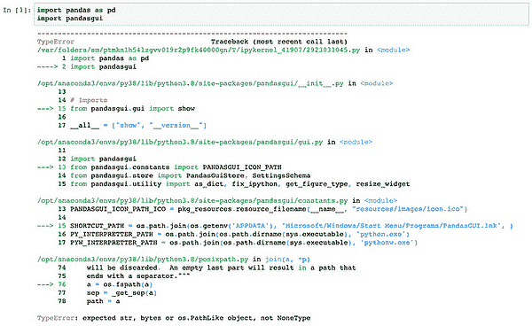
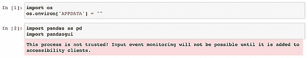
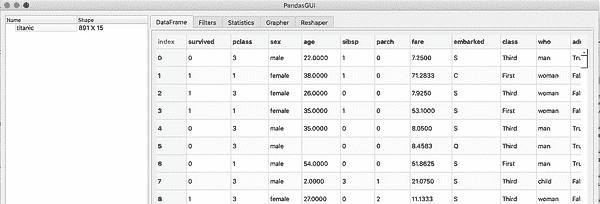
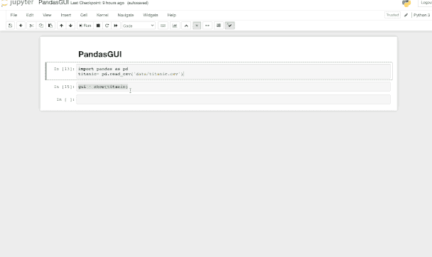
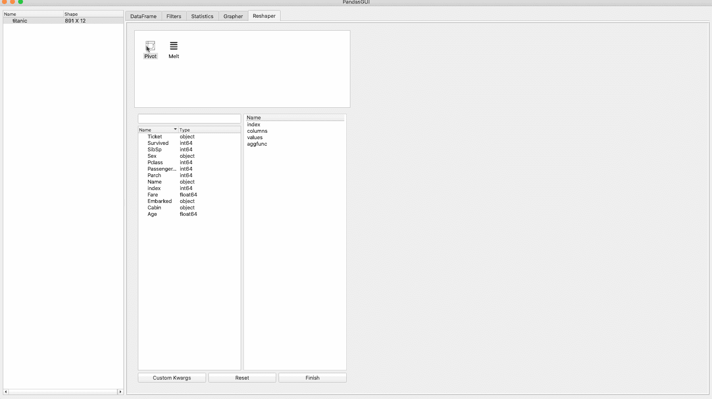
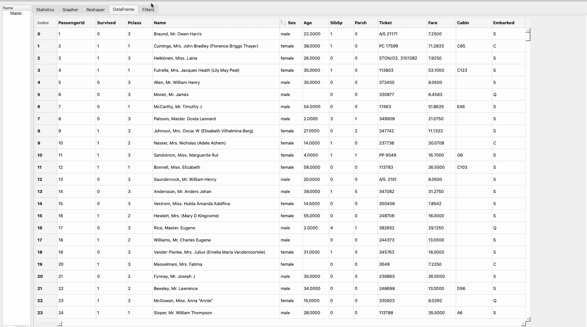
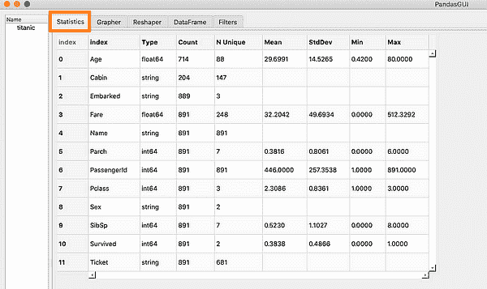
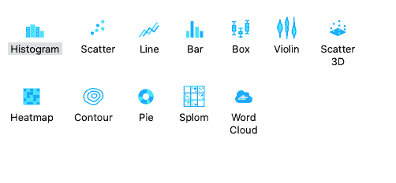
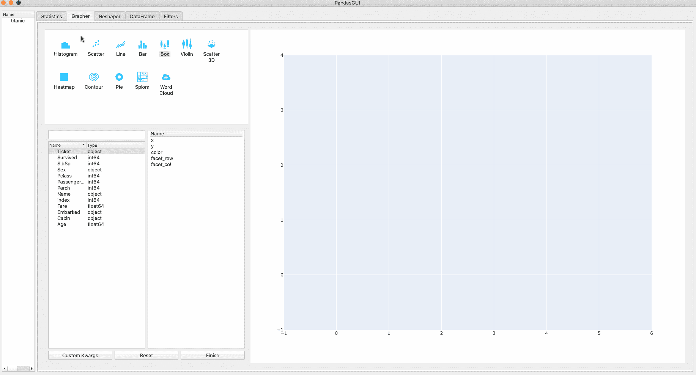

# 使用 PandasGUI 彻底改变数据分析

> 原文：[`www.kdnuggets.com/2023/06/revolutionizing-data-analysis-pandasgui.html`](https://www.kdnuggets.com/2023/06/revolutionizing-data-analysis-pandasgui.html)

在当今数据驱动的世界中，有效的数据分析对企业至关重要，而 Pandas，一个用于处理和清洗数据的 Python 库，已成为一个宝贵的资产。尽管对于初学者或那些喜欢更直观的学习方法的人来说并不容易快速掌握，但 PandasGUI 提供了一个令人惊叹的解决方案：一个具有图形用户界面的库，简化了数据操作和可视化能力。本文将介绍如何安装它，并展示其卓越的功能，这些功能可以提升数据分析能力。


由[Mateusz Butkiewicz](https://unsplash.com/@puszkins?utm_source=medium&utm_medium=referral)拍摄，图片来源于[Unsplash](https://unsplash.com?utm_source=medium&utm_medium=referral)

# 开始使用 PandasGUI

* * *

## 我们的三大课程推荐

 1\. [Google 网络安全证书](https://www.kdnuggets.com/google-cybersecurity) - 快速进入网络安全职业生涯。

 2\. [Google 数据分析专业证书](https://www.kdnuggets.com/google-data-analytics) - 提升你的数据分析技能

 3\. [Google IT 支持专业证书](https://www.kdnuggets.com/google-itsupport) - 支持你的组织的 IT 工作

* * *

要开始使用 PandasGUI，第一步是下载其软件包。你可以通过在命令行中运行以下命令来完成：

```py
pip install pandasgui
```

现在你可以使用以下命令加载和导入它：

```py
import pandas as pd
import pandasgui
```

如果你使用的是除了 Windows 以外的其他操作系统，你可能会遇到由于缺少环境变量 APPDATA 而导致的一些问题。如果你使用的是 Mac OS 或 Linux 并尝试导入 PandasGUI，你将遇到类似的错误：



解决这个问题的一个简单方法是将环境变量的值设置为空字符串。这样，你可以绕过任何错误，并让代码继续运行——这是一个高效的解决方案，可以迅速缓解当前的问题。

```py
import os
os.environ['APPDATA'] = ""
```

现在你可以没有错误地导入它。你可能会收到一个警告信息，这没关系。这个警告的原因是 Mac OS 中缺少某些推荐接口的实现，因此系统给出了这个警告。



最后一步是加载数据集以演示该库的功能。你可以加载你选择的结构化数据集，也可以使用 PandasGUI 提供的数据集。在本文中，我们将使用 PandasGUI 库附带的 Titanic 数据集。

```py
from pandasgui.datasets import titanic
```

现在，我们准备启动 PandasGUI。只需调用如下代码中的 show() 函数：

```py
pandasgui.show(titanic)
```

一旦执行这些命令，将会打开一个新窗口，显示你上传的数据框。



PandasGUI 显示的 Titanic 数据框

# PandasGUI 功能

界面相当直观。它包括以下组件。我将在后面的子部分中介绍它们。

+   查看和排序数据框

+   重新调整数据框

+   数据框过滤

+   摘要统计

+   交互式绘图

## 查看和排序数据框

PandasGPU 的第一个功能是查看和排序数据框，支持升序和降序。这是数据探索的重要步骤，可以像下面的图像中所示那样轻松完成：



查看和排序数据框

## 重新调整数据框

PandasGUI 提供了两种方法来重新调整数据框，即 pivot 和 melt。**Pivot** 通过将值从一列移动到几列来转换数据框。当你试图围绕特定列进行数据重构时，可以使用此功能。通过指定索引和用于 pivot 操作的列，你可以更轻松地重新调整数据框。

另一方面，**melt** 方法使你能够对数据框进行反透视，将多个列合并为一个列，同时保持其他列作为变量。此功能特别适合从宽格式转到长格式或标准化数据集时使用。

在下面的 gif 中，我们将使用 pivot 方法来重新调整 Titanic 数据框：



使用 pivot 重新调整数据框

## 数据框过滤

在许多情况下，你可能希望根据某些条件过滤数据集，以便进一步了解数据或从数据集中提取特定切片。要使用 PandasGUI 对数据应用过滤器，首先你需要进入过滤器部分并编写每个过滤器，然后应用它。假设我们想要仅获取以下乘客：

+   男性

+   属于 Pclass 3

+   幸存于海难

+   年龄在 30 到 40 之间

因此，我们将对数据集应用以下四个过滤器：

+   性别 == ‘male’

+   Pclass == ‘3’

+   幸存 == 1

+   30 < 年龄 < 40

在下面的 gif 中是对 Titanic 数据集应用这四个过滤器的逐步指南：



## 摘要统计

你还可以使用 PandasGUI 提供 DataFrame 的详细统计概览。这将包括每列的均值、标准差、最小值和最大值。



## 互动绘图

最后，PandasGUI 为数据集提供了强大的互动绘图选项，包括：

+   直方图

+   散点图

+   折线图

+   条形图

+   箱形图

+   小提琴图

+   3D 散点图

+   热图

+   等高线图

+   饼图

+   SpLOM 图

+   词云



在下面的 gif 中，我们将为数据集创建三个互动图：饼图、条形图和词云。



本文重点介绍了 PandasGUI 的功能，这是一种强大的库，为广泛使用的 Pandas 库增加了图形用户界面。我们首先演示了它的安装，加载了一个示例数据集，并探索了如过滤、排序和统计分析等功能。

# 参考文献

+   [PandasGUI：使用图形用户界面对 Pandas 数据框进行分析](https://towardsdatascience.com/pandasgui-analyzing-pandas-dataframes-with-a-graphical-user-interface-36f5c1357b1d)

+   [关于 PandasGUI 你需要知道的一切](https://www.analyticsvidhya.com/blog/2021/07/everything-you-need-to-know-about-pandasgui/)

+   [PandasGUI — 实现轻松数据分析的终极秘密](https://towardsdatascience.com/is-pandas-easy-to-use-try-this-tool-to-make-it-easier-2071eeffe482)

**[Youssef Rafaat](https://www.linkedin.com/in/youssef-hosni-b2960b135)** 是计算机视觉研究员和数据科学家。他的研究专注于为医疗保健应用开发实时计算机视觉算法。他还在营销、金融和医疗保健领域担任数据科学家超过 3 年。

### 更多相关内容

+   [预测分析如何革新科技决策](https://www.kdnuggets.com/how-predictive-analytics-is-revolutionizing-decisionmaking-in-tech)

+   [人工智能如何革新传统行业？](https://www.kdnuggets.com/how-ai-is-revolutionizing-the-legacy-industries)

+   [掌握 SQL、Python、数据清洗、数据处理及探索性数据分析的指南汇总](https://www.kdnuggets.com/collection-of-guides-on-mastering-sql-python-data-cleaning-data-wrangling-and-exploratory-data-analysis)

+   [数据科学家的探索性数据分析必备指南](https://www.kdnuggets.com/2023/06/data-scientist-essential-guide-exploratory-data-analysis.html)

+   [SQL 中的数据清洗：如何为分析准备杂乱数据](https://www.kdnuggets.com/data-cleaning-in-sql-how-to-prepare-messy-data-for-analysis)

+   [学习数据分析和数据科学的最佳免费资源](https://www.kdnuggets.com/2024/03/365datascience-best-free-resources-learn-data-analysis-data-science)
