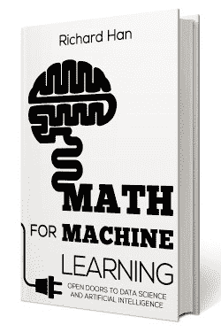

# 机器学习的数学

> 原文：[`www.kdnuggets.com/2019/01/rhan-math-machine-learning-ebook.html`](https://www.kdnuggets.com/2019/01/rhan-math-machine-learning-ebook.html)

赞助帖子。

[**机器学习的数学**](https://gum.co/VVZsI)，作者**理查德·韩**。

从自动驾驶汽车和推荐系统到语音和面部识别，机器学习是未来的发展方向。你是否想学习机器学习背后的数学，以进入数据科学和人工智能的激动人心的领域？目前并没有许多资源提供简单详细的例子，并且一步一步地讲解这些主题。

[**这本电子书**](https://gum.co/VVZsI) 不仅解释了涉及的数学类型和混淆的符号，还直接介绍了机器学习中的基础主题。这本书将帮助你以顺畅自然的方式入门机器学习，为更高级的主题做好准备，打破机器学习复杂、困难和令人畏惧的观念。

[**在这里获取这本电子书**](https://gum.co/VVZsI)。

* * *

## 我们的前三大课程推荐

 1\. [谷歌网络安全证书](https://www.kdnuggets.com/google-cybersecurity) - 快速入门网络安全职业。

 2\. [谷歌数据分析专业证书](https://www.kdnuggets.com/google-data-analytics) - 提升你的数据分析能力

 3\. [谷歌 IT 支持专业证书](https://www.kdnuggets.com/google-itsupport) - 支持你的组织的 IT 需求

* * *

### 更多相关主题

+   [如何克服对数学的恐惧，并学习数据科学中的数学](https://www.kdnuggets.com/2021/03/overcome-fear-learn-math-data-science.html)

+   [如何学习机器学习中的数学](https://www.kdnuggets.com/2022/02/learn-math-machine-learning.html)

+   [KDnuggets™ 新闻 22:n07，2 月 16 日：如何学习机器学习的数学…](https://www.kdnuggets.com/2022/n07.html)

+   [数据科学中的基础数学：奇异值分解的视觉介绍](https://www.kdnuggets.com/2022/06/essential-math-data-science-visual-introduction-singular-value-decomposition.html)

+   [数据科学中的基础数学：特征向量及其在 PCA 中的应用](https://www.kdnuggets.com/2022/06/essential-math-data-science-eigenvectors-application-pca.html)

+   [数据科学中需要多少数学？](https://www.kdnuggets.com/2020/06/math-data-science.html)
