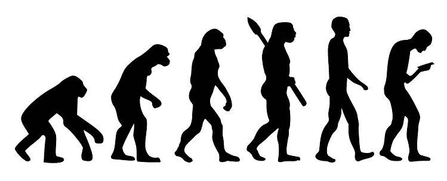
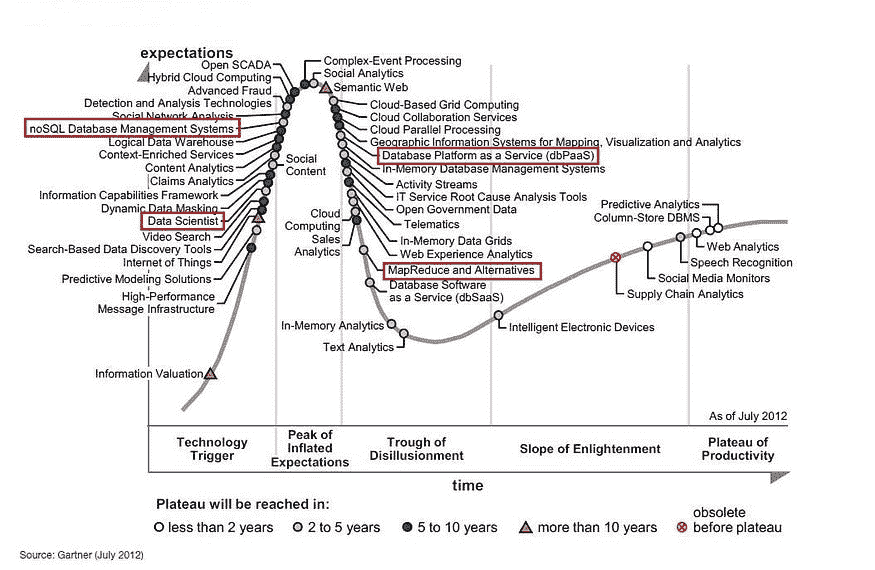
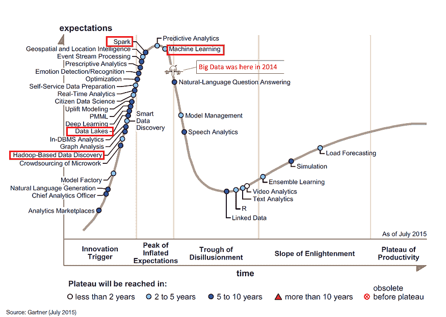
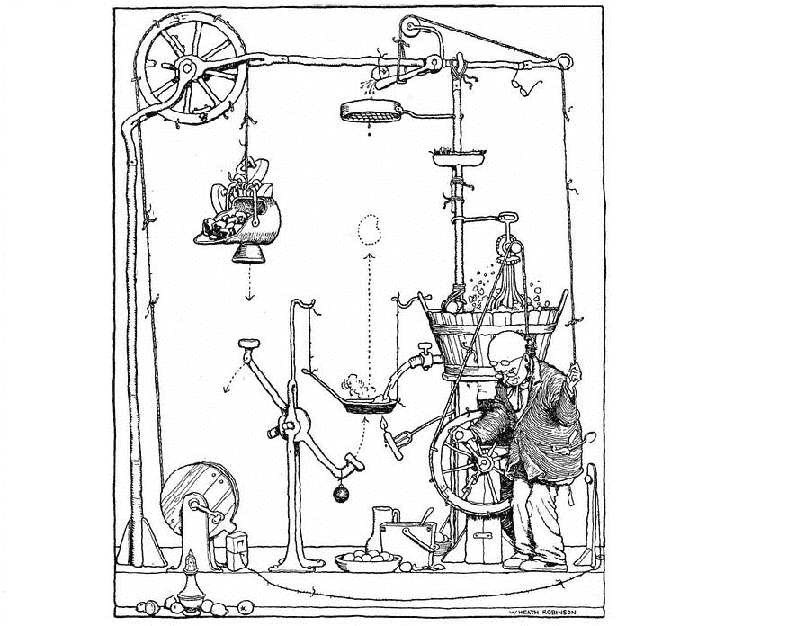
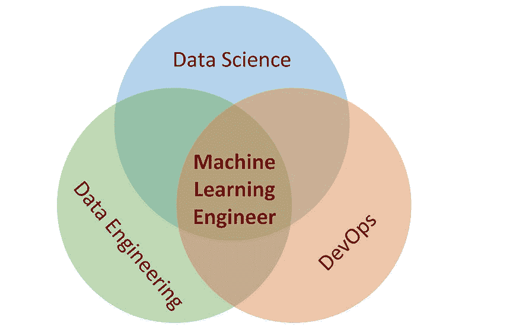

# 机器学习工程师的崛起

> 原文：[`www.kdnuggets.com/2020/11/rise-machine-learning-engineer.html`](https://www.kdnuggets.com/2020/11/rise-machine-learning-engineer.html)

评论

**作者 [Edward Bullen](https://www.linkedin.com/in/edbullen/?originalSubdomain=uk)，Telstra 数据工程和数据科学负责人**。

### 初期 — 数据科学家

* * *

## 我们的前三个课程推荐

 1\. [Google 网络安全证书](https://www.kdnuggets.com/google-cybersecurity) - 快速进入网络安全职业的快车道

 2\. [Google 数据分析专业证书](https://www.kdnuggets.com/google-data-analytics) - 提升您的数据分析技能

 3\. [Google IT 支持专业证书](https://www.kdnuggets.com/google-itsupport) - 支持您的组织 IT

* * *

在 2010 年代初期，大数据的炒作真正起飞。随着对高级分析和分析非结构化数据的期望增加，“数据科学家”这一角色出现在 Gartner 炒作周期的上升阶段（见下图）。

与此同时，实施 Gartner 图表中提到的各种重要新数据平台（例如 Map Reduce 和其他分布式系统及数据库平台即服务）的挑战开始显现，这些挑战也开始出现在 Gartner 炒作周期的下滑阶段。这些平台并没有神奇地为数据科学家提供所需的数据，而且显然需要大量的设计和工程工作来将这些数据平台与数据科学家的需求对齐。此外，围绕 NoSQL 数据库的巨大炒作和期望也在发展，但这主要集中在 Web 规模应用和敏捷开发的需求上，而不是数据分析的需求上。

### 大多数人已经达到的阶段 — 一半的路程

数据与分析之间的脱节导致了幻灭、挫败感，并且无法完成许多数据科学和分析项目，因为数据部分缺失。

到 2015 年，大数据已经被从炒作周期中移除（参见 [`www.datasciencecentral.com/profiles/blogs/big-data-falls-off-the-hype-cycle`](https://www.datasciencecentral.com/profiles/blogs/big-data-falls-off-the-hype-cycle)），分析和数据科学的世界将希望寄托在新的数据平台技术上，如**Apache Spark**和**数据湖**。

### 数据工程师的登场

因此，数据工程师的角色应运而生，对这一职位的需求猛增——到 2020 年，根据[`www.itjobswatch.co.uk/`](https://www.itjobswatch.co.uk/)，英国所有 IT 职位中有 1.5%与数据工程相关——为了对比，所有 IT 职位中有 1.2%是为网页开发而招聘的：

有趣的是，同时在 2015 年，对**机器学习**的期望和希望被认为达到了顶峰。机器学习提供了一种利用所有这些数据的方法。

### 需要解决的新问题——我们如何将其投入生产？

*赫斯·罗宾逊的煎饼机。*

随着数据工程师角色的成熟，这些专家开始解决数据科学家所有的数据来源和处理问题，一个新的问题出现了——如何将所有这些机器学习模型部署到生产中（即，让它们运行实际的业务部分），现在数据科学家已经获得了他们所需的数据？

到 2019 年，对机器学习的关注提升到了一个新的水平，并进入了一个完全不同的 Gartner Hype-Cycle，其中考虑了多种类型的机器学习和人工智能技术及应用场景：[`twitter.com/kdnuggets/status/1234871536391245824`](https://twitter.com/kdnuggets/status/1234871536391245824)

### 进入机器学习工程师的角色

要让机器学习解决方案对其部署的业务、研究机构或非政府组织具有价值，它需要：

+   与实时数据源集成

+   保持可靠、稳健和准确

+   实际上能够被其他人使用——可能是许多其他人和应用。

从根本上说，机器学习或“人工智能”解决方案只是一种应用算法或数学于数据的软件产品。

为了实现一个集成的、稳健且可扩展的软件产品，将需要软件源代码控制和自动化测试框架，用于将更改和更新合并到发布版本中。这使得团队成员能够在一个超越数据科学家在 Jupyter（IPython）笔记本中演示的概念的软件产品上进行协作。

此外，这需要一个能够应对硬件和网络故障并且能够扩展以满足需求的架构作为支持。

最终，由于领域的性质，应用将会高度依赖数据，这方面的要求比典型的网络应用或事务系统更为复杂。很可能会有许多大规模数据聚合需求和复杂的数据特征工程方面的要求，或许还会结合高吞吐量的数据流环境。

为了实现这一点，必须跨越多个学科——*数据架构和工程*、*数据科学和统计*以及*DevOps 或软件工程*——机器学习工程师的角色由此诞生：

> 机器学习工程师不仅仅是构建，他们还需要设计。

机器学习工程师具备多个领域的混合知识，是设计过程中的关键部分，而不仅仅是实现部分。

数据科学和建模阶段的微小妥协通常会在数据层面带来巨大的效率提升。同时，了解数据科学家采用的编码方法的背景将有助于将其转化为生产代码的部署。相反，将代码部署平台和数据处理平台的约束以数据科学家能够理解的语言反馈给数据科学家，可以使这些因素融入到分析和建模方法中。

通过这种方式，机器学习工程师的引入打破了跨学科的壁垒，最终将数据工程师提供的数据和数据科学家分析的数据转化为有价值的机器学习应用。

[原文](https://medium.com/swlh/the-rise-of-the-machine-learning-engineer-c04bab0c29e)。经许可转载。

**相关：**

+   [从数据科学转向机器学习工程](https://www.kdnuggets.com/2020/11/moving-data-science-machine-learning-engineering.html)

+   [数据科学家还是机器学习工程师？哪个职业选择更好？](https://www.kdnuggets.com/2020/11/greatlearning-data-scientist-machine-learning-engineer.html)

+   [机器学习工程师在 10 年内会存在吗？](https://www.kdnuggets.com/2020/05/machine-learning-engineers-not-exist-10-years.html)

### 更多相关主题

+   [成为优秀数据科学家所需的 5 项关键技能](https://www.kdnuggets.com/2021/12/5-key-skills-needed-become-great-data-scientist.html)

+   [每个初学者数据科学家应该掌握的 6 种预测模型](https://www.kdnuggets.com/2021/12/6-predictive-models-every-beginner-data-scientist-master.html)

+   [2021 年最佳 ETL 工具](https://www.kdnuggets.com/2021/12/mozart-best-etl-tools-2021.html)

+   [停止学习数据科学以寻找目标，并通过找到目标来…](https://www.kdnuggets.com/2021/12/stop-learning-data-science-find-purpose.html)

+   [学习数据科学统计学的顶级资源](https://www.kdnuggets.com/2021/12/springboard-top-resources-learn-data-science-statistics.html)

+   [成功的数据科学家的 5 个特征](https://www.kdnuggets.com/2021/12/5-characteristics-successful-data-scientist.html)
