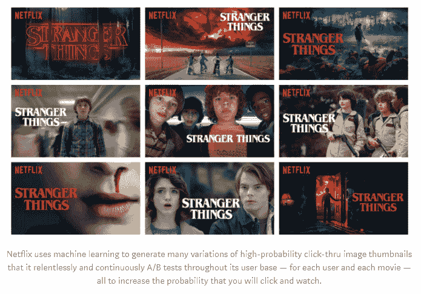
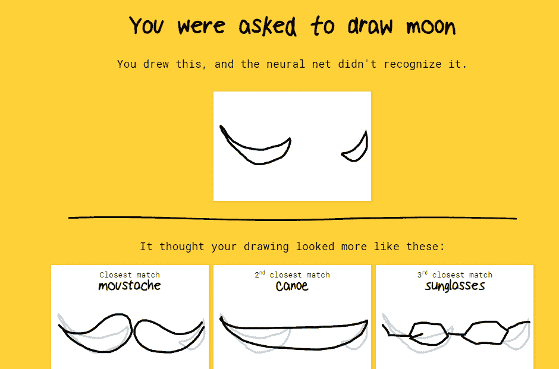
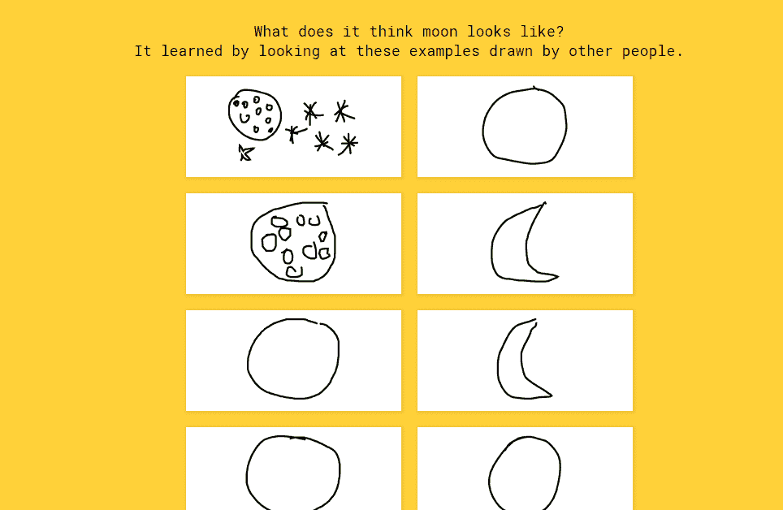
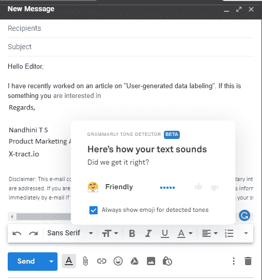
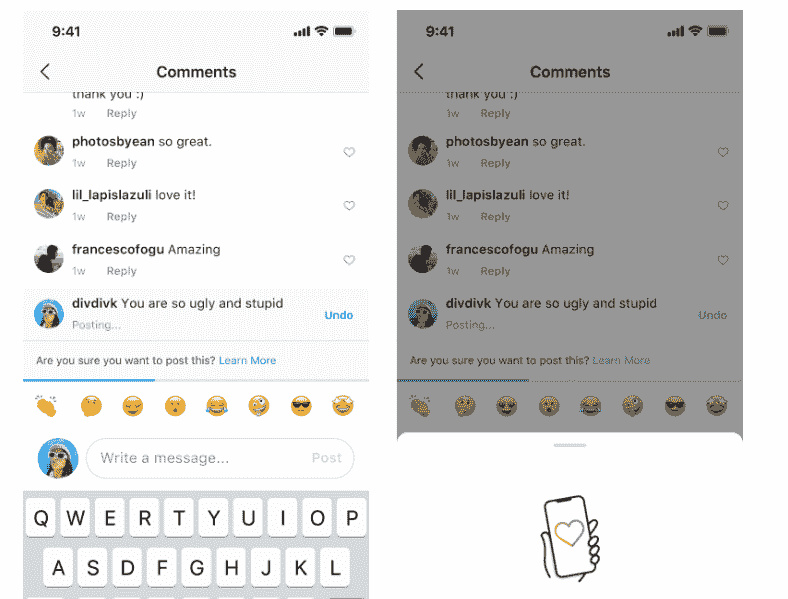

# 用户生成的数据标记的兴起

> 原文：[`www.kdnuggets.com/2019/12/rise-user-generated-data-labeling.html`](https://www.kdnuggets.com/2019/12/rise-user-generated-data-labeling.html)

评论

**作者 [Nandhini TS](https://www.linkedin.com/in/nandhini-ts-75a7bb133/)，Xtract.io**

猎豹使用监督学习技术来捕捉猎物。你可能会说这是一个奇怪的、随机的陈述。但想想看，猎豹通过实践、观察、经验和计算，发展出了一种非常精细的狩猎方法。

* * *

## 我们的前三个课程推荐

 1\. [Google 网络安全证书](https://www.kdnuggets.com/google-cybersecurity) - 快速入门网络安全职业。

 2\. [Google 数据分析专业证书](https://www.kdnuggets.com/google-data-analytics) - 提升你的数据分析能力

 3\. [Google IT 支持专业证书](https://www.kdnuggets.com/google-itsupport) - 支持你组织的 IT 需求

* * *

就像训练数据集以创建一个出色的 AI 模型一样。它们会被不断训练和教导，直到能够独立操作。神奇的猎豹物种也经历了类似的过程，直到它能够预测各种猎物的逃跑策略，并调整其速度以实现快速转弯——而不仅仅依靠灵活性和速度。认知是通过大量训练获得的，这一过程的核心是数据标记。

这是一个重要的前提，它帮助你的机器学习算法根据标记的输入进行“学习”。现在，有几种方法可以做到这一点——自主管理的人力劳动、外包给个人/公司、第三方管理的标记服务提供商等等。

不过，假设你的项目庞大且需要持续进行数据标记——无论你在移动中、睡觉还是吃饭时。这时候你需要免费完成这些任务。当然，它可以外包，但如果你考虑成本、覆盖概率和准确性，我相信你会欣赏***用户生成的数据标记***。

我有 6 个有趣的例子来帮助你理解这个，我们直接深入吧！

### **1\. Netflix 标注了缩略图，你知道吗？**

数据科学在像 Netflix 这样的平台上的一个简单应用当然是他们的推荐引擎如何处理隐式数据。假设用户“A”在 4 天内连续观看了一个节目，比如“处女的秘密”（所有季节），隐式数据就是你喜欢这个节目，因为你显然牺牲了大量的睡眠来观看它。行为数据与成千上万其他数据点结合，是 Netflix 机器学习算法实际运作的基础。

Netflix 产品创新副总裁 Todd Yellin [表示](https://www.wired.co.uk/article/how-do-netflixs-algorithms-work-machine-learning-helps-to-predict-what-viewers-will-like)，他们考虑的数据是 *“我们从这些资料中看到的数据类型 – 人们观看什么，他们之后观看了什么，他们之前观看了什么，他们一年前观看了什么，他们最近观看了什么，以及一天中的时间”*。

所以，如果你看过《贞爱不忍》，Netflix 的机器学习算法很可能会考虑观看过这个节目之后人们观看了什么，分析社区偏好的趋势，看看他们是否喜欢强势女性主角，或是欣赏喜剧、腐败警察、神秘谋杀等。

现在，Netflix 基于类似的兴趣对节目和电影进行分类和推荐，并且在此基础上更进一步（以提高点击率），采用了一种称为缩略图个性化的概念。这些基本上是 Netflix 从电影或节目的视频帧中标注的图像。

*图片来源**:* [*Becominghuman.ai*](https://becominghuman.ai/how-netflix-uses-ai-and-machine-learning-a087614630fe)

那么，用户生成的数据标注在哪里呢？正是 Netflix 收集不同的缩略图，并根据用户的过去行为、对特定类型的偏好、过滤器和光线、最喜欢的明星等进行标注。这种推荐对每个用户都是独特的，它基于数千个类似的兴趣，这些兴趣帮助提高了点击率。Netflix 如何巧妙地收集用户数据并有效利用这些数据来改善体验真是太棒了。

赞美 Netflix！

### **2\. 现在是玩游戏的时候了，听说过 Quickdraw 吗？**

[Quickdraw](https://quickdraw.withgoogle.com/) 是由 Google 提供的最大涂鸦数据集，包含 5000 万幅绘画，涵盖 345 个类别。这是一个你画画而神经网络试图猜测的游戏。但图像的构思对每个人来说都是非常主观的，这也是神经网络可能并不总是准确的原因。

关键在这里。为了使预测准确，模型在你与其互动时会不断学习。

为了帮助你更好地理解：我被要求画一个月亮。虽然对自己的绘画技能感到尴尬，我还是会展示我画的图来帮助你理解这个概念！

好吧，图像明显显示神经网络没有识别出它（我不是毕加索，对吧？）无论如何，游戏只有在用户感到自己战胜了神经网络时才会变得有趣，因为神经网络能够识别他们如何构思和表现被要求绘制的内容。这正是这个概念的成功之处。但由于有数百万种不同的可能性以及像我这样适合玩画图游戏（在空气中绘画）的人所具备的技能，这个模型利用了用户生成的数据。

现在，我那幅可怜的月亮图被作为标记为“moon”的训练数据集用来帮助提高准确性。这里是神经网络识别为月亮的图像以及它如何学会识别它的情况。

### **3\. Grammarly 需要你的帮助来确认你是否正确**

所有作家都熟悉 Grammarly。它是一个帮助你保持写作免于语法错误的工具，包括拼写、标点符号等等。Grammarly 不仅关注语法错误，它还帮助你识别剽窃、词汇选择不当、俚语、语气检测等。Grammarly 使用一个复杂的人工智能系统，幕后有一支计算语言学家和深度学习工程师的团队。算法通过分析研究语料库（这些是用于研究和开发的大量标记文本集合）来学习写作规则并提出建议。

所以，我们都知道任何 AI 模型的基础是持续学习。就像人类通过丰富他们的知识变得更聪明一样，机器也是如此！但是，机器基于规则工作。如果存在否定，它们会报告错误。同样，Grammarly 通过你的帮助（用户）变得更聪明。让我以你刚刚读到的上一行作为例子。我看到“is”的红色下划线，认为我犯了一个错误（见下文）。

但，从逻辑和语法上讲，使用“are”可能是正确的。不过，超越语法，写作需要连贯，最重要的是你的句子需要读起来顺畅。在这个例子中，我使用了“is”因为这个过程仍在进行，因此使用现在进行时。然而，Grammarly 有其他的想法。所以，作为用户，我帮助 Grammarly 对其进行标记，以更好地适应上下文，并忽略了将其修改得更聪明的建议。

### **4\. Google 套件中的一些产品，它们是最好的，对吧？**

**a. Gmail 如何帮助你自动完成**

Google 的 Smart Compose 显然依靠人工智能。其确切功能是通过使用 [词袋语言模型](https://www.theregister.co.uk/2018/05/19/ai_roundup_may18/) 与递归神经网络。它基本上利用主题行和之前的电子邮件进行学习，并将这些内容编码为词嵌入，并转换为向量。这里有一个示例，Grammarly 正在检测语气！

**b. Google 地图变得更聪明**

假设一个非英语使用者使用 Google 地图（语音）来跟踪位置，而应用程序返回了不正确的信息。当你迅速按下返回按钮时，模型学习到发生了错误，这就成了学习。原因是我们知道发音和口音因地区而异。这些数据集将帮助机器学习模型准确地执行语音转文本转换。

**c. 最不喜欢的图像验证码**

我们都经历过无数次 Google 要求你确认图像集的过程，以区分人类和机器人。由于这种验证码被机器人绕过的情况越来越多，现在这些验证码变得有些复杂。为了提高图像分类的准确性，用户参与的数据被用作机器学习模型的训练数据集，以便随着时间的推移提高其准确性。

### **5\. Instagram 可以自动检测并删除辱骂性评论**

自然语言处理（NLP）帮助机器像人类一样理解语言。对于 Instagram 来说，仅含中性词的句子仍可能具有攻击性，而充满脏话的句子可能是一首流行歌曲。这很复杂。但是，对于使用 DeepText 自动识别和删除攻击性评论的 Instagram 来说，这就不那么复杂了。

在 [一项调查](https://www.ditchthelabel.org/wp-content/uploads/2017/07/The-Annual-Bullying-Survey-2017-1.pdf) 中，由 Ditch the Label 进行，超过 10,000 名年龄在 12 到 25 岁之间的英国青少年中，42% 报告称 Instagram 是他们遭受欺凌最多的平台。

DeepText 由人类训练，以识别和标记在不同上下文中什么是攻击性的，什么不是攻击性的，从而理解攻击性语言。但是，仍然存在将某些内容错误分类为攻击性的风险。

Kevin Systrom（Instagram 的首席执行官）表示，*“机器学习的整体理念是，它在理解这些细微差别方面远胜于过去的任何算法，或任何单一的人类。”*

“*我认为我们需要做的是弄清楚如何进入那些灰色区域，并评估这个算法的表现是否随着时间的推移真正改善了情况。因为，如果它引发问题而且没有效果，我们将废弃它并从头开始尝试新的方案。*”

正是这种风险因素，Instagram 最近推出了一个选项，如果用户确定要发布评论，会使用 AI 驱动的技术进行提醒，实际测试鼓励用户后退。

要让一个 AI 模型如此智能（分类哪些是攻击性的，哪些不是），它确实需要基于用户贡献的持续训练，不是吗？

### **6\. Smartbasket - Bigbasket 迄今为止最智能的推出**

印度的在线杂货店 Bigbasket 利用基于 AI 的技术来改善客户体验。

Bigbasket 的分析负责人 Subramanai 在 [一次采访](https://yourstory.com/2018/12/bigbaskets-tech-leaders-share-ai-pivotal-part-solution) 中表示，“*鉴于这种背景，我们的 AI 旅程到目前为止主要集中在机器学习上。我们现在正处于更深入地探索 AI 和相关技术（如物联网、计算机视觉和高级分析）以促进业务增长的阶段*。”

AI 在 Bigbasket 的多个案例中都有应用，例如他们如何分析当前流量数据并将其与交付承诺进行映射。另一个是 Smartbasket——这是非常有趣的。Smartbasket 的引入旨在为客户创建个性化的购物篮。

“通常，客户的最终订单中有 90%已经包含在 Smartbasket 中。我们的数据表明，这些客户现在花费的时间只有他们通常的一半，” 数据分析负责人表示。

他们的机器学习算法也在变得更智能，其中客户将 40%的推荐产品添加到购物车中。

因此，如果我们深入探讨推荐引擎和 Smartbasket 概念，从客户收集的数据——行为分析、偏好、购买历史、对同一产品的社区行为以及其他数千条信息，都会作为训练数据输入推荐引擎。点击量随着模式的智能化而提升，这一过程基于每次用户对推荐类型的反馈。

推荐系统有三种类型——协同过滤、基于内容和混合推荐。像 Bigbasket 和 Netflix 这样的公司利用混合推荐，即考虑独特的用户行为以及类似用户的模式。总而言之，在这里，用户在使推荐引擎更智能方面发挥了巨大的作用！

### **结论**

大型用户基础公司利用其客户帮助标注数据，这种做法在上下文中非常契合，以至于我们作为用户，甚至没有意识到这一点。尽管如此，对于像 Bigbasket 和 Netflix 这样的在线商店和媒体服务的推荐引擎，用户在标注数据和使模型更智能方面的贡献并不明显，因为过程中的额外分析工作非常繁琐。

但对于像 Quick draw 这样的系统，标注则相对简单。如果神经网络失败，数据会立即作为学习输入。这些情况对于处理海量实时信息的大型公司来说很常见。但对于其他 AI 项目来说，数据标注仍然重要，你可以使用市场上好用的数据注释工具，如 [Xtract.io](https://www.xtract.io/platforms/data-annotation)、[Cloudfactory](https://www.cloudfactory.com/) 和 [figure eight](https://www.figure-eight.com/)。

**个人简介： [Nandhini TS](https://www.linkedin.com/in/nandhini-ts-75a7bb133/)** 是 Xtract.io 的产品营销助理——一家数据解决方案公司。她喜欢写关于数据在成功业务操作中的力量和影响的文章。在闲暇时间，她专注于发展副业和狂看恐龙纪录片。

**相关内容：**

+   数据标注如何促进 AI 模型

+   机器学习数据准备 101：为什么重要以及如何进行

+   数据科学项目准备的奇妙四步

### 更多相关话题

+   [机器学习数据标注：市场概览、方法和工具](https://www.kdnuggets.com/2021/12/data-labeling-ml-overview-and-tools.html)

+   [我如何使用 Grounding DINO 实现自动图像标注](https://www.kdnuggets.com/2023/05/automatic-image-labeling-grounding-dino.html)

+   [拖拽、放置、分析：无代码数据科学的兴起](https://www.kdnuggets.com/drag-drop-analyze-the-rise-of-nocode-data-science)

+   [为什么艾米莉·埃克达尔选择了 co:rise 来提升她的工作表现作为……](https://www.kdnuggets.com/2022/08/corise-emily-ekdahl-chose-corise-level-job-performance-machine-learning-engineer.html)

+   [提示工程的兴起与衰退：时尚还是未来？](https://www.kdnuggets.com/the-rise-and-fall-of-prompt-engineering-fad-or-future)

+   [超越人类界限：超级智能的崛起](https://www.kdnuggets.com/beyond-human-boundaries-the-rise-of-superintelligence)
