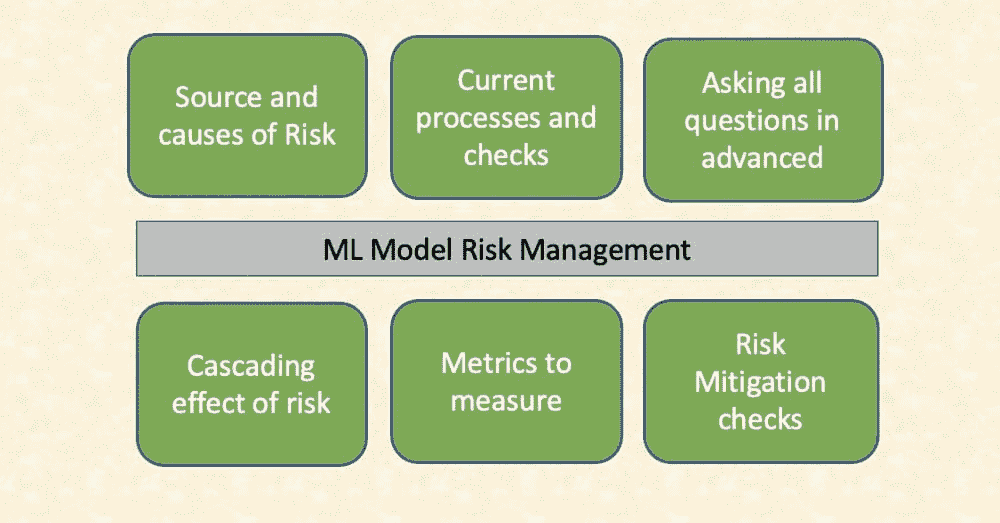
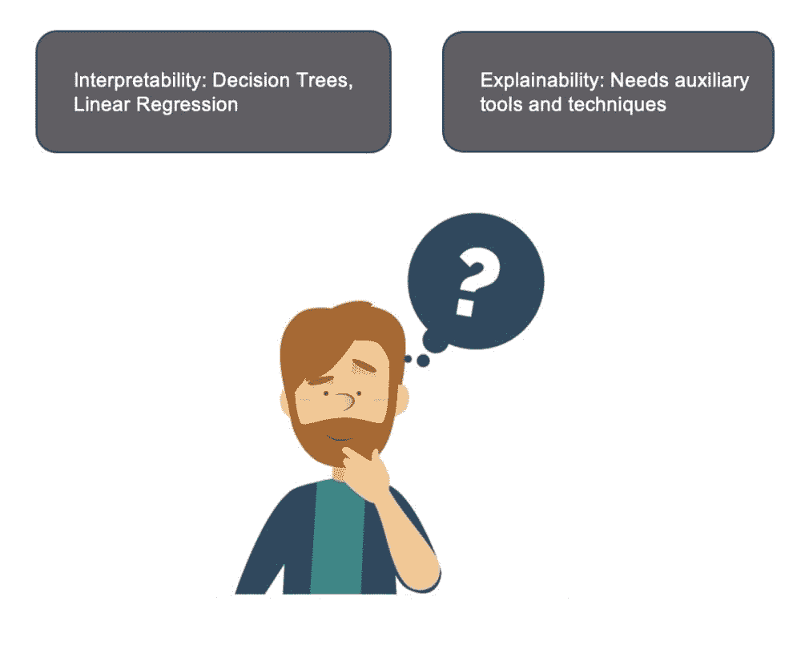
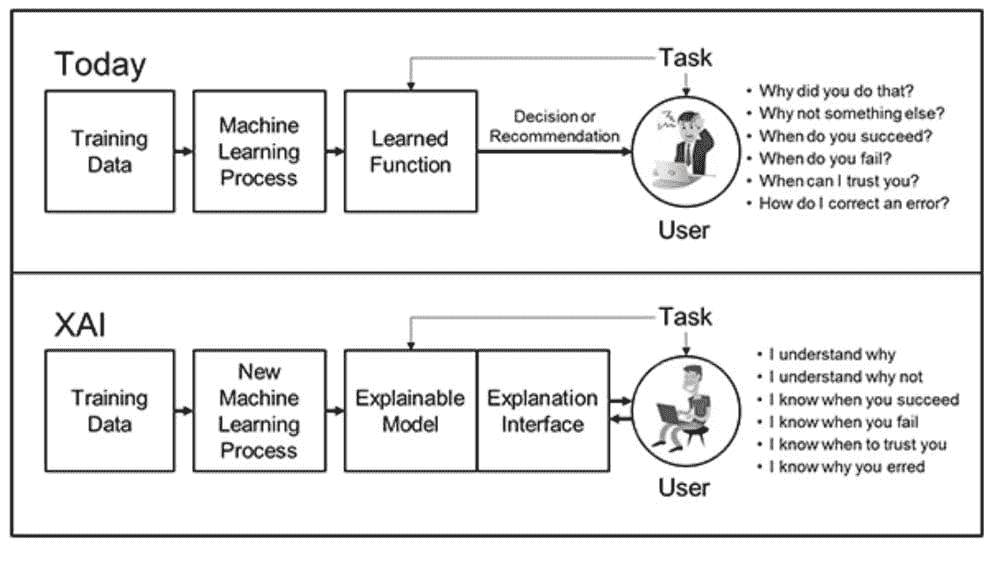

# AI/ML 模型的风险管理框架

> 原文：[`www.kdnuggets.com/2022/03/risk-management-framework-aiml-models.html`](https://www.kdnuggets.com/2022/03/risk-management-framework-aiml-models.html)

来源：商业矢量图由 jcomp 创作 — [www.freepik.com](https://www.freepik.com)（展示管理 AI 风险和生产成功 AI 模型的关键概念）

AI/ML 模型像其他数学和金融模型一样，具有其自身的风险，并需要事先了解以减轻这些风险。本文的意图在[风险定义](https://en.wikipedia.org/wiki/Risk)中得到了很好的总结：

> 风险是指可能发生不利情况的可能性。风险涉及对活动效果/影响的不确定性，这些活动涉及人类重视的东西（例如健康、福祉、财富、财产或环境），通常关注负面、不期望的后果。

风险需要提前充分考虑，从设计阶段开始。不能等到后果显现后再进行损害控制。这就是“风险管理”通过设计前瞻性的方法、拉动杠杆评估最坏情况，并及时采取行动的帮助所在。

来源：作者

管理风险的关键措施包括识别风险来源，并检查它们在当前流程中的处理方式。这种分析可以揭示当前检查可能不足以应对不可预见的风险的差距。

从原则上讲，这一框架涉及对可能出错的情况进行头脑风暴——不能等到自动驾驶汽车在路上陷入是否拯救一个老人还是一个孩子的困境时才采取行动。对于这个问题没有一个理想的答案，但必须在实施解决方案之前考虑最坏情况，并且这个最坏情况必须是可以接受的。

风险本质上是非自包含的，会通过放大所有方面的麻烦而产生连锁反应。清晰的风险定义和测量指标对确保风险被控制在可接受的范围内至关重要。这些指标还通过前后分析证明了风险缓解措施的有效性。

由于技术的迅猛发展，相对于金融和医学等成熟行业，AI 相关的风险在衡量、规划和预先捕捉方面仍相对未知。可以直接学习并导入到 AI 风险管理工具中的几个教训包括：

+   文档

+   数据完整性

+   法规与合规性

+   可解释性

# **文档**

ML 模型可能最终解决的问题与最初设想的可能有所不同。项目开始时对 ML 模型有一定的期望（可理解为魔法）。然而，由于缺乏相关特征或高质量数据提供的统计信号用于模型学习，模型的性能受到限制。进行了一系列实验来校准特征、算法、数据，甚至是问题陈述本身，以评估模型如何最佳地适应确切或调整后的业务任务，并且仍能增加价值。

例如，如果业务需求是优化服务中心的资源分配，以处理全天接收到的大量查询和电话。可以将问题框定为多类分类，其中目标变量，即预期的电话数量，可以分为 3 类——低、中和高。这意味着企业将根据 ML 模型对低、中或高工作量（或预期电话数量）的预测来估算资源。

另一方面，企业可能更感兴趣的是从 ML 模型中获取未来一周的预期工作量，并将应用自己的后处理逻辑来决定资源应该如何分配。

我们已经讨论了两种问题陈述的框架——回归和分类。

虽然没有一种规则适用于所有情况——这需要与业务讨论并进行详细文档记录。假设、数据可用性、数据历史记录、任何仅在实时中可用且在学习阶段未显示给模型的属性都需要详细记录，并与客户签署确认，然后再深入数据建模。

# **数据完整性**

Covid 已经极大地改变了世界运作的动态，使得许多 ML 模型变得无关紧要。没有任何模型/AI 解决方案提供商能够预见到这一点，考虑到这次疫情的黑天鹅效应。但，模型输出偏离预期结果的方式还有无数种，其中一个主要原因是训练数据与推理数据特征之间的漂移。现在，这在开发者的掌控之中，可以使用各种统计方法来控制。其中一个指标是 [KS 统计量](https://www.statisticshowto.com/kolmogorov-smirnov-test/)。

如果你想了解更多关于如何维护数据质量以构建成功的机器学习解决方案的信息，我推荐你事先阅读这篇 文章。文章解释了无缝数据集成和一致性对维护数据管道的重要性，并强调了采纳数据文化的重要性。

# **声誉、法规和合规风险**

人工智能机器人能否获得意识并通过接管世界来危害人类安全？这样的问题主要占据我们的思考，并立即将 AI 变成数字化转型潮流中的反派。

但 AI 只是一个技术本身不能造成伤害，除非它被设计和构建成这样。这引出了一个重要且常被忽视的概念——意图。

[引用 Dave Waters](https://www.supplychaintoday.com/artificial-intelligence-machine-learning-quotes-top-minds/)的话，“人工智能的潜在好处巨大，危险也是如此。”

来源：人物矢量图由 pch.vector 创作 — [www.freepik.com](https://www.freepik.com)，并结合作者对良好和恶意意图的例子进行输入

AI 有巨大的潜力来改善人类生活，但也带来了自身的风险。

一旦风险出现，就需要遵循法规。是的，法规是必要的，以建立检查和平衡机制，并确保它们提供正确的框架，不妨碍 AI 利益的飞跃，同时控制可能的危害。

不妥协或滥用个人数据且尊重用户隐私的社会友好型应用才能成功并进入市场。像 GDPR 这样的法规旨在赋予个人控制权和权利，以决定他们允许如何使用个人数据。

及时干预和更新这些监管框架可以确保我们的社会继续享受 AI 良好意图带来的好处，同时阻止恶意 AI 产品的出现。

# **可解释性**

AI 模型能否解释预测结果。模型开发者必须在不影响模型准确性的情况下解释算法的内部工作原理。这可以通过两种方式实现——可解释模型或辅助工具。

来源：教育矢量图由 freepik 创作 — [www.freepik.com](https://www.freepik.com)

“可解释性”和“解释性”这两个词常被交替使用。决策树、线性回归等模型由于其固有的预测解释特性，属于可解释模型的范畴。而像深度神经网络这样的黑箱模型则需要借助 LIME 和 SHAP 框架等辅助工具和技术来解释模型输出。

下图展示了数据科学社区应努力实现的真实状态，我们能够解释为什么模型输出特定类别 X 而不是类别 Y。模型何时成功并可以以更大的信心信任？输入数据中的哪些变化会导致预测结果的翻转等。

来源：https://[www.darpa.mil](https://www.darpa.mil/)/program/explainable-artificial-intelligence

有多种工具可以帮助控制风险，包括但不限于模型可解释性、偏差检测和缓解、模型监控和维护。

我将在即将发表的文章中详细阐述这些内容。敬请关注。

**[Vidhi Chugh](https://vidhi-chugh.medium.com/)** 是一位获奖的 AI/ML 创新领导者和 AI 伦理学家。她在数据科学、产品和研究的交汇点工作，以提供业务价值和见解。她提倡数据中心科学，并在数据治理方面是领先专家，致力于构建值得信赖的 AI 解决方案。

* * *

## 我们的前 3 个课程推荐

 1\. [Google 网络安全证书](https://www.kdnuggets.com/google-cybersecurity) - 快速进入网络安全职业轨道。

 2\. [Google 数据分析专业证书](https://www.kdnuggets.com/google-data-analytics) - 提升你的数据分析技能

 3\. [Google IT 支持专业证书](https://www.kdnuggets.com/google-itsupport) - 支持你的组织 IT 工作

* * *

### 更多相关话题

+   [Giskard 简介：AI 模型的开源质量管理](https://www.kdnuggets.com/2023/11/giskard-introduction-giskard-opensource-quality-management-ai-models)

+   [Django 框架中的社交用户认证](https://www.kdnuggets.com/2023/01/social-user-authentication-django-framework.html)

+   [适用于所有用途的唯一提示框架](https://www.kdnuggets.com/the-only-prompting-framework-for-every-use)

+   [免费的 4 周 AI 质量管理数据科学课程](https://www.kdnuggets.com/2022/02/truera-free-4-week-data-science-course-ai-quality-management.html)

+   [KDnuggets 新闻，5 月 18 日：5 个免费机器学习托管平台…](https://www.kdnuggets.com/2022/n20.html)

+   [关于数据管理及其重要性的 6 件事…](https://www.kdnuggets.com/2022/05/6-things-need-know-data-management-matters-computer-vision.html)
