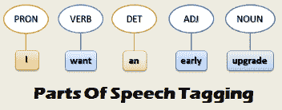
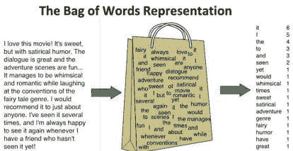
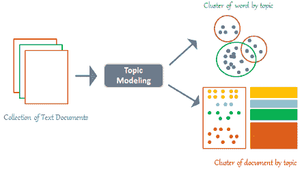
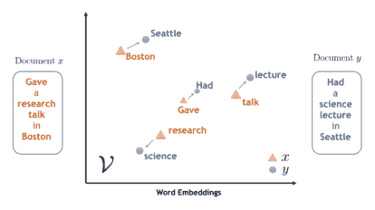

# 自然语言处理（NLP）的路线图

> 原文：[`www.kdnuggets.com/2020/10/roadmap-natural-language-processing-nlp.html`](https://www.kdnuggets.com/2020/10/roadmap-natural-language-processing-nlp.html)

评论

图片由[Kelly Sikkema](https://unsplash.com/@kellysikkema?utm_source=medium&utm_medium=referral)拍摄，来源于[Unsplash](https://unsplash.com/?utm_source=medium&utm_medium=referral)

### 介绍

由于过去十年中[大数据](https://towardsdatascience.com/big-data-analysis-spark-and-hadoop-a11ba591c057)的发展，组织现在每天面临分析来自各种来源的大量数据的任务。

自然语言处理（NLP）是人工智能研究的一个领域，专注于处理和使用文本和语音数据以创建智能机器并生成洞察。

目前最有趣的 NLP 应用之一是创建能够与人类讨论复杂话题的机器。[IBM 项目辩论者](https://www.research.ibm.com/artificial-intelligence/project-debater/)迄今为止代表了这一领域最成功的方法之一。

视频 1：IBM 项目辩论者

### 预处理技术

一些最常用的技术用于准备文本数据以供推理使用：

+   **分词：** 用于将输入文本分割成其组成单词（标记）。这样，更容易将数据转换为数字格式。

+   **停止词去除：** 应用于从文本中去除所有介词（例如“an”，“the”等），这些介词只是数据中的噪音源（因为它们不会带来额外的信息）。

+   **词干提取：** 最终用于去除数据中的所有词缀（例如前缀或后缀）。这样，算法可以更容易地将具有相似含义的词（例如 insight ~ insightful）视为不同的词。

所有这些预处理技术可以通过标准的 Python NLP 库，如[NLTK](https://www.nltk.org/)和[Spacy](https://spacy.io/)，轻松应用于不同类型的文本。

此外，为了推断我们文本的语言语法和结构，我们可以利用如词性（POS）标注和浅层解析等技术（见图 1）。实际上，运用这些技术，我们会明确地将每个单词标记上其词汇类别（基于短语的句法上下文）。



图 1：词性标注示例 [1]。

### 建模技术

### 词袋模型

词袋模型是一种用于自然语言处理和[计算机视觉](https://towardsdatascience.com/roadmap-to-computer-vision-79106beb8be4)的技术，用于创建用于训练分类器的新特征（图 2）。该技术通过构建直方图来计算文档中的所有词汇（不考虑词序和语法规则）。



图 2：词袋模型 [2]

这种技术可能受限的主要问题之一是文本中介词、代词、冠词等的存在。实际上，这些词可能在我们的文本中频繁出现，但不一定对找出文档的主要特征和主题有实际信息。

为了解决这种问题，通常使用一种称为“词频-逆文档频率”（TFIDF）的技术。TFIDF 旨在通过考虑文本中每个词在大量文本样本中的总体出现频率来重新调整词频。使用这种技术，我们将奖励那些在我们的文本中出现但在其他文本中很少出现的词（提升其频率值），而惩罚那些在我们的文本和其他文本中都频繁出现的词（如介词、代词等）。

### 潜在狄利克雷分配（LDA）

潜在狄利克雷分配（LDA）是一种主题建模技术。主题建模是一个研究领域，专注于发现聚类文档的方法，以便根据内容发现潜在的区分标志（图 3）。因此，主题建模在这个范围内也可以被视为一种[降维技术](https://towardsdatascience.com/feature-extraction-techniques-d619b56e31be)，因为它允许我们将初始数据减少到一个有限的聚类集。



图 3：主题建模 [3]

潜在狄利克雷分配（LDA）是一种无监督学习技术，用于发现可以表征不同文档的潜在主题，并将相似的文档聚集在一起。该算法输入的是被认为存在的主题数***N***，然后将不同的文档分组到***N***个彼此紧密相关的文档聚类中。

LDA 与其他聚类技术如 K 均值聚类的区别在于，LDA 是一种软聚类技术（每个文档根据概率分布分配到一个聚类中）。例如，文档可以被分配到聚类 A，因为算法确定该文档 80%的可能性属于该类，同时也考虑到该文档中嵌入的一些特征（剩余的 20%）更有可能属于第二个聚类 B。

### 词嵌入

词嵌入是将词编码为数值向量的最常见方法之一，然后将这些向量输入到我们的机器学习模型中进行推断。词嵌入旨在可靠地将词转换为向量空间，以便相似的词由相似的向量表示。



图 4：词嵌入 [4]

目前，有三种主要技术用于创建词嵌入：[Word2Vec](https://en.wikipedia.org/wiki/Word2vec)、[GloVe](https://en.wikipedia.org/wiki/GloVe_(machine_learning))和[fastText](https://en.wikipedia.org/wiki/FastText)。这三种技术都使用浅层神经网络来创建所需的词嵌入。

如果你有兴趣了解更多关于词嵌入的工作原理，[这篇文章是一个很好的起点。](https://machinelearningmastery.com/what-are-word-embeddings/)

### 情感分析

情感分析是一种自然语言处理技术，通常用于理解某种文本是否表达了对一个话题的正面、负面或中性情感。这在尝试了解公众对一个话题、产品或公司的总体看法（通过在线评论、推文等）时尤其有用。

在情感分析中，文本中的情感通常表示为介于-1（负面情感）和 1（正面情感）之间的值，称为极性。

情感分析可以被视为一种无监督学习技术，因为我们通常没有为数据提供手工标签。为了克服这一障碍，我们使用了预标记的词典（一个词汇书），这些词典已经创建用来量化大量词在不同上下文中的情感。一些广泛使用的情感分析词典包括[TextBlob](https://github.com/sloria/TextBlob/tree/eb08c120d364e908646731d60b4e4c6c1712ff63)和[VADER](https://github.com/cjhutto/vaderSentiment)。

### Transformer

[Transformer](http://jalammar.github.io/illustrated-transformer/)代表了当前最先进的自然语言处理模型，用于分析文本数据。一些广为人知的 Transformer 模型包括[BERT](https://arxiv.org/abs/1810.04805)和[GTP2](https://openai.com/blog/better-language-models/)。

在 Transformer 出现之前，递归神经网络（RNNs）代表了分析序列化文本数据以进行预测的最有效方法，但这种方法在可靠地利用长期依赖性方面相当困难（例如，我们的网络可能会发现很难理解几个迭代前输入的一个词对当前迭代的有用性）。

Transformers 成功克服了这一限制，得益于一种叫做 [Attention](https://arxiv.org/pdf/1706.03762.pdf) 的机制（该机制用于确定文本中需要关注的部分并给予更多权重）。此外，Transformers 使得并行处理文本数据变得更容易，而不是顺序处理（从而提高了执行速度）。

现在可以通过 [Hugging Face 库](https://huggingface.co/)轻松在 Python 中实现 Transformers。

### 文本预测演示

文本预测是可以通过 Transformers 轻松实现的任务之一，例如 GPT2。在这个示例中，我们将输入 Carlos Ruiz Zafón 的《[风之影](https://en.wikipedia.org/wiki/The_Shadow_of_the_Wind)》中的一句话，然后我们的 Transformer 将生成另外 50 个字符，这些字符应该逻辑上跟随我们的输入数据。

```py
A book is a mirror that offers us only what we already carry inside us. It is a way of knowing ourselves, and it takes a whole life of self awareness as we become aware of ourselves. This is a real lesson from the book My Life.
```

从上面展示的示例输出中可以看出，我们的 GPT2 模型在为输入字符串创建可续写的内容方面表现得相当出色。

一个示例笔记本可以运行以生成你自己的文本，访问 [此链接](https://drive.google.com/open?id=1UVfieBsf4gb6J_s_FaRA93D0ueO4-7JE)。

*希望你喜欢这篇文章，感谢阅读！*

### 联系方式

如果你想保持更新我的最新文章和项目， [请关注我在 Medium 上](https://medium.com/@pierpaoloippolito28?source=post_page---------------------------) 并订阅我的 [邮件列表](http://eepurl.com/gwO-Dr?source=post_page---------------------------)。以下是我的一些联系方式：

+   [Linkedin](https://uk.linkedin.com/in/pier-paolo-ippolito-202917146?source=post_page---------------------------)

+   [个人博客](https://pierpaolo28.github.io/blog/?source=post_page---------------------------)

+   [个人网站](https://pierpaolo28.github.io/?source=post_page---------------------------)

+   [Medium 个人资料](https://towardsdatascience.com/@pierpaoloippolito28?source=post_page---------------------------)

+   [GitHub](https://github.com/pierpaolo28?source=post_page---------------------------)

+   [Kaggle](https://www.kaggle.com/pierpaolo28?source=post_page---------------------------)

### 参考文献

[1] 使用 NLTK POS 标注器在 Python 中提取自定义关键词，Thinkinfi，Anindya Naskar。访问地址：[`www.thinkinfi.com/2018/10/extract-custom-entity-using-nltk-pos.html`](https://www.thinkinfi.com/2018/10/extract-custom-entity-using-nltk-pos.html)

[2] BoW 和 SoW 词袋模型的比较，ProgrammerSought。访问地址：[`www.programmersought.com/article/4304366575/;jsessionid=0187F8E68A22612555B437068028C012`](http://www.programmersought.com/article/4304366575/;jsessionid=0187F8E68A22612555B437068028C012)

[3] 主题建模：NLP 中的讲故事艺术，

TechnovativeThinker。访问地址：[`medium.com/@MageshDominator/topic-modeling-art-of-storytelling-in-nlp-4dc83e96a987`](https://medium.com/@MageshDominator/topic-modeling-art-of-storytelling-in-nlp-4dc83e96a987)

[4] 词移动嵌入：来自 Word2Vec 的通用文本嵌入，IBM 研究博客。访问链接：[`www.ibm.com/blogs/research/2018/11/word-movers-embedding/`](https://www.ibm.com/blogs/research/2018/11/word-movers-embedding/)

**简介： [Pier Paolo Ippolito](https://www.linkedin.com/in/pierpaolo28/)** 是一位数据科学家和南安普顿大学人工智能硕士毕业生。他对 AI 进展和机器学习应用（如金融和医学）有浓厚的兴趣。可以在[Linkedin](https://www.linkedin.com/in/pierpaolo28/)上与他联系。

[原文](https://towardsdatascience.com/roadmap-to-natural-language-processing-nlp-38a81dcff3a6)。经授权转载。

**相关：**

+   加速自然语言处理：来自亚马逊的免费课程

+   NLP 简介及提升技能的 5 个技巧

+   开始使用 PyTorch

* * *

## 我们的前三个课程推荐

 1\. [谷歌网络安全证书](https://www.kdnuggets.com/google-cybersecurity) - 快速进入网络安全职业道路

 2\. [谷歌数据分析专业证书](https://www.kdnuggets.com/google-data-analytics) - 提升你的数据分析技能

 3\. [谷歌 IT 支持专业证书](https://www.kdnuggets.com/google-itsupport) - 支持你的组织的 IT 工作

* * *

### 更多相关话题

+   [是什么让 Python 成为初创企业理想的编程语言](https://www.kdnuggets.com/2021/12/makes-python-ideal-programming-language-startups.html)

+   [停止学习数据科学以寻找目标，并寻找目标来…](https://www.kdnuggets.com/2021/12/stop-learning-data-science-find-purpose.html)

+   [9 亿美元 AI 失败的分析](https://www.kdnuggets.com/2021/12/9b-ai-failure-examined.html)

+   [学习数据科学的统计学顶级资源](https://www.kdnuggets.com/2021/12/springboard-top-resources-learn-data-science-statistics.html)

+   [成功数据科学家的 5 个特征](https://www.kdnuggets.com/2021/12/5-characteristics-successful-data-scientist.html)

+   [每个数据科学家都应该知道的三个 R 库（即使你使用 Python）](https://www.kdnuggets.com/2021/12/three-r-libraries-every-data-scientist-know-even-python.html)
