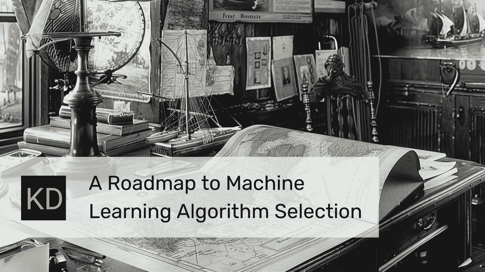

# 机器学习算法选择路线图

> 原文：[`www.kdnuggets.com/roadmap-to-machine-learning-algorithm-selection`](https://www.kdnuggets.com/roadmap-to-machine-learning-algorithm-selection)

图片由作者创建

## 介绍

* * *

## 我们的三大课程推荐

 1\. [谷歌网络安全证书](https://www.kdnuggets.com/google-cybersecurity) - 快速进入网络安全职业生涯。

 2\. [谷歌数据分析专业证书](https://www.kdnuggets.com/google-data-analytics) - 提升你的数据分析能力

 3\. [谷歌 IT 支持专业证书](https://www.kdnuggets.com/google-itsupport) - 支持你的组织进行 IT 管理

* * *

生成预测模型的重要一步是选择合适的机器学习算法，这一选择可能对模型性能和效率产生显著影响。这种选择甚至可以决定最基本的预测任务的成功：模型是否能够充分从训练数据中学习并推广到新的数据集。这对于数据科学从业者和学生尤为重要，因为他们面临着大量可能的算法选择。本文的目标是帮助揭开选择合适机器学习算法的过程，重点介绍“传统”算法，并提供一些选择最佳算法的指南。

## 算法选择的重要性

选择最佳、正确或甚至足够的算法可以显著提高模型的预测准确性。你可能会猜到，错误的算法选择可能导致模型性能不佳，甚至可能达不到有用的标准。这带来了巨大的潜在优势：选择与数据和问题的统计特征匹配的“正确”算法，将使模型能够更好地学习并提供更准确的输出，可能还会节省时间。相反，选择错误的算法可能会带来一系列负面后果：训练时间可能更长；训练可能计算开销更大；最糟糕的是，模型可能不够可靠。这可能意味着模型准确性降低，面对新数据时结果不佳，或者无法真正洞察数据所能告诉你的内容。在这些指标中任何一个或全部表现不佳，最终可能浪费资源并限制整个项目的成功。

**简而言之** 正确选择适合任务的算法直接影响机器学习模型的效率和准确性。

## 算法选择考虑因素

为任务选择正确的机器学习算法涉及多种因素，每个因素都可能对最终决策产生重大影响。以下是决策过程中的几个方面需要牢记。

### 数据集特征

数据集的特征对于算法选择至关重要。数据集的大小、包含的数据元素类型、数据是结构化还是非结构化等因素都是顶级因素。试想将一个针对结构化数据的算法应用于非结构化数据问题，你可能不会取得很大进展！大型数据集需要可扩展的算法，而较小的数据集可能用更简单的模型就可以处理。还不要忘记数据的质量——数据是干净的，还是有噪声的，或许是不完整的——因为不同的算法在处理缺失数据和噪声时具有不同的能力和鲁棒性。

### 问题类型

你要解决的问题类型，无论是分类、回归、聚类还是其他类型，显然会影响算法的选择。每类问题都有适合的特定算法，而许多算法根本无法处理其他问题类型。例如，如果你在处理分类问题，你可能会在逻辑回归和支持向量机之间进行选择，而一个聚类问题可能会使你使用 k-means。你可能不会在试图解决回归问题时从决策树分类算法开始。

### 性能指标

你打算通过什么方式来衡量模型的性能？如果你设定了特定的指标——例如，分类问题的精确度或召回率，回归问题的均方误差——你必须确保所选算法能够适应。此外，不要忽视其他非传统指标，如训练时间和模型可解释性。尽管某些模型的训练速度较快，但可能会以牺牲准确性或可解释性为代价。

### 资源可用性

最后，你所拥有的资源可能会大大影响你的算法决策。例如，深度学习模型可能需要大量的计算能力（例如，GPU）和内存，这使得它们在一些资源受限的环境中不那么理想。了解你拥有的资源可以帮助你做出一个能够在需求、资源和完成工作的折中之间做出平衡的决策。

通过周密考虑这些因素，可以做出一个既表现良好又符合项目目标和限制的算法选择。

## 算法选择初学者指南

以下是一个可以作为实际工具的流程图，用于指导机器学习算法的选择，详细说明了从问题定义阶段到模型完成部署的步骤。通过遵循这一结构化的选择点和考虑事项的顺序，用户可以成功评估将影响选择正确算法的因素。

### 需要考虑的决策点

流程图标识了许多具体的决策点，其中大部分在上述内容中已经涵盖：

+   **确定数据类型**：理解数据是结构化还是非结构化形式可以帮助确定选择算法的起点，同时识别单个数据元素类型（整数、布尔值、文本、浮点小数等）也有帮助。

+   **数据大小**：数据集的大小在决定是使用更简单还是更复杂的模型时起着重要作用，这取决于数据大小、计算效率和训练时间等因素。

+   **问题类型**：要解决的机器学习问题的具体类型——分类、回归、聚类或其他——将决定可能相关的算法集合，每组算法提供的算法或算法集合将适合目前为止对问题的选择。

+   **调整和评估**：从选择的算法得出的模型通常会从选择开始，经过参数调整，最后进行评估，每一步都需要确定算法的有效性，任何时刻都可能导致选择另一种算法的决定。

流程图可视化由作者创建（点击放大）

## 一步一步来

从头到尾，上述流程图概述了从问题定义，到数据类型识别、数据大小评估、问题分类，再到模型选择、调整和后续评估的演变过程。如果评估表明模型令人满意，可能会进行部署；否则，可能需要修改模型或使用不同的算法进行新的尝试。通过使算法选择步骤更简单，选择最有效的算法以适应特定数据和项目规格的可能性更大。

### 第一步：定义问题并评估数据特征

选择算法的基础在于对问题的精确定义：你想要建模什么以及你要克服哪些挑战。同时，评估数据的特性，如数据的类型（结构化/非结构化）、数量、质量（噪声和缺失值的缺乏）和多样性。这些因素共同影响你能够应用的模型复杂性水平和你必须使用的模型类型。

### 第 2 步：根据数据和问题类型选择合适的算法

在问题和数据特征被揭示之后，下一步是选择最适合你的数据和问题类型的算法或算法组。例如，像逻辑回归、决策树和 SVM 这样的算法可能对结构化数据的二分类有用。回归可能会提示使用线性回归或集成方法。非结构化数据的聚类分析可能需要使用 K-Means、DBSCAN 或其他类型的算法。你选择的算法必须能够有效处理你的数据，同时满足项目的要求。

### 第 3 步：考虑模型性能要求

不同项目的性能要求需要不同的策略。这一轮涉及识别对你的企业最重要的性能指标：准确性、精度、召回率、执行速度、可解释性等。例如，在理解模型内部工作机制至关重要的领域，如金融或医学中，可解释性变得非常关键。必须将关于项目中重要特征的数据与各种算法的已知优势相匹配，以确保这些需求得到满足。*最终*，这种对齐确保了数据和业务的需求得到满足。

### 第 4 步：构建基线模型

与其追求算法复杂性的最前沿，不如从一个简单的初始模型开始建模。该模型应该易于安装并运行快速，这是基于对更复杂模型性能的估计。这一步对建立早期模型性能估计非常重要，并可能指出数据准备中的大规模问题，或初始时做出的天真假设。

### 第 5 步：根据模型评估进行精细化和迭代

一旦达到基线水平，依据性能标准对模型进行精细化。这包括调整模型的超参数和特征工程，或者如果前一个模型不符合项目指定的性能指标，则考虑不同的基线。通过这些精细化过程的迭代可能会发生多次，每次模型的调整都可能带来更深入的理解和更好的性能。以这种方式精细化和评估模型是优化其性能以符合设定标准的关键。

这种规划水平不仅减少了选择适当算法的复杂过程，而且还会增加能够引入一个耐用、合理定位的机器学习模型的可能性。

## 结果：常见机器学习算法

本节概述了一些常用的分类、回归和聚类任务算法。了解这些算法及其使用时机，可以帮助个人做出与其项目相关的决策。

### 常见分类算法

+   逻辑回归：最适用于二分类任务，逻辑回归是一个有效但简单的算法，当因变量和自变量之间的关系是线性时。

+   决策树：适用于多类和二类分类，决策树模型易于理解和使用，在透明度重要的情况下很有用，可以处理分类数据和数值数据。

+   支持向量机（SVM）：适用于高维空间中具有明确类别边界的复杂问题分类。

+   朴素贝叶斯：基于贝叶斯定理，适用于大型数据集，相对于更复杂的模型通常较快，特别是当数据是独立时。

### 常见回归算法

+   线性回归：最基础的回归模型，当处理数据可以通过最小的多重共线性线性分离时最有效。

+   Ridge 回归：在线性回归中添加正则化，旨在减少复杂性并防止在处理高度相关的数据时过拟合。

+   Lasso 回归：类似于 Ridge，也包括正则化，但通过将不太重要变量的系数归零来强制模型简单化。

### 常见聚类算法

+   k-means 聚类：当簇的数量和它们明显的非层次分离明显时，使用这个简单的聚类算法。

+   层次聚类：如果您的模型需要层次结构，让层次聚类促进发现和访问更深层次的簇。

+   DBSCAN：如果目标是找到形状变化的簇，标记数据集中明显和远离的簇，或者处理高度噪声的数据，一般来说可以考虑在数据集上实现 DBSCAN。

牢记性能目标，您的算法选择可以根据数据集的特征和目标进行调整，如下所述：

+   在数据较小且类别地理位置明确且容易区分的情况下，实施简单模型——如用于分类的逻辑回归和用于回归的线性回归——是一个好主意。

+   要处理大型数据集或防止数据建模中的过拟合，您可能需要考虑使用更复杂的模型，例如用于回归问题的 Ridge 回归和 Lasso 回归，以及用于分类任务的 SVM。

+   对于聚类目的，如果你面临各种问题，比如恢复基本的鼠标点击聚类、识别更复杂的自上而下或自下而上的层次结构，或处理特别嘈杂的数据，那么应该考虑 k-means、层次聚类和 DBSCAN，这取决于数据集的具体情况。

## 总结

选择机器学习算法对任何数据科学项目的成功至关重要，同时也是一门艺术。本文讨论了算法选择过程中的许多步骤的逻辑进展，并以最终集成和模型的进一步优化作为结论。每一步都与前一步同样重要，因为每一步都会对指导下的模型产生影响。本文开发的一个资源是一个简单的流程图，用于帮助指导选择。这个想法是将其作为确定模型的模板，至少在开始阶段如此。这将作为未来构建的基础，并为未来尝试构建机器学习模型提供路线图。

这个基本点是正确的：你学习和探索不同方法的越多，你在使用这些方法解决问题和建模数据方面就会变得越好。这要求你不断质疑算法本身的内部机制，并保持对新趋势甚至是领域中新算法的开放态度。为了成为一名优秀的数据科学家，你需要不断学习并保持灵活。

请记住，亲手尝试各种算法并测试它们可以是一个有趣且有回报的经历。通过遵循本讨论中介绍的指南，你可以理解这里涵盖的机器学习和数据分析的各个方面，并为将来出现的问题做好准备。机器学习和数据科学无疑会带来许多挑战，但这些挑战最终会成为帮助你取得成功的经验点。

**[Matthew Mayo](https://www.kdnuggets.com/wp-content/uploads/./profile-pic.jpg)** ([**@mattmayo13**](https://twitter.com/mattmayo13)) 拥有计算机科学硕士学位和数据挖掘研究生文凭。作为[KDnuggets](https://www.kdnuggets.com/)和[Statology](https://www.statology.org/)的主编，以及[Machine Learning Mastery](https://machinelearningmastery.com/)的特约编辑，Matthew 致力于使复杂的数据科学概念变得易于理解。他的专业兴趣包括自然语言处理、语言模型、机器学习算法以及探索新兴的人工智能。他的使命是使数据科学社区的知识普及化。Matthew 自 6 岁起便开始编程。

### 进一步阅读

+   [KDnuggets 新闻，12 月 14 日：3 门免费的机器学习课程……](https://www.kdnuggets.com/2022/n48.html)

+   [机器学习中的替代特征选择方法](https://www.kdnuggets.com/2021/12/alternative-feature-selection-methods-machine-learning.html)

+   [机器学习模型的高级特征选择技术](https://www.kdnuggets.com/2023/06/advanced-feature-selection-techniques-machine-learning-models.html)

+   [完整的机器学习学习路线图](https://www.kdnuggets.com/2022/12/complete-machine-learning-study-roadmap.html)

+   [机器学习算法的全流程部署到…](https://www.kdnuggets.com/2021/12/deployment-machine-learning-algorithm-live-production-environment.html)

+   [揭开选择完美机器学习算法的秘密！](https://www.kdnuggets.com/2023/07/ml-algorithm-choose.html)
