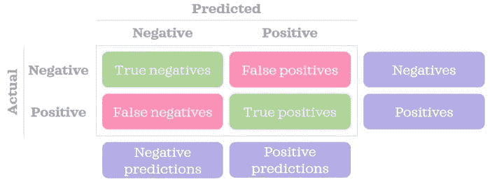
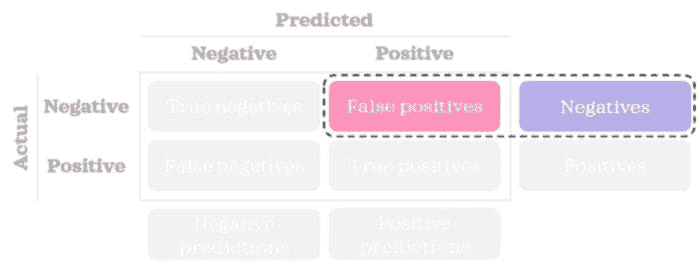
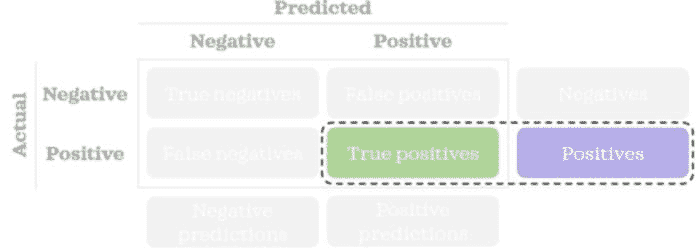
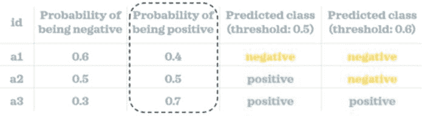
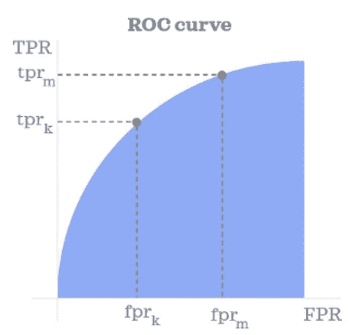
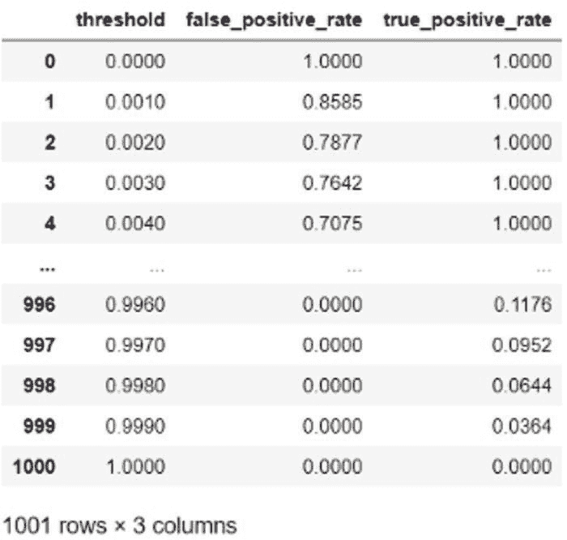
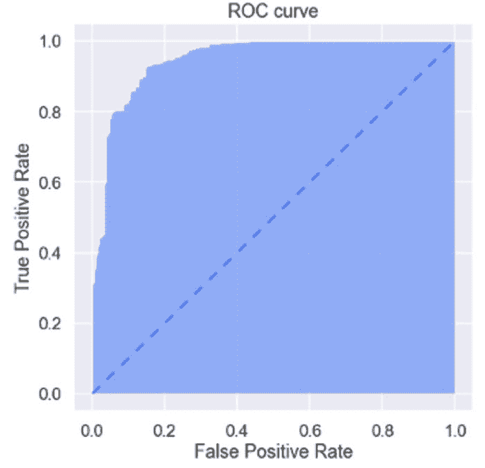
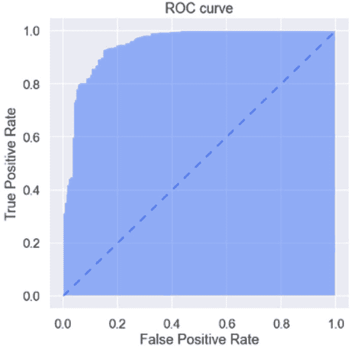
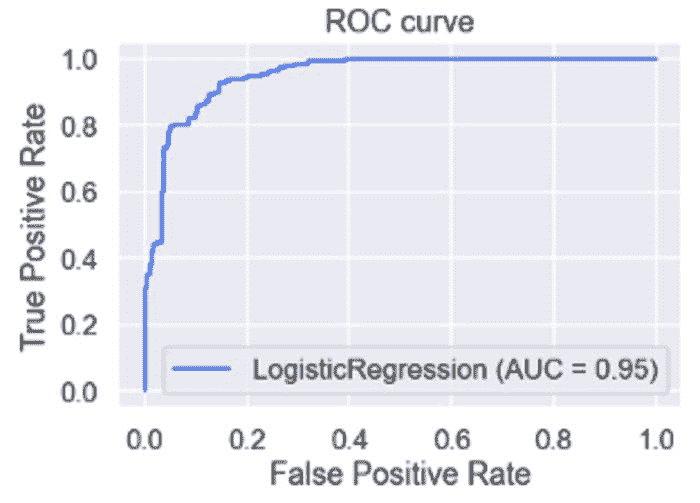

# ROC 曲线解释

> 原文：[`www.kdnuggets.com/2021/07/roc-curve-explained.html`](https://www.kdnuggets.com/2021/07/roc-curve-explained.html)

评论

**作者：[Zolzaya Luvsandorj](https://zluvsand.medium.com/)，iSelect 数据科学家**

ROC 曲线下面积是评估监督分类模型的最有用的指标之一。这个指标通常被称为 ROC-AUC。这里，ROC 代表接收者操作特征，AUC 代表曲线下面积。在我看来，AUROCC 是一个更准确的缩写，但可能听起来不如 ROC-AUC 那样悦耳。在正确的语境中，AUC 也可以暗示 ROC-AUC，尽管它也可以指代任何曲线下的面积。


图片由[Joel Filipe](https://unsplash.com/@joelfilip?utm_source=medium&utm_medium=referral)在[Unsplash](https://unsplash.com/?utm_source=medium&utm_medium=referral)提供

在这篇文章中，我们将深入了解 ROC 曲线的概念构建，并在 Python 中以静态和交互式格式可视化该曲线。

### 理解曲线

ROC 曲线展示了在不同*阈值*下*假阳性率（FPR）*与*真正阳性率（TPR）*之间的关系。让我们理解这三个术语的含义。

首先，让我们回顾一下混淆矩阵的样子：



作者提供的图像

复习一下混淆矩阵，让我们来看一下这些术语。

### 假阳性率

我们可以使用下面的简单公式来计算 FPR：


> FPR 告诉我们错误预测的负记录的百分比。



作者提供的图像

### 真正阳性率

我们可以使用下面的简单公式来计算 TPR：


> TPR 告诉我们正确预测的正记录的百分比。这也被称为召回率或灵敏度。



作者提供的图像

### 阈值

一般来说，分类模型可以预测给定记录属于某一类别的概率。通过将概率值与我们设定的阈值进行比较，我们可以将记录分类到一个类别中。换句话说，你需要定义一个类似于以下的规则：

> 如果为正的概率大于或等于阈值，则记录被分类为正预测；否则为负预测。

在下面的小例子中，我们可以看到三个记录的概率分数。使用两个不同的阈值（0.5 和 0.6），我们将每个记录分类到一个类别中。如你所见，预测的类别根据我们选择的阈值不同而有所变化。



作者提供的图像

在构建混淆矩阵并计算如 FPR 和 TPR 等比率时，我们需要预测的类别而不是概率分数。

### ROC 曲线

现在我们知道了 FPR、TPR 和阈值是什么，理解 ROC 曲线的展示就很简单了。在构造曲线时，我们首先计算许多阈值下的 FPR 和 TPR。一旦我们得到这些阈值的 FPR 和 TPR，我们就将 FPR 绘制在 x 轴上，将 TPR 绘制在 y 轴上，从而得到 ROC 曲线。就是这样！✨



作者提供的图像

ROC 曲线下的面积范围从 0 到 1。一个完全随机的模型其 AUROCC 为 0.5，由下方虚线蓝色三角形对角线表示。ROC 曲线距离该线越远，模型的预测能力越强。


作者提供的图像

现在，到了查看一些代码示例来巩固我们的知识的时候了。

### 在 Python 中构建静态 ROC 曲线

首先，让我们导入在本帖其余部分中需要的库：

```py
import numpy as np
import pandas as pd
pd.options.display.float_format = "{:.4f}".formatfrom sklearn.datasets import load_breast_cancer
from sklearn.linear_model import LogisticRegression
from sklearn.metrics import roc_curve, plot_roc_curveimport matplotlib.pyplot as plt
import seaborn as sns
import plotly.express as px
sns.set(palette='rainbow', context='talk')
```

现在，我们将构建一个函数，根据正确类别、预测为正类的概率和阈值，来找出*假阳性*和*真阳性*的数量：

```py
def get_fp_tp(y, proba, threshold):
    """Return the number of false positives and true positives."""
    # Classify into classes
    pred = pd.Series(np.where(proba>=threshold, 1, 0), 
                     dtype='category')
    pred.cat.set_categories([0,1], inplace=True)
    # Create confusion matrix
    confusion_matrix = pred.groupby([y, pred]).size().unstack()\
                           .rename(columns={0: 'pred_0', 
                                            1: 'pred_1'}, 
                                   index={0: 'actual_0', 
                                          1: 'actual_1'})
    false_positives = confusion_matrix.loc['actual_0', 'pred_1']
    true_positives = confusion_matrix.loc['actual_1', 'pred_1']
    return false_positives, true_positives
```

*请注意，实际上你将使用分割的数据集（例如训练集、测试集）。但为了简单起见，我们在这篇文章中不会对数据进行分割。*

我们将在一个玩具数据集上构建一个简单的模型，并获取记录的正类概率（用值 1 表示）：

```py
# Load sample data
X = load_breast_cancer()['data'][:,:2] # first two columns only
y = load_breast_cancer()['target']# Train a model
log = LogisticRegression()
log.fit(X, y)# Predict probability
proba = log.predict_proba(X)[:,1]
```

我们将使用 1001 个不同的阈值，范围从 0 到 1，每次增加 0.001。换句话说，阈值将类似于 0、0.001、0.002、…、0.998、0.999、1。让我们找出这些阈值的 FPR 和 TPR。

```py
# Find fpr & tpr for thresholds
negatives = np.sum(y==0)
positives = np.sum(y==1)columns = ['threshold', 'false_positive_rate', 'true_positive_rate']
inputs = pd.DataFrame(columns=columns, dtype=np.number)
thresholds = np.linspace(0, 1, 1001)for i, threshold in enumerate(thresholds):
    inputs.loc[i, 'threshold'] = threshold
    false_positives, true_positives = get_fp_tp(y, proba, threshold)
    inputs.loc[i, 'false_positive_rate'] = false_positives/negatives
    inputs.loc[i, 'true_positive_rate'] = true_positives/positives
inputs
```



绘图数据已准备好。让我们来绘制它：

```py
def plot_static_roc_curve(fpr, tpr):
    plt.figure(figsize=[7,7])
    plt.fill_between(fpr, tpr, alpha=.5)
    # Add dashed line with a slope of 1
    plt.plot([0,1], [0,1], linestyle=(0, (5, 5)), linewidth=2)
    plt.xlabel("False Positive Rate")
    plt.ylabel("True Positive Rate")
    plt.title("ROC curve");

plot_static_roc_curve(inputs['false_positive_rate'], 
                      inputs['true_positive_rate'])
```



虽然构建自定义函数有助于我们理解曲线及其输入，并更好地控制它们，但我们也可以利用*sklearn*的优化能力。例如，我们可以使用`roc_curve()`函数获取 FPR、TPR 和阈值。我们可以使用自定义绘图函数以相同的方式绘制数据：

```py
fpr, tpr, thresholds = roc_curve(y, proba)
plot_static_roc_curve(fpr, tpr)
```



*Sklearn*还提供了一个`plot_roc_curve()`函数，自动完成所有工作。你只需一行代码（添加标题是可选的）：

```py
plot_roc_curve(log, X, y)
plt.title("ROC curve"); # Add a title for clarity
```



### 在 Python 中绘制交互式 ROC 曲线

使用静态图时，很难看到曲线上不同点对应的阈值。一个选项是检查我们创建的`inputs`数据框。另一个选项是创建图的交互式版本，这样当我们悬停在图表上时，可以看到 FPR 和 TPR 以及对应的阈值：

```py
def plot_interactive_roc_curve(df, fpr, tpr, thresholds):
    fig = px.area(
        data_frame=df, 
        x=fpr, 
        y=tpr,
        hover_data=thresholds, 
        title='ROC Curve'
    )
    fig.update_layout(
        autosize=False,
        width=500,
        height=500,
        margin=dict(l=30, r=30, b=30, t=30, pad=4),
        title_x=.5, # Centre title
        hovermode = 'closest',
        xaxis=dict(hoverformat='.4f'),
        yaxis=dict(hoverformat='.4f')
    )
    hovertemplate = 'False Positive Rate=%{x}<br>True Positive Rate=%{y}<br>Threshold=%{customdata[0]:.4f}<extra></extra>'
    fig.update_traces(hovertemplate=hovertemplate)

    # Add dashed line with a slope of 1
    fig.add_shape(type='line', line=dict(dash='dash'), x0=0, x1=1, y0=0, y1=1)
    fig.show()plot_interactive_roc_curve(df=inputs, 
                           fpr='false_positive_rate', 
                           tpr='true_positive_rate', 
                           thresholds=['threshold'])
```


交互性非常有用，不是吗？

希望你喜欢学习如何构建和可视化 ROC 曲线。一旦你理解了这条曲线，就很容易理解另一条相关曲线：[*精确度-召回率曲线*](https://levelup.gitconnected.com/precision-recall-curve-explained-fabfe58fb52e)。

感谢阅读这篇文章。如果你感兴趣，这里有一些我其他文章的链接：

+   [在 Python 中使用标点符号的有趣方法](https://towardsdatascience.com/interesting-ways-to-use-punctuations-in-python-43205a0bd67d)

+   [从零开始学习 Python 的 5 个技巧](https://towardsdatascience.com/5-tips-to-learn-python-from-zero-e4f6a9106558)

+   [数据科学中的 Python 虚拟环境入门](https://towardsdatascience.com/introduction-to-python-virtual-environment-for-data-science-3c216929f1a7)

+   [数据科学中的 Git 入门](https://towardsdatascience.com/introduction-to-git-for-data-science-ca5ffd1cebbe?source=your_stories_page-------------------------------------)

+   [通过这些技巧组织你的 Jupyter Notebook](https://towardsdatascience.com/organise-your-jupyter-notebook-with-these-tips-d164d5dcd51f)

+   [在 Seaborn（Python）中制作更美观且自定义的图表的 6 个简单技巧](https://towardsdatascience.com/6-simple-tips-for-prettier-and-customised-plots-in-seaborn-python-22f02ecc2393)

+   [针对 Pandas 用户的 5 个技巧](https://towardsdatascience.com/5-tips-for-pandas-users-e73681d16d17)

+   [在 pandas 中编写高级 SQL 查询](https://towardsdatascience.com/writing-advanced-sql-queries-in-pandas-1dc494a17afe?source=your_stories_page-------------------------------------)

再见了 ????????

**个人简介： [Zolzaya Luvsandorj](https://zluvsand.medium.com/)** 在 iSelect 担任数据科学家。在以优异的成绩获得多个荣誉奖项完成 BCom 学位后，Zolzaya 曾在一家咨询公司担任数据分析师三年，然后转到现在的职位。她热衷于扩展数据科学、计算机科学和统计学知识，并在博客中用简单的语言解释数据科学概念。

[原文](https://towardsdatascience.com/roc-curve-explained-50acab4f7bd8)。已获许可转载。

**相关：**

+   直接使用 Pandas 获取互动图表

+   如何创建一个互动的 3D 图表并轻松与任何人分享

+   指标的重要性，第一部分：评估分类模型

* * *

## 我们的三大课程推荐

 1\. [谷歌网络安全证书](https://www.kdnuggets.com/google-cybersecurity) - 快速进入网络安全职业生涯。

 2\. [谷歌数据分析专业证书](https://www.kdnuggets.com/google-data-analytics) - 提升你的数据分析技能

 3\. [谷歌 IT 支持专业证书](https://www.kdnuggets.com/google-itsupport) - 支持你的组织 IT 部门

* * *

### 相关主题

+   [分类指标解析：逻辑回归与…](https://www.kdnuggets.com/2022/10/classification-metrics-walkthrough-logistic-regression-accuracy-precision-recall-roc.html)

+   [数据库关键术语详解](https://www.kdnuggets.com/2016/07/database-key-terms-explained.html)

+   [描述性统计学关键术语详解](https://www.kdnuggets.com/2017/05/descriptive-statistics-key-terms-explained.html)

+   [决策树算法详解](https://www.kdnuggets.com/2020/01/decision-tree-algorithm-explained.html)

+   [键值数据库详解](https://www.kdnuggets.com/2021/04/nosql-explained-understanding-key-value-databases.html)

+   [F1 分数的微观、宏观和加权平均值，清晰解释](https://www.kdnuggets.com/2023/01/micro-macro-weighted-averages-f1-score-clearly-explained.html)
